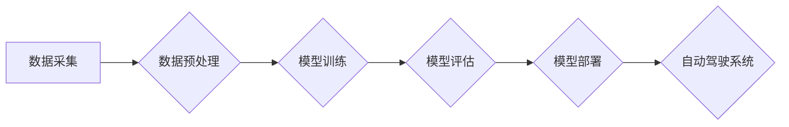

> 小鹏汽车, 算力, 迭代速度, 自动驾驶, 深度学习, 芯片, 软件架构

## 1. 背景介绍

近年来，自动驾驶技术作为智能汽车的核心竞争力，吸引了全球汽车巨头和科技公司的目光。其中，小鹏汽车作为中国领先的智能汽车公司，在自动驾驶领域表现突出，其算力投入和迭代速度成为业界关注的焦点。

小鹏汽车自成立以来，始终将自动驾驶视为核心战略，并积极布局算力基础设施和算法研发。公司在芯片设计、数据标注、算法训练等方面投入大量资源，形成了强大的技术实力。

## 2. 核心概念与联系

**2.1 自动驾驶算力需求**

自动驾驶系统需要处理海量传感器数据，进行实时感知、决策和控制。这需要强大的算力支持，才能保证系统能够快速、准确地识别周围环境，并做出安全可靠的驾驶决策。

**2.2 小鹏汽车算力架构**

小鹏汽车构建了多层次的算力架构，包括：

* **车载算力平台:** 搭载高性能的芯片，负责处理实时感知、决策和控制等任务。
* **云端算力平台:** 提供大规模的计算资源，用于数据训练、模型优化和算法开发。
* **边缘算力平台:** 位于数据中心和车端之间，负责数据预处理、边缘决策等任务。

**2.3 算力与迭代速度的关系**

算力是推动自动驾驶技术迭代的重要驱动力。强大的算力可以加速算法训练，提高模型精度，缩短迭代周期。

**Mermaid 流程图:**



## 3. 核心算法原理 & 具体操作步骤

**3.1 算法原理概述**

小鹏汽车在自动驾驶算法方面，主要采用深度学习技术，包括卷积神经网络（CNN）、循环神经网络（RNN）和强化学习（RL）。

* **CNN:** 用于图像识别和物体检测，可以识别道路、车辆、行人等物体。
* **RNN:** 用于序列数据处理，可以预测车辆轨迹和驾驶行为。
* **RL:** 用于决策控制，可以训练车辆在不同场景下做出最优驾驶决策。

**3.2 算法步骤详解**

1. **数据采集:** 收集车辆周围的传感器数据，包括摄像头、雷达、激光雷达等。
2. **数据预处理:** 对采集到的数据进行清洗、格式化和增强，以便于模型训练。
3. **模型训练:** 使用深度学习算法训练模型，使模型能够识别物体、预测轨迹和做出决策。
4. **模型评估:** 对训练好的模型进行评估，测试其性能和准确性。
5. **模型部署:** 将训练好的模型部署到车载平台，用于实际驾驶场景。

**3.3 算法优缺点**

* **优点:** 深度学习算法能够自动学习特征，具有较高的准确率和鲁棒性。
* **缺点:** 深度学习算法需要大量的训练数据和计算资源，训练时间较长。

**3.4 算法应用领域**

深度学习算法在自动驾驶领域有广泛的应用，包括：

* **感知:** 识别道路、车辆、行人等物体。
* **决策:** 规划驾驶路线、控制车辆速度和方向。
* **控制:** 控制车辆的转向、加速和制动。

## 4. 数学模型和公式 & 详细讲解 & 举例说明

**4.1 数学模型构建**

自动驾驶系统的数学模型通常基于状态空间模型，描述车辆在不同状态下的运动和控制。

**状态空间模型:**

$$
x(t) = f(x(t-1), u(t-1), w(t-1))
$$

其中：

* $x(t)$: 车辆状态向量，包括位置、速度、方向等。
* $u(t)$: 控制输入向量，包括油门、刹车、转向等。
* $w(t)$: 噪声向量，代表环境干扰和传感器误差。

**4.2 公式推导过程**

根据车辆动力学方程和传感器测量数据，可以推导得到状态空间模型的具体形式。

**4.3 案例分析与讲解**

例如，可以利用卡尔曼滤波算法对车辆状态进行估计，并根据估计结果进行控制决策。

## 5. 项目实践：代码实例和详细解释说明

**5.1 开发环境搭建**

* 操作系统: Ubuntu 20.04
* 编程语言: Python 3.8
* 深度学习框架: TensorFlow 2.0

**5.2 源代码详细实现**

```python
import tensorflow as tf

# 定义模型结构
model = tf.keras.models.Sequential([
    tf.keras.layers.Conv2D(32, (3, 3), activation='relu', input_shape=(64, 64, 3)),
    tf.keras.layers.MaxPooling2D((2, 2)),
    tf.keras.layers.Conv2D(64, (3, 3), activation='relu'),
    tf.keras.layers.MaxPooling2D((2, 2)),
    tf.keras.layers.Flatten(),
    tf.keras.layers.Dense(10, activation='softmax')
])

# 编译模型
model.compile(optimizer='adam',
              loss='sparse_categorical_crossentropy',
              metrics=['accuracy'])

# 训练模型
model.fit(x_train, y_train, epochs=10)

# 评估模型
loss, accuracy = model.evaluate(x_test, y_test)
print('Loss:', loss)
print('Accuracy:', accuracy)
```

**5.3 代码解读与分析**

这段代码定义了一个简单的卷积神经网络模型，用于图像分类任务。

* `tf.keras.models.Sequential`: 创建一个顺序模型，层级结构清晰。
* `tf.keras.layers.Conv2D`: 卷积层，用于提取图像特征。
* `tf.keras.layers.MaxPooling2D`: 最大池化层，用于降维和提高模型鲁棒性。
* `tf.keras.layers.Flatten`: 将多维数据转换为一维向量。
* `tf.keras.layers.Dense`: 全连接层，用于分类决策。
* `model.compile`: 编译模型，指定优化器、损失函数和评价指标。
* `model.fit`: 训练模型，使用训练数据进行迭代训练。
* `model.evaluate`: 评估模型，使用测试数据计算损失和准确率。

**5.4 运行结果展示**

训练完成后，可以将模型应用于实际图像分类任务，并观察其预测结果。

## 6. 实际应用场景

小鹏汽车的算力投入和迭代速度，在自动驾驶技术发展中发挥着重要作用。

**6.1 自动驾驶辅助系统**

小鹏汽车的自动驾驶辅助系统，例如自动泊车、自动变道、自动巡航等功能，都依赖于强大的算力支持。

**6.2 高级自动驾驶**

小鹏汽车正在积极研发高级自动驾驶技术，例如无人工驾驶，这需要更强大的算力和更复杂的算法。

**6.3 其他应用场景**

小鹏汽车的算力技术还可以应用于其他领域，例如智能座舱、车联网、数据分析等。

**6.4 未来应用展望**

随着算力技术的不断发展，小鹏汽车的自动驾驶技术将更加智能化、安全可靠，为用户提供更便捷、舒适的驾驶体验。

## 7. 工具和资源推荐

**7.1 学习资源推荐**

* **书籍:**
    * 深度学习
    * 自动驾驶技术
* **在线课程:**
    * Coursera: 深度学习
    * Udacity: 自动驾驶工程师
* **开源项目:**
    * TensorFlow
    * PyTorch

**7.2 开发工具推荐**

* **编程语言:** Python
* **深度学习框架:** TensorFlow, PyTorch
* **仿真平台:** CARLA, Gazebo

**7.3 相关论文推荐**

* **论文:**
    * Deep Learning for Autonomous Driving
    * End-to-End Learning for Self-Driving Cars

## 8. 总结：未来发展趋势与挑战

**8.1 研究成果总结**

小鹏汽车在算力投入和迭代速度方面取得了显著成果，其自动驾驶技术水平在国内外处于领先地位。

**8.2 未来发展趋势**

* **算力持续提升:** 随着芯片技术的进步，自动驾驶系统的算力将得到进一步提升。
* **算法模型不断优化:** 深度学习算法将不断优化，提高模型精度和鲁棒性。
* **数据规模扩大:** 自动驾驶数据将不断积累，为算法训练提供更丰富的样本。

**8.3 面临的挑战**

* **安全可靠性:** 自动驾驶系统需要保证在复杂环境下安全可靠地运行。
* **法规政策:** 自动驾驶技术的应用需要完善的法律法规和政策支持。
* **成本问题:** 自动驾驶系统的成本较高，需要进一步降低。

**8.4 研究展望**

未来，小鹏汽车将继续加大算力投入，加强算法研发，推动自动驾驶技术向更智能、更安全、更可靠的方向发展。

## 9. 附录：常见问题与解答

**9.1 常见问题:**

* 小鹏汽车的自动驾驶技术目前处于什么阶段？
* 小鹏汽车的自动驾驶系统有哪些功能？
* 小鹏汽车的自动驾驶技术有哪些优势？

**9.2 常见问题解答:**

* 小鹏汽车的自动驾驶技术目前处于量产阶段，已在部分车型上应用。
* 小鹏汽车的自动驾驶系统包括自动泊车、自动变道、自动巡航等功能。
* 小鹏汽车的自动驾驶技术优势在于强大的算力、先进的算法和丰富的驾驶数据。


作者：禅与计算机程序设计艺术 / Zen and the Art of Computer Programming 
<end_of_turn>