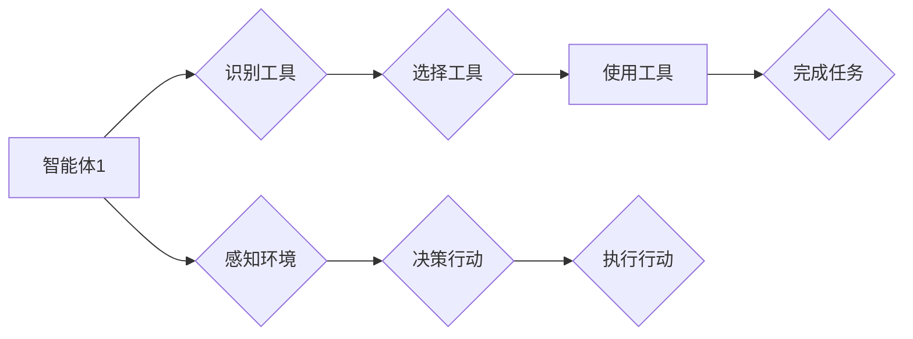

> 多智能体协同、工具使用、人工智能、机器学习、强化学习、协作机器人、智能系统、应用案例

## 1. 背景介绍

随着人工智能技术的飞速发展，多智能体协同系统逐渐成为研究热点。多智能体协同系统是指由多个智能体组成的系统，这些智能体能够相互感知、通信和协作，共同完成复杂任务。在现实世界中，多智能体协同系统应用广泛，例如无人驾驶汽车、智能制造、灾害救援等。

工具使用是多智能体协同系统中一个重要的方面。智能体需要能够识别、选择和使用合适的工具来完成任务。例如，在灾害救援场景中，机器人需要能够识别和使用工具，例如撬棍、钳子等，来帮助救援人员。

## 2. 核心概念与联系

**2.1 多智能体协同**

多智能体协同是指多个智能体在共享环境中相互作用，协同完成共同目标的过程。每个智能体都具有自己的感知能力、决策能力和行动能力，通过信息交换和协作，可以实现比单个智能体更强大的功能。

**2.2 工具使用**

工具使用是指智能体识别、选择和使用工具来完成任务的过程。工具可以是物理工具，也可以是软件工具。

**2.3 核心概念联系**

多智能体协同系统中，智能体需要能够识别、选择和使用合适的工具来完成任务。工具使用是多智能体协同系统中一个重要的方面，它可以提高智能体的效率和完成任务的能力。

**Mermaid 流程图**



## 3. 核心算法原理 & 具体操作步骤

**3.1 算法原理概述**

工具使用算法的核心是智能体能够识别、选择和使用合适的工具来完成任务。这需要结合感知、决策和执行三个方面。

* **感知:** 智能体需要能够感知周围环境，识别工具的存在和属性。
* **决策:** 智能体需要能够根据任务目标和工具属性，选择合适的工具。
* **执行:** 智能体需要能够使用工具完成任务。

**3.2 算法步骤详解**

1. **环境感知:** 智能体使用传感器收集环境信息，识别工具的存在和属性，例如工具的形状、大小、材质等。
2. **任务分析:** 智能体分析任务目标，确定需要使用哪些工具来完成任务。
3. **工具选择:** 智能体根据任务目标和工具属性，选择合适的工具。
4. **工具使用:** 智能体使用选择的工具完成任务。

**3.3 算法优缺点**

* **优点:** 能够提高智能体的效率和完成任务的能力。
* **缺点:** 需要大量的训练数据和计算资源，算法复杂度较高。

**3.4 算法应用领域**

* **机器人:** 机器人可以使用工具完成各种任务，例如搬运物体、组装产品等。
* **无人驾驶汽车:** 无人驾驶汽车可以使用工具完成道路维修、事故救援等任务。
* **医疗:** 机器人医生可以使用工具进行手术、诊断等。

## 4. 数学模型和公式 & 详细讲解 & 举例说明

**4.1 数学模型构建**

我们可以使用状态空间模型来描述智能体使用工具的过程。

* 状态空间: $S = \{s_1, s_2, ..., s_n\}$，其中 $s_i$ 表示智能体在第 $i$ 个状态。
* 动作空间: $A = \{a_1, a_2, ..., a_m\}$，其中 $a_i$ 表示智能体可以执行的第 $i$ 个动作。
* 状态转移函数: $P(s_{t+1}|s_t, a_t)$，表示在状态 $s_t$ 执行动作 $a_t$ 后，智能体进入状态 $s_{t+1}$ 的概率。
* 奖励函数: $R(s_t, a_t)$，表示在状态 $s_t$ 执行动作 $a_t$ 后获得的奖励。

**4.2 公式推导过程**

我们可以使用强化学习算法来训练智能体使用工具。强化学习算法的目标是找到一个策略 $\pi(s)$，使得智能体在执行该策略时获得最大的累积奖励。

**Bellman 方程:**

$$
V^{\pi}(s) = \max_{a \in A} \left[ R(s, a) + \gamma \sum_{s' \in S} P(s'|s, a) V^{\pi}(s') \right]
$$

其中:

* $V^{\pi}(s)$ 表示在策略 $\pi$ 下，从状态 $s$ 开始的累积奖励。
* $\gamma$ 是折扣因子，表示未来奖励的权重。

**4.3 案例分析与讲解**

例如，我们可以训练一个机器人使用工具来完成搬运物体的任务。

* 状态空间: $S = \{start, holding_tool, moving_to_object, holding_object, moving_to_destination, destination\}$
* 动作空间: $A = \{grab_tool, release_tool, move_forward, turn_left, turn_right\}$
* 奖励函数:

    * 在目标位置放下物体时获得奖励。
    * 在碰撞物体时惩罚。
    * 在执行动作时获得少量奖励。

我们可以使用 Q-learning 算法来训练机器人使用工具完成任务。

## 5. 项目实践：代码实例和详细解释说明

**5.1 开发环境搭建**

* 操作系统: Ubuntu 20.04
* Python 版本: 3.8
* 库依赖:

    * ROS (Robot Operating System)
    * OpenCV (计算机视觉库)
    * TensorFlow (深度学习框架)

**5.2 源代码详细实现**

```python
# 工具使用算法实现

import rospy
from sensor_msgs.msg import Image
from cv_bridge import CvBridge
from tensorflow.keras.models import load_model

# 加载工具识别模型
tool_model = load_model('tool_recognition_model.h5')

# 初始化 ROS 节点
rospy.init_node('tool_use_node')

# 创建 CvBridge 对象
bridge = CvBridge()

# 订阅相机图像话题
image_sub = rospy.Subscriber('/camera/image_raw', Image, image_callback)

# 定义图像回调函数
def image_callback(msg):
    # 将图像从 ROS 消息转换为 OpenCV 图像
    cv_image = bridge.imgmsg_to_cv2(msg, desired_encoding='bgr8')

    # 使用工具识别模型识别工具
    predicted_class = tool_model.predict(cv_image)

    # 根据识别结果执行相应的动作
    if predicted_class == 'wrench':
        # 使用扳手
        rospy.loginfo('使用扳手')
    elif predicted_class == 'hammer':
        # 使用锤子
        rospy.loginfo('使用锤子')
    else:
        # 未识别到工具
        rospy.loginfo('未识别到工具')

# 循环等待
rospy.spin()
```

**5.3 代码解读与分析**

* 代码首先加载工具识别模型。
* 然后初始化 ROS 节点并订阅相机图像话题。
* 在图像回调函数中，将图像从 ROS 消息转换为 OpenCV 图像，并使用工具识别模型识别工具。
* 根据识别结果，执行相应的动作。

**5.4 运行结果展示**

当机器人接收到相机图像时，会识别出工具，并执行相应的动作。例如，如果机器人识别到扳手，就会执行使用扳手的动作。

## 6. 实际应用场景

**6.1 智能制造**

在智能制造领域，多智能体协同系统可以提高生产效率和产品质量。例如，多个机器人可以协同完成复杂的生产任务，例如组装产品、焊接、喷漆等。

**6.2 灾害救援**

在灾害救援场景中，多智能体协同系统可以帮助救援人员更快、更有效地完成救援任务。例如，机器人可以进入危险区域进行搜救，无人机可以进行空中侦察，协同工作可以提高救援效率。

**6.3 医疗**

在医疗领域，多智能体协同系统可以辅助医生进行手术、诊断等工作。例如，机器人医生可以进行微创手术，无人机可以进行药物配送，协同工作可以提高医疗效率和安全性。

**6.4 未来应用展望**

随着人工智能技术的不断发展，多智能体协同系统将在更多领域得到应用，例如：

* **智慧城市:** 多智能体协同系统可以用于交通管理、环境监测、公共安全等领域。
* **教育:** 多智能体协同系统可以用于个性化教学、远程教育等领域。
* **娱乐:** 多智能体协同系统可以用于游戏开发、虚拟现实等领域。

## 7. 工具和资源推荐

**7.1 学习资源推荐**

* **书籍:**

    * Multi-Agent Systems: A Modern Approach
    * Reinforcement Learning: An Introduction

* **在线课程:**

    * Coursera: Multi-Agent Systems
    * Udacity: Artificial Intelligence Nanodegree

**7.2 开发工具推荐**

* **ROS (Robot Operating System):** 用于机器人开发的开源平台。
* **Gazebo:** 用于机器人仿真和测试的开源软件。
* **TensorFlow:** 用于深度学习的开源框架。

**7.3 相关论文推荐**

* Multi-Agent Reinforcement Learning: A Survey
* Deep Reinforcement Learning for Multi-Agent Systems: A Survey

## 8. 总结：未来发展趋势与挑战

**8.1 研究成果总结**

近年来，多智能体协同系统取得了显著进展，在理论研究和应用实践方面都取得了重要成果。

**8.2 未来发展趋势**

* **更复杂的场景:** 多智能体协同系统将应用于更复杂的场景，例如无人驾驶、智慧城市等。
* **更智能的算法:** 将开发更智能的算法，例如基于深度学习的算法，提高多智能体协同系统的效率和智能水平。
* **更强的安全性:** 将加强多智能体协同系统的安全性，确保其在实际应用中能够安全可靠地运行。

**8.3 面临的挑战**

* **算法复杂度:** 多智能体协同系统的算法复杂度较高，需要开发更有效的算法。
* **数据获取:** 多智能体协同系统的训练需要大量的训练数据，数据获取是一个挑战。
* **安全性:** 多智能体协同系统的安全性是一个重要问题，需要加强研究和开发。

**8.4 研究展望**

未来，多智能体协同系统将成为人工智能领域的重要研究方向，其应用前景广阔。


## 9. 附录：常见问题与解答

**9.1 如何选择合适的工具？**

选择合适的工具需要根据任务目标和工具属性进行分析。例如，如果需要拧紧螺丝，就需要选择扳手；如果需要敲击物体，就需要选择锤子。

**9.2 如何训练多智能体协同系统？**

可以使用强化学习算法来训练多智能体协同系统。强化学习算法的目标是找到一个策略，使得智能体在执行该策略时获得最大的累积奖励。

**9.3 多智能体协同系统的安全性如何保证？**

多智能体协同系统的安全性需要从多个方面考虑，例如：

* **算法安全性:** 算法本身需要安全可靠，避免出现漏洞。
* **数据安全性:** 训练数据和运行数据需要进行保护，避免泄露或被篡改。
* **物理安全性:** 多智能体协同系统在物理环境中的运行需要安全可靠，避免造成人员伤亡或财产损失。


作者：禅与计算机程序设计艺术 / Zen and the Art of Computer Programming 
<end_of_turn>