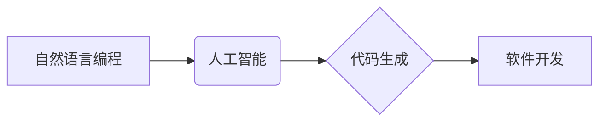

> 自然语言编程，NLP，AI，代码生成，软件开发，编程范式，未来趋势

## 1. 背景介绍

软件开发行业正经历着前所未有的变革。随着人工智能（AI）技术的飞速发展，自然语言编程（NLP）逐渐成为一个备受关注的领域。NLP 旨在通过自然语言指令来编写和执行代码，打破了传统编程语言的限制，让编程变得更加直观、易用和高效。

传统的编程语言需要程序员掌握复杂的语法规则和编程逻辑，这对于初学者来说门槛很高，并且对于熟练程序员来说也可能导致代码冗长、难以维护。而NLP则利用了人工智能的强大能力，可以将自然语言指令转换为机器可执行的代码，从而降低了编程的门槛，提高了开发效率。

## 2. 核心概念与联系

**2.1 自然语言编程 (NLP)**

NLP 是一种利用自然语言来进行软件开发的新型编程范式。它允许程序员使用类似于日常语言的指令来编写代码，例如“创建一个函数来计算两个数字的和”或“生成一个网页显示当前时间”。

**2.2 人工智能 (AI)**

AI 是指模拟人类智能的计算机系统。NLP 依赖于 AI 技术，特别是深度学习算法，来理解和处理自然语言指令。

**2.3 代码生成**

代码生成是 NLP 的核心功能之一。通过训练大量的代码数据，NLP 模型可以学习到代码的结构和语法规则，并根据自然语言指令生成相应的代码。

**2.4 关系图**



## 3. 核心算法原理 & 具体操作步骤

**3.1 算法原理概述**

NLP 算法的核心是利用深度学习模型来理解和处理自然语言指令。常见的 NLP 算法包括：

* **Transformer 模型:** Transformer 模型是一种强大的深度学习模型，能够有效地捕捉自然语言中的长距离依赖关系。它在 NLP 领域取得了突破性的进展，例如在机器翻译、文本摘要和代码生成等任务中表现出色。
* **Recurrent Neural Networks (RNN):** RNN 是另一种常用的 NLP 算法，能够处理序列数据，例如文本。RNN 可以学习到文本中的上下文信息，并根据上下文生成相应的输出。

**3.2 算法步骤详解**

1. **预处理:** 将自然语言指令进行预处理，例如分词、词性标注和词向量化。
2. **编码:** 使用 Transformer 模型或 RNN 将预处理后的指令编码成一个向量表示。
3. **解码:** 使用另一个 Transformer 模型或 RNN 将编码后的向量表示解码成代码。
4. **后处理:** 对生成的代码进行语法检查和格式化。

**3.3 算法优缺点**

**优点:**

* **易用性:** 使用自然语言指令编写代码更加直观和易于理解。
* **效率:** 可以显著提高代码开发效率。
* **可扩展性:** 可以扩展到更复杂的编程任务。

**缺点:**

* **准确性:** 代码生成模型的准确性仍然存在一定局限性。
* **安全性:** 自然语言指令可能存在安全漏洞。
* **可解释性:** 代码生成过程的决策机制难以解释。

**3.4 算法应用领域**

* **自动代码生成:** 自动生成简单的代码片段，例如函数定义、循环语句等。
* **代码修复:** 自动修复代码中的错误。
* **代码翻译:** 将代码从一种编程语言翻译成另一种编程语言。
* **代码注释:** 自动生成代码注释。

## 4. 数学模型和公式 & 详细讲解 & 举例说明

**4.1 数学模型构建**

NLP 模型通常基于 Transformer 架构，其核心是注意力机制。注意力机制允许模型关注输入序列中与当前任务最相关的部分，从而提高模型的理解能力和生成质量。

**4.2 公式推导过程**

注意力机制的计算公式如下：

$$
Attention(Q, K, V) = softmax(\frac{QK^T}{\sqrt{d_k}})V
$$

其中：

* $Q$：查询矩阵
* $K$：键矩阵
* $V$：值矩阵
* $d_k$：键向量的维度
* $softmax$：softmax 函数

**4.3 案例分析与讲解**

假设我们有一个句子“我爱吃苹果”，我们要使用注意力机制来计算每个词对句子整体含义的贡献。

* $Q$：查询矩阵表示当前词的语义信息。
* $K$：键矩阵表示每个词的语义信息。
* $V$：值矩阵表示每个词的词义信息。

通过计算 $QK^T$，我们可以得到每个词对当前词的注意力权重。然后，使用 softmax 函数将权重归一化，得到每个词对句子整体含义的贡献度。

## 5. 项目实践：代码实例和详细解释说明

**5.1 开发环境搭建**

* Python 3.7+
* TensorFlow 或 PyTorch
* Jupyter Notebook

**5.2 源代码详细实现**

```python
import tensorflow as tf

# 定义 Transformer 模型
class Transformer(tf.keras.Model):
    def __init__(self, vocab_size, embedding_dim, num_heads, num_layers):
        super(Transformer, self).__init__()
        self.embedding = tf.keras.layers.Embedding(vocab_size, embedding_dim)
        self.transformer_layers = tf.keras.layers.StackedRNNCells([tf.keras.layers.MultiHeadAttention(num_heads=num_heads, key_dim=embedding_dim) for _ in range(num_layers)])
        self.decoder = tf.keras.layers.Dense(vocab_size, activation='softmax')

    def call(self, inputs):
        embeddings = self.embedding(inputs)
        outputs = self.transformer_layers(embeddings)
        outputs = self.decoder(outputs)
        return outputs

# 训练模型
model = Transformer(vocab_size=10000, embedding_dim=128, num_heads=8, num_layers=6)
model.compile(optimizer='adam', loss='sparse_categorical_crossentropy', metrics=['accuracy'])
model.fit(train_data, train_labels, epochs=10)

```

**5.3 代码解读与分析**

* 代码定义了一个 Transformer 模型，包含嵌入层、多头注意力层和解码层。
* 嵌入层将单词转换为向量表示。
* 多头注意力层捕捉句子中的长距离依赖关系。
* 解码层将编码后的向量表示转换为单词概率分布。
* 模型使用 Adam 优化器和交叉熵损失函数进行训练。

**5.4 运行结果展示**

训练完成后，模型可以用于生成代码。例如，输入自然语言指令“创建一个函数来计算两个数字的和”，模型可以生成相应的代码。

## 6. 实际应用场景

**6.1 代码生成工具**

* GitHub Copilot: 基于 OpenAI 的 Codex 模型，可以自动生成代码建议。
* Tabnine: 基于深度学习的代码补全工具，可以预测下一个代码片段。

**6.2 代码修复工具**

* DeepCode: 使用深度学习模型检测代码中的错误和漏洞。
* CodeGuru Reviewer: AWS 提供的代码审查工具，可以识别代码中的潜在问题。

**6.3 代码翻译工具**

* DeepL: 可以将代码从一种编程语言翻译成另一种编程语言。
* Google Translate: 可以翻译代码，但准确性有限。

**6.4 未来应用展望**

* 更智能的代码生成工具，可以生成更复杂的代码。
* 更强大的代码修复工具，可以自动修复更复杂的代码错误。
* 更广泛的代码翻译工具，可以支持更多编程语言。

## 7. 工具和资源推荐

**7.1 学习资源推荐**

* **书籍:**
    * 《深度学习》
    * 《自然语言处理》
* **在线课程:**
    * Coursera: 深度学习课程
    * Udacity: 自然语言处理课程

**7.2 开发工具推荐**

* **Python:** 广泛使用的编程语言，适合 NLP 开发。
* **TensorFlow:** 开源深度学习框架。
* **PyTorch:** 开源深度学习框架。
* **Jupyter Notebook:** 用于代码编写和实验的交互式环境。

**7.3 相关论文推荐**

* **Attention Is All You Need:** https://arxiv.org/abs/1706.03762
* **BERT: Pre-training of Deep Bidirectional Transformers for Language Understanding:** https://arxiv.org/abs/1810.04805

## 8. 总结：未来发展趋势与挑战

**8.1 研究成果总结**

NLP 技术取得了显著进展，代码生成、代码修复和代码翻译等应用领域取得了突破性进展。

**8.2 未来发展趋势**

* 更强大的 NLP 模型，能够生成更复杂的代码。
* 更智能的代码生成工具，能够理解更复杂的编程需求。
* 更广泛的 NLP 应用，例如代码自动测试和代码文档生成。

**8.3 面临的挑战**

* 代码生成模型的准确性和可靠性仍然存在挑战。
* 自然语言指令的表达方式仍然不够规范和标准化。
* 代码生成模型的安全性和可解释性需要进一步研究。

**8.4 研究展望**

* 研究更强大的 NLP 模型，提高代码生成质量和可靠性。
* 开发更规范和标准化的自然语言指令规范。
* 研究代码生成模型的安全性和可解释性，确保代码的安全性、可靠性和可维护性。

## 9. 附录：常见问题与解答

**9.1 Q: 自然语言编程真的可以取代传统编程吗？**

**A:** 目前，自然语言编程还不能完全取代传统编程。但它可以作为一种辅助工具，提高开发效率，降低编程门槛。

**9.2 Q: 自然语言编程有哪些局限性？**

**A:** 自然语言编程的局限性包括：

* 代码生成模型的准确性和可靠性仍然存在挑战。
* 自然语言指令的表达方式仍然不够规范和标准化。
* 代码生成模型的安全性和可解释性需要进一步研究。

**9.3 Q: 如何学习自然语言编程？**

**A:** 可以学习深度学习、自然语言处理和编程基础知识。


作者：禅与计算机程序设计艺术 / Zen and the Art of Computer Programming 
<end_of_turn>