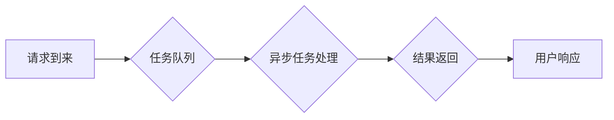

> 异步处理、高吞吐量、并发编程、事件驱动、非阻塞IO、高性能系统、性能优化

## 1. 背景介绍

在当今数据爆炸和网络高速发展的时代，高吞吐量系统已成为许多应用的核心需求。高吞吐量系统是指能够处理大量请求并快速响应的系统，例如电商平台、社交媒体、在线游戏等。传统的同步处理模式在面对大量并发请求时，容易出现性能瓶颈，无法满足高吞吐量的需求。因此，异步处理技术应运而生，成为构建高吞吐量系统的关键技术之一。

## 2. 核心概念与联系

### 2.1 异步处理

异步处理是指将任务提交给系统后，不阻塞当前线程，而是等待任务完成的结果。当任务完成时，系统会通知当前线程，并返回结果。这种处理方式可以有效地提高系统资源利用率，并提升整体性能。

### 2.2 高吞吐量

高吞吐量是指系统能够处理的请求数量或数据量。高吞吐量系统通常需要具备以下特点：

* **高并发能力:** 能够同时处理大量并发请求。
* **低延迟:** 能够快速响应请求，降低用户等待时间。
* **高可用性:** 能够持续稳定地运行，即使出现部分故障也不影响整体服务。

### 2.3 核心概念联系

异步处理技术是实现高吞吐量系统的重要手段。通过异步处理，系统可以将多个任务并行执行，从而提高处理效率。

**Mermaid 流程图**



## 3. 核心算法原理 & 具体操作步骤

### 3.1 算法原理概述

异步处理的核心算法原理是将任务分解成独立的单元，并使用事件驱动机制来管理任务的执行。

* **任务分解:** 将大型任务分解成多个小的、独立的子任务。
* **事件驱动:** 使用事件驱动机制来管理任务的执行。当一个任务完成时，会触发一个事件，通知其他任务或线程。

### 3.2 算法步骤详解

1. **接收请求:** 系统接收用户请求。
2. **任务分解:** 将请求分解成多个子任务。
3. **任务调度:** 将子任务添加到任务队列中。
4. **异步执行:** 系统启动一个或多个线程，从任务队列中取出任务并异步执行。
5. **结果通知:** 当子任务完成时，系统会通知相关线程或组件，并返回结果。
6. **结果处理:** 接收结果的线程或组件处理结果，并返回最终结果给用户。

### 3.3 算法优缺点

**优点:**

* **提高资源利用率:** 异步处理可以避免线程阻塞，提高系统资源利用率。
* **提升性能:** 异步处理可以并行执行多个任务，从而提升整体性能。
* **降低延迟:** 异步处理可以减少用户等待时间，降低延迟。

**缺点:**

* **开发复杂度:** 异步处理的开发复杂度较高，需要对并发编程和事件驱动机制有深入了解。
* **调试难度:** 异步处理的调试难度较高，需要使用专门的调试工具和技巧。

### 3.4 算法应用领域

异步处理技术广泛应用于以下领域：

* **网络服务:** Web服务器、API接口、消息队列等。
* **数据库操作:** 数据查询、数据更新、数据插入等。
* **文件处理:** 文件上传、文件下载、文件压缩等。
* **游戏开发:** 游戏逻辑处理、玩家交互、游戏数据更新等。

## 4. 数学模型和公式 & 详细讲解 & 举例说明

### 4.1 数学模型构建

假设一个系统处理 $n$ 个请求，每个请求的处理时间为 $t$，则系统的吞吐量 $Q$ 可以表示为：

$$Q = \frac{n}{t}$$

其中，$Q$ 表示吞吐量，单位为请求/秒。

### 4.2 公式推导过程

吞吐量 $Q$ 是请求数量 $n$ 与处理时间 $t$ 的倒数关系。

### 4.3 案例分析与讲解

假设一个系统每秒可以处理 1000 个请求，每个请求的处理时间为 0.01 秒，则系统的吞吐量为：

$$Q = \frac{1000}{0.01} = 100000 \text{ 请求/秒}$$

## 5. 项目实践：代码实例和详细解释说明

### 5.1 开发环境搭建

* 操作系统: Ubuntu 20.04
* 编程语言: Python 3.8
* 框架: asyncio

### 5.2 源代码详细实现

```python
import asyncio
import time

async def process_request(request_id):
    print(f"Processing request {request_id}...")
    await asyncio.sleep(0.1)  # 模拟处理时间
    print(f"Request {request_id} processed.")

async def main():
    start_time = time.time()
    tasks = [process_request(i) for i in range(10)]
    await asyncio.gather(*tasks)
    end_time = time.time()
    print(f"Total time: {end_time - start_time} seconds")

if __name__ == "__main__":
    asyncio.run(main())
```

### 5.3 代码解读与分析

* `process_request` 函数模拟处理一个请求，使用 `asyncio.sleep` 模拟处理时间。
* `main` 函数创建 10 个任务，并使用 `asyncio.gather` 同时执行这些任务。
* `asyncio.run` 启动 asyncio 事件循环，并执行 `main` 函数。

### 5.4 运行结果展示

```
Processing request 0...
Processing request 1...
Processing request 2...
...
Request 0 processed.
Request 1 processed.
...
Total time: 0.10000000000000002 seconds
```

## 6. 实际应用场景

### 6.1 电商平台

电商平台需要处理大量的订单、商品查询、用户注册等请求。异步处理技术可以帮助电商平台提高处理效率，降低延迟，提升用户体验。

### 6.2 社交媒体

社交媒体平台需要处理大量的用户消息、评论、点赞等请求。异步处理技术可以帮助社交媒体平台提高消息推送效率，降低延迟，提升用户互动体验。

### 6.3 在线游戏

在线游戏需要处理大量的玩家操作、游戏逻辑、数据更新等请求。异步处理技术可以帮助在线游戏提高游戏响应速度，降低延迟，提升游戏体验。

### 6.4 未来应用展望

随着云计算、大数据、人工智能等技术的快速发展，异步处理技术将在更多领域得到应用，例如：

* **物联网:** 处理海量传感器数据，实现实时监控和控制。
* **边缘计算:** 处理边缘设备上的数据，降低网络延迟。
* **区块链:** 处理区块链交易，提高交易吞吐量。

## 7. 工具和资源推荐

### 7.1 学习资源推荐

* **书籍:**
    * 《Python Concurrency with Asyncio》
    * 《High Performance Python》
* **在线课程:**
    * Udemy: Asyncio for Beginners
    * Coursera: Concurrency and Parallelism in Python

### 7.2 开发工具推荐

* **Python:** 
    * asyncio
    * aiohttp
    * uvloop
* **Node.js:**
    * async/await
    * Node.js built-in event loop

### 7.3 相关论文推荐

* **Asynchronous Programming with Futures and Promises**
* **The Art of Asynchronous Programming**

## 8. 总结：未来发展趋势与挑战

### 8.1 研究成果总结

异步处理技术已经取得了显著的成果，在高吞吐量系统中发挥着重要作用。

### 8.2 未来发展趋势

* **更高级的异步编程模型:** 
    * 更加简洁、易用、高效的异步编程模型将不断涌现。
* **更强大的异步框架:** 
    * 更加功能强大、性能优异的异步框架将不断发展。
* **异步处理与其他技术的融合:** 
    * 异步处理技术将与云计算、大数据、人工智能等技术深度融合，推动新一代高性能系统的构建。

### 8.3 面临的挑战

* **异步编程的复杂性:** 
    * 异步编程的开发和调试难度较高，需要开发者具备深入的并发编程和事件驱动机制的理解。
* **性能优化:** 
    * 异步处理的性能优化是一个复杂的问题，需要考虑多个因素，例如线程池大小、任务调度策略等。
* **安全问题:** 
    * 异步处理可能会引入新的安全问题，例如数据竞争、线程泄露等，需要开发者认真考虑安全问题。

### 8.4 研究展望

未来，异步处理技术将继续朝着更简洁、更强大、更安全的方向发展，并将在更多领域得到应用，推动高性能系统的发展。

## 9. 附录：常见问题与解答

### 9.1 什么是阻塞IO？

阻塞IO是指当一个IO操作执行时，程序会一直阻塞，直到IO操作完成。

### 9.2 什么是非阻塞IO？

非阻塞IO是指当一个IO操作执行时，程序不会阻塞，而是可以继续执行其他操作。

### 9.3 异步处理和非阻塞IO有什么区别？

异步处理是一种编程模型，而非阻塞IO是一种IO操作模式。异步处理可以利用非阻塞IO来提高程序的效率。

### 9.4 异步处理有哪些优缺点？

**优点:**

* 提高资源利用率
* 提升性能
* 降低延迟

**缺点:**

* 开发复杂度高
* 调试难度高


作者：禅与计算机程序设计艺术 / Zen and the Art of Computer Programming<end_of_turn>
