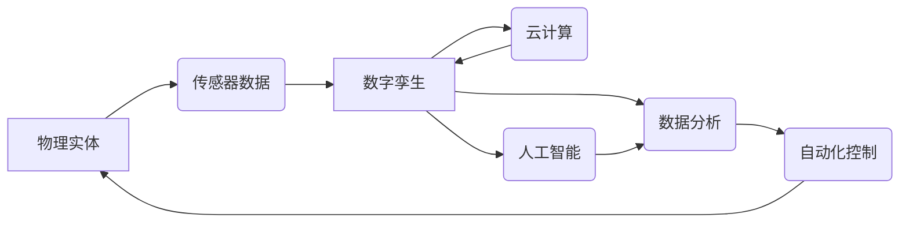

> 数字孪生、物理实体、自动化、机器学习、深度学习、传感器网络、云计算

## 1. 背景介绍

随着物联网、人工智能和云计算技术的快速发展，数字实体与物理实体的融合正在深刻地改变着我们的世界。数字实体，即基于数字模型的虚拟表示，能够实时反映物理实体的状态、行为和环境。数字孪生技术作为数字实体与物理实体之间桥梁，使得我们可以对物理世界进行更深入的理解和控制。

传统工业生产模式面临着效率低下、成本高昂、可持续性差等问题。而数字孪生技术可以帮助我们构建虚拟的生产环境，进行模拟和优化，从而提高生产效率、降低成本、提升产品质量和可持续性。

## 2. 核心概念与联系

**2.1 数字孪生**

数字孪生是指基于物理实体的虚拟模型，它能够实时反映物理实体的状态、行为和环境。数字孪生包含了物理实体的几何形状、物理属性、传感器数据、运行状态等信息。

**2.2 物理实体**

物理实体是指真实存在的物质对象，例如机器设备、车辆、建筑物、人员等。

**2.3 自动化**

自动化是指利用计算机和机器人等技术，使生产过程或其他任务能够自动完成，无需人工干预。

**2.4 连接性**

连接性是指物理实体和数字实体之间的数据交换和通信能力。

**2.5 数据分析**

数据分析是指对收集到的数据进行处理和分析，以从中提取有价值的信息。

**2.6 人工智能**

人工智能是指模拟人类智能的计算机系统，例如机器学习、深度学习等。

**2.7 云计算**

云计算是指利用互联网提供计算资源、存储资源和软件服务的模式。

**2.8 核心概念关系图**



## 3. 核心算法原理 & 具体操作步骤

**3.1 算法原理概述**

数字孪生技术的核心算法包括数据采集、数据处理、模型构建、仿真模拟和控制决策等环节。

* **数据采集:** 利用传感器网络收集物理实体的状态、行为和环境数据。
* **数据处理:** 对采集到的数据进行清洗、预处理和特征提取。
* **模型构建:** 基于数据分析，构建物理实体的数字孪生模型。
* **仿真模拟:** 利用数字孪生模型进行仿真模拟，预测物理实体的未来状态和行为。
* **控制决策:** 根据仿真模拟结果，制定控制策略，对物理实体进行自动化控制。

**3.2 算法步骤详解**

1. **部署传感器网络:** 在物理实体周围部署传感器网络，收集物理实体的状态、行为和环境数据。
2. **数据采集和传输:** 传感器采集到的数据通过网络传输到云平台。
3. **数据预处理:** 对采集到的数据进行清洗、格式转换和缺失值处理。
4. **特征提取:** 利用机器学习算法，从数据中提取有价值的特征。
5. **模型构建:** 基于提取的特征，构建物理实体的数字孪生模型。
6. **仿真模拟:** 利用数字孪生模型进行仿真模拟，预测物理实体的未来状态和行为。
7. **控制决策:** 根据仿真模拟结果，制定控制策略，对物理实体进行自动化控制。

**3.3 算法优缺点**

**优点:**

* 提高生产效率和降低成本
* 提升产品质量和可持续性
* 增强对物理实体的理解和控制
* 促进创新和发展

**缺点:**

* 建立数字孪生模型需要大量数据和计算资源
* 模型精度受数据质量和算法复杂度影响
* 需要专业的技术人员进行开发和维护

**3.4 算法应用领域**

数字孪生技术应用领域广泛，包括：

* 制造业: 生产过程优化、设备维护、产品设计
* 能源行业: 电网管理、能源效率提升、风力发电优化
* 交通运输: 交通流量管理、车辆调度、道路安全
* 建筑行业: 建筑设计、施工管理、建筑运营
* 医疗保健: 虚拟手术模拟、疾病诊断、个性化医疗

## 4. 数学模型和公式 & 详细讲解 & 举例说明

**4.1 数学模型构建**

数字孪生模型通常采用基于物理学的模型、数据驱动模型或混合模型。

* **基于物理学的模型:** 基于物理定律和方程，建立物理实体的数学模型。例如，机械系统的运动模型可以采用牛顿第二定律。
* **数据驱动模型:** 利用机器学习算法，从数据中学习物理实体的特征和行为模式。例如，可以使用神经网络预测机器设备的故障概率。
* **混合模型:** 将基于物理学的模型和数据驱动模型结合起来，提高模型的精度和鲁棒性。

**4.2 公式推导过程**

例如，考虑一个简单的机械系统，其运动方程可以表示为：

$$m\ddot{x} + c\dot{x} + kx = F(t)$$

其中：

* $m$ 是质量
* $c$ 是阻尼系数
* $k$ 是弹簧系数
* $x$ 是位移
* $\dot{x}$ 是速度
* $\ddot{x}$ 是加速度
* $F(t)$ 是外力

**4.3 案例分析与讲解**

例如，可以利用数字孪生技术对风力发电机组进行仿真模拟，预测其发电量和故障概率。通过分析风力发电机组的运行数据，建立其数字孪生模型，并利用仿真模拟预测其在不同风速条件下的发电量和故障概率。

## 5. 项目实践：代码实例和详细解释说明

**5.1 开发环境搭建**

* 操作系统: Ubuntu 20.04
* 编程语言: Python 3.8
* 软件包: TensorFlow, PyTorch, NumPy, Pandas, Matplotlib

**5.2 源代码详细实现**

```python
import tensorflow as tf

# 定义神经网络模型
model = tf.keras.models.Sequential([
    tf.keras.layers.Dense(128, activation='relu', input_shape=(10,)),
    tf.keras.layers.Dense(64, activation='relu'),
    tf.keras.layers.Dense(1)
])

# 编译模型
model.compile(optimizer='adam', loss='mse')

# 训练模型
model.fit(X_train, y_train, epochs=100)

# 评估模型
loss = model.evaluate(X_test, y_test)
print('Loss:', loss)
```

**5.3 代码解读与分析**

这段代码实现了基于深度学习的数字孪生模型。

* 首先定义了一个神经网络模型，包含三个全连接层。
* 然后编译模型，使用 Adam 优化器和均方误差损失函数。
* 接着训练模型，使用训练数据进行训练。
* 最后评估模型，使用测试数据计算模型的损失值。

**5.4 运行结果展示**

训练完成后，可以将模型应用于预测物理实体的状态和行为。例如，可以利用训练好的模型预测风力发电机组的未来发电量。

## 6. 实际应用场景

**6.1 制造业**

* **生产过程优化:** 利用数字孪生技术模拟生产过程，优化生产流程和参数，提高生产效率和产品质量。
* **设备维护:** 通过监测设备运行数据，预测设备故障，提前进行维护，降低设备停机时间和维修成本。
* **产品设计:** 利用数字孪生技术进行虚拟产品测试，优化产品设计，缩短产品开发周期。

**6.2 能源行业**

* **电网管理:** 利用数字孪生技术模拟电网运行状态，预测电力需求，优化电力调度，提高电网稳定性和可靠性。
* **能源效率提升:** 通过监测能源消耗数据，识别能源浪费环节，优化能源使用方式，提高能源效率。
* **风力发电优化:** 利用数字孪生技术预测风力发电量，优化风力发电机组运行策略，提高发电效率。

**6.3 交通运输**

* **交通流量管理:** 利用数字孪生技术模拟交通流量，预测交通拥堵情况，优化交通信号灯控制，缓解交通拥堵。
* **车辆调度:** 利用数字孪生技术优化车辆调度方案，提高车辆利用率，降低运输成本。
* **道路安全:** 利用数字孪生技术模拟道路交通场景，预测交通事故风险，提高道路安全。

**6.4 未来应用展望**

数字孪生技术在未来将得到更广泛的应用，例如：

* **智慧城市:** 利用数字孪生技术构建城市虚拟模型，优化城市规划和管理，提高城市生活质量。
* **个性化医疗:** 利用数字孪生技术构建患者虚拟模型，进行个性化疾病诊断和治疗方案制定。
* **虚拟现实和增强现实:** 利用数字孪生技术增强虚拟现实和增强现实体验，创造更逼真的虚拟世界。

## 7. 工具和资源推荐

**7.1 学习资源推荐**

* **书籍:**
    * 《数字孪生：从概念到实践》
    * 《工业互联网》
* **在线课程:**
    * Coursera: 数字孪生
    * edX: 物联网和数字孪生
* **网站:**
    * 数字孪生联盟 (Digital Twin Consortium)
    * 物联网论坛 (IoT Forum)

**7.2 开发工具推荐**

* **云平台:**
    * AWS
    * Azure
    * Google Cloud
* **数据分析工具:**
    * Python (Pandas, NumPy, Scikit-learn)
    * R
* **仿真模拟工具:**
    * ANSYS
    * COMSOL

**7.3 相关论文推荐**

* **数字孪生的定义和分类:**
    * Tao, Y., et al. (2019). Digital twin: A comprehensive review. IEEE Access, 7, 10417-10436.
* **数字孪生技术在制造业中的应用:**
    * Grieves, M., et al. (2014). Digital twins. In Proceedings of the 2014 IEEE International Conference on Industrial Technology (ICIT) (pp. 1-6). IEEE.
* **数字孪生技术在能源行业的应用:**
    * Lee, J., et al. (2018). Digital twin for smart grid: A review. IEEE Access, 6, 39437-39450.

## 8. 总结：未来发展趋势与挑战

**8.1 研究成果总结**

数字孪生技术已经取得了显著的成果，在制造业、能源行业、交通运输等领域得到了广泛应用。

**8.2 未来发展趋势**

* **模型精度提升:** 利用更先进的机器学习算法和数据分析技术，提高数字孪生模型的精度和可靠性。
* **多物理场耦合:** 将多个物理场（例如力学、热力学、电磁学）耦合到数字孪生模型中，模拟更复杂的物理现象。
* **边缘计算:** 将数字孪生模型部署到边缘设备上，实现实时数据处理和决策，降低网络延迟。
* **人工智能集成:** 将人工智能技术与数字孪生技术结合，实现智能化控制和预测。

**8.3 面临的挑战**

* **数据质量:** 数字孪生模型的精度依赖于数据质量，需要解决数据采集、清洗和预处理等问题。
* **模型复杂度:** 数字孪生模型的复杂度较高，需要强大的计算资源和算法优化技术。
* **安全性和隐私:** 数字孪生模型涉及到大量敏感数据，需要保障数据安全和隐私。

**8.4 研究展望**

未来，数字孪生技术将继续发展，在更多领域得到应用，为我们创造更美好的未来。


## 9. 附录：常见问题与解答

**9.1 数字孪