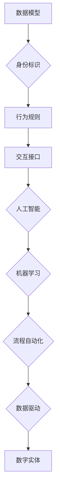

> 数字实体、自动化、人工智能、机器学习、数据驱动、流程自动化、业务流程、未来趋势

## 1. 背景介绍

数字经济时代，数据已成为重要的生产要素，而数字实体作为数据化的实体，在推动经济数字化转型中扮演着越来越重要的角色。数字实体是指通过数字化技术将物理世界或抽象概念映射到数字空间中的虚拟表示，它可以是产品、服务、流程、组织甚至整个生态系统。

数字实体的自动化，是指利用人工智能、机器学习等技术，使数字实体能够自主完成预设的任务，无需人工干预。这种自动化不仅可以提高效率，降低成本，还能释放人类的创造力和潜能，推动数字经济的持续发展。

## 2. 核心概念与联系

**2.1 数字实体的构成**

数字实体通常由以下几个核心要素构成：

* **数据模型:** 描述数字实体的结构、属性和行为的数据模型，例如产品规格、服务功能、流程步骤等。
* **身份标识:** 唯一标识数字实体的标识符，例如产品ID、服务ID、流程ID等。
* **行为规则:** 定义数字实体的行为逻辑和决策规则，例如产品的使用场景、服务的服务流程、流程的执行步骤等。
* **交互接口:** 数字实体与其他系统或实体进行交互的接口，例如API、协议、数据格式等。

**2.2 自动化技术**

数字实体的自动化主要依赖于以下技术：

* **人工智能 (AI):**  赋予数字实体智能决策能力，例如机器学习、深度学习、自然语言处理等。
* **机器学习 (ML):**  通过数据训练，使数字实体能够自动学习和改进行为，例如预测需求、优化流程、识别异常等。
* **流程自动化 (PA):**  自动执行预定义的业务流程，例如订单处理、客户服务、合同管理等。
* **数据驱动:**  基于数据分析和决策，使数字实体能够做出更智能和高效的决策。

**2.3 自动化架构**

数字实体的自动化通常采用以下架构：



## 3. 核心算法原理 & 具体操作步骤

### 3.1 算法原理概述

数字实体自动化的核心算法主要包括：

* **机器学习算法:** 用于训练数字实体的智能决策模型，例如监督学习、无监督学习、强化学习等。
* **流程自动化算法:** 用于自动执行预定义的业务流程，例如状态机、工作流引擎等。
* **数据分析算法:** 用于分析数字实体的数据，发现模式和趋势，支持智能决策，例如聚类分析、关联规则挖掘等。

### 3.2 算法步骤详解

**3.2.1 机器学习算法步骤:**

1. **数据收集:** 收集与数字实体相关的各种数据，例如产品使用数据、客户行为数据、市场趋势数据等。
2. **数据预处理:** 对收集到的数据进行清洗、转换、特征提取等预处理操作，使其适合机器学习算法的训练。
3. **模型选择:** 根据具体的应用场景和数据特点，选择合适的机器学习算法，例如回归算法、分类算法、聚类算法等。
4. **模型训练:** 使用预处理后的数据训练选择的机器学习模型，调整模型参数，使其能够准确地预测或分类数据。
5. **模型评估:** 使用测试数据评估模型的性能，例如准确率、召回率、F1-score等指标。
6. **模型部署:** 将训练好的模型部署到生产环境中，用于数字实体的智能决策。

**3.2.2 流程自动化算法步骤:**

1. **流程建模:**  根据业务需求，使用流程建模工具，绘制数字实体的业务流程图，定义流程步骤、节点、条件等。
2. **流程配置:**  配置流程自动化引擎，将流程图转化为可执行的流程代码，定义流程变量、数据流、事件触发等。
3. **流程测试:**  测试流程的正确性和完整性，确保流程能够按照预期执行。
4. **流程部署:**  部署流程自动化引擎，使数字实体能够自动执行预定义的业务流程。

### 3.3 算法优缺点

**3.3.1 机器学习算法:**

* **优点:** 能够自动学习和改进，适应不断变化的数据环境，具有强大的预测和分类能力。
* **缺点:** 需要大量的训练数据，训练过程耗时，模型解释性较差，容易受到数据偏差的影响。

**3.3.2 流程自动化算法:**

* **优点:**  能够提高效率，降低成本，减少人为错误，使业务流程更加规范化和可控。
* **缺点:**  流程设计需要专业知识，难以应对复杂和动态的业务场景，流程变更需要重新配置。

### 3.4 算法应用领域

数字实体自动化的算法应用领域广泛，例如：

* **制造业:** 自动化生产线，优化生产流程，预测设备故障。
* **金融业:** 自动化风控，智能理财，个性化服务。
* **零售业:** 智能推荐，个性化营销，库存管理。
* **医疗保健:** 智能诊断，个性化治疗，病历管理。

## 4. 数学模型和公式 & 详细讲解 & 举例说明

### 4.1 数学模型构建

数字实体自动化的数学模型通常基于概率论、统计学和机器学习等数学基础。

**4.1.1 概率模型:** 用于描述数字实体的行为和状态的概率分布，例如贝叶斯网络、马尔科夫链等。

**4.1.2 统计模型:** 用于分析数字实体的数据，发现模式和趋势，例如线性回归、逻辑回归等。

**4.1.3 机器学习模型:** 用于训练数字实体的智能决策模型，例如决策树、支持向量机、神经网络等。

### 4.2 公式推导过程

**4.2.1 贝叶斯网络:**

贝叶斯网络是一种概率图模型，用于表示随机变量之间的依赖关系。其核心公式是贝叶斯定理：

$$P(A|B) = \frac{P(B|A)P(A)}{P(B)}$$

其中：

* $P(A|B)$ 是在已知事件 B 发生的情况下，事件 A 发生的概率。
* $P(B|A)$ 是在已知事件 A 发生的情况下，事件 B 发生的概率。
* $P(A)$ 是事件 A 发生的概率。
* $P(B)$ 是事件 B 发生的概率。

**4.2.2 线性回归:**

线性回归是一种用于预测连续变量的统计模型，其核心公式为：

$$y = \beta_0 + \beta_1x_1 + \beta_2x_2 + ... + \beta_nx_n + \epsilon$$

其中：

* $y$ 是预测变量。
* $x_1, x_2, ..., x_n$ 是解释变量。
* $\beta_0, \beta_1, \beta_2, ..., \beta_n$ 是模型参数。
* $\epsilon$ 是误差项。

### 4.3 案例分析与讲解

**4.3.1 贝叶斯网络案例:**

假设我们想要预测客户是否会购买某个产品，我们可以构建一个贝叶斯网络，其中包含以下节点：

* 客户年龄
* 客户收入
* 客户兴趣
* 产品价格
* 客户购买行为

我们可以根据历史数据，学习每个节点的概率分布和节点之间的依赖关系，然后利用贝叶斯定理，计算出客户购买产品的概率。

**4.3.2 线性回归案例:**

假设我们想要预测房屋价格，我们可以使用线性回归模型，其中解释变量包括房屋面积、房屋位置、房屋朝向等，模型参数可以根据训练数据进行估计，然后利用模型预测新的房屋价格。

## 5. 项目实践：代码实例和详细解释说明

### 5.1 开发环境搭建

* 操作系统: Ubuntu 20.04 LTS
* Python 版本: 3.8.10
* 虚拟环境: venv
* 依赖库: pandas, numpy, scikit-learn, TensorFlow

### 5.2 源代码详细实现

```python
# 导入必要的库
import pandas as pd
from sklearn.model_selection import train_test_split
from sklearn.linear_model import LinearRegression

# 加载数据
data = pd.read_csv('house_data.csv')

# 选择特征和目标变量
features = ['area', 'location', 'orientation']
target = 'price'

# 将数据分割为训练集和测试集
X_train, X_test, y_train, y_test = train_test_split(data[features], data[target], test_size=0.2, random_state=42)

# 创建线性回归模型
model = LinearRegression()

# 训练模型
model.fit(X_train, y_train)

# 预测测试集数据
y_pred = model.predict(X_test)

# 评估模型性能
from sklearn.metrics import mean_squared_error
mse = mean_squared_error(y_test, y_pred)
print(f'Mean Squared Error: {mse}')
```

### 5.3 代码解读与分析

* 首先，我们导入必要的库，并加载数据。
* 然后，我们选择特征和目标变量，并将数据分割为训练集和测试集。
* 接下来，我们创建线性回归模型，并使用训练集训练模型。
* 然后，我们使用训练好的模型预测测试集数据，并评估模型性能。

### 5.4 运行结果展示

运行上述代码后，会输出测试集数据的均方误差值，该值越小，模型的预测性能越好。

## 6. 实际应用场景

### 6.1 数字实体自动化在制造业的应用

* **智能制造:** 利用数字实体自动化技术，实现生产线智能化、自动化，提高生产效率和产品质量。
* **预测性维护:** 通过分析设备运行数据，预测设备故障，提前进行维护，降低设备停机时间和维修成本。
* **供应链优化:** 利用数字实体自动化技术，优化供应链流程，提高供应链效率和响应能力。

### 6.2 数字实体自动化在金融业的应用

* **智能风控:** 利用数字实体自动化技术，分析客户数据，识别风险，提高风控效率和准确率。
* **个性化金融服务:** 利用数字实体自动化技术，根据客户需求，提供个性化的金融产品和服务。
* **自动交易:** 利用数字实体自动化技术，实现自动交易，提高交易效率和降低交易成本。

### 6.3 数字实体自动化在零售业的应用

* **智能推荐:** 利用数字实体自动化技术，分析客户购买历史和行为数据，推荐个性化的商品。
* **个性化营销:** 利用数字实体自动化技术，根据客户需求和喜好，进行个性化的营销推广。
* **库存管理:** 利用数字实体自动化技术，优化库存管理，减少库存积压和缺货情况。

### 6.4 未来应用展望

数字实体自动化技术的发展将带来更多新的应用场景，例如：

* **数字孪生:** 利用数字实体自动化技术，构建数字孪生系统，模拟现实世界，进行虚拟测试和优化。
* **智能城市:** 利用数字实体自动化技术，构建智能城市，提高城市管理效率和居民生活质量。
* **元宇宙:** 利用数字实体自动化技术，构建元宇宙，创造虚拟世界，提供新的娱乐、社交和商业体验。

## 7. 工具和资源推荐

### 7.1 学习资源推荐

* **书籍:**
    * 《深度学习》
    * 《机器学习实战》
    * 《Python机器学习》
* **在线课程:**
    * Coursera: 深度学习
    * edX: 机器学习
    * Udacity: 机器学习工程师

### 7.2 开发工具推荐

* **Python:** 广泛应用于机器学习和数据科学领域，拥有丰富的库和工具。
* **TensorFlow:** 开源深度学习框架，支持多种硬件平台