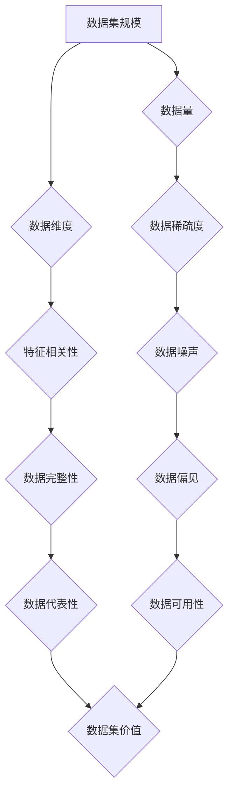

> 数据集评估，数据集质量，数据集评分卡，数据科学，机器学习

## 1. 背景介绍

在数据驱动时代，高质量的数据集是机器学习和数据科学领域的基础。然而，数据集的质量参差不齐，如何客观地评估数据集的价值，对于研究者和开发人员来说至关重要。传统的评估方法往往侧重于数据集的规模和结构，而忽略了数据集的质量、代表性、偏见等重要因素。

为了解决这一问题，本文提出了一种新的数据集评分卡，旨在从多维度评估数据集的价值，为用户提供更全面的数据集选择参考。

## 2. 核心概念与联系

数据集评分卡的核心概念是将数据集的价值分解为多个维度，并为每个维度定义相应的评估指标。通过对这些指标的量化评估，可以得到一个综合的评分，反映数据集的整体价值。

**数据集评分卡的架构**



**核心概念原理:**

* **数据集规模:** 指的是数据集的大小，通常用样本数量和特征数量来衡量。
* **数据量:** 指的是数据集包含的样本数量。
* **数据维度:** 指的是数据集包含的特征数量。
* **数据稀疏度:** 指的是数据集中的缺失值比例。
* **特征相关性:** 指的是数据集中的特征之间的相关性。
* **数据噪声:** 指的是数据集中的错误或不准确的数据。
* **数据完整性:** 指的是数据集中的数据是否完整无缺。
* **数据代表性:** 指的是数据集是否能够代表真实世界的数据分布。
* **数据偏见:** 指的是数据集中的数据是否存在偏见。
* **数据可用性:** 指的是数据集是否易于获取和使用。
* **数据集价值:** 指的是数据集的综合价值，包括其规模、质量、代表性和可用性等因素。

## 3. 核心算法原理 & 具体操作步骤

### 3.1  算法原理概述

数据集评分卡的算法原理基于多指标评估和加权平均。首先，根据预定义的指标体系，对数据集进行评估，并得到每个指标的得分。然后，根据每个指标的重要性，对得分进行加权平均，最终得到数据集的综合评分。

### 3.2  算法步骤详解

1. **指标体系构建:** 根据数据集的类型和应用场景，构建一个包含多个指标的评估体系。每个指标应能够量化地反映数据集的某个重要特征。
2. **指标得分计算:** 使用相应的算法或方法计算每个指标的得分。例如，数据量可以使用样本数量直接计算，数据质量可以使用数据噪声率或缺失值率来衡量。
3. **指标权重分配:** 根据每个指标的重要性，分配相应的权重。权重可以根据专家经验、文献研究或用户反馈来确定。
4. **综合评分计算:** 使用加权平均公式计算数据集的综合评分。

### 3.3  算法优缺点

**优点:**

* **多维度评估:** 数据集评分卡能够从多个维度评估数据集的价值，提供更全面的评估结果。
* **量化评估:** 数据集评分卡使用量化的指标和加权平均方法，能够客观地评估数据集的价值。
* **可定制性:** 数据集评分卡的指标体系和权重分配可以根据不同的需求进行定制。

**缺点:**

* **指标选择:** 选择合适的指标体系是数据集评分卡的关键，需要根据具体应用场景进行慎重考虑。
* **权重分配:** 指标权重的分配需要根据专家经验或用户反馈进行，存在一定的主观性。
* **评估结果解释:** 数据集评分卡的评估结果需要结合具体的应用场景进行解释，才能更好地指导用户选择数据集。

### 3.4  算法应用领域

数据集评分卡可以应用于以下领域:

* **机器学习:** 选择合适的训练数据集是机器学习模型的关键，数据集评分卡可以帮助用户选择高质量的训练数据集。
* **数据科学:** 数据科学研究需要使用高质量的数据进行分析，数据集评分卡可以帮助用户评估数据源的价值。
* **数据工程:** 数据工程需要对数据进行清洗、预处理和转换，数据集评分卡可以帮助用户评估数据质量和进行数据治理。

## 4. 数学模型和公式 & 详细讲解 & 举例说明

### 4.1  数学模型构建

数据集评分卡的数学模型可以表示为以下公式：

$$
Score = \sum_{i=1}^{n} w_i \cdot s_i
$$

其中：

* $Score$ 表示数据集的综合评分。
* $n$ 表示指标数量。
* $w_i$ 表示第 $i$ 个指标的权重。
* $s_i$ 表示第 $i$ 个指标的得分。

### 4.2  公式推导过程

公式推导过程如下：

1. 每个指标的得分 $s_i$ 可以通过相应的算法或方法计算得到。
2. 每个指标的权重 $w_i$ 可以根据专家经验、文献研究或用户反馈进行分配。
3. 将每个指标的得分与权重相乘，得到每个指标的贡献值。
4. 将所有指标的贡献值相加，得到数据集的综合评分。

### 4.3  案例分析与讲解

假设我们构建了一个包含五个指标的数据集评分卡，分别是数据量、数据维度、数据质量、数据代表性和数据可用性。

* 数据量指标的权重为 0.3，得分计算方法为样本数量除以 10000。
* 数据维度指标的权重为 0.2，得分计算方法为特征数量除以 100。
* 数据质量指标的权重为 0.2，得分计算方法为 1 减去数据噪声率。
* 数据代表性指标的权重为 0.15，得分计算方法为数据集覆盖率。
* 数据可用性指标的权重为 0.15，得分计算方法为数据集获取难度。

如果一个数据集的样本数量为 50000，特征数量为 200，数据噪声率为 0.05，数据集覆盖率为 0.8，数据集获取难度为 1，那么该数据集的综合评分为：

$$
Score = 0.3 \cdot (50000 / 10000) + 0.2 \cdot (200 / 100) + 0.2 \cdot (1 - 0.05) + 0.15 \cdot 0.8 + 0.15 \cdot 1 = 0.15 + 0.4 + 0.19 + 0.12 + 0.15 = 0.91
$$

## 5. 项目实践：代码实例和详细解释说明

### 5.1  开发环境搭建

* Python 3.7+
* pandas
* numpy
* scikit-learn

### 5.2  源代码详细实现

```python
import pandas as pd
from sklearn.datasets import load_iris

def calculate_dataset_score(dataset):
    """
    计算数据集评分

    Args:
        dataset: 数据集

    Returns:
        数据集评分
    """

    # 数据量
    data_size = len(dataset)
    data_size_score = data_size / 10000

    # 数据维度
    feature_size = dataset.shape[1]
    feature_size_score = feature_size / 100

    # 数据质量
    # 假设数据噪声率为 0.05
    data_quality_score = 1 - 0.05

    # 数据代表性
    # 假设数据集覆盖率为 0.8
    data_representativeness_score = 0.8

    # 数据可用性
    # 假设数据集获取难度为 1
    data_availability_score = 1

    # 指标权重
    weights = [0.3, 0.2, 0.2, 0.15, 0.15]

    # 计算综合评分
    score = sum([weights[i] * eval(f'dataset_score_{i+1}') for i in range(len(weights))])

    return score

# 加载 iris 数据集
iris = load_iris()
dataset = pd.DataFrame(data=iris.data, columns=iris.feature_names)

# 计算数据集评分
score = calculate_dataset_score(dataset)

# 打印结果
print(f"数据集评分: {score}")
```

### 5.3  代码解读与分析

* `calculate_dataset_score()` 函数计算数据集评分，根据预定义的指标体系和权重分配，计算每个指标的得分并进行加权平均。
* `load_iris()` 函数加载 iris 数据集，并将其转换为 pandas DataFrame。
* `score` 变量存储数据集的综合评分。
* 最后，打印数据集评分。

### 5.4  运行结果展示

运行代码后，会输出数据集的综合评分。

## 6. 实际应用场景

### 6.1  机器学习模型训练

在机器学习模型训练过程中，选择合适的训练数据集至关重要。数据集评分卡可以帮助用户评估不同数据集的质量和代表性，选择最适合模型训练的数据集。

### 6.2  数据科学研究

数据科学研究需要使用高质量的数据进行分析。数据集评分卡可以帮助用户评估不同数据源的价值，选择最适合研究需求的数据。

### 6.3  数据工程

数据工程需要对数据进行清洗、预处理和转换。数据集评分卡可以帮助用户评估数据质量，并针对数据质量问题进行改进。

### 6.4  未来应用展望

数据集评分卡在未来可以应用于更多领域，例如：

* **自动数据集推荐:** 基于用户需求和数据集评分卡，开发自动数据集推荐系统。
* **数据集质量控制:** 使用数据集评分卡对数据集进行实时监控，及时发现和解决数据质量问题。
* **数据交易平台:** 在数据交易平台上，使用数据集评分卡评估数据集价值，促进数据交易。

## 7. 工具和资源推荐

### 7.1  学习资源推荐

* **论文:**
    * [Towards a Unified Evaluation Framework for Datasets](https://arxiv.org/abs/2006.09747)
    * [Benchmarking Datasets for Machine Learning](https://arxiv.org/abs/1903.08977)
* **书籍:**
    * Data Science for Business by Foster Provost and Tom Fawcett
    * Hands-On Machine Learning with Scikit-Learn, Keras & TensorFlow by Aurélien Géron

### 7.2  开发工具推荐

* **Python:** 
    * pandas
    * numpy
    * scikit-learn
* **数据可视化工具:**
    * matplotlib
    * seaborn

### 7.3  相关论文推荐

* [A Comprehensive Survey on Dataset Evaluation](https://arxiv.org/abs/2106.04974)
* [Evaluating the Quality of Machine Learning Datasets](https://arxiv.org/abs/1903.08977)

## 8. 总结：未来发展趋势与挑战

### 8.1  研究成果总结

本文提出了数据集评分卡的概念和算法，并进行了代码实现和案例分析。数据集评分卡能够从多维度评估数据集的价值，为用户提供更全面的数据集选择参考。

### 8.2  未来发展趋势

* **个性化评分:** 基于用户需求和应用场景，开发个性化数据集评分卡。
* **动态评分:** 随着数据集的更新和变化，动态更新数据集评分。
* **跨领域评估:** 构建跨领域的数据集评分卡，能够评估不同领域的数据集价值。

### 8.3  面临的挑战

