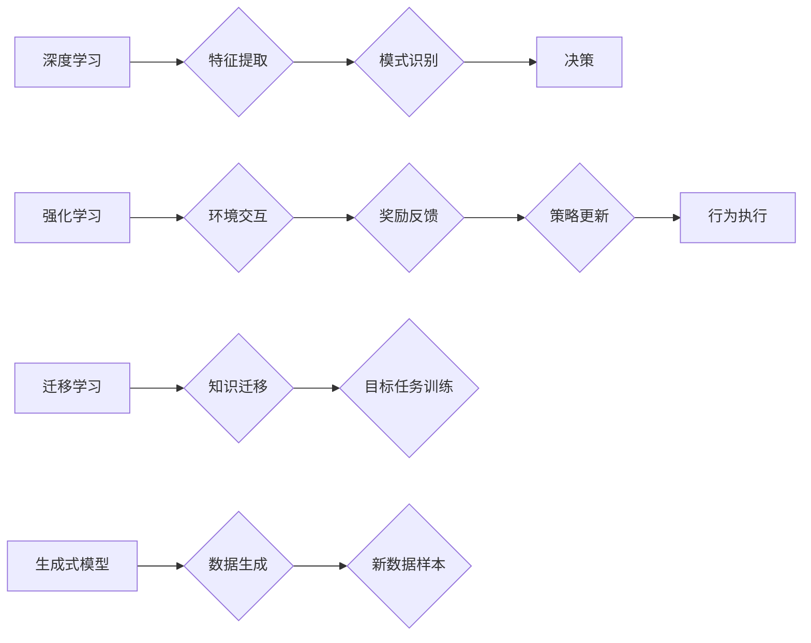

> 深度学习、强化学习、迁移学习、生成式模型、自然语言处理、计算机视觉、机器人学、伦理问题

## 1. 背景介绍

人工智能（AI）正经历着前所未有的发展阶段，从最初的局限于特定领域的专家系统，发展到如今能够处理复杂任务、学习和适应新环境的通用人工智能。新一代人工智能的核心在于深度学习、强化学习、迁移学习等技术的突破，以及对大规模数据和计算资源的有效利用。

近年来，深度学习在计算机视觉、自然语言处理等领域取得了显著成就，例如图像识别、语音识别、机器翻译等任务的准确率大幅提升。强化学习则在机器人控制、游戏策略等领域展现出强大的潜力，能够让智能体通过与环境交互学习最优策略。迁移学习则能够将已有的知识和经验迁移到新的任务和领域，降低模型训练成本和时间。

## 2. 核心概念与联系

**2.1 深度学习**

深度学习是一种基于多层神经网络的机器学习方法，能够自动从数据中学习特征表示。其核心在于利用多个隐藏层来提取数据的抽象特征，从而实现更复杂的模式识别和决策。

**2.2 强化学习**

强化学习是一种基于交互学习的机器学习方法，智能体通过与环境交互，根据环境反馈调整行为，最终学习到最优策略。其核心在于利用奖励机制引导智能体学习，使其在长期内获得最大奖励。

**2.3 迁移学习**

迁移学习是一种利用已有的知识和经验来解决新任务的方法。其核心在于将从源任务中学习到的知识迁移到目标任务，从而降低目标任务的训练成本和时间。

**2.4 生成式模型**

生成式模型能够从数据中学习数据分布，并生成新的数据样本。其核心在于学习数据的潜在表示，并利用该表示生成新的数据。

**2.5 关联图**

关联图是一种用于表示知识和关系的图形模型，能够捕捉数据之间的复杂关系。其核心在于利用节点和边来表示实体和关系，并通过图结构来表示知识的组织和推理。

**Mermaid 流程图**



## 3. 核心算法原理 & 具体操作步骤

### 3.1 算法原理概述

深度学习算法的核心是多层神经网络，通过多个隐藏层来提取数据的抽象特征。每个神经元接收来自上一层的输入，并通过激活函数进行处理，输出到下一层。通过训练，神经网络的参数会不断调整，使得网络能够学习到数据的特征表示。

### 3.2 算法步骤详解

1. **数据预处理:** 将原始数据转换为网络可以理解的格式，例如归一化、编码等。
2. **网络结构设计:** 根据任务需求设计神经网络的结构，包括层数、神经元数量、激活函数等。
3. **参数初始化:** 为网络参数赋予初始值。
4. **前向传播:** 将输入数据通过网络传递，计算输出结果。
5. **损失函数计算:** 计算输出结果与真实值的差异，即损失函数值。
6. **反向传播:** 根据损失函数值，反向传播误差，更新网络参数。
7. **迭代训练:** 重复前向传播、损失函数计算和反向传播的过程，直到损失函数值达到预设阈值。

### 3.3 算法优缺点

**优点:**

* 能够自动学习特征，无需人工特征工程。
* 能够处理高维数据和复杂模式。
* 在图像识别、语音识别等领域取得了显著成果。

**缺点:**

* 训练数据量大，计算资源消耗高。
* 训练过程复杂，需要专业知识和经验。
* 模型解释性差，难以理解模型的决策过程。

### 3.4 算法应用领域

* **计算机视觉:** 图像识别、物体检测、图像分割、人脸识别等。
* **自然语言处理:** 文本分类、情感分析、机器翻译、文本生成等。
* **语音识别:** 语音转文本、语音合成等。
* **推荐系统:** 商品推荐、内容推荐等。
* **医疗诊断:** 病情诊断、疾病预测等。

## 4. 数学模型和公式 & 详细讲解 & 举例说明

### 4.1 数学模型构建

深度学习模型的核心是神经网络，其数学模型可以表示为多层感知机（MLP）。

**4.1.1 单层感知机模型**

单层感知机模型的输出可以表示为：

$$
y = f(w^T x + b)
$$

其中：

* $x$ 是输入向量。
* $w$ 是权重向量。
* $b$ 是偏置项。
* $f$ 是激活函数。

**4.1.2 多层感知机模型**

多层感知机模型由多个隐藏层组成，每个隐藏层都包含多个神经元。每个神经元的输出可以表示为：

$$
h_i = f(w_{i}^T x + b_i)
$$

其中：

* $h_i$ 是第 $i$ 个神经元的输出。
* $w_{i}$ 是第 $i$ 个神经元的权重向量。
* $b_i$ 是第 $i$ 个神经元的偏置项。

最终的输出可以表示为：

$$
y = f(W^T h + b)
$$

其中：

* $W$ 是连接隐藏层和输出层的权重矩阵。
* $b$ 是输出层的偏置项。

### 4.2 公式推导过程

深度学习模型的训练过程是通过优化损失函数来实现的。损失函数通常是预测值与真实值的差值，例如均方误差（MSE）。

**4.2.1 均方误差（MSE）**

$$
MSE = \frac{1}{n} \sum_{i=1}^{n} (y_i - \hat{y}_i)^2
$$

其中：

* $y_i$ 是真实值。
* $\hat{y}_i$ 是预测值。
* $n$ 是样本数量。

**4.2.2 梯度下降法**

梯度下降法是一种常用的优化算法，其核心思想是沿着损失函数的梯度方向更新模型参数，使得损失函数值不断减小。

$$
\theta = \theta - \alpha \nabla L(\theta)
$$

其中：

* $\theta$ 是模型参数。
* $\alpha$ 是学习率。
* $\nabla L(\theta)$ 是损失函数的梯度。

### 4.3 案例分析与讲解

**4.3.1 图像分类**

在图像分类任务中，深度学习模型可以学习图像特征，并将其映射到不同的类别。例如，AlexNet模型在ImageNet数据集上取得了显著的成绩，其准确率超过了传统方法。

**4.3.2 机器翻译**

机器翻译任务的目标是将一种语言的文本翻译成另一种语言的文本。深度学习模型，例如Transformer模型，能够学习语言的语义和语法关系，从而实现高质量的机器翻译。

## 5. 项目实践：代码实例和详细解释说明

### 5.1 开发环境搭建

* **操作系统:** Ubuntu 20.04
* **编程语言:** Python 3.8
* **深度学习框架:** TensorFlow 2.0
* **其他工具:** Jupyter Notebook

### 5.2 源代码详细实现

```python
import tensorflow as tf

# 定义模型结构
model = tf.keras.models.Sequential([
    tf.keras.layers.Conv2D(32, (3, 3), activation='relu', input_shape=(28, 28, 1)),
    tf.keras.layers.MaxPooling2D((2, 2)),
    tf.keras.layers.Conv2D(64, (3, 3), activation='relu'),
    tf.keras.layers.MaxPooling2D((2, 2)),
    tf.keras.layers.Flatten(),
    tf.keras.layers.Dense(10, activation='softmax')
])

# 编译模型
model.compile(optimizer='adam',
              loss='sparse_categorical_crossentropy',
              metrics=['accuracy'])

# 加载数据
(x_train, y_train), (x_test, y_test) = tf.keras.datasets.mnist.load_data()

# 数据预处理
x_train = x_train.astype('float32') / 255.0
x_test = x_test.astype('float32') / 255.0
x_train = x_train.reshape((x_train.shape[0], 28, 28, 1))
x_test = x_test.reshape((x_test.shape[0], 28, 28, 1))

# 训练模型
model.fit(x_train, y_train, epochs=5)

# 评估模型
loss, accuracy = model.evaluate(x_test, y_test)
print('Test loss:', loss)
print('Test accuracy:', accuracy)
```

### 5.3 代码解读与分析

* **模型结构:** 代码定义了一个简单的卷积神经网络模型，包含两层卷积层、两层池化层和一层全连接层。
* **模型编译:** 模型使用Adam优化器、交叉熵损失函数和准确率指标进行编译。
* **数据加载:** 代码使用MNIST数据集进行训练和测试。
* **数据预处理:** 数据进行归一化和形状转换。
* **模型训练:** 模型使用训练数据进行训练，训练5个epoch。
* **模型评估:** 使用测试数据评估模型的性能。

### 5.4 运行结果展示

运行代码后，会输出测试集上的损失值和准确率。

## 6. 实际应用场景

### 6.1 医疗诊断

深度学习在医疗诊断领域具有巨大的潜力，例如：

* **病灶检测:** 利用深度学习模型识别医学图像中的病灶，辅助医生诊断。
* **疾病预测:** 根据患者的医疗记录和影像数据，预测患者患病风险。
* **药物研发:** 利用深度学习模型加速药物研发过程，例如预测药物的活性。

### 6.2 自动驾驶

自动驾驶技术依赖于深度学习模型来感知周围环境，例如：

* **物体检测:** 检测道路上的车辆、行人、交通信号灯等物体。
* **路径规划:** 根据感知到的环境信息，规划车辆行驶路径。
* **决策控制:** 根据路径规划和环境信息，控制车辆的加速、减速、转向等动作。

### 6.3 金融风险管理

深度学习可以用于金融风险管理，例如：

* **欺诈检测:** 利用深度学习模型识别金融交易中的欺诈行为。
* **信用评分:** 根据客户的财务数据，预测客户的信用风险。
* **投资决策:** 利用深度学习模型分析市场数据，辅助投资决策。

### 6.4 未来应用展望

新一代人工智能技术将应用于更广泛的领域，例如：

* **教育:** 个性化学习、智能辅导。
* **娱乐:** 生成式游戏、虚拟现实体验。
* **制造业:** 智能制造、工业自动化。
* **农业:** 智能农业、精准种植。

## 7. 工具和资源推荐

### 7.1 学习资源推荐

* **书籍:**
    * 深度学习 (Deep Learning) - Ian Goodfellow, Yoshua Bengio, Aaron Courville
    * 人工智能：一种现代方法 (Artificial Intelligence: A Modern Approach) - Stuart Russell, Peter Norvig
* **在线课程:**
    * Coursera: 深度学习 Specialization
    * Udacity: 
    * fast