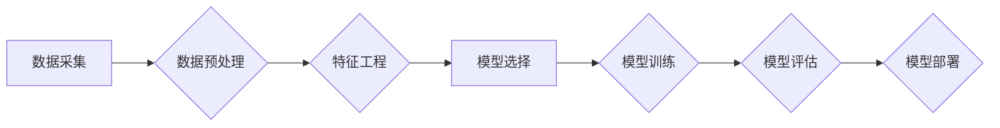

> 机器学习、算法原理、代码实现、数学模型、应用场景、工具推荐

## 1. 背景介绍

机器学习作为人工智能领域的核心技术之一，近年来发展迅速，并在各个领域取得了令人瞩目的成就。从语音识别、图像识别到推荐系统、医疗诊断，机器学习的应用无处不在。

随着海量数据的涌现和计算能力的提升，机器学习正逐渐从理论研究走向实际应用。然而，对于许多人来说，机器学习仍然是一个相对陌生的领域。

本文旨在深入浅出地讲解机器学习的基本原理、核心算法、数学模型以及代码实现，并结合实际应用场景，帮助读者更好地理解和掌握机器学习的知识。

## 2. 核心概念与联系

机器学习的核心思想是通过算法学习数据中的模式和规律，从而能够对新的数据进行预测或分类。

**机器学习的三个基本类型：**

* **监督学习 (Supervised Learning):**  利用标记数据训练模型，预测新的数据标签。例如，图像分类、文本分类等。
* **无监督学习 (Unsupervised Learning):**  利用未标记数据发现数据中的隐藏结构和模式。例如，聚类分析、降维等。
* **强化学习 (Reinforcement Learning):**  通过试错学习，在环境中获得最大奖励。例如，游戏AI、机器人控制等。

**机器学习流程:**



## 3. 核心算法原理 & 具体操作步骤

### 3.1  算法原理概述

**线性回归 (Linear Regression)**

线性回归是一种监督学习算法，用于预测连续值。它假设数据之间存在线性关系，并通过最小化误差来找到最佳拟合直线。

### 3.2  算法步骤详解

1. **数据预处理:** 清洗数据，处理缺失值，标准化数据。
2. **特征工程:** 选择合适的特征，进行特征转换。
3. **模型训练:** 使用训练数据训练线性回归模型，求解模型参数。
4. **模型评估:** 使用测试数据评估模型性能，例如使用均方误差 (MSE) 或 R-squared。
5. **模型部署:** 将训练好的模型部署到实际应用场景中。

### 3.3  算法优缺点

**优点:**

* 算法简单易懂，易于实现。
* 计算效率高，适合处理大规模数据。

**缺点:**

* 只能处理线性关系的数据。
* 对异常值敏感。

### 3.4  算法应用领域

* 房价预测
* 股票价格预测
* 销售预测

## 4. 数学模型和公式 & 详细讲解 & 举例说明

### 4.1  数学模型构建

线性回归模型的数学表达式为：

$$y = w_0 + w_1x_1 + w_2x_2 + ... + w_nx_n + \epsilon$$

其中：

* $y$ 是预测值
* $w_0, w_1, ..., w_n$ 是模型参数
* $x_1, x_2, ..., x_n$ 是输入特征
* $\epsilon$ 是误差项

### 4.2  公式推导过程

线性回归的目标是找到最佳的模型参数，使得预测值与真实值之间的误差最小。常用的误差函数是均方误差 (MSE)：

$$MSE = \frac{1}{n}\sum_{i=1}^{n}(y_i - \hat{y}_i)^2$$

其中：

* $n$ 是样本数量
* $y_i$ 是真实值
* $\hat{y}_i$ 是预测值

通过最小化 MSE，可以求解出最佳的模型参数。

### 4.3  案例分析与讲解

假设我们想要预测房屋价格，输入特征包括房屋面积、房间数量等。我们可以使用线性回归模型来建立房屋价格预测模型。

通过训练数据，我们可以得到模型参数，例如：

* $w_0 = 100000$
* $w_1 = 500$ (房屋面积每增加1平方米，价格增加500元)
* $w_2 = 10000$ (每增加一间房间，价格增加10000元)

根据这些参数，我们可以预测新房子的价格。

## 5. 项目实践：代码实例和详细解释说明

### 5.1  开发环境搭建

* Python 3.x
* scikit-learn 库

### 5.2  源代码详细实现

```python
import pandas as pd
from sklearn.linear_model import LinearRegression
from sklearn.model_selection import train_test_split

# 加载数据
data = pd.read_csv('house_price.csv')

# 选择特征和目标变量
X = data[['面积', '房间']]
y = data['价格']

# 将数据分为训练集和测试集
X_train, X_test, y_train, y_test = train_test_split(X, y, test_size=0.2, random_state=42)

# 创建线性回归模型
model = LinearRegression()

# 训练模型
model.fit(X_train, y_train)

# 预测测试集数据
y_pred = model.predict(X_test)

# 评估模型性能
from sklearn.metrics import mean_squared_error
mse = mean_squared_error(y_test, y_pred)
print(f'均方误差: {mse}')
```

### 5.3  代码解读与分析

* 首先，我们加载数据并选择特征和目标变量。
* 然后，我们将数据分为训练集和测试集，用于训练和评估模型。
* 创建线性回归模型并使用训练数据进行训练。
* 训练完成后，我们可以使用模型预测测试集数据。
* 最后，我们使用均方误差 (MSE) 来评估模型性能。

### 5.4  运行结果展示

运行代码后，会输出模型的均方误差值。

## 6. 实际应用场景

### 6.1  金融领域

* 欺诈检测
* 风险评估
* 股票预测

### 6.2  医疗领域

* 疾病诊断
* 药物研发
* 患者风险预测

### 6.3  电商领域

* 商品推荐
* 顾客画像
* 销售预测

### 6.4  未来应用展望

随着机器学习技术的不断发展，其应用场景将更加广泛，例如：

* 自动驾驶
* 人工智能助手
* 个性化教育

## 7. 工具和资源推荐

### 7.1  学习资源推荐

* **书籍:**
    * 《机器学习》 - 周志华
    * 《深入理解机器学习》 -  李航
* **在线课程:**
    * Coursera: Machine Learning by Andrew Ng
    * edX: Artificial Intelligence by Columbia University

### 7.2  开发工具推荐

* **Python:** 
    * scikit-learn
    * TensorFlow
    * PyTorch

### 7.3  相关论文推荐

* **《机器学习》** - 周志华
* **《深入理解机器学习》** - 李航

## 8. 总结：未来发展趋势与挑战

### 8.1  研究成果总结

机器学习取得了显著的成果，在各个领域都取得了突破性的进展。

### 8.2  未来发展趋势

* **深度学习:** 深度学习算法在图像识别、自然语言处理等领域取得了优异的性能，未来将继续发展和完善。
* **迁移学习:** 迁移学习可以利用已有的模型知识，减少训练数据和时间，未来将更加广泛应用于实际场景。
* **联邦学习:** 联邦学习可以保护数据隐私，未来将应用于医疗、金融等敏感数据领域。

### 8.3  面临的挑战

* **数据质量:** 机器学习模型的性能依赖于数据质量，如何获取高质量数据仍然是一个挑战。
* **算法解释性:** 许多机器学习算法是黑盒模型，难以解释其决策过程，这限制了其在一些领域应用。
* **伦理问题:** 机器学习算法可能存在偏见和歧视，需要关注其伦理问题。

### 8.4  研究展望

未来机器学习研究将继续探索更有效的算法、更强大的计算能力和更广泛的应用场景，为人类社会带来更多福祉。

## 9. 附录：常见问题与解答

* **什么是机器学习？**

机器学习是一种人工智能技术，通过算法学习数据中的模式和规律，从而能够对新的数据进行预测或分类。

* **机器学习有哪些类型？**

机器学习主要分为监督学习、无监督学习和强化学习三种类型。

* **如何选择合适的机器学习算法？**

选择合适的机器学习算法需要根据具体任务和数据特点进行选择。

* **如何评估机器学习模型的性能？**

常用的机器学习模型性能评估指标包括准确率、召回率、F1-score、AUC等。

* **机器学习有哪些应用场景？**

机器学习应用场景非常广泛，例如图像识别、语音识别、自然语言处理、推荐系统、医疗诊断等。


作者：禅与计算机程序设计艺术 / Zen and the Art of Computer Programming 
<end_of_turn>