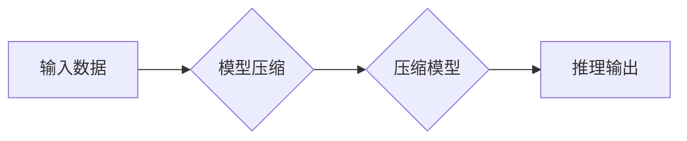

> 模型压缩,深度学习,神经网络,效率优化,部署,推理速度,模型大小

## 1. 背景介绍

近年来，深度学习在计算机视觉、自然语言处理、语音识别等领域取得了突破性进展。然而，深度学习模型通常具有庞大的参数量和计算复杂度，这导致模型部署和推理速度慢，对硬件资源要求高。为了解决这些问题，模型压缩技术应运而生。

模型压缩技术旨在通过减少模型大小和计算量，提高模型的运行效率，使其能够在资源受限的设备上高效部署。随着移动设备、嵌入式系统和边缘计算的兴起，模型压缩技术变得越来越重要。

## 2. 核心概念与联系

模型压缩技术主要包括以下几个核心概念：

* **模型量化:** 将模型参数从高精度浮点数（如32位浮点数）转换为低精度整数（如8位整数），从而减少模型参数的存储空间和计算量。
* **模型剪枝:** 通过移除模型中不重要的权重或神经元，减少模型参数量和计算复杂度。
* **知识蒸馏:** 将大型模型的知识迁移到小型模型中，从而获得性能优异且模型规模更小的模型。

**模型压缩技术架构**



## 3. 核心算法原理 & 具体操作步骤

### 3.1  算法原理概述

模型压缩算法的核心思想是通过分析模型结构和参数分布，找到可以被压缩或移除的部分，从而减少模型大小和计算量。

### 3.2  算法步骤详解

模型压缩算法的具体步骤通常包括以下几个阶段：

1. **模型分析:** 对目标模型进行分析，了解其结构、参数分布和性能特征。
2. **压缩策略选择:** 根据模型特点和压缩目标，选择合适的压缩策略，例如量化、剪枝或知识蒸馏。
3. **压缩操作:** 根据选择的压缩策略，对模型进行压缩操作，例如将参数量化、移除不重要的权重或神经元。
4. **性能评估:** 对压缩后的模型进行性能评估，确保其性能损失在可接受范围内。
5. **模型优化:** 对压缩后的模型进行进一步优化，例如重新训练模型或调整超参数，以提高其性能。

### 3.3  算法优缺点

**量化算法:**

* **优点:** 压缩率高，实现简单，对硬件要求低。
* **缺点:** 可能会导致精度损失。

**剪枝算法:**

* **优点:** 可以有效减少模型参数量，提高推理速度。
* **缺点:** 需要进行模型训练和剪枝过程，复杂度较高。

**知识蒸馏算法:**

* **优点:** 可以获得性能优异且模型规模更小的模型。
* **缺点:** 需要训练两个模型，训练时间较长。

### 3.4  算法应用领域

模型压缩技术广泛应用于以下领域：

* **移动设备:** 将深度学习模型部署到移动设备上，实现手机上的图像识别、语音识别等功能。
* **嵌入式系统:** 将深度学习模型部署到嵌入式系统上，实现智能家居、工业自动化等应用。
* **边缘计算:** 将深度学习模型部署到边缘设备上，实现实时数据处理和决策。

## 4. 数学模型和公式 & 详细讲解 & 举例说明

### 4.1  数学模型构建

模型量化可以看作是一个映射关系，将高精度浮点数参数映射到低精度整数参数。

假设一个高精度浮点数参数为 $w$, 则其量化后的低精度整数参数为 $w'$. 量化过程可以使用以下公式表示:

$$w' = \text{round}(w \cdot q)$$

其中，$q$ 是量化因子，用于控制量化精度。

### 4.2  公式推导过程

量化因子 $q$ 的选择会影响模型的精度和压缩率。

* **压缩率:** $q$ 越大，压缩率越高，但精度损失也越大。
* **精度:** $q$ 越小，精度损失越小，但压缩率越低。

因此，需要根据实际应用场景选择合适的量化因子。

### 4.3  案例分析与讲解

例如，将32位浮点数参数量化为8位整数，则量化因子 $q$ 为 $2^{24}$.

在量化过程中，需要考虑数值范围和精度损失。

可以使用以下方法来减轻精度损失:

* **动态量化:** 根据输入数据动态调整量化因子。
* **混合精度量化:** 将模型参数分为不同精度级别，例如将重要的参数量化为高精度，而将不重要的参数量化为低精度。

## 5. 项目实践：代码实例和详细解释说明

### 5.1  开发环境搭建

本项目使用Python语言和TensorFlow框架进行开发。

需要安装以下软件包:

* Python 3.x
* TensorFlow 2.x
* NumPy
* Matplotlib

### 5.2  源代码详细实现

```python
import tensorflow as tf

# 定义一个简单的卷积神经网络模型
model = tf.keras.models.Sequential([
    tf.keras.layers.Conv2D(32, (3, 3), activation='relu', input_shape=(28, 28, 1)),
    tf.keras.layers.MaxPooling2D((2, 2)),
    tf.keras.layers.Flatten(),
    tf.keras.layers.Dense(10, activation='softmax')
])

# 编译模型
model.compile(optimizer='adam',
              loss='sparse_categorical_crossentropy',
              metrics=['accuracy'])

# 加载MNIST数据集
(x_train, y_train), (x_test, y_test) = tf.keras.datasets.mnist.load_data()

# 数据预处理
x_train = x_train.astype('float32') / 255.0
x_test = x_test.astype('float32') / 255.0
x_train = x_train.reshape((x_train.shape[0], 28, 28, 1))
x_test = x_test.reshape((x_test.shape[0], 28, 28, 1))

# 模型训练
model.fit(x_train, y_train, epochs=5)

# 模型量化
converter = tf.lite.TFLiteConverter.from_keras_model(model)
tflite_model = converter.convert()

# 保存模型
with open('model.tflite', 'wb') as f:
    f.write(tflite_model)
```

### 5.3  代码解读与分析

* 代码首先定义了一个简单的卷积神经网络模型。
* 然后，使用TensorFlow Lite框架将模型量化为TFLite格式。
* 最后，将量化后的模型保存为`.tflite`文件。

### 5.4  运行结果展示

量化后的模型可以部署到移动设备或嵌入式系统上，实现高效的深度学习推理。

## 6. 实际应用场景

### 6.1  移动设备应用

* **图像识别:** 将深度学习模型部署到手机上，实现人脸识别、物体识别等功能。
* **语音识别:** 将深度学习模型部署到手机上，实现语音转文本、语音助手等功能。
* **自然语言处理:** 将深度学习模型部署到手机上，实现文本分类、情感分析等功能。

### 6.2  嵌入式系统应用

* **智能家居:** 将深度学习模型部署到智能家居设备上，实现语音控制、图像识别等功能。
* **工业自动化:** 将深度学习模型部署到工业设备上，实现缺陷检测、异常报警等功能。
* **医疗诊断:** 将深度学习模型部署到医疗设备上，辅助医生进行疾病诊断。

### 6.3  边缘计算应用

* **实时数据处理:** 将深度学习模型部署到边缘设备上，实现对实时数据的分析和决策。
* **隐私保护:** 将深度学习模型部署到边缘设备上，避免将敏感数据上传到云端。
* **低延迟应用:** 将深度学习模型部署到边缘设备上，实现低延迟的实时应用。

### 6.4  未来应用展望

随着模型压缩技术的不断发展，其应用场景将更加广泛。

* **更小更轻的模型:** 模型压缩技术将使深度学习模型能够部署到更小的设备上，例如可穿戴设备、传感器等。
* **更快的推理速度:** 模型压缩技术将进一步提高深度学习模型的推理速度，使其能够满足实时应用的需求。
* **更低的功耗:** 模型压缩技术将降低深度学习模型的功耗，使其能够在电池供电的设备上运行更长时间。

## 7. 工具和资源推荐

### 7.1  学习资源推荐

* **书籍:**
    * 《深度学习》 by Ian Goodfellow, Yoshua Bengio, and Aaron Courville
    * 《动手学深度学习》 by Aurélien Géron
* **在线课程:**
    * TensorFlow官方教程: https://www.tensorflow.org/tutorials
    * Coursera深度学习课程: https://www.coursera.org/specializations/deep-learning

### 7.2  开发工具推荐

* **TensorFlow Lite:** https://www.tensorflow.org/lite
* **PyTorch Mobile:** https://pytorch.org/mobile/
* **ONNX Runtime:** https://onnxruntime.ai/

### 7.3  相关论文推荐

* **MobileNet: Efficient Convolutional Neural Networks for Mobile Vision Applications:** https://arxiv.org/abs/1704.04861
* **SqueezeNet: AlexNet-level accuracy with 50x fewer parameters and <0.5MB model size:** https://arxiv.org/abs/1602.07360
* **Knowledge Distillation:** https://arxiv.org/abs/1503.02531

## 8. 总结：未来发展趋势与挑战

### 8.1  研究成果总结

模型压缩技术取得了显著的进展，使得深度学习模型能够在资源受限的设备上高效部署。

### 8.2  未来发展趋势

* **更有效的压缩算法:** 研究更有效的模型压缩算法，以进一步提高压缩率和精度。
* **硬件加速:** 开发专门用于模型压缩的硬件加速器，以提高模型压缩和推理速度。
* **自适应压缩:** 研究自适应压缩技术，根据实际应用场景动态调整压缩策略。

### 8.3  面临的挑战

* **精度损失:** 模型压缩可能会导致精度损失，需要找到平衡压缩率和精度的方法。
* **通用性:** 目前大多数模型压缩算法针对特定模型架构，缺乏通用性。
* **可解释性:** 模型压缩后的模型结构更加复杂，难以解释其工作原理。

### 8.4  研究展望

未来，模型压缩技术将继续朝着更有效、更通用、更可解释的方向发展，为深度学习的广泛应用提供技术支持。

## 9. 附录：常见问题与解答

**Q1: 模型压缩会降低模型的精度吗?**

A1: 可能会，但可以通过选择合适的压缩策略和技术来减轻精度损失。

**Q2: 模型压缩的压缩率是多少?**

A2: 压缩率取决于选择的压缩策略和模型架构，通常可以达到50%到90%。

**Q3: 模型压缩的应用场景有哪些?**

A3: 模型压缩的应用场景广泛，包括移动设备、嵌入式系统、边缘计算等。

**作者：禅与计算机程序设计艺术 / Zen and the Art of Computer Programming**


<end_of_turn>