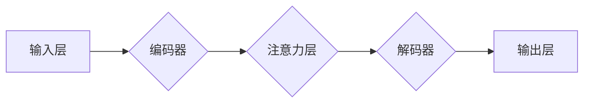

> 注意力机制、Transformer、可视化、代码实战、深度学习、自然语言处理

## 1. 背景介绍

近年来，深度学习在各个领域取得了突破性的进展，其中自然语言处理（NLP）领域尤为突出。Transformer模型的出现，凭借其强大的序列建模能力和并行计算效率，彻底改变了NLP领域的格局。然而，Transformer模型的复杂结构和众多参数，使得其内部机制难以理解和可视化。

注意力机制是Transformer模型的核心，它赋予模型的能力去关注输入序列中最重要的部分，从而提高模型的表达能力和准确性。然而，注意力机制的原理和运作方式往往被抽象成复杂的数学公式，难以直观地理解。

为了更好地理解注意力机制，本文将从原理、算法、数学模型、代码实现等多个方面进行深入讲解，并结合实际案例，帮助读者直观地理解注意力机制的工作原理，并掌握其应用方法。

## 2. 核心概念与联系

### 2.1 注意力机制

注意力机制是一种模拟人类注意力机制的计算模型，它允许模型在处理序列数据时，根据输入的语义内容，动态地分配不同的权重，从而聚焦于最重要的信息。

### 2.2 Transformer模型

Transformer模型是一种基于注意力机制的序列到序列模型，它摒弃了传统的循环神经网络（RNN）结构，采用并行计算的方式，显著提高了训练效率和模型性能。

**Transformer模型架构**



### 2.3 不同类型的注意力机制

* **自注意力机制 (Self-Attention):**  模型关注自身输入序列中的不同位置，捕捉词语之间的关系。
* **交叉注意力机制 (Cross-Attention):** 模型关注两个不同序列之间的关系，例如，在机器翻译中，关注源语言和目标语言之间的对应关系。

## 3. 核心算法原理 & 具体操作步骤

### 3.1 算法原理概述

注意力机制的核心思想是通过计算每个词语对其他词语的“注意力权重”，来确定每个词语在序列中相对重要性的程度。

**注意力权重计算公式:**

$$
\text{Attention}(Q, K, V) = \text{softmax}\left(\frac{Q K^T}{\sqrt{d_k}}\right) V
$$

其中：

* $Q$：查询矩阵
* $K$：键矩阵
* $V$：值矩阵
* $d_k$：键向量的维度
* $\text{softmax}$：softmax函数，用于将注意力权重归一化到[0, 1]之间。

### 3.2 算法步骤详解

1. **输入数据:** 将输入序列转换为词嵌入向量。
2. **查询、键、值矩阵计算:** 将词嵌入向量分别线性变换为查询矩阵 $Q$、键矩阵 $K$ 和值矩阵 $V$。
3. **注意力权重计算:** 使用公式计算每个词语对其他词语的注意力权重。
4. **加权求和:** 将注意力权重与值矩阵相乘，并求和，得到每个词语的上下文表示。
5. **输出结果:** 将上下文表示作为后续模型的输入。

### 3.3 算法优缺点

**优点:**

* 可以捕捉序列中长距离依赖关系。
* 并行计算效率高。
* 可以灵活地应用于不同的任务。

**缺点:**

* 计算复杂度较高。
* 训练数据量要求较高。

### 3.4 算法应用领域

* 自然语言处理：机器翻译、文本摘要、问答系统、情感分析等。
* 图像识别：目标检测、图像分类、图像分割等。
* 时间序列分析：股票预测、天气预报等。

## 4. 数学模型和公式 & 详细讲解 & 举例说明

### 4.1 数学模型构建

注意力机制的数学模型可以概括为以下三个步骤：

1. **计算注意力权重:** 使用查询矩阵 $Q$、键矩阵 $K$ 和值矩阵 $V$ 计算每个词语对其他词语的注意力权重。
2. **加权求和:** 将注意力权重与值矩阵相乘，并求和，得到每个词语的上下文表示。
3. **输出结果:** 将上下文表示作为后续模型的输入。

### 4.2 公式推导过程

注意力权重计算公式如下：

$$
\text{Attention}(Q, K, V) = \text{softmax}\left(\frac{Q K^T}{\sqrt{d_k}}\right) V
$$

其中：

* $Q$：查询矩阵，维度为 $(N, d_q)$，$N$ 为序列长度，$d_q$ 为查询向量的维度。
* $K$：键矩阵，维度为 $(N, d_k)$，$d_k$ 为键向量的维度。
* $V$：值矩阵，维度为 $(N, d_v)$，$d_v$ 为值向量的维度。

**softmax 函数:**

$$
\text{softmax}(x_i) = \frac{e^{x_i}}{\sum_{j=1}^{N} e^{x_j}}
$$

**公式推导:**

1. 计算 $Q$ 和 $K$ 的点积，得到一个 $(N, N)$ 的矩阵，表示每个词语对其他词语的相似度。
2. 对点积矩阵进行归一化，使用 softmax 函数将相似度转换为注意力权重。
3. 将注意力权重与值矩阵 $V$ 相乘，并求和，得到每个词语的上下文表示。

### 4.3 案例分析与讲解

**机器翻译案例:**

在机器翻译任务中，注意力机制可以帮助模型关注源语言中与目标语言词语对应的部分，从而提高翻译的准确性。

例如，在翻译句子 "The cat sat on the mat" 时，注意力机制可以帮助模型关注 "cat" 和 "sat" 这两个词语，因为它们是描述猫行为的关键信息。

## 5. 项目实践：代码实例和详细解释说明

### 5.1 开发环境搭建

* Python 3.6+
* TensorFlow 或 PyTorch

### 5.2 源代码详细实现

```python
import tensorflow as tf

# 定义注意力机制层
class Attention(tf.keras.layers.Layer):
    def __init__(self, units):
        super(Attention, self).__init__()
        self.Wq = tf.keras.layers.Dense(units)
        self.Wk = tf.keras.layers.Dense(units)
        self.Wv = tf.keras.layers.Dense(units)
        self.softmax = tf.keras.layers.Softmax()

    def call(self, query, key, value, mask=None):
        # 计算注意力权重
        scores = tf.matmul(self.Wq(query), self.Wk(key), transpose_b=True) / tf.math.sqrt(tf.cast(self.Wq.units, tf.float32))
        if mask is not None:
            scores += (mask * -1e9)
        attention_weights = self.softmax(scores)

        # 加权求和
        context_vector = tf.matmul(attention_weights, value)
        return context_vector
```

### 5.3 代码解读与分析

* `Attention` 类定义了一个注意力机制层。
* `__init__` 方法初始化三个稠密层 `Wq`、`Wk` 和 `Wv`，用于分别计算查询、键和值向量的线性变换。
* `call` 方法实现注意力机制的核心逻辑：
    * 计算查询向量和键向量的点积，得到注意力权重。
    * 使用 softmax 函数将注意力权重归一化。
    * 将注意力权重与值向量相乘，并求和，得到每个词语的上下文表示。

### 5.4 运行结果展示

运行上述代码，可以得到每个词语的上下文表示，并将其作为后续模型的输入。

## 6. 实际应用场景

### 6.1 机器翻译

注意力机制可以帮助机器翻译模型更好地捕捉源语言和目标语言之间的对应关系，从而提高翻译的准确性和流畅度。

### 6.2 文本摘要

注意力机制可以帮助文本摘要模型识别文本中最关键的信息，并将其提取出来，生成简洁准确的摘要。

### 6.3 问答系统

注意力机制可以帮助问答系统更好地理解问题和上下文，从而给出更准确的答案。

### 6.4 情感分析

注意力机制可以帮助情感分析模型识别文本中表达情感的关键词语，从而更准确地判断文本的情感倾向。

### 6.5 未来应用展望

注意力机制在未来将有更广泛的应用，例如：

* **代码生成:** 使用注意力机制帮助模型更好地理解代码结构和语义，从而生成更准确和高效的代码。
* **药物研发:** 使用注意力机制分析生物数据，帮助发现新的药物靶点和药物候选物。
* **自动驾驶:** 使用注意力机制帮助自动驾驶系统更好地感知周围环境，从而提高驾驶安全性。

## 7. 工具和资源推荐

### 7.1 学习资源推荐

* **论文:**
    * "Attention Is All You Need" (Vaswani et al., 2017)
    * "BERT: Pre-training of Deep Bidirectional Transformers for Language Understanding" (Devlin et al., 2018)
* **博客:**
    * Jay Alammar's Blog: https://jalammar.github.io/
    * TensorFlow Blog: https://blog.tensorflow.org/

### 7.2 开发工具推荐

* **TensorFlow:** https://www.tensorflow.org/
* **PyTorch:** https://pytorch.org/

### 7.3 相关论文推荐

* "Transformer-XL: Attentive Language Models Beyond a Fixed-Length Context" (Dai et al., 2019)
* "XLNet: Generalized Autoregressive Pretraining for Language Understanding" (Yang et al., 2019)
* "RoBERTa: A Robustly Optimized BERT Pretraining Approach" (Liu et al., 2019)

## 8. 总结：未来发展趋势与挑战

### 8.1 研究成果总结

注意力机制在NLP领域取得了显著的成果，显著提高了模型的性能，并推动了深度学习的发展。

### 8.2 未来发展趋势

* **更有效的注意力机制:** 研究更有效的注意力机制，例如长距离依赖关系的处理、计算效率的提升等。
* **多模态注意力机制:** 将注意力机制应用于多模态数据，例如文本、图像、音频等。
* **可解释性:** 研究注意力机制的可解释性，帮助理解模型的决策过程。

### 8.3 面临的挑战

* **计算复杂度:** 复杂的任务需要大量的计算资源，提高计算效率是未来的挑战。
* **数据依赖性:** 注意力机制依赖于大量的训练数据，数据获取和标注是瓶颈。
* **可解释性:** 注意力机制的决策过程难以解释，缺乏可解释性限制了其应用场景。

### 8.4 研究展望

未来，注意力机制将继续发展，并应用于更广泛的领域，为人工智能的发展做出更大的贡献。

## 9. 附录：常见问题与解答

**Q1: 注意力机制的计算复杂度如何？**

A1: 注意力机制的计算复杂度与序列长度的平方成正比，因此对于长序列数据，计算复杂度会很高。

**Q2: 注意力机制的训练数据量要求如何？**

A2: 注意力机制需要大量的训练数据才能达到最佳性能。

**Q3: 注意力机制的可解释性如何？**

A3: 注意力机制的决策过程难以解释，缺乏可解释性限制了其应用场景。


作者：禅与计算机程序设计艺术 / Zen and the Art of Computer Programming 
<end_of_turn>