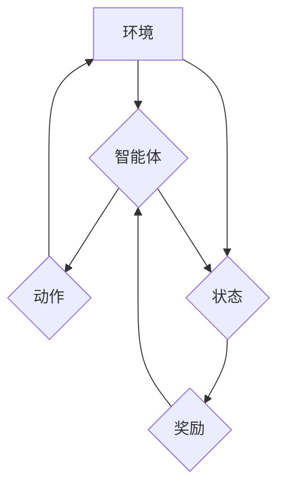

> 深度Q-learning, DQN, 强化学习, 神经网络, 价值函数, 策略梯度, 探索与利用

## 1. 背景介绍

强化学习 (Reinforcement Learning, RL) 作为机器学习的一个重要分支，旨在训练智能体在环境中通过与环境交互学习最优策略，以最大化累积奖励。传统的 Q-learning 算法在离散状态和动作空间中表现出色，但当面对连续状态和动作空间时，其性能会显著下降。

深度强化学习 (Deep Reinforcement Learning, DRL) 则利用深度神经网络 (Deep Neural Network, DNN) 来逼近 Q-函数，从而能够有效地处理连续状态和动作空间的问题。其中，深度 Q-learning (Deep Q-learning) 作为 DRL 的重要算法之一，在解决各种复杂任务中取得了显著的成果。

## 2. 核心概念与联系

**2.1 核心概念**

* **强化学习 (RL):**  一种机器学习方法，智能体通过与环境交互，学习一个策略，以最大化累积奖励。
* **Q-learning:**  一种经典的强化学习算法，通过学习 Q-函数来估计在特定状态下采取特定动作的期望累积奖励。
* **深度神经网络 (DNN):**  一种能够学习复杂非线性关系的神经网络结构。
* **深度 Q-learning (Deep Q-learning):**  将深度神经网络用于逼近 Q-函数的强化学习算法。

**2.2 核心架构**



**2.3 联系**

深度 Q-learning 将深度神经网络与 Q-learning 算法相结合，利用 DNN 的强大的学习能力来逼近 Q-函数，从而能够有效地处理连续状态和动作空间的问题。

## 3. 核心算法原理 & 具体操作步骤

**3.1 算法原理概述**

深度 Q-learning 的核心思想是利用深度神经网络来逼近 Q-函数，即估计在特定状态下采取特定动作的期望累积奖励。

**3.2 算法步骤详解**

1. **初始化:** 初始化深度神经网络，并设置学习率、折扣因子等超参数。
2. **环境交互:** 智能体与环境交互，获取当前状态和奖励。
3. **动作选择:** 根据当前状态和 Q-网络的输出，选择一个动作。
4. **状态转移:** 执行动作后，智能体进入新的状态。
5. **Q-值更新:** 利用 Bellman 方程更新 Q-网络的参数，使 Q-网络的输出更接近真实 Q-值。
6. **重复步骤 2-5:** 重复上述步骤，直到智能体学习到最优策略。

**3.3 算法优缺点**

**优点:**

* 可以处理连续状态和动作空间。
* 学习能力强，能够学习复杂策略。

**缺点:**

* 训练过程复杂，需要大量的训练数据和计算资源。
* 容易陷入局部最优解。

**3.4 算法应用领域**

* 游戏 AI
* 机器人控制
* 自动驾驶
* 医疗诊断

## 4. 数学模型和公式 & 详细讲解 & 举例说明

**4.1 数学模型构建**

深度 Q-learning 的数学模型基于强化学习的 Bellman 方程。

**4.2 公式推导过程**

Bellman 方程：

$$
Q(s, a) = r + \gamma \max_{a'} Q(s', a')
$$

其中：

* $Q(s, a)$ 是在状态 $s$ 下采取动作 $a$ 的期望累积奖励。
* $r$ 是从状态 $s$ 到状态 $s'$ 执行动作 $a$ 后获得的奖励。
* $\gamma$ 是折扣因子，控制未来奖励的权重。
* $s'$ 是执行动作 $a$ 后进入的新状态。
* $a'$ 是在状态 $s'$ 中采取的动作。

**4.3 案例分析与讲解**

假设一个智能体在玩一个简单的游戏，游戏状态 $s$ 可以表示为玩家的位置，动作 $a$ 可以表示为向左、向右、向上、向下移动。

当智能体在某个位置 $s$ 采取动作 $a$ 后，获得奖励 $r$，并进入新的状态 $s'$。

根据 Bellman 方程，我们可以更新智能体的 Q-值：

$$
Q(s, a) = r + \gamma \max_{a'} Q(s', a')
$$

例如，如果智能体在位置 $s$ 采取向右移动的动作 $a$ 后，获得奖励 $r = 1$，并进入新的状态 $s'$，那么我们可以更新智能体的 Q-值：

$$
Q(s, a) = 1 + \gamma \max_{a'} Q(s', a')
$$

其中，$\max_{a'} Q(s', a')$ 表示在状态 $s'$ 中采取所有可能的动作 $a'$ 后获得的最大 Q-值。

## 5. 项目实践：代码实例和详细解释说明

**5.1 开发环境搭建**

* Python 3.x
* TensorFlow 或 PyTorch
* OpenAI Gym

**5.2 源代码详细实现**

```python
import tensorflow as tf

# 定义深度神经网络模型
model = tf.keras.models.Sequential([
    tf.keras.layers.Dense(64, activation='relu', input_shape=(state_size,)),
    tf.keras.layers.Dense(64, activation='relu'),
    tf.keras.layers.Dense(action_size)
])

# 定义损失函数和优化器
optimizer = tf.keras.optimizers.Adam(learning_rate=0.001)
loss_fn = tf.keras.losses.MeanSquaredError()

# 训练循环
for episode in range(num_episodes):
    state = env.reset()
    done = False
    total_reward = 0

    while not done:
        # 选择动作
        action = tf.argmax(model(tf.expand_dims(state, axis=0))).numpy()[0]

        # 执行动作并获取奖励和下一个状态
        next_state, reward, done, _ = env.step(action)

        # 更新 Q-值
        with tf.GradientTape() as tape:
            q_values = model(tf.expand_dims(state, axis=0))
            target_q_value = reward + gamma * tf.reduce_max(model(tf.expand_dims(next_state, axis=0)))
            loss = loss_fn(target_q_value, q_values[0, action])

        # 反向传播并更新模型参数
        gradients = tape.gradient(loss, model.trainable_variables)
        optimizer.apply_gradients(zip(gradients, model.trainable_variables))

        # 更新状态
        state = next_state

        # 更新总奖励
        total_reward += reward

    print(f"Episode {episode+1}, Total Reward: {total_reward}")
```

**5.3 代码解读与分析**

* 代码首先定义了深度神经网络模型，并使用 Adam 优化器和均方误差损失函数进行训练。
* 训练循环中，智能体与环境交互，选择动作，执行动作，获取奖励和下一个状态。
* 根据 Bellman 方程，更新 Q-值，并使用梯度下降算法更新模型参数。
* 训练结束后，智能体能够学习到最优策略，并能够在环境中获得最大奖励。

**5.4 运行结果展示**

训练完成后，可以观察智能体的行为，例如在游戏环境中，智能体能够学习到控制角色移动的最优策略，并最终完成游戏目标。

## 6. 实际应用场景

**6.1 游戏 AI**

深度 Q-learning 广泛应用于游戏 AI，例如 AlphaGo、AlphaZero 等，能够学习到复杂的策略，并战胜人类玩家。

**6.2 机器人控制**

深度 Q-learning 可以用于训练机器人控制策略，例如让机器人学会自主导航、抓取物体等。

**6.3 自动驾驶**

深度 Q-learning 可以用于训练自动驾驶系统的决策策略，例如让汽车学会避开障碍物、变道等。

**6.4 医疗诊断**

深度 Q-learning 可以用于辅助医疗诊断，例如根据患者的症状和检查结果，预测疾病的可能性。

**6.5 未来应用展望**

随着深度学习技术的不断发展，深度 Q-learning 在未来将有更广泛的应用场景，例如：

* 个性化教育
* 金融投资
* 药物研发

## 7. 工具和资源推荐

**7.1 学习资源推荐**

* **书籍:**
    * Reinforcement Learning: An Introduction by Richard S. Sutton and Andrew G. Barto
    * Deep Reinforcement Learning Hands-On by Maxim Lapan
* **课程:**
    * Deep Reinforcement Learning Specialization by DeepLearning.AI
    * Reinforcement Learning by David Silver (University of DeepMind)

**7.2 开发工具推荐**

* **TensorFlow:** https://www.tensorflow.org/
* **PyTorch:** https://pytorch.org/
* **OpenAI Gym:** https://gym.openai.com/

**7.3 相关论文推荐**

* Deep Q-Network (DQN) by Volodymyr Mnih et al. (2015)
* Dueling Network Architectures for Deep Reinforcement Learning by Hado van Hasselt et al. (2016)
* Double Q-Learning by  Hasselt et al. (2015)

## 8. 总结：未来发展趋势与挑战

**8.1 研究成果总结**

深度 Q-learning 算法取得了显著的成果，在解决各种复杂任务中表现出色。

**8.2 未来发展趋势**

* **探索更有效的算法:** 研究更有效的深度 Q-learning 算法，例如结合强化学习和监督学习的算法。
* **提高算法的鲁棒性:** 研究提高深度 Q-learning 算法的鲁棒性，使其能够更好地应对未知环境和噪声干扰。
* **降低算法的计算复杂度:** 研究降低深度 Q-learning 算法的计算复杂度，使其能够在更低资源环境下运行。

**8.3 面临的挑战**

* **样本效率:** 深度 Q-learning 算法通常需要大量的训练数据，这在现实应用中可能难以实现。
* **局部最优解:** 深度 Q-learning 算法容易陷入局部最优解，难以找到全局最优策略。
* **安全性和可解释性:** 深度 Q-learning 算法的决策过程通常是不可解释的，这在一些安全关键应用中可能是一个问题。

**8.4 研究展望**

未来，深度 Q-learning 算法将继续发展，并应用于更多领域。

## 9. 附录：常见问题与解答

**9.1 Q: 深度 Q-learning 和 Q-learning 的区别是什么？**

**A:** 深度 Q-learning 使用深度神经网络来逼近 Q-函数，而传统的 Q-learning 使用表格或函数逼近。

**9.2 Q: 深度 Q-learning 的训练过程如何？**

**A:** 深度 Q-learning 的训练过程是通过与环境交互，根据 Bellman 方程更新 Q-值，并使用梯度下降算法更新模型参数。

**9.3 Q: 深度 Q-learning 的应用场景有哪些？**

**A:** 深度 Q-learning 的应用场景包括游戏 AI、机器人控制、自动驾驶、医疗诊断等。


作者：禅与计算机程序设计艺术 / Zen and the Art of Computer Programming 
<end_of_turn>