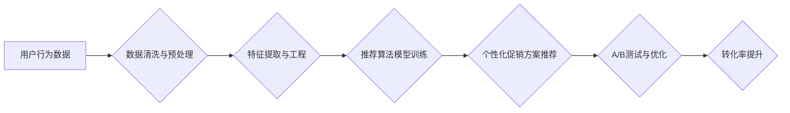

> 电商促销策略，推荐算法，机器学习，数据挖掘，A/B测试，转化率优化，用户行为分析

## 1. 背景介绍

在当今激烈的电商市场竞争中，制定有效的促销策略至关重要。传统的促销策略往往依赖于经验和直觉，缺乏数据支撑和精准度。随着大数据和人工智能技术的快速发展，电商促销策略也迎来了新的变革。数据驱动、个性化推荐、智能化决策成为新的趋势。

本文将深入探讨电商促销策略的实践效果，从核心概念、算法原理、数学模型、代码实现、实际应用场景等多个方面进行分析，并展望未来发展趋势和挑战。

## 2. 核心概念与联系

电商促销策略的核心在于通过数据分析和机器学习，精准识别用户需求，并制定个性化的促销方案，以提高转化率和用户满意度。

**核心概念：**

* **用户行为分析:** 通过分析用户浏览、购买、评价等行为数据，挖掘用户兴趣、偏好和购买习惯。
* **推荐算法:** 基于用户行为数据和商品信息，推荐用户可能感兴趣的商品，引导用户购买。
* **A/B测试:** 对不同的促销方案进行对比测试，通过数据分析确定最优方案。
* **转化率优化:** 通过优化促销页面、文案、流程等，提高用户转化率。

**架构图:**



## 3. 核心算法原理 & 具体操作步骤

### 3.1  算法原理概述

电商促销策略中常用的推荐算法主要包括：

* **基于内容的推荐:** 根据商品的属性和用户历史购买记录，推荐相似的商品。
* **基于协同过滤的推荐:** 根据用户的评分或购买行为，推荐与相似用户购买过的商品。
* **基于深度学习的推荐:** 利用深度神经网络，学习用户和商品之间的复杂关系，进行更精准的推荐。

### 3.2  算法步骤详解

以基于协同过滤的推荐算法为例，其具体步骤如下：

1. **数据收集:** 收集用户评分或购买行为数据。
2. **数据预处理:** 清洗数据，处理缺失值和异常值。
3. **用户-商品矩阵构建:** 将用户和商品映射到矩阵中，每个元素表示用户对商品的评分或购买行为。
4. **相似度计算:** 计算用户之间的相似度或商品之间的相似度。
5. **推荐生成:** 根据用户相似度或商品相似度，推荐用户可能感兴趣的商品。

### 3.3  算法优缺点

**优点:**

* 能够推荐用户可能感兴趣的商品，提高用户体验。
* 能够发现用户隐性需求，挖掘潜在市场。

**缺点:**

* 数据稀疏性问题，难以推荐新用户或新商品。
* 冷启动问题，新用户或新商品难以获得推荐。

### 3.4  算法应用领域

基于协同过滤的推荐算法广泛应用于电商平台、视频网站、音乐平台等领域，例如：

* **商品推荐:** 根据用户的购买历史推荐相关商品。
* **内容推荐:** 根据用户的浏览历史推荐相关视频或文章。
* **音乐推荐:** 根据用户的听歌记录推荐相关歌曲。

## 4. 数学模型和公式 & 详细讲解 & 举例说明

### 4.1  数学模型构建

基于协同过滤的推荐算法通常使用矩阵分解模型，将用户-商品矩阵分解成两个低维矩阵，分别表示用户特征和商品特征。

**模型公式:**

$$
R = U \cdot V^T
$$

其中：

* $R$ 是用户-商品矩阵。
* $U$ 是用户特征矩阵。
* $V^T$ 是商品特征矩阵的转置。

### 4.2  公式推导过程

通过最小化预测误差与实际评分之间的差值，可以得到用户特征矩阵 $U$ 和商品特征矩阵 $V$ 的最优解。

**损失函数:**

$$
L(U, V) = \frac{1}{2} \sum_{u, i} (R_{ui} - \hat{R}_{ui})^2
$$

其中：

* $R_{ui}$ 是用户 $u$ 对商品 $i$ 的实际评分。
* $\hat{R}_{ui}$ 是模型预测的用户 $u$ 对商品 $i$ 的评分。

### 4.3  案例分析与讲解

假设有一个用户-商品矩阵 $R$，其中 $R_{12} = 5$ 表示用户 1 对商品 2 的评分为 5。通过矩阵分解模型，可以得到用户 1 的特征向量 $u_1$ 和商品 2 的特征向量 $v_2$，然后计算预测评分 $\hat{R}_{12} = u_1 \cdot v_2^T$。

## 5. 项目实践：代码实例和详细解释说明

### 5.1  开发环境搭建

* Python 3.x
* scikit-learn
* pandas
* numpy

### 5.2  源代码详细实现

```python
import pandas as pd
from sklearn.decomposition import NMF

# 加载用户-商品矩阵
data = pd.read_csv('user_item_matrix.csv')

# 数据预处理
# ...

# 训练 NMF 模型
model = NMF(n_components=10)
U = model.fit_transform(data)
V = model.components_

# 生成推荐结果
# ...
```

### 5.3  代码解读与分析

* 使用 NMF 模型进行矩阵分解，将用户-商品矩阵分解成用户特征矩阵 $U$ 和商品特征矩阵 $V$。
* $n_components$ 参数控制分解后的维度，可以根据实际情况进行调整。
* 训练好的模型可以用于生成推荐结果，例如推荐用户可能感兴趣的商品。

### 5.4  运行结果展示

* 通过 A/B 测试，比较不同推荐策略的效果，并选择最优方案。
* 使用指标如点击率、转化率等，评估推荐策略的实际效果。

## 6. 实际应用场景

电商促销策略的实践效果在各个电商平台都得到了广泛应用，例如：

* **淘宝:** 利用用户行为数据和推荐算法，推荐个性化商品和促销活动。
* **京东:** 通过 A/B 测试和转化率优化，提高促销活动的转化率。
* **拼多多:** 利用社交电商的特点，通过用户分享和团购，提高促销活动的参与度。

### 6.4  未来应用展望

随着人工智能技术的不断发展，电商促销策略将更加智能化、个性化和精准化。

* **更精准的推荐:** 利用深度学习等先进算法，更精准地识别用户需求，推荐更符合用户偏好的商品。
* **更个性化的促销:** 根据用户的购买历史、浏览记录、兴趣爱好等信息，定制个性化的促销方案，提高用户体验。
* **更智能化的决策:** 利用机器学习算法，自动分析数据，优化促销策略，提高促销效果。

## 7. 工具和资源推荐

### 7.1  学习资源推荐

* **书籍:**
    * 《推荐系统实践》
    * 《机器学习》
* **在线课程:**
    * Coursera: 机器学习
    * edX: 数据科学

### 7.2  开发工具推荐

* **Python:** 
    * scikit-learn
    * pandas
    * numpy
* **Spark:** 大数据处理框架

### 7.3  相关论文推荐

* **Collaborative Filtering for Implicit Feedback Datasets**
* **Deep Learning for Recommender Systems**

## 8. 总结：未来发展趋势与挑战

### 8.1  研究成果总结

电商促销策略的实践效果取得了显著的成果，提高了用户体验、转化率和商家收益。

### 8.2  未来发展趋势

电商促销策略将更加智能化、个性化和精准化，利用人工智能技术，为用户提供更个性化的购物体验。

### 8.3  面临的挑战

* 数据隐私保护
* 模型解释性和可信度
* 算法公平性和可解释性

### 8.4  研究展望

未来研究将重点关注以下几个方面:

* 开发更鲁棒、更精准的推荐算法
* 构建更安全的、更可信的推荐系统
* 研究电商促销策略的社会影响和伦理问题

## 9. 附录：常见问题与解答

* **Q1: 如何处理数据稀疏性问题？**

* **A1:** 可以使用矩阵分解模型，将稀疏矩阵分解成低维矩阵，提高模型的表达能力。

* **Q2: 如何评估推荐策略的效果？**

* **A2:** 可以使用指标如点击率、转化率、用户满意度等，评估推荐策略的实际效果。

* **Q3: 如何保证推荐系统的公平性和可解释性？**

* **A3:** 可以使用公平性约束条件，确保推荐结果不歧视特定用户群体。可以使用可解释性模型，解释推荐结果背后的逻辑。


作者：禅与计算机程序设计艺术 / Zen and the Art of Computer Programming 
<end_of_turn>