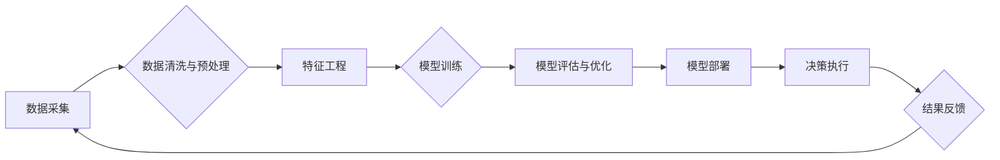

> 电商平台, 供给能力, 数据驱动, 决策优化, 预测模型, 算法, 机器学习, 深度学习

## 1. 背景介绍

在当今激烈的电商市场竞争中，供给能力的提升至关重要。供给能力是指电商平台能够有效地提供商品和服务的能力，包括商品的种类、数量、质量、价格以及配送速度等方面。 

传统的电商平台往往依赖于经验和主观判断来进行供给能力的管理，这往往导致决策效率低下、资源配置不合理，难以满足用户日益增长的需求。随着大数据、人工智能等技术的快速发展，数据驱动决策已成为提升电商平台供给能力的新趋势。

## 2. 核心概念与联系

数据驱动决策的核心在于利用数据分析和机器学习等技术，从海量数据中挖掘出有价值的洞察，为决策提供科学依据。

在电商平台的供给能力提升中，数据驱动决策主要涉及以下几个核心概念：

* **需求预测:** 通过分析历史销售数据、用户行为数据等，预测未来用户对商品的需求量，为商品采购、库存管理提供指导。
* **商品推荐:** 根据用户的兴趣偏好、购买历史等信息，推荐合适的商品，提高用户转化率。
* **价格优化:** 通过分析市场价格、用户敏感度等因素，制定合理的商品价格策略，最大化利润。
* **库存管理:** 通过预测需求和优化物流配送，合理控制库存水平，降低库存成本。
* **供应链管理:** 通过数据分析和协同优化，提高供应链的效率和稳定性。

**数据驱动决策流程图:**



## 3. 核心算法原理 & 具体操作步骤

### 3.1  算法原理概述

在数据驱动决策中，常用的算法包括：

* **回归算法:** 用于预测连续数值型变量，例如商品价格、销量等。常见的回归算法包括线性回归、逻辑回归、支持向量机回归等。
* **分类算法:** 用于预测离散型变量，例如用户是否会购买商品、商品是否属于某个类别等。常见的分类算法包括决策树、随机森林、支持向量机分类等。
* **聚类算法:** 用于将数据点按照相似性进行分组，例如用户画像、商品分类等。常见的聚类算法包括K-means聚类、层次聚类等。

### 3.2  算法步骤详解

以需求预测为例，使用线性回归算法进行步骤详解：

1. **数据采集:** 收集历史销售数据、用户行为数据等相关信息。
2. **数据清洗与预处理:** 处理缺失值、异常值、数据格式等问题，确保数据质量。
3. **特征工程:** 选择和提取与需求预测相关的特征，例如商品类别、价格、季节、促销活动等。
4. **模型训练:** 使用历史数据训练线性回归模型，学习商品需求与特征之间的关系。
5. **模型评估与优化:** 使用测试数据评估模型性能，并通过调整模型参数、特征选择等方式优化模型效果。
6. **模型部署:** 将训练好的模型部署到线上环境，用于预测未来商品需求。

### 3.3  算法优缺点

**线性回归算法:**

* **优点:** 计算简单、易于理解、可解释性强。
* **缺点:** 对数据线性关系依赖性强，难以处理非线性关系。

### 3.4  算法应用领域

线性回归算法广泛应用于：

* **需求预测:** 预测商品销量、用户流量等。
* **价格预测:** 预测商品价格走势。
* **风险评估:** 评估贷款风险、投资风险等。

## 4. 数学模型和公式 & 详细讲解 & 举例说明

### 4.1  数学模型构建

线性回归模型的数学表达式为：

$$y = \beta_0 + \beta_1x_1 + \beta_2x_2 + ... + \beta_nx_n + \epsilon$$

其中：

* $y$ 是预测变量，例如商品销量。
* $x_1, x_2, ..., x_n$ 是特征变量，例如商品价格、季节等。
* $\beta_0, \beta_1, ..., \beta_n$ 是模型参数，需要通过训练数据学习得到。
* $\epsilon$ 是误差项，代表预测值与实际值之间的差异。

### 4.2  公式推导过程

线性回归模型的目标是找到最优的模型参数，使得预测值与实际值之间的误差最小。常用的误差函数是均方误差（MSE）：

$$MSE = \frac{1}{n}\sum_{i=1}^{n}(y_i - \hat{y}_i)^2$$

其中：

* $n$ 是样本数量。
* $y_i$ 是第 $i$ 个样本的实际值。
* $\hat{y}_i$ 是第 $i$ 个样本的预测值。

通过最小化MSE，可以得到最优的模型参数。

### 4.3  案例分析与讲解

假设我们想要预测商品的销量，已知商品的价格、季节等特征数据。我们可以使用线性回归模型进行预测。

例如，假设训练数据如下：

| 价格 | 季节 | 销量 |
|---|---|---|
| 10 | 春 | 100 |
| 15 | 夏 | 150 |
| 20 | 秋 | 200 |
| 25 | 冬 | 250 |

通过训练线性回归模型，我们可以得到以下模型参数：

* $\beta_0 = 50$
* $\beta_1 = 10$
* $\beta_2 = 20$

因此，预测价格为20，季节为秋的商品销量为：

$$y = 50 + 10 \times 20 + 20 \times 3 = 350$$

## 5. 项目实践：代码实例和详细解释说明

### 5.1  开发环境搭建

* Python 3.x
* scikit-learn 库

### 5.2  源代码详细实现

```python
import pandas as pd
from sklearn.linear_model import LinearRegression
from sklearn.model_selection import train_test_split

# 加载数据
data = pd.read_csv('sales_data.csv')

# 选择特征和目标变量
X = data[['price', 'season']]
y = data['sales']

# 将数据分为训练集和测试集
X_train, X_test, y_train, y_test = train_test_split(X, y, test_size=0.2, random_state=42)

# 创建线性回归模型
model = LinearRegression()

# 训练模型
model.fit(X_train, y_train)

# 预测测试集数据
y_pred = model.predict(X_test)

# 评估模型性能
from sklearn.metrics import mean_squared_error
mse = mean_squared_error(y_test, y_pred)
print(f'Mean Squared Error: {mse}')
```

### 5.3  代码解读与分析

* 首先，我们使用pandas库加载数据，并选择特征和目标变量。
* 然后，我们使用train_test_split函数将数据分为训练集和测试集。
* 接下来，我们创建线性回归模型，并使用fit函数训练模型。
* 训练完成后，我们使用predict函数预测测试集数据。
* 最后，我们使用mean_squared_error函数评估模型性能。

### 5.4  运行结果展示

运行代码后，会输出模型的均方误差值。

## 6. 实际应用场景

数据驱动决策在电商平台的供给能力提升中具有广泛的应用场景：

* **商品推荐:** 根据用户的兴趣偏好、购买历史等信息，推荐合适的商品，提高用户转化率。
* **价格优化:** 通过分析市场价格、用户敏感度等因素，制定合理的商品价格策略，最大化利润。
* **库存管理:** 通过预测需求和优化物流配送，合理控制库存水平，降低库存成本。
* **供应链管理:** 通过数据分析和协同优化，提高供应链的效率和稳定性。

## 7. 工具和资源推荐

### 7.1  学习资源推荐

* **书籍:**
    * 《Python数据科学手册》
    * 《机器学习实战》
* **在线课程:**
    * Coursera: 数据科学与机器学习
    * edX: 机器学习

### 7.2  开发工具推荐

* **Python:** 
    * Jupyter Notebook
    * PyCharm
* **数据分析工具:**
    * pandas
    * scikit-learn
    * TensorFlow

### 7.3  相关论文推荐

* **《基于深度学习的电商商品推荐系统》**
* **《数据驱动决策在电商平台供给能力提升中的应用研究》**

## 8. 总结：未来发展趋势与挑战

### 8.1  研究成果总结

数据驱动决策已成为提升电商平台供给能力的重要手段，通过利用数据分析和机器学习等技术，可以有效地预测需求、优化价格、管理库存、协同供应链等，提高电商平台的运营效率和用户体验。

### 8.2  未来发展趋势

* **人工智能技术的进一步发展:** 深度学习、强化学习等人工智能技术将更加广泛地应用于电商平台的供给能力提升中。
* **数据质量的提升:** 数据的准确性、完整性和时效性将更加重要，需要加强数据治理和数据质量控制。
* **个性化定制:** 数据驱动决策将更加注重用户个性化需求，提供更加精准的商品推荐、价格策略和服务体验。

### 8.3  面临的挑战

* **数据安全和隐私保护:** 数据驱动决策需要处理大量用户数据，如何保障数据安全和隐私保护是一个重要的挑战。
* **算法解释性和可信度:** 许多机器学习算法的决策过程难以解释，如何提高算法的解释性和可信度是一个重要的研究方向。
* **数据孤岛问题:** 不同部门的数据难以共享和整合，如何打破数据孤岛，实现数据互通互联是一个重要的挑战。

### 8.4  研究展望

未来，数据驱动决策将在电商平台的供给能力提升中发挥更加重要的作用，需要不断探索新的算法、技术和应用场景，以更好地服务于用户和企业。

## 9. 附录：常见问题与解答

* **Q1: 数据驱动决策需要哪些数据？**

* **A1:** 数据驱动决策需要各种类型的电商平台数据，例如用户行为数据、商品信息数据、订单数据、物流数据等。

* **Q2: 如何评估数据驱动决策的有效性？**

* **A2:** 可以通过评估模型的预测精度、业务指标的提升等方式来评估数据驱动决策的有效性。

* **Q3: 数据驱动决策会取代人工决策吗？**

* **A3:** 数据驱动决策可以辅助人工决策，但不会完全取代人工决策。人工决策仍然需要考虑伦理、社会影响等因素。


作者：禅与计算机程序设计艺术 / Zen and the Art of Computer Programming 
<end_of_turn>