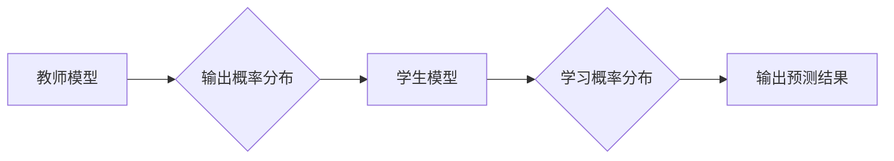

> 知识蒸馏，温度参数，模型压缩，性能优化，迁移学习

## 1. 背景介绍

在深度学习领域，模型规模的不断扩大带来了强大的性能提升，但也带来了巨大的计算资源消耗和部署成本。知识蒸馏（Knowledge Distillation）作为一种模型压缩技术，旨在将大型模型（教师模型）的知识迁移到小型模型（学生模型）中，从而实现模型压缩和性能优化。

知识蒸馏的核心思想是，除了预测结果外，教师模型的输出概率分布也包含了丰富的知识信息。学生模型可以通过学习教师模型的概率分布，而不是仅仅学习其预测结果，从而获得更好的泛化能力和压缩效果。

## 2. 核心概念与联系

### 2.1 知识蒸馏原理

知识蒸馏的核心是将教师模型的知识通过概率分布的方式传递给学生模型。

* **教师模型:** 通常是一个大型、训练充分的模型，拥有丰富的知识和强大的预测能力。
* **学生模型:** 通常是一个小型、参数量更少的模型，需要学习教师模型的知识以提升性能。

知识蒸馏的目标是让学生模型的输出概率分布尽可能接近教师模型的输出概率分布。

### 2.2 温度参数的作用

温度参数（Temperature）是知识蒸馏中一个重要的超参数，它控制着教师模型输出概率分布的平滑程度。

* **高温度 (T > 1):**  教师模型的输出概率分布更加平滑，学生模型更容易学习到教师模型的整体知识结构。
* **低温度 (T < 1):** 教师模型的输出概率分布更加尖锐，学生模型更容易学习到教师模型对特定样本的预测结果。

### 2.3  知识蒸馏流程图



## 3. 核心算法原理 & 具体操作步骤

### 3.1  算法原理概述

知识蒸馏算法的核心是通过最小化教师模型和学生模型输出概率分布之间的距离来学习。常用的距离度量方法包括KL散度（Kullback-Leibler Divergence）。

### 3.2  算法步骤详解

1. **训练教师模型:** 首先训练一个大型的教师模型，使其在目标任务上达到最佳性能。
2. **生成教师模型的软标签:** 使用教师模型对训练数据进行预测，并将其输出概率分布作为软标签。
3. **训练学生模型:** 使用学生模型对训练数据进行预测，并将其输出概率分布与教师模型的软标签进行比较。
4. **优化损失函数:** 使用KL散度或其他距离度量方法计算教师模型和学生模型输出概率分布之间的距离，并将其作为损失函数。
5. **更新模型参数:** 使用梯度下降算法更新学生模型的参数，使其输出概率分布更加接近教师模型的软标签。

### 3.3  算法优缺点

**优点:**

* 模型压缩: 可以有效地压缩模型规模，降低计算资源消耗。
* 性能提升: 可以提升学生模型的泛化能力和预测精度。
* 迁移学习: 可以将教师模型的知识迁移到新的任务或领域。

**缺点:**

* 训练复杂度: 训练知识蒸馏模型需要更多的计算资源和时间。
* 性能依赖性: 学生模型的性能取决于教师模型的质量。

### 3.4  算法应用领域

知识蒸馏技术广泛应用于以下领域:

* **图像分类:** 将大型图像分类模型压缩到小型模型，用于移动设备和嵌入式系统。
* **自然语言处理:** 将大型语言模型压缩到小型模型，用于文本分类、机器翻译和对话系统等任务。
* **语音识别:** 将大型语音识别模型压缩到小型模型，用于语音助手和语音搜索等应用。

## 4. 数学模型和公式 & 详细讲解 & 举例说明

### 4.1  数学模型构建

知识蒸馏的目标是最小化教师模型和学生模型输出概率分布之间的距离。常用的距离度量方法是KL散度。

假设教师模型的输出概率分布为 $p(y|x)$，学生模型的输出概率分布为 $q(y|x)$，则KL散度可以表示为:

$$
KL(p||q) = \sum_y p(y|x) \log \frac{p(y|x)}{q(y|x)}
$$

其中，$x$ 表示输入数据，$y$ 表示输出类别。

### 4.2  公式推导过程

KL散度度量了两个概率分布之间的差异。当两个概率分布相同时，KL散度为0。

### 4.3  案例分析与讲解

假设我们有一个图像分类任务，教师模型是一个大型的ResNet模型，学生模型是一个小型MobileNet模型。

我们可以使用知识蒸馏技术将ResNet模型的知识迁移到MobileNet模型中。

在训练过程中，我们将ResNet模型的输出概率分布作为软标签，并将其与MobileNet模型的输出概率分布进行比较，使用KL散度作为损失函数。

通过训练，MobileNet模型可以学习到ResNet模型的知识，从而提升其在图像分类任务上的性能。

## 5. 项目实践：代码实例和详细解释说明

### 5.1  开发环境搭建

* Python 3.7+
* PyTorch 1.7+
* CUDA 10.2+

### 5.2  源代码详细实现

```python
import torch
import torch.nn as nn
import torch.optim as optim

# 定义教师模型和学生模型
class TeacherModel(nn.Module):
    # ...

class StudentModel(nn.Module):
    # ...

# 初始化模型
teacher_model = TeacherModel()
student_model = StudentModel()

# 定义损失函数和优化器
criterion = nn.KLDivLoss(reduction='batchmean')
optimizer = optim.Adam(student_model.parameters(), lr=0.001)

# 训练循环
for epoch in range(num_epochs):
    for batch_idx, (data, target) in enumerate(train_loader):
        # 前向传播
        teacher_output = teacher_model(data)
        student_output = student_model(data)

        # 计算损失
        loss = criterion(F.log_softmax(student_output, dim=1), F.softmax(teacher_output, dim=1))

        # 反向传播和优化
        optimizer.zero_grad()
        loss.backward()
        optimizer.step()

# 保存模型
torch.save(student_model.state_dict(), 'student_model.pth')
```

### 5.3  代码解读与分析

* **模型定义:** 代码中定义了教师模型和学生模型，并初始化模型参数。
* **损失函数:** 使用KL散度作为损失函数，衡量教师模型和学生模型输出概率分布之间的差异。
* **优化器:** 使用Adam优化器更新学生模型的参数。
* **训练循环:** 训练循环中，首先使用教师模型对数据进行预测，然后使用学生模型进行预测，并计算损失。最后，使用梯度下降算法更新学生模型的参数。
* **模型保存:** 训练完成后，保存学生模型的权重参数。

### 5.4  运行结果展示

通过训练和测试，可以观察到学生模型的性能提升。

## 6. 实际应用场景

知识蒸馏技术在实际应用场景中具有广泛的应用前景。

### 6.1  移动设备应用

知识蒸馏可以将大型模型压缩到小型模型，从而在移动设备上部署高效的深度学习模型。例如，可以将图像分类模型压缩到手机上，实现实时图像识别功能。

### 6.2  嵌入式系统应用

知识蒸馏可以将大型模型压缩到嵌入式系统上，实现资源有限的设备上的深度学习应用。例如，可以将语音识别模型压缩到智能音箱上，实现语音控制功能。

### 6.3  边缘计算应用

知识蒸馏可以将大型模型部署到边缘设备上，实现数据本地处理和决策，从而降低网络延迟和数据传输成本。例如，可以将物体检测模型部署到无人驾驶汽车上，实现实时环境感知。

### 6.4  未来应用展望

随着深度学习技术的不断发展，知识蒸馏技术将有更广泛的应用场景。例如，可以将知识蒸馏应用于自然语言处理、推荐系统、医疗诊断等领域。

## 7. 工具和资源推荐

### 7.1  学习资源推荐

* **论文:**
    * Hinton, G., Vinyals, O., & Dean, J. (2015). Distilling the knowledge in a neural network. arXiv preprint arXiv:1503.02531.
* **博客:**
    * https://blog.openai.com/better-language-models/
    * https://towardsdatascience.com/knowledge-distillation-a-powerful-technique-for-model-compression-a3999999999

### 7.2  开发工具推荐

* **PyTorch:** https://pytorch.org/
* **TensorFlow:** https://www.tensorflow.org/

### 7.3  相关论文推荐

* **Teacher-Student Generative Adversarial Networks**
* **Multi-Teacher Knowledge Distillation**
* **Progressive Knowledge Distillation**

## 8. 总结：未来发展趋势与挑战

### 8.1  研究成果总结

知识蒸馏技术取得了显著的成果，有效地压缩了模型规模，提升了模型性能，并拓展了深度学习的应用场景。

### 8.2  未来发展趋势

* **更有效的蒸馏方法:** 研究更有效的知识蒸馏方法，例如基于强化学习的蒸馏方法。
* **跨模态知识蒸馏:** 研究跨模态知识蒸馏方法，例如将图像和文本知识进行融合。
* **动态知识蒸馏:** 研究动态知识蒸馏方法，例如根据任务需求动态调整蒸馏过程。

### 8.3  面临的挑战

* **蒸馏效率:** 知识蒸馏训练过程仍然比较耗时，需要进一步提高训练效率。
* **蒸馏效果:** 对于某些任务，知识蒸馏效果并不理想，需要进一步研究如何提高蒸馏效果。
* **知识表示:** 如何更好地表示和传递知识仍然是一个挑战。

### 8.4  研究展望

未来，知识蒸馏技术将继续发展，并应用于更多领域。

## 9. 附录：常见问题与解答

* **Q: 知识蒸馏的温度参数如何选择？**

* **A:** 温度参数的选择需要根据具体任务和模型进行调整。一般来说，较低的温度参数可以获得更精确的蒸馏效果，但同时也可能导致过拟合。较高的温度参数可以获得更平滑的蒸馏效果，但同时也可能导致蒸馏效果不佳。

* **Q: 知识蒸馏的训练时间是否会比直接训练模型更长？**

* **A:** 知识蒸馏的训练时间通常比直接训练模型更长，因为需要训练两个模型。但是，由于学生模型的规模较小，因此训练时间仍然比直接训练大型模型更短。

* **Q: 知识蒸馏是否适用于所有类型的深度学习模型？**

* **A:** 知识蒸馏适用于大多数类型的深度学习模型，但对于某些特殊的模型，例如生成对抗网络（GAN），知识蒸馏效果可能不佳。


作者：禅与计算机程序设计艺术 / Zen and the Art of Computer Programming 
<end_of_turn>