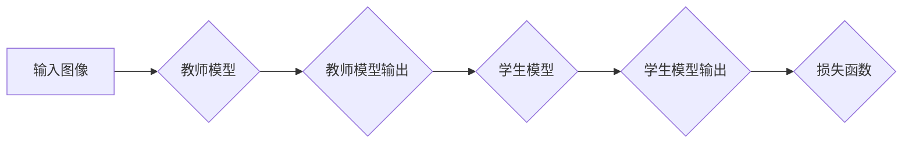

> 知识蒸馏，图像生成，生成对抗网络，教师模型，学生模型，迁移学习，压缩模型

## 1. 背景介绍

图像生成技术近年来取得了飞速发展，生成对抗网络（GAN）作为其核心技术之一，在图像合成、修复、风格迁移等领域展现出强大的应用潜力。然而，传统的GAN模型通常存在训练复杂、收敛困难、生成图像质量不稳定等问题。为了解决这些问题，知识蒸馏（KD）技术应运而生。

知识蒸馏是一种机器学习的迁移学习方法，旨在将一个大型、复杂的模型（教师模型）的知识迁移到一个小型、高效的模型（学生模型）中。通过这种方式，可以有效地压缩模型规模，提高模型的推理速度，同时保持较高的性能。

在图像生成任务中，知识蒸馏可以有效地提高学生模型的生成图像质量，加速训练过程，并降低模型的计算成本。

## 2. 核心概念与联系

### 2.1 知识蒸馏原理

知识蒸馏的核心思想是将教师模型的知识，包括特征表示和决策边界，通过一种特殊的训练方式传递给学生模型。

**教师模型**通常是一个经过充分训练的、性能优异的模型，它拥有丰富的特征表示和强大的决策能力。

**学生模型**通常是一个小型、高效的模型，其参数数量远少于教师模型。

知识蒸馏的训练目标是使学生模型的输出尽可能接近教师模型的输出，从而学习到教师模型的知识。

### 2.2 知识蒸馏流程



**流程描述：**

1. 输入图像首先被送入教师模型进行处理，得到教师模型的输出。
2. 学生模型也对输入图像进行处理，得到学生模型的输出。
3. 损失函数用于衡量学生模型输出与教师模型输出之间的差异。
4. 通过反向传播算法，更新学生模型的参数，使其输出更接近教师模型的输出。

### 2.3 知识蒸馏的优势

* **模型压缩:** 知识蒸馏可以有效地压缩模型规模，减少模型参数数量，从而降低模型的存储和计算成本。
* **性能提升:** 通过学习教师模型的知识，学生模型可以获得更高的性能，例如更高的准确率、更低的错误率等。
* **训练加速:** 知识蒸馏可以加速模型的训练过程，因为学生模型的初始参数已经包含了教师模型的部分知识，因此不需要从头开始训练。

## 3. 核心算法原理 & 具体操作步骤

### 3.1 算法原理概述

知识蒸馏算法的核心是利用教师模型的软标签来指导学生模型的训练。

**软标签**是指教师模型对输入图像的概率分布，而不是简单的类别标签。

通过学习教师模型的软标签，学生模型可以获得更丰富的特征信息，从而提高其生成图像的质量。

### 3.2 算法步骤详解

1. **训练教师模型:** 首先需要训练一个性能优异的教师模型，例如一个大型的GAN模型。
2. **生成教师模型的软标签:** 将输入图像送入教师模型，得到教师模型的输出概率分布，即教师模型的软标签。
3. **训练学生模型:** 将输入图像送入学生模型，并使用教师模型的软标签作为目标标签进行训练。
4. **调整温度参数:** 温度参数可以控制软标签的“软化”程度，通常需要通过实验来确定最佳的温度参数。

### 3.3 算法优缺点

**优点:**

* 能够有效地压缩模型规模，提高模型的效率。
* 能够提高学生模型的性能，例如生成图像的质量。
* 能够加速模型的训练过程。

**缺点:**

* 需要先训练一个性能优异的教师模型，这需要大量的计算资源和时间。
* 温度参数的选择对算法性能有重要影响，需要通过实验来确定最佳参数。

### 3.4 算法应用领域

知识蒸馏技术在图像生成任务中具有广泛的应用前景，例如：

* **图像合成:** 生成高质量的合成图像，例如人脸、场景、物体等。
* **图像修复:** 修复损坏的图像，例如去除噪声、修复缺失部分等。
* **图像风格迁移:** 将一张图像的风格迁移到另一张图像上。

## 4. 数学模型和公式 & 详细讲解 & 举例说明

### 4.1 数学模型构建

知识蒸馏的数学模型主要包括两个部分：

* **教师模型的输出:**  教师模型对输入图像的预测概率分布，可以用一个概率向量 $p_t$ 表示，其中 $p_t(c)$ 表示输入图像属于类别 $c$ 的概率。
* **学生模型的输出:** 学生模型对输入图像的预测概率分布，可以用一个概率向量 $p_s$ 表示，其中 $p_s(c)$ 表示输入图像属于类别 $c$ 的概率。

### 4.2 公式推导过程

知识蒸馏的损失函数通常由两个部分组成：

* **分类损失:** 衡量学生模型的输出与真实标签之间的差异，通常使用交叉熵损失函数。
* **知识蒸馏损失:** 衡量学生模型的输出与教师模型的软标签之间的差异，通常使用KL散度。

**公式:**

$$
L = L_{CE} + \lambda L_{KD}
$$

$$
L_{CE} = -\sum_{c=1}^{C} y_c \log(p_s(c))
$$

$$
L_{KD} = KL(p_s || p_t)
$$

其中：

* $L_{CE}$ 是分类损失
* $L_{KD}$ 是知识蒸馏损失
* $\lambda$ 是平衡系数，用于控制分类损失和知识蒸馏损失的权重
* $y_c$ 是真实标签，如果输入图像属于类别 $c$，则 $y_c = 1$，否则 $y_c = 0$
* $p_s(c)$ 是学生模型对输入图像属于类别 $c$ 的概率
* $p_t(c)$ 是教师模型对输入图像属于类别 $c$ 的概率

### 4.3 案例分析与讲解

假设我们有一个图像分类任务，需要训练一个学生模型来识别不同种类的猫。

我们可以使用一个预先训练好的教师模型，例如ResNet-50，作为教师模型。

然后，我们可以使用知识蒸馏算法来训练学生模型，例如MobileNet-V2。

在训练过程中，我们会使用教师模型的软标签来指导学生模型的学习。

通过这种方式，学生模型可以学习到教师模型的知识，从而提高其识别猫的准确率。

## 5. 项目实践：代码实例和详细解释说明

### 5.1 开发环境搭建

* **操作系统:** Ubuntu 20.04
* **Python 版本:** 3.8
* **深度学习框架:** PyTorch 1.8
* **其他依赖库:** torchvision, numpy, matplotlib

### 5.2 源代码详细实现

```python
import torch
import torch.nn as nn
import torchvision.models as models

# 定义教师模型
teacher_model = models.resnet50(pretrained=True)

# 定义学生模型
student_model = nn.Sequential(
    nn.Conv2d(3, 64, kernel_size=3, stride=1, padding=1),
    nn.ReLU(),
    nn.MaxPool2d(kernel_size=2, stride=2),
    nn.Conv2d(64, 128, kernel_size=3, stride=1, padding=1),
    nn.ReLU(),
    nn.MaxPool2d(kernel_size=2, stride=2),
    nn.Flatten(),
    nn.Linear(128 * 7 * 7, 10)
)

# 定义损失函数
criterion = nn.CrossEntropyLoss()

# 定义优化器
optimizer = torch.optim.Adam(student_model.parameters(), lr=0.001)

# 训练循环
for epoch in range(10):
    for images, labels in dataloader:
        # 前向传播
        outputs_teacher = teacher_model(images)
        outputs_student = student_model(images)

        # 计算损失
        loss_ce = criterion(outputs_student, labels)
        loss_kd = torch.nn.KLDivLoss()(torch.softmax(outputs_student, dim=1), torch.softmax(outputs_teacher, dim=1))
        loss = loss_ce + 0.1 * loss_kd

        # 反向传播
        optimizer.zero_grad()
        loss.backward()
        optimizer.step()

    print(f"Epoch {epoch+1}/{10}, Loss: {loss.item()}")
```

### 5.3 代码解读与分析

* **教师模型:** 使用预训练的ResNet-50作为教师模型，其已经拥有丰富的特征表示能力。
* **学生模型:** 定义了一个小型的神经网络作为学生模型，其参数数量远少于教师模型。
* **损失函数:** 使用交叉熵损失函数和KL散度作为损失函数，分别衡量分类损失和知识蒸馏损失。
* **训练循环:** 训练循环中，首先使用教师模型对输入图像进行预测，得到教师模型的软标签。然后，使用学生模型对输入图像进行预测，并计算损失函数。最后，使用反向传播算法更新学生模型的参数。

### 5.4 运行结果展示

通过训练，学生模型可以学习到教师模型的知识，从而提高其图像分类的准确率。

## 6. 实际应用场景

### 6.1 图像生成

知识蒸馏可以应用于图像生成任务，例如生成高质量的人脸图像、场景图像、物体图像等。

通过将一个大型的GAN模型作为教师模型，可以训练一个小型、高效的学生模型，从而降低图像生成的计算成本，同时保持较高的图像质量。

### 6.2 图像修复

知识蒸馏也可以应用于图像修复任务，例如去除图像中的噪声、修复缺失的部分等。

通过将一个预先训练好的图像修复模型作为教师模型，可以训练一个小型、高效的学生模型，从而提高图像修复的效率，并降低计算成本。

### 6.3 图像风格迁移

知识蒸馏还可以应用于图像风格迁移任务，例如将一张图像的风格迁移到另一张图像上。

通过将一个预先训练好的风格迁移模型作为教师模型，可以训练一个小型、高效的学生模型，从而提高风格迁移的效率，并降低计算成本。

### 6.4 未来应用展望

随着人工智能技术的不断发展，知识蒸馏技术在图像生成任务中的应用前景更加广阔。

未来，知识蒸馏技术可能会应用于更多新的图像生成任务，例如：

* **3D物体生成:** 生成高质量的3D物体模型。
* **视频生成:** 生成高质量的视频序列。
* **图像编辑:** 实现更灵活、更精细的图像编辑操作。

## 7. 工具和资源推荐

### 7.1 学习资源推荐

* **论文:**
    * Hinton, G. E., Vinyals, O., & Dean, J. (2015). Distilling the knowledge in a neural network. arXiv preprint arXiv:1503.02531.
    * Romero, A., Gatta, C., & Camps, T. (2014). Transfer learning for deep neural networks: A survey. arXiv preprint arXiv:1412.6555.
* **博客:**
    * https://towardsdatascience.com/knowledge-distillation-a-powerful-technique-for-model-compression-a3999619969c
    * https://blog.paperspace.com/knowledge-distillation-tutorial/

### 7.2 开发工具推荐

* **深度学习框架:** PyTorch, TensorFlow
* **图像处理库:** OpenCV, Pillow
* **数据增强库:** Albumentations

### 7.3