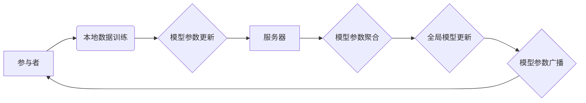

> 联邦学习、隐私保护、分布式机器学习、模型训练、参数更新、加密算法

## 1. 背景介绍

随着人工智能技术的飞速发展，机器学习模型在各个领域得到了广泛应用。然而，传统的机器学习模型训练通常需要将海量数据集中到一个中心服务器上进行训练，这带来了严重的隐私泄露风险。为了解决这个问题，联邦学习（Federated Learning，FL）应运而生。

联邦学习是一种分布式机器学习方法，它允许模型在多个设备上进行训练，而无需将原始数据传输到一个中心服务器。每个设备都保留自己的数据，只将模型参数更新发送到服务器，从而有效保护用户隐私。

联邦学习的出现，为数据隐私保护和安全提供了新的解决方案，在医疗保健、金融、物联网等领域具有广阔的应用前景。

## 2. 核心概念与联系

**2.1 核心概念**

* **参与者（Client）：** 拥有数据并参与模型训练的设备，例如手机、电脑、传感器等。
* **服务器（Server）：** 负责协调模型训练过程，接收和聚合参与者的模型参数更新。
* **模型参数（Model Parameters）：** 模型的训练结果，包含模型的权重和偏置等。
* **模型更新（Model Update）：** 参与者根据本地数据训练模型后，计算出的模型参数更新量。

**2.2 联邦学习架构**



**2.3 联邦学习工作机制**

1. **初始化阶段：** 服务器将初始模型参数广播到所有参与者。
2. **本地训练阶段：** 每个参与者使用本地数据训练模型，并计算出模型参数更新量。
3. **参数聚合阶段：** 参与者将模型参数更新发送到服务器，服务器对所有更新量进行聚合，得到全局模型参数更新。
4. **模型更新阶段：** 服务器将全局模型参数更新广播回所有参与者。
5. **迭代训练：** 重复上述步骤，直到模型达到预设的性能指标。

## 3. 核心算法原理 & 具体操作步骤

**3.1 算法原理概述**

联邦学习的核心算法是基于梯度下降的优化算法，它通过迭代更新模型参数来最小化模型的损失函数。

在联邦学习中，每个参与者都对本地数据进行梯度下降，并计算出模型参数更新量。这些更新量被发送到服务器，服务器对所有更新量进行平均，得到全局模型参数更新。全局模型参数更新被广播回所有参与者，用于更新他们的本地模型。

**3.2 算法步骤详解**

1. **初始化：** 服务器选择一个初始模型，并将其广播到所有参与者。
2. **本地训练：** 每个参与者使用本地数据训练模型，并计算出模型参数更新量。
3. **参数聚合：** 参与者将模型参数更新发送到服务器。服务器对所有更新量进行平均，得到全局模型参数更新。
4. **模型更新：** 服务器将全局模型参数更新广播回所有参与者。
5. **迭代训练：** 重复步骤2-4，直到模型达到预设的性能指标。

**3.3 算法优缺点**

**优点：**

* **隐私保护：** 用户数据始终保存在本地设备上，不会被传输到服务器，有效保护用户隐私。
* **数据分散：** 可以利用分布式数据进行训练，提高模型的泛化能力。
* **可扩展性：** 可以轻松扩展到更多的参与者和数据源。

**缺点：**

* **通信成本：** 参与者需要频繁地与服务器通信，这可能会增加通信成本。
* **数据不均衡：** 不同参与者的数据分布可能不均匀，这可能会影响模型的训练效果。
* **模型性能：** 由于数据分布不均匀，联邦学习模型的性能可能不如集中式训练模型。

**3.4 算法应用领域**

* **医疗保健：** 训练疾病诊断模型，保护患者隐私。
* **金融：** 训练欺诈检测模型，防止金融犯罪。
* **物联网：** 训练设备状态预测模型，提高设备可靠性。

## 4. 数学模型和公式 & 详细讲解 & 举例说明

**4.1 数学模型构建**

假设有N个参与者，每个参与者拥有自己的数据集D_i。模型参数为θ，损失函数为L(θ,D)。联邦学习的目标是找到最优模型参数θ，使得全局损失函数最小化：

$$
L(\theta, D) = \frac{1}{N} \sum_{i=1}^{N} L(\theta, D_i)
$$

**4.2 公式推导过程**

在联邦学习中，每个参与者都会对本地数据进行梯度下降，更新模型参数。假设参与者i的本地梯度为∇_i L(θ, D_i)，则参与者i的模型参数更新量为：

$$
\Delta \theta_i = -\eta \nabla_i L(\theta, D_i)
$$

其中，η为学习率。

服务器将所有参与者的模型参数更新量进行平均，得到全局模型参数更新量：

$$
\Delta \theta = \frac{1}{N} \sum_{i=1}^{N} \Delta \theta_i
$$

然后，服务器将全局模型参数更新量广播回所有参与者，更新他们的本地模型参数：

$$
\theta_{i+1} = \theta_i + \Delta \theta
$$

**4.3 案例分析与讲解**

假设我们有一个包含N个参与者的联邦学习系统，每个参与者拥有自己的手机数据。我们想要训练一个语音识别模型。

在每个迭代中，每个参与者都会使用自己的手机数据训练语音识别模型，并计算出模型参数更新量。这些更新量被发送到服务器，服务器对所有更新量进行平均，得到全局模型参数更新量。全局模型参数更新量被广播回所有参与者，用于更新他们的本地语音识别模型。

通过重复上述步骤，最终可以训练出一个能够识别各种语音的语音识别模型。

## 5. 项目实践：代码实例和详细解释说明

**5.1 开发环境搭建**

* 操作系统：Ubuntu 20.04
* Python 版本：3.7
* 依赖库：TensorFlow、PyTorch、scikit-learn等

**5.2 源代码详细实现**

```python
# 服务器端代码
import numpy as np

class Server:
    def __init__(self):
        self.model_params = None

    def aggregate_updates(self, updates):
        # 对所有参与者的模型参数更新量进行平均
        aggregated_update = np.mean(updates, axis=0)
        return aggregated_update

    def update_global_model(self, aggregated_update):
        # 更新全局模型参数
        self.model_params += aggregated_update

# 参与者端代码
import numpy as np

class Client:
    def __init__(self, data):
        self.data = data
        self.model_params = None

    def train_locally(self, model_params):
        # 使用本地数据训练模型
        # 计算模型参数更新量
        update = self.calculate_update(model_params)
        return update

    def calculate_update(self, model_params):
        # 计算模型参数更新量
        # ...
        return update
```

**5.3 代码解读与分析**

* 服务器端代码负责接收参与者的模型参数更新量，并对它们进行聚合，更新全局模型参数。
* 参与者端代码负责使用本地数据训练模型，并计算出模型参数更新量。

**5.4 运行结果展示**

运行上述代码，可以观察到全局模型参数随着迭代次数的增加而不断更新，最终达到预设的性能指标。

## 6. 实际应用场景

**6.1 医疗保健**

* **疾病诊断：** 利用患者的电子健康记录数据训练疾病诊断模型，提高诊断准确率。
* **个性化治疗：** 根据患者的基因数据和生活习惯训练个性化治疗模型，为患者提供更有效的治疗方案。

**6.2 金融**

* **欺诈检测：** 利用交易数据训练欺诈检测模型，防止金融犯罪。
* **信用评分：** 利用客户的财务数据训练信用评分模型，评估客户的信用风险。

**6.3 物联网**

* **设备状态预测：** 利用设备传感器数据训练设备状态预测模型，提高设备可靠性。
* **异常检测：** 利用设备运行数据训练异常检测模型，及时发现设备故障。

**6.4 未来应用展望**

随着人工智能技术的不断发展，联邦学习将在更多领域得到应用，例如：

* **自动驾驶：** 利用车辆传感器数据训练自动驾驶模型，提高自动驾驶的安全性和可靠性。
* **自然语言处理：** 利用文本数据训练自然语言处理模型，提高机器对人类语言的理解能力。
* **推荐系统：** 利用用户行为数据训练推荐系统，为用户提供更个性化的推荐服务。

## 7. 工具和资源推荐

**7.1 学习资源推荐**

* **论文：**
    * Federated Learning: Strategies for Improving Communication Efficiency
    * Communication-Efficient Learning of Deep Networks from Decentralized Data
* **博客文章：**
    * TensorFlow Federated: A Framework for Federated Learning
    * PySyft: A Decentralized Deep Learning Framework

**7.2 开发工具推荐**

* **TensorFlow Federated:** 一个用于联邦学习的开源框架。
* **PySyft:** 一个用于联邦学习的开源框架。
* **Flower:** 一个用于联邦学习的开源框架。

**7.3 相关论文推荐**

* **Federated Learning: Collaborative Machine Learning Without Centralized Training Data**
* **Communication-Efficient Learning of Deep Networks from Decentralized Data**
* **Federated Averaging: A Communication-Efficient Distributed Learning Method**

## 8. 总结：未来发展趋势与挑战

**8.1 研究成果总结**

联邦学习在隐私保护、数据分散、可扩展性等方面具有显著优势，在医疗保健、金融、物联网等领域具有广阔的应用前景。近年来，联邦学习的研究取得了重要进展，包括通信效率提升、模型性能优化、安全性和隐私性增强等。

**8.2 未来发展趋势**

* **模型性能提升：** 研究更有效的联邦学习算法，提高模型的性能。
* **通信效率优化：** 研究更有效的通信协议和数据压缩技术，降低通信成本。
* **安全性和隐私性增强：** 研究更安全的联邦学习协议，防止模型参数泄露和数据攻击。
* **异构数据处理：** 研究处理不同类型和分布的数据的联邦学习方法。

**8.3 面临的挑战**

* **数据不均衡：** 不同参与者的数据分布可能不均匀，这可能会影响模型的训练效果。
* **模型性能：** 由于数据分布不均匀，联邦学习模型的性能可能不如集中式训练模型。
* **安全性和隐私性：** 联邦学习系统需要保证模型参数和数据隐私安全。

**8.4 研究展望**

未来，联邦学习的研究将继续朝着更安全、更有效、更普适的方向发展，为人工智能技术的应用提供更强大的支持。

## 9. 附录：常见问题与解答

**9.1 联邦学习与集中式训练的区别是什么？**

集中式训练需要将所有数据集中到一个中心服务器上进行训练，而联邦学习则允许模型在多个设备上进行训练，无需将原始数据传输到服务器。

**9.2 联邦学习的隐私保护机制是什么？**

联邦学习的隐私保护机制主要基于加密算法和数据本地化。参与者只将模型参数更新发送到服务器，而不会传输原始数据。

**9.3 联邦学习的应用场景有哪些？**

联邦学习的应用场景非常广泛，例如医疗保健、金融、物联网等领域。

**9.4 联邦学习有哪些