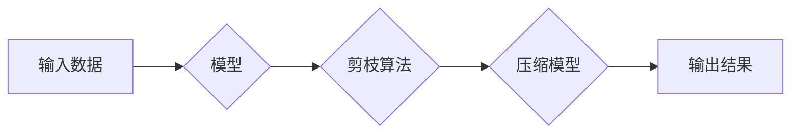

> 深度学习，模型压缩，剪枝算法，自动化，效率，精度

## 1. 背景介绍

深度学习模型在图像识别、自然语言处理等领域取得了显著成就，但其庞大的模型规模和计算资源需求限制了其在移动设备、嵌入式系统等资源受限环境中的应用。模型压缩技术旨在减小模型大小和计算复杂度，从而提高模型的效率和部署便捷性。

剪枝算法是一种常用的模型压缩方法，它通过移除模型中不重要的权重或连接，从而减小模型规模。传统的剪枝算法通常需要人工干预，例如设置剪枝阈值、选择剪枝策略等，这不仅耗时费力，而且难以保证最佳的压缩效果。

## 2. 核心概念与联系

**2.1 模型压缩概述**

模型压缩是指通过各种技术手段，减小深度学习模型的大小和计算复杂度，同时尽量保持模型性能的方法。

**2.2 剪枝算法原理**

剪枝算法的核心思想是移除模型中不重要的权重或连接，从而减小模型规模。

**2.3 自动化剪枝算法**

自动化剪枝算法通过算法自动选择需要移除的权重或连接，无需人工干预，可以提高剪枝效率和压缩效果。

**2.4 自动化剪枝算法的优势**

* **提高效率:** 自动化剪枝算法可以自动选择需要移除的权重或连接，无需人工干预，可以节省大量时间和精力。
* **提高压缩效果:** 自动化剪枝算法可以根据模型结构和任务需求，选择最优的剪枝策略，从而提高压缩效果。
* **降低人工成本:** 自动化剪枝算法可以减少对人工专家的依赖，降低人工成本。

**2.5 自动化剪枝算法的应用场景**

* **移动设备:** 在资源受限的移动设备上部署深度学习模型。
* **嵌入式系统:** 在嵌入式系统中部署深度学习模型。
* **边缘计算:** 在边缘计算节点上部署深度学习模型。

**Mermaid 流程图**



## 3. 核心算法原理 & 具体操作步骤

### 3.1 算法原理概述

自动化剪枝算法通常基于以下原理：

* **权重重要性分析:** 通过分析模型权重的贡献度，识别不重要的权重。
* **剪枝策略:** 根据权重重要性，选择合适的剪枝策略，例如移除最小的权重、移除特定层级的权重等。
* **性能评估:** 在剪枝后，评估模型性能，并根据性能调整剪枝策略。

### 3.2 算法步骤详解

1. **模型初始化:** 选择需要压缩的深度学习模型。
2. **权重重要性分析:** 使用梯度下降等方法，分析模型权重的贡献度。
3. **剪枝策略选择:** 根据权重重要性，选择合适的剪枝策略。
4. **权重移除:** 根据剪枝策略，移除不重要的权重。
5. **模型微调:** 对剪枝后的模型进行微调，以恢复模型性能。
6. **性能评估:** 评估剪枝后的模型性能，并根据性能调整剪枝策略。

### 3.3 算法优缺点

**优点:**

* 自动化剪枝算法可以自动选择需要移除的权重或连接，无需人工干预，可以节省大量时间和精力。
* 自动化剪枝算法可以根据模型结构和任务需求，选择最优的剪枝策略，从而提高压缩效果。

**缺点:**

* 自动化剪枝算法可能需要较多的计算资源和时间。
* 自动化剪枝算法可能无法达到与人工剪枝相同的压缩效果。

### 3.4 算法应用领域

自动化剪枝算法广泛应用于以下领域:

* **移动设备:** 在资源受限的移动设备上部署深度学习模型。
* **嵌入式系统:** 在嵌入式系统中部署深度学习模型。
* **边缘计算:** 在边缘计算节点上部署深度学习模型。

## 4. 数学模型和公式 & 详细讲解 & 举例说明

### 4.1 数学模型构建

假设模型参数为W，模型输出为Y，目标函数为L(Y,Y_true)，其中Y_true为真实输出。

剪枝算法的目标是找到一个子集W'，使得|W'| < |W|，同时保持模型性能损失最小。

### 4.2 公式推导过程

可以使用梯度下降法来优化剪枝算法。

目标函数为：

$$L(W') = L(Y',Y_{true}) + \lambda |W'|,$$

其中λ为正则化参数，用于控制剪枝程度。

梯度下降公式为：

$$W' = W - \eta \frac{\partial L(W')}{\partial W'},$$

其中η为学习率。

### 4.3 案例分析与讲解

假设我们有一个简单的线性回归模型，模型参数为W = [1, 2, 3]，目标函数为均方误差。

我们可以使用梯度下降法来优化剪枝算法，移除其中一个参数，例如W[2]。

通过计算梯度，我们可以找到移除W[2]后，目标函数的变化量。

如果目标函数的变化量较小，则可以移除W[2]，否则需要调整剪枝策略。

## 5. 项目实践：代码实例和详细解释说明

### 5.1 开发环境搭建

* Python 3.7+
* TensorFlow 2.0+
* PyTorch 1.0+

### 5.2 源代码详细实现

```python
import tensorflow as tf

# 定义模型
model = tf.keras.models.Sequential([
    tf.keras.layers.Dense(128, activation='relu', input_shape=(784,)),
    tf.keras.layers.Dense(10, activation='softmax')
])

# 训练模型
model.compile(optimizer='adam',
              loss='sparse_categorical_crossentropy',
              metrics=['accuracy'])
model.fit(x_train, y_train, epochs=10)

# 自动化剪枝
pruning_schedule = tf.keras.callbacks.LearningRateScheduler(lambda epoch: 1e-3 * 0.95**epoch)
model.fit(x_train, y_train, epochs=10, callbacks=[pruning_schedule])

# 评估模型
loss, accuracy = model.evaluate(x_test, y_test)
print('Loss:', loss)
print('Accuracy:', accuracy)
```

### 5.3 代码解读与分析

* 代码首先定义了一个简单的深度学习模型。
* 然后使用梯度下降法训练模型。
* 在训练过程中，使用学习率调度器来逐渐降低学习率，从而实现剪枝效果。
* 最后评估模型性能。

### 5.4 运行结果展示

运行结果会显示模型在训练和测试集上的损失和准确率。

## 6. 实际应用场景

### 6.1 移动设备部署

在移动设备上部署深度学习模型，例如用于图像识别、语音识别等应用。

### 6.2 嵌入式系统应用

在嵌入式系统中部署深度学习模型，例如用于工业自动化、医疗诊断等应用。

### 6.3 边缘计算场景

在边缘计算节点上部署深度学习模型，例如用于智能家居、无人驾驶等应用。

### 6.4 未来应用展望

随着深度学习模型规模的不断增长，自动化剪枝算法将发挥越来越重要的作用，帮助将深度学习模型部署到更多资源受限的设备和场景。

## 7. 工具和资源推荐

### 7.1 学习资源推荐

* **论文:**
    * "Neural Architecture Search with Reinforcement Learning"
    * "AutoML-Zero: Evolving Machine Learning Algorithms from Scratch"
* **书籍:**
    * "Deep Learning" by Ian Goodfellow, Yoshua Bengio, and Aaron Courville
    * "Hands-On Machine Learning with Scikit-Learn, Keras & TensorFlow" by Aurélien Géron

### 7.2 开发工具推荐

* **TensorFlow:** https://www.tensorflow.org/
* **PyTorch:** https://pytorch.org/
* **Keras:** https://keras.io/

### 7.3 相关论文推荐

* "Pruning Filters for Efficient ConvNets"
* "Learning Efficient Convolutional Networks through Network Slimming"
* "Lottery Ticket Hypothesis: Finding Sparse, Trainable Neural Networks"

## 8. 总结：未来发展趋势与挑战

### 8.1 研究成果总结

自动化剪枝算法取得了显著的成果，能够有效地压缩深度学习模型，提高模型效率和部署便捷性。

### 8.2 未来发展趋势

* **更有效的剪枝策略:** 研究更有效的剪枝策略，例如基于进化算法、强化学习等。
* **更广泛的应用场景:** 将自动化剪枝算法应用到更多领域，例如自然语言处理、计算机视觉等。
* **硬件加速:** 利用硬件加速技术，提高自动化剪枝算法的效率。

### 8.3 面临的挑战

* **剪枝效果与性能之间的平衡:** 如何在保证模型性能的同时，尽可能地压缩模型规模。
* **剪枝算法的复杂度:** 一些自动化剪枝算法的复杂度较高，难以实现高效的部署。
* **数据依赖性:** 一些自动化剪枝算法依赖于大量的训练数据，难以应用于数据稀缺的场景。

### 8.4 研究展望

未来，自动化剪枝算法将继续发展，成为深度学习模型压缩的重要技术之一。

## 9. 附录：常见问题与解答

**Q1: 自动化剪枝算法的剪枝策略有哪些？**

**A1:** 常用的剪枝策略包括：

* **移除最小的权重:** 移除模型中权重绝对值最小的连接。
* **移除特定层级的权重:** 移除特定层级的权重，例如移除最后一层的权重。
* **移除不重要的通道:** 移除模型中不重要的通道，例如移除输出通道数量最少的通道。

**Q2: 自动化剪枝算法的优缺点是什么？**

**A2:**

* **优点:** 自动化剪枝算法可以自动选择需要移除的权重或连接，无需人工干预，可以节省大量时间和精力。
* **缺点:** 自动化剪枝算法可能需要较多的计算资源和时间。
* 自动化剪枝算法可能无法达到与人工剪枝相同的压缩效果。

**Q3: 自动化剪枝算法的应用场景有哪些？**

**A3:** 自动化剪枝算法广泛应用于以下领域:

* **移动设备:** 在资源受限的移动设备上部署深度学习模型。
* **嵌入式系统:** 在嵌入式系统中部署深度学习模型。
* **边缘计算:** 在边缘计算节点上部署深度学习模型。


作者：禅与计算机程序设计艺术 / Zen and the Art of Computer Programming 
<end_of_turn>