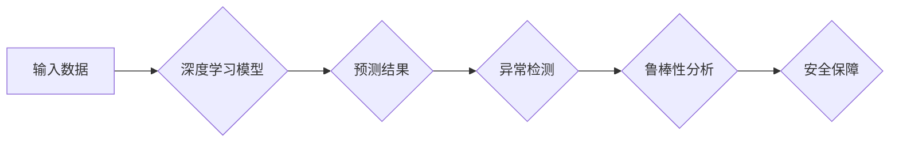

> 自动驾驶, 深度学习, 模型鲁棒性, 异常检测,  adversarial attack, 数据增强, 正则化

## 1. 背景介绍

自动驾驶技术作为人工智能领域的重要应用之一，近年来取得了显著进展。深度学习模型在自动驾驶中的应用，例如图像识别、路径规划和决策控制，为实现自动驾驶提供了强大的技术支撑。然而，深度学习模型的鲁棒性问题一直是该领域面临的重大挑战。

深度学习模型通常在大量标注数据上进行训练，但现实世界环境复杂多变，存在着各种不可预测的因素，例如天气变化、道路拥堵、其他车辆的异常行为等。这些因素可能导致深度学习模型的预测结果不准确，甚至出现安全隐患。

模型鲁棒性是指模型在面对输入数据分布变化、噪声干扰、恶意攻击等情况时，能够保持稳定性能的能力。对于自动驾驶系统来说，模型鲁棒性至关重要，因为它直接关系到驾驶安全和可靠性。

## 2. 核心概念与联系

### 2.1 深度学习模型

深度学习模型是一种基于多层神经网络的机器学习模型，能够学习复杂的数据特征。在自动驾驶中，深度学习模型广泛应用于图像识别、目标检测、路径规划和决策控制等任务。

### 2.2 模型鲁棒性

模型鲁棒性是指模型在面对输入数据分布变化、噪声干扰、恶意攻击等情况时，能够保持稳定性能的能力。鲁棒模型能够抵抗对抗性样本的攻击，并能够在不确定环境下做出可靠的预测。

### 2.3 异常检测

异常检测是指识别数据集中与众不同的数据点，这些数据点可能代表着异常情况或潜在的风险。在自动驾驶中，异常检测可以用于识别道路上的异常车辆行为、识别传感器故障等。

**Mermaid 流程图**



## 3. 核心算法原理 & 具体操作步骤

### 3.1 算法原理概述

模型鲁棒性分析通常采用以下几种方法：

* **对抗性样本攻击:** 通过生成对抗性样本来测试模型的鲁棒性。对抗性样本是经过精心设计，能够欺骗模型的输入数据。
* **数据增强:** 通过对训练数据进行增强，例如添加噪声、旋转图像等，来提高模型的鲁棒性。
* **正则化:** 通过在模型训练过程中添加正则化项，例如L1正则化、L2正则化等，来约束模型的复杂度，提高模型的鲁棒性。

### 3.2 算法步骤详解

**对抗性样本攻击:**

1. 选择一个目标模型。
2. 生成对抗性样本，例如使用Fast Gradient Sign Method (FGSM)算法。
3. 将对抗性样本输入到目标模型中，观察模型的预测结果。
4. 分析模型在对抗性样本下的性能，例如准确率、损失函数等。

**数据增强:**

1. 收集训练数据。
2. 对训练数据进行增强，例如添加噪声、旋转图像、裁剪图像等。
3. 使用增强后的数据训练模型。
4. 评估模型在增强后的数据上的性能。

**正则化:**

1. 选择一个正则化项，例如L1正则化、L2正则化等。
2. 在模型损失函数中添加正则化项。
3. 使用优化算法训练模型。
4. 评估模型在训练数据和测试数据上的性能。

### 3.3 算法优缺点

**对抗性样本攻击:**

* **优点:** 可以有效地测试模型的鲁棒性，发现模型的弱点。
* **缺点:** 生成对抗性样本需要一定的计算资源，并且生成的对抗性样本可能不具有现实意义。

**数据增强:**

* **优点:** 可以提高模型的鲁棒性，减少过拟合现象。
* **缺点:** 数据增强方法的选择需要根据具体任务进行调整，并且过度增强数据可能导致模型性能下降。

**正则化:**

* **优点:** 可以提高模型的泛化能力，减少过拟合现象。
* **缺点:** 正则化项的选择需要根据具体任务进行调整，并且过度的正则化可能导致模型性能下降。

### 3.4 算法应用领域

* **自动驾驶:** 检测对抗性样本，提高自动驾驶系统的鲁棒性。
* **医疗诊断:** 识别异常医疗影像，提高诊断准确率。
* **金融欺诈检测:** 识别欺诈交易，降低金融风险。

## 4. 数学模型和公式 & 详细讲解 & 举例说明

### 4.1 数学模型构建

**对抗性样本攻击:**

假设目标模型为f(x)，输入数据为x，输出为y。对抗性样本攻击的目标是找到一个微小的扰动δ，使得模型的输出发生显著变化，即f(x + δ) ≠ y。

**数据增强:**

数据增强通常通过对输入数据进行线性变换，例如旋转、缩放、平移等。这些变换可以表示为矩阵乘法，例如旋转变换可以表示为旋转矩阵乘以输入数据。

**正则化:**

正则化项通常是模型参数的L1范数或L2范数。L1范数是指模型参数绝对值的和，L2范数是指模型参数平方和的平方根。

### 4.2 公式推导过程

**对抗性样本攻击:**

FGSM算法的目标是找到一个扰动δ，使得模型的损失函数最大化。

$$
\delta = \epsilon \cdot \text{sign}(\nabla_x L(f(x), y))
$$

其中，ε为扰动幅度，∇xL为模型损失函数对输入数据的梯度。

**数据增强:**

数据增强可以通过矩阵变换来实现。例如，旋转变换可以表示为：

$$
x' = R \cdot x
$$

其中，x为原始数据，x'为旋转后的数据，R为旋转矩阵。

**正则化:**

正则化项可以添加到模型损失函数中：

$$
L_{reg} = \lambda \cdot ||w||_p
$$

其中，λ为正则化参数，||w||p为模型参数w的L_p范数。

### 4.3 案例分析与讲解

**对抗性样本攻击:**

在图像识别任务中，攻击者可以生成对抗性图像，这些图像在人类眼中看起来正常，但在深度学习模型中却会导致错误的分类结果。

**数据增强:**

在自动驾驶任务中，可以通过对图像进行旋转、缩放、平移等增强，来提高模型对不同视角和环境的鲁棒性。

**正则化:**

在自然语言处理任务中，可以通过L2正则化来防止模型过拟合，提高模型的泛化能力。

## 5. 项目实践：代码实例和详细解释说明

### 5.1 开发环境搭建

* Python 3.7+
* TensorFlow 2.0+
* PyTorch 1.0+
* Jupyter Notebook

### 5.2 源代码详细实现

```python
# 使用 TensorFlow 实现对抗性样本攻击
import tensorflow as tf

# 定义目标模型
model = tf.keras.models.Sequential([
    tf.keras.layers.Conv2D(32, (3, 3), activation='relu', input_shape=(28, 28, 1)),
    tf.keras.layers.MaxPooling2D((2, 2)),
    tf.keras.layers.Flatten(),
    tf.keras.layers.Dense(10, activation='softmax')
])

# 加载 MNIST 数据集
(x_train, y_train), (x_test, y_test) = tf.keras.datasets.mnist.load_data()

# 准备对抗性样本
epsilon = 0.01
x_adv = x_train + epsilon * tf.sign(tf.gradients(model(x_train), x_train)[0])

# 评估模型在对抗性样本上的性能
loss = model(x_adv).numpy()
print(loss)
```

### 5.3 代码解读与分析

* 代码首先定义了一个简单的卷积神经网络模型。
* 然后加载 MNIST 数据集，并准备对抗性样本。
* 最后评估模型在对抗性样本上的性能。

### 5.4 运行结果展示

运行代码后，会输出模型在对抗性样本上的损失值。

## 6. 实际应用场景

### 6.1 自动驾驶

* **异常驾驶行为检测:** 利用深度学习模型识别异常驾驶行为，例如超速、疲劳驾驶、酒后驾驶等。
* **道路环境感知:** 利用深度学习模型感知道路环境，例如识别交通信号灯、行人、车辆等。
* **路径规划:** 利用深度学习模型规划安全有效的驾驶路径。

### 6.2 其他领域

* **医疗诊断:** 利用深度学习模型识别疾病，例如癌症、心血管疾病等。
* **金融欺诈检测:** 利用深度学习模型识别欺诈交易，例如信用卡欺诈、网络钓鱼等。
* **工业缺陷检测:** 利用深度学习模型识别工业产品缺陷，例如芯片缺陷、金属缺陷等。

### 6.4 未来应用展望

随着深度学习技术的不断发展，模型鲁棒性分析将在更多领域得到应用，例如：

* **无人机控制:** 提高无人机在复杂环境下的鲁棒性。
* **机器人导航:** 提高机器人导航的安全性。
* **智能家居:** 提高智能家居系统的可靠性。

## 7. 工具和资源推荐

### 7.1 学习资源推荐

* **书籍:**
    * 深度学习
    * 深度学习实战
    * 深度学习与计算机视觉
* **在线课程:**
    * Coursera 深度学习课程
    * Udacity 深度学习工程师 Nanodegree
* **博客:**
    * TensorFlow Blog
    * PyTorch Blog

### 7.2 开发工具推荐

* **TensorFlow:** 开源深度学习框架
* **PyTorch:** 开源深度学习框架
* **Keras:** 高级深度学习API

### 7.3 相关论文推荐

* **Adversarial Examples in the Physical World**
* **Improving the Robustness of Deep Neural Networks against Adversarial Examples**
* **Towards Deep Learning Models Resistant to Adversarial Attacks**

## 8. 总结：未来发展趋势与挑战

### 8.1 研究成果总结

近年来，在模型鲁棒性分析方面取得了显著进展，例如：

* 提出了一系列对抗性样本攻击方法，例如FGSM、PGD等。
* 开发了多种数据增强和正则化技术，提高模型的鲁棒性。
* 研究了模型鲁棒性分析的理论基础，例如泛化能力、对抗性训练等。

### 8.2 未来发展趋势

* **更有效的对抗性样本攻击方法:** 攻击者会不断开发更有效的对抗性样本攻击方法，因此需要研究更强大的防御机制。
* **更鲁棒的深度学习模型:** 需要开发更鲁棒的深度学习模型，能够抵抗各种类型的攻击和干扰。
* **模型鲁棒性分析的自动化:** 需要开发自动化模型鲁棒性分析工具，方便研究人员和开发人员进行评估和改进。

### 8.3 面临的挑战

* **对抗性样本的生成:** 生成有效的对抗性样本仍然是一个挑战，需要考虑多种因素，例如模型结构、输入数据分布等。
* **模型鲁棒性的评估:** 如何客观地评估模型的鲁棒性是一个挑战，需要考虑多种攻击方式和评估指标。
* **模型鲁棒性的可解释性:** 深度学习模型的鲁棒性分析结果往往难以解释，需要研究更可解释的模型和分析方法。

### 8.4 研究展望

未来，模型鲁棒性分析将继续是一个重要的研究方向，需要多学科交叉合作，才能解决这一挑战，推动深度学习技术在安全关键领域得到更广泛的应用。

## 9. 附录：常见问题与解答

**Q1: 什么是对抗性样本？**

**A1:** 对抗性样本是指经过精心设计