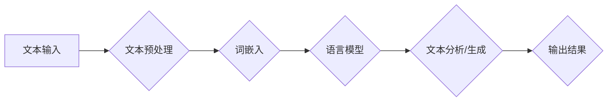

> 自然语言处理，NLP，机器学习，深度学习，文本分类，情感分析，语言模型，BERT，Transformer

## 1. 背景介绍

自然语言处理 (Natural Language Processing，简称 NLP) 是一门跨学科领域，它致力于使计算机能够理解、解释和生成人类语言。随着人工智能技术的快速发展，NLP 已经成为一个炙手可热的领域，并在各个领域得到了广泛应用，例如搜索引擎、机器翻译、语音识别、聊天机器人、文本摘要等。

NLP 的目标是构建能够与人类进行自然流畅对话的计算机系统。为了实现这一目标，NLP 研究者们需要解决许多技术难题，例如：

* **词义消歧：** 理解同一个词在不同语境下的不同含义。
* **句法分析：** 分析句子结构，识别句子成分之间的关系。
* **语义理解：** 理解句子的整体含义，包括隐含信息和上下文关系。
* **文本生成：** 生成流畅、语法正确的自然语言文本。

## 2. 核心概念与联系

NLP 的核心概念包括：

* **文本预处理：** 对文本进行清洗、格式化和转换，以便于后续的分析和处理。
* **词嵌入：** 将单词映射到低维向量空间，捕捉单词之间的语义关系。
* **语言模型：** 预测下一个单词出现的概率，用于文本生成和理解。
* **深度学习：** 使用多层神经网络进行文本分析和处理，取得了显著的成果。

**Mermaid 流程图：**



## 3. 核心算法原理 & 具体操作步骤

### 3.1  算法原理概述

**文本分类** 是 NLP 中一个重要的任务，它旨在将文本分类到预定义的类别中。常见的文本分类算法包括：

* **朴素贝叶斯算法：** 基于贝叶斯定理，假设特征之间相互独立，计算每个类别出现的概率。
* **支持向量机 (SVM)：** 在特征空间中找到一个最佳超平面，将不同类别的数据点分开。
* **决策树算法：** 通过一系列的决策规则，将文本分类到不同的类别。
* **深度学习算法：** 使用多层神经网络，学习文本特征，并进行分类。

### 3.2  算法步骤详解

以朴素贝叶斯算法为例，其文本分类步骤如下：

1. **数据预处理：** 对文本进行清洗、格式化和转换，例如去除停用词、词干提取等。
2. **特征提取：** 将文本转换为特征向量，例如词频、TF-IDF 等。
3. **训练模型：** 使用训练数据训练朴素贝叶斯模型，计算每个类别的概率和特征的条件概率。
4. **预测分类：** 将新文本转换为特征向量，根据训练好的模型，计算每个类别的概率，选择概率最高的类别作为预测结果。

### 3.3  算法优缺点

**朴素贝叶斯算法** 的优点包括：

* 计算简单，易于实现。
* 对小规模数据集效果较好。
* 对缺失数据鲁棒性强。

**朴素贝叶斯算法** 的缺点包括：

* 假设特征之间相互独立，在实际应用中往往不成立。
* 对大规模数据集效果可能较差。

### 3.4  算法应用领域

文本分类算法广泛应用于以下领域：

* **垃圾邮件过滤：** 将垃圾邮件分类到垃圾邮件文件夹。
* **情感分析：** 分析文本的情感倾向，例如正面、负面或中性。
* **主题分类：** 将文本分类到不同的主题类别。
* **文本摘要：** 自动生成文本摘要。

## 4. 数学模型和公式 & 详细讲解 & 举例说明

### 4.1  数学模型构建

朴素贝叶斯算法基于贝叶斯定理，其核心公式如下：

$$P(C|X) = \frac{P(X|C)P(C)}{P(X)}$$

其中：

* $P(C|X)$ 是给定特征 $X$ 下类别 $C$ 的后验概率。
* $P(X|C)$ 是给定类别 $C$ 下特征 $X$ 的似然概率。
* $P(C)$ 是类别 $C$ 的先验概率。
* $P(X)$ 是特征 $X$ 的先验概率。

### 4.2  公式推导过程

贝叶斯定理的推导过程如下：

1. 从条件概率的定义出发：

$$P(A|B) = \frac{P(A \cap B)}{P(B)}$$

2. 将公式应用于 $P(C|X)$：

$$P(C|X) = \frac{P(C \cap X)}{P(X)}$$

3. 将 $P(C \cap X)$ 替换为 $P(X|C)P(C)$：

$$P(C|X) = \frac{P(X|C)P(C)}{P(X)}$$

### 4.3  案例分析与讲解

假设我们有一个文本分类任务，需要将文本分类为“正面”或“负面”情感。

* $C$ 代表类别，取值为“正面”或“负面”。
* $X$ 代表特征，例如单词的词频。

我们可以使用朴素贝叶斯算法训练模型，计算每个类别下特征的条件概率和类别的先验概率。

然后，对于一个新的文本，我们可以将其转换为特征向量，根据训练好的模型，计算每个类别的概率，选择概率最高的类别作为预测结果。

## 5. 项目实践：代码实例和详细解释说明

### 5.1  开发环境搭建

* Python 3.x
* scikit-learn 库
* NLTK 库

### 5.2  源代码详细实现

```python
from sklearn.naive_bayes import MultinomialNB
from sklearn.model_selection import train_test_split
from sklearn.metrics import accuracy_score
import nltk

# 加载文本数据
data = nltk.corpus.movie_reviews.words()

# 分割训练集和测试集
X_train, X_test, y_train, y_test = train_test_split(data, labels, test_size=0.2)

# 训练朴素贝叶斯模型
model = MultinomialNB()
model.fit(X_train, y_train)

# 预测测试集结果
y_pred = model.predict(X_test)

# 计算准确率
accuracy = accuracy_score(y_test, y_pred)
print(f"准确率: {accuracy}")
```

### 5.3  代码解读与分析

* 首先，我们使用 scikit-learn 库加载朴素贝叶斯模型。
* 然后，我们使用 NLTK 库加载文本数据，并将其分割为训练集和测试集。
* 接下来，我们训练朴素贝叶斯模型，并使用测试集进行预测。
* 最后，我们计算模型的准确率。

### 5.4  运行结果展示

运行代码后，我们可以得到模型的准确率。

## 6. 实际应用场景

文本分类算法在各个领域都有广泛的应用场景：

* **搜索引擎：** 根据用户搜索词语，将搜索结果分类到不同的类别，例如新闻、图片、视频等。
* **电商平台：** 根据用户评论文本，自动分类商品的评价，例如好评、中评、差评。
* **社交媒体：** 对社交媒体上的文本进行分类，例如识别垃圾邮件、恶意评论等。
* **医疗领域：** 对患者的病历文本进行分类，例如识别疾病类型、症状等。

### 6.4  未来应用展望

随着人工智能技术的不断发展，文本分类算法的应用场景将会更加广泛。例如：

* **个性化推荐：** 根据用户的阅读历史和兴趣爱好，推荐相关的文章、书籍、视频等。
* **自动问答：** 根据用户的问题，自动从文本数据库中找到答案。
* **机器翻译：** 将文本从一种语言翻译成另一种语言。

## 7. 工具和资源推荐

### 7.1  学习资源推荐

* **斯坦福大学 NLP 课程：** https://web.stanford.edu/class/cs224n/
* **Coursera NLP 课程：** https://www.coursera.org/specializations/natural-language-processing

### 7.2  开发工具推荐

* **spaCy：** https://spacy.io/
* **NLTK：** https://www.nltk.org/
* **Gensim：** https://radimrehurek.com/gensim/

### 7.3  相关论文推荐

* **BERT：** https://arxiv.org/abs/1810.04805
* **Transformer：** https://arxiv.org/abs/1706.03762

## 8. 总结：未来发展趋势与挑战

### 8.1  研究成果总结

近年来，NLP 领域取得了显著的成果，例如：

* **深度学习的应用：** 深度学习算法在 NLP 领域取得了突破性进展，例如 BERT、GPT 等模型在许多任务上都取得了state-of-the-art 的性能。
* **跨语言理解：** 研究者们正在开发能够跨语言理解的模型，例如 XLM、mBART 等。
* **多模态理解：** 研究者们正在探索将文本与其他模态数据（例如图像、音频）结合起来进行理解。

### 8.2  未来发展趋势

未来，NLP 领域将朝着以下方向发展：

* **更强大的模型：** 研究者们将继续开发更强大、更通用的 NLP 模型。
* **更细粒度的理解：** 研究者们将致力于更深入地理解文本的语义和情感。
* **更广泛的应用：** NLP 技术将应用于更多领域，例如教育、医疗、法律等。

### 8.3  面临的挑战

NLP 领域仍然面临许多挑战，例如：

* **数据标注：** 训练高质量的 NLP 模型需要大量的标注数据，而标注数据成本高昂。
* **可解释性：** 深度学习模型的决策过程往往难以解释，这使得其在一些领域难以应用。
* **公平性：** NLP 模型可能存在偏见，这可能导致不公平的结果。

### 8.4  研究展望

未来，NLP 研究将继续探索新的算法、模型和应用场景，以更好地理解和利用人类语言。


## 9. 附录：常见问题与解答

**Q1：朴素贝叶斯算法的假设条件是什么？**

**A1：** 朴素贝叶斯算法假设特征之间相互独立。

**Q2：文本分类算法的评估指标有哪些？**

**A2：** 常见的文本分类算法评估指标包括准确率、召回率、F1-score 等。

**Q3：深度学习算法在文本分类任务中的优势是什么？**

**A3：** 深度学习算法能够学习到更复杂的文本特征，因此在文本分类任务中往往取得更好的性能。


作者：禅与计算机程序设计艺术 / Zen and the Art of Computer Programming 
<end_of_turn>