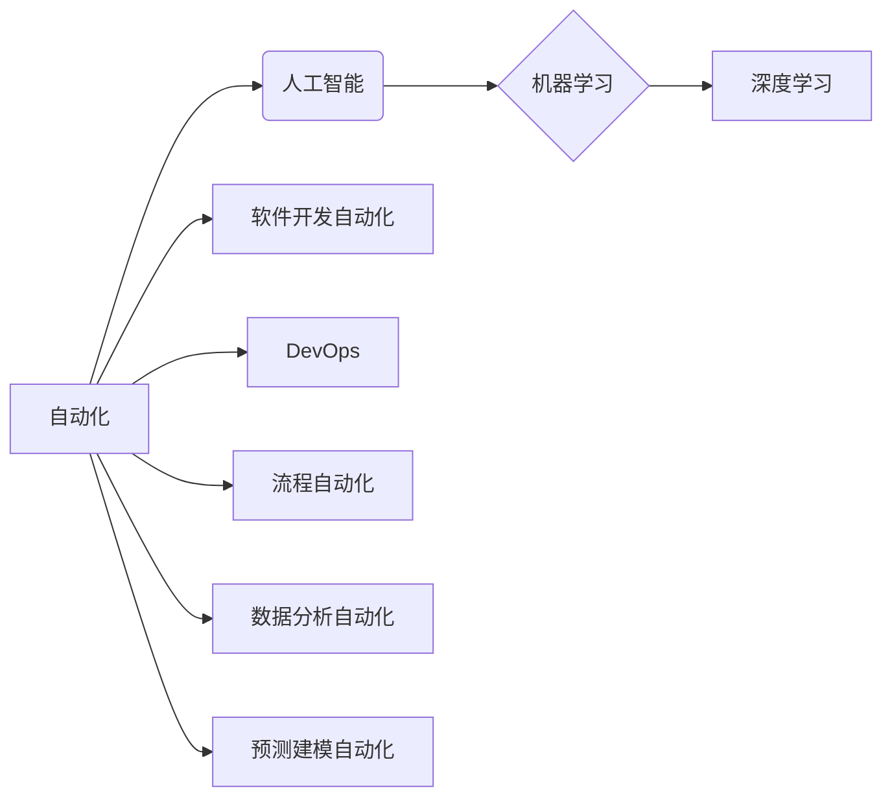

> 自动化、人工智能、机器学习、深度学习、软件开发、DevOps、流程自动化、数据分析、预测建模

## 1. 背景介绍

在当今科技飞速发展的时代，自动化已成为各行各业的热门话题，而计算领域也不例外。从软件开发到数据分析，从流程自动化到预测建模，自动化技术正在深刻地改变着我们工作和生活的方方面面。

随着人工智能（AI）和机器学习（ML）技术的不断发展，计算领域的自动化发展呈现出前所未有的势头。AI和ML算法能够学习和理解数据，并根据这些知识自动执行任务，从而极大地提高了效率和准确性。

## 2. 核心概念与联系

**2.1 自动化**

自动化是指通过程序、设备或系统自动执行重复性任务，减少人工干预的过程。

**2.2 人工智能 (AI)**

人工智能是指使机器能够像人类一样思考、学习和解决问题的能力。

**2.3 机器学习 (ML)**

机器学习是人工智能的一个子领域，它使机器能够从数据中学习，并根据学习到的知识进行预测或决策。

**2.4 深度学习 (DL)**

深度学习是机器学习的一个子领域，它使用多层神经网络来模拟人类大脑的学习过程。

**2.5 软件开发自动化**

软件开发自动化是指使用工具和技术自动执行软件开发过程中的各种任务，例如代码构建、测试、部署等。

**2.6 DevOps**

DevOps是一种软件开发和运维的文化和实践，它强调协作、自动化和持续交付。

**2.7 流程自动化**

流程自动化是指使用软件工具自动执行业务流程中的重复性任务，例如审批、数据录入等。

**2.8 数据分析自动化**

数据分析自动化是指使用工具和技术自动执行数据分析任务，例如数据清洗、数据挖掘、数据可视化等。

**2.9 预测建模自动化**

预测建模自动化是指使用机器学习算法自动构建预测模型，并根据模型预测未来趋势。

**2.10 核心概念联系**

以下Mermaid流程图展示了计算领域自动化核心概念之间的联系：



## 3. 核心算法原理 & 具体操作步骤

### 3.1 算法原理概述

机器学习算法的核心原理是通过学习数据中的模式和规律，从而能够对新的数据进行预测或分类。常见的机器学习算法包括：

* **监督学习:** 利用标记数据训练模型，例如分类和回归问题。
* **无监督学习:** 利用未标记数据发现数据中的隐藏结构，例如聚类和降维。
* **强化学习:** 通过试错学习，在环境中获得最大奖励。

### 3.2 算法步骤详解

以下以监督学习中的线性回归算法为例，详细说明其操作步骤：

1. **数据准备:** 收集和预处理数据，包括数据清洗、特征工程等。
2. **模型选择:** 选择合适的机器学习算法，例如线性回归。
3. **模型训练:** 使用训练数据训练模型，调整模型参数，使模型能够准确预测目标变量。
4. **模型评估:** 使用测试数据评估模型的性能，例如准确率、召回率等。
5. **模型部署:** 将训练好的模型部署到生产环境中，用于对新数据进行预测。

### 3.3 算法优缺点

**优点:**

* 能够自动学习数据中的模式和规律。
* 能够对新的数据进行预测或分类。
* 能够不断改进模型性能。

**缺点:**

* 需要大量的训练数据。
* 模型训练过程可能需要很长时间。
* 模型解释性较差。

### 3.4 算法应用领域

机器学习算法广泛应用于各个领域，例如：

* **图像识别:** 自动识别图像中的物体、场景等。
* **自然语言处理:** 自动理解和生成人类语言。
* **推荐系统:** 根据用户的历史行为推荐相关商品或服务。
* **欺诈检测:** 自动识别和预防欺诈行为。

## 4. 数学模型和公式 & 详细讲解 & 举例说明

### 4.1 数学模型构建

线性回归模型的数学模型如下：

$$
y = \theta_0 + \theta_1 x_1 + \theta_2 x_2 + ... + \theta_n x_n + \epsilon
$$

其中：

* $y$ 是目标变量。
* $x_1, x_2, ..., x_n$ 是特征变量。
* $\theta_0, \theta_1, ..., \theta_n$ 是模型参数。
* $\epsilon$ 是误差项。

### 4.2 公式推导过程

线性回归模型的目标是找到最佳的模型参数，使模型能够对目标变量进行最准确的预测。可以使用最小二乘法来求解模型参数。最小二乘法的原理是找到使模型预测值与实际值之间的误差平方和最小的参数值。

### 4.3 案例分析与讲解

假设我们想要预测房屋价格，特征变量包括房屋面积、房间数量、地理位置等。我们可以使用线性回归模型来建立房屋价格预测模型。

通过训练数据，我们可以得到模型参数，例如：

* $\theta_0 = 100000$
* $\theta_1 = 500$
* $\theta_2 = 10000$

这意味着，房屋面积每增加1平方米，价格会增加500元；房间数量每增加1个，价格会增加10000元。

## 5. 项目实践：代码实例和详细解释说明

### 5.1 开发环境搭建

* Python 3.x
* scikit-learn 库

### 5.2 源代码详细实现

```python
from sklearn.linear_model import LinearRegression
from sklearn.model_selection import train_test_split
import pandas as pd

# 加载数据
data = pd.read_csv('house_price.csv')

# 划分训练集和测试集
X = data[['area', 'rooms']]
y = data['price']
X_train, X_test, y_train, y_test = train_test_split(X, y, test_size=0.2, random_state=42)

# 创建线性回归模型
model = LinearRegression()

# 训练模型
model.fit(X_train, y_train)

# 预测测试集数据
y_pred = model.predict(X_test)

# 评估模型性能
from sklearn.metrics import mean_squared_error
mse = mean_squared_error(y_test, y_pred)
print(f'Mean Squared Error: {mse}')
```

### 5.3 代码解读与分析

* 首先，我们加载数据并划分训练集和测试集。
* 然后，我们创建线性回归模型并使用训练集训练模型。
* 接着，我们使用训练好的模型预测测试集数据。
* 最后，我们使用均方误差（MSE）来评估模型性能。

### 5.4 运行结果展示

运行代码后，会输出模型的均方误差值。MSE值越小，模型的预测性能越好。

## 6. 实际应用场景

### 6.1 软件开发自动化

* **代码构建:** 自动化代码编译、打包和部署流程。
* **代码测试:** 自动化单元测试、集成测试和系统测试。
* **持续交付:** 自动化代码发布和部署到生产环境。

### 6.2 DevOps

* **配置管理:** 自动化服务器配置和环境搭建。
* **监控和报警:** 自动化监控系统性能和报警异常情况。
* **日志管理:** 自动化收集、分析和存储系统日志。

### 6.3 流程自动化

* **审批流程:** 自动化审批流程，减少人工审批时间。
* **数据录入:** 自动化数据录入，提高数据录入效率。
* **报表生成:** 自动化报表生成，节省人力成本。

### 6.4 未来应用展望

随着人工智能和机器学习技术的不断发展，计算领域的自动化将更加广泛地应用于各个领域，例如：

* **自动驾驶:** 自动化驾驶汽车的决策和控制。
* **医疗诊断:** 自动化辅助医生进行疾病诊断。
* **金融风险管理:** 自动化识别和预防金融风险。

## 7. 工具和资源推荐

### 7.1 学习资源推荐

* **在线课程:** Coursera, edX, Udacity
* **书籍:**
    * 《Python机器学习》
    * 《深度学习》
    * 《人工智能：一种现代方法》

### 7.2 开发工具推荐

* **Python:** 广泛用于机器学习和数据分析。
* **scikit-learn:** Python机器学习库。
* **TensorFlow:** 深度学习框架。
* **PyTorch:** 深度学习框架。

### 7.3 相关论文推荐

* **《ImageNet Classification with Deep Convolutional Neural Networks》**
* **《Attention Is All You Need》**
* **《BERT: Pre-training of Deep Bidirectional Transformers for Language Understanding》**

## 8. 总结：未来发展趋势与挑战

### 8.1 研究成果总结

计算领域的自动化发展取得了显著成果，人工智能和机器学习算法在各个领域得到了广泛应用。

### 8.2 未来发展趋势

* **更强大的AI算法:** 发展更强大、更智能的AI算法，例如通用人工智能。
* **更广泛的应用场景:** 将AI技术应用于更多领域，例如医疗、教育、金融等。
* **更安全的自动化系统:** 确保自动化系统安全可靠，防止被恶意攻击。

### 8.3 面临的挑战

* **数据隐私和安全:** 如何保护数据隐私和安全，防止数据泄露。
* **算法偏见:** 如何避免算法产生偏见，确保公平公正。
* **伦理问题:** 如何解决自动化带来的伦理问题，例如工作岗位替代等。

### 8.4 研究展望

未来，计算领域的自动化研究将继续深入，探索更智能、更安全、更可持续的自动化解决方案。

## 9. 附录：常见问题与解答

**Q1: 自动化会取代人类工作吗？**

A1: 自动化可能会改变一些工作内容，但不会完全取代人类工作。自动化可以帮助人类完成重复性、低效的任务，从而释放人类精力去从事更创造性、更具挑战性的工作。

**Q2: 如何学习自动化技术？**

A2: 可以通过在线课程、书籍、实践项目等方式学习自动化技术。

**Q3: 自动化技术有哪些应用场景？**

A3: 自动化技术广泛应用于各个领域，例如软件开发、DevOps、流程自动化、数据分析等。


作者：禅与计算机程序设计艺术 / Zen and the Art of Computer Programming 
<end_of_turn>