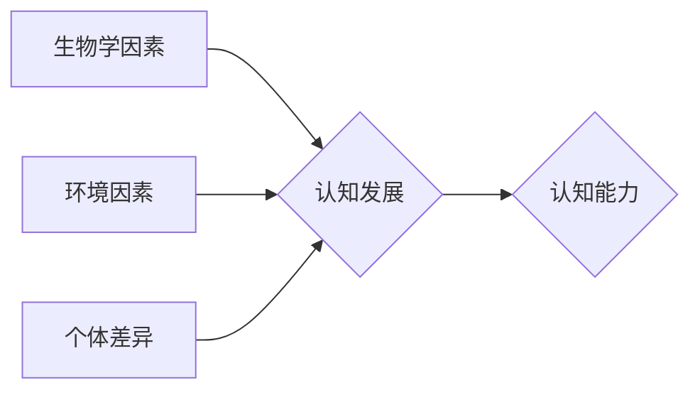

> 认知发展、阶段性模型、人工智能、机器学习、深度学习、神经网络、知识图谱、推理、决策

## 1. 背景介绍

认知发展是人工智能领域的核心议题之一。从早期基于规则的专家系统到如今的深度学习模型，人工智能的发展历程始终伴随着对认知能力的探索和模拟。然而，人类的认知能力是极其复杂的，它涉及感知、记忆、语言、推理、决策等多个方面，并且在个体发展过程中经历了不同的阶段。

理解认知发展的阶段性路径对于构建更智能、更接近人类认知的 AI 系统至关重要。本篇文章将探讨认知发展的阶段性路径模型，分析不同阶段的特点和关键能力，并探讨其在人工智能领域中的应用前景。

## 2. 核心概念与联系

认知发展是一个动态的过程，它涉及多个相互关联的概念和机制。

**2.1 核心概念**

* **认知:** 指人类对世界进行感知、理解、思考和解决问题的能力。
* **阶段性:** 指认知发展并非线性连续的，而是经历着不同的阶段，每个阶段都有其独特的特征和能力。
* **路径模型:** 指描述认知发展过程的模型，它可以帮助我们理解不同阶段的认知能力是如何形成和发展的。

**2.2 核心联系**

认知发展是一个复杂的过程，涉及多个方面相互作用。

* **生物学因素:** 遗传、神经发育等生物因素对认知发展起着基础作用。
* **环境因素:** 社会文化环境、教育经历等环境因素对认知发展有重要影响。
* **个体差异:** 每个个体在认知发展过程中都有其独特的轨迹和节奏。

**2.3  Mermaid 流程图**



## 3. 核心算法原理 & 具体操作步骤

**3.1 算法原理概述**

认知发展的阶段性路径模型通常采用基于行为的观察和实验数据，结合神经科学研究成果，构建描述不同阶段认知能力特征的模型。这些模型通常包含以下几个关键要素：

* **阶段划分:** 将认知发展划分为不同的阶段，每个阶段具有其独特的认知能力和发展特点。
* **能力描述:** 对每个阶段的认知能力进行详细描述，包括感知、记忆、语言、推理、决策等方面。
* **发展规律:** 描述不同阶段认知能力是如何形成和发展的，以及不同阶段之间是如何过渡的。

**3.2 算法步骤详解**

1. **数据收集:** 收集大量关于儿童认知发展的行为观察数据和实验数据。
2. **数据分析:** 使用统计学方法和机器学习算法对数据进行分析，识别不同阶段的认知能力特征。
3. **模型构建:** 基于分析结果，构建描述不同阶段认知能力特征的模型。
4. **模型验证:** 使用新的数据对模型进行验证，评估模型的准确性和可靠性。

**3.3 算法优缺点**

* **优点:** 能够提供对认知发展阶段性路径的系统性描述，为理解和模拟人类认知提供理论基础。
* **缺点:** 

    * 难以完全捕捉认知发展的复杂性，模型可能存在局限性。
    * 不同研究者对阶段划分和能力描述可能存在差异，导致模型的异质性。

**3.4 算法应用领域**

* **教育学:** 为教育教学提供理论依据，设计针对不同阶段儿童的教育方案。
* **心理学:** 帮助理解儿童认知发展过程中的异常现象，为儿童心理健康提供指导。
* **人工智能:** 为构建更智能、更接近人类认知的 AI 系统提供参考。

## 4. 数学模型和公式 & 详细讲解 & 举例说明

**4.1 数学模型构建**

认知发展的阶段性路径模型可以采用数学模型来描述不同阶段的认知能力特征。例如，可以利用概率论和统计学方法构建描述认知能力发展趋势的模型。

**4.2 公式推导过程**

假设认知能力发展可以用一个指数函数来描述，则可以推导出以下公式：

$$C(t) = C_0 * e^{kt}$$

其中：

* $C(t)$ 表示在时间 $t$ 时刻的认知能力水平。
* $C_0$ 表示初始认知能力水平。
* $k$ 表示认知能力发展速度。
* $t$ 表示时间。

**4.3 案例分析与讲解**

例如，假设一个儿童在 2 岁时开始学习语言，其初始语言能力水平为 $C_0 = 1$，语言能力发展速度为 $k = 0.2$。则在 5 岁时，其语言能力水平为：

$$C(5) = 1 * e^{0.2 * 5} \approx 1.49$$

这表明，在 5 岁时，该儿童的语言能力水平已经超过了初始水平。

## 5. 项目实践：代码实例和详细解释说明

**5.1 开发环境搭建**

本项目使用 Python 语言进行开发，所需的库包括 NumPy、Matplotlib 等。

**5.2 源代码详细实现**

```python
import numpy as np
import matplotlib.pyplot as plt

# 定义认知能力发展函数
def cognitive_development(C0, k, t):
  return C0 * np.exp(k * t)

# 设置初始条件
C0 = 1  # 初始认知能力水平
k = 0.2  # 认知能力发展速度
t = np.arange(0, 10, 0.1)  # 时间范围

# 计算认知能力水平
C = cognitive_development(C0, k, t)

# 绘制图形
plt.plot(t, C)
plt.xlabel('时间 (岁)')
plt.ylabel('认知能力水平')
plt.title('认知能力发展曲线')
plt.show()
```

**5.3 代码解读与分析**

该代码首先定义了一个认知能力发展函数，该函数接收初始认知能力水平、发展速度和时间作为输入，并返回相应的认知能力水平。然后，代码设置了初始条件，并使用 NumPy 库生成时间范围。最后，代码调用认知能力发展函数计算不同时间点的认知能力水平，并使用 Matplotlib 库绘制图形。

**5.4 运行结果展示**

运行该代码后，将生成一个认知能力发展曲线的图形，该曲线显示了认知能力随着时间的推移而逐渐增长的趋势。

## 6. 实际应用场景

认知发展的阶段性路径模型在多个领域都有实际应用场景。

**6.1 教育学**

* **个性化教学:** 根据学生的认知发展阶段，设计个性化的教学方案，提高学习效率。
* **学习障碍诊断:** 通过观察学生的认知发展轨迹，识别学习障碍的早期迹象，及时进行干预。

**6.2 心理学**

* **儿童心理健康评估:** 评估儿童的认知发展水平，判断其心理健康状况。
* **认知训练:** 设计针对不同认知能力的训练方案，帮助儿童提高认知能力。

**6.3 人工智能**

* **智能教育系统:** 开发能够根据学生的认知发展阶段提供个性化学习内容的智能教育系统。
* **聊天机器人:** 构建能够理解和回应人类语言的聊天机器人，使其更接近人类的自然语言交互能力。

**6.4 未来应用展望**

随着人工智能技术的不断发展，认知发展的阶段性路径模型将有更广泛的应用前景。例如，未来可能能够利用该模型开发出能够模拟人类认知能力的 AI 系统，用于解决更复杂的问题，例如科学研究、医疗诊断、艺术创作等。

## 7. 工具和资源推荐

**7.1 学习资源推荐**

* **书籍:**
    * 《认知心理学》
    * 《儿童发展心理学》
    * 《人工智能导论》

* **在线课程:**
    * Coursera: 人工智能
    * edX: 认知科学

**7.2 开发工具推荐**

* **Python:** 广泛应用于人工智能领域，拥有丰富的库和工具。
* **TensorFlow:** 深度学习框架，用于构建和训练神经网络模型。
* **PyTorch:** 深度学习框架，具有灵活性和易用性。

**7.3 相关论文推荐**

* **Piaget's Theory of Cognitive Development**
* **Vygotsky's Sociocultural Theory of Cognitive Development**
* **The Development of Language in Children**

## 8. 总结：未来发展趋势与挑战

**8.1 研究成果总结**

认知发展的阶段性路径模型为理解和模拟人类认知提供了重要的理论基础。通过对不同阶段认知能力特征的描述和分析，我们可以更好地理解认知发展的规律，并为构建更智能的 AI 系统提供参考。

**8.2 未来发展趋势**

未来，认知发展的阶段性路径模型将朝着以下方向发展：

* **更加细粒度的阶段划分:** 将认知发展阶段划分得更加细致，以便更好地描述不同阶段的认知能力差异。
* **更加精准的模型预测:** 利用更先进的机器学习算法和神经网络模型，提高模型的预测精度。
* **跨学科融合:** 将认知发展研究与其他学科，例如神经科学、心理学、教育学等进行融合，形成更加完整的认知发展理论体系。

**8.3 面临的挑战**

认知发展的阶段性路径模型仍然面临着一些挑战：

* **数据获取和分析:** 认知发展数据往往难以获取和分析，需要开发更加有效的收集和分析方法。
* **模型解释性:** 许多深度学习模型缺乏解释性，难以理解模型是如何做出决策的。
* **个体差异:** 每个个体的认知发展轨迹都存在差异，需要开发更加个性化的模型。

**8.4 研究展望**

尽管面临着挑战，但认知发展的阶段性路径模型仍然是一个充满希望的研究领域。随着人工智能技术的不断发展，相信未来我们将能够构建更加智能、更加接近人类认知的 AI 系统。

## 9. 附录：常见问题与解答

**9.1 常见问题**

* **认知发展阶段的划分标准是什么？**

* **如何评估认知能力水平？**

* **认知发展的阶段性路径模型如何应用于人工智能？**

**9.2 常见问题解答**

* 认知发展阶段的划分标准通常基于儿童的行为观察和实验数据，以及神经科学研究成果。

* 认知能力水平可以通过各种测试和评估方法来评估，例如智力测试、语言测试、记忆测试等。

* 认知发展的阶段性路径模型可以为人工智能系统的设计和开发提供参考，例如，可以根据学生的认知发展阶段，设计个性化的学习内容和教学方法。


作者：禅与计算机程序设计艺术 / Zen and the Art of Computer Programming 
<end_of_turn>