> 软件 2.0, 社会责任, 科技向善, 人工智能, 伦理, 可持续发展, 透明度, 隐私保护

## 1. 背景介绍

软件已经深刻地改变了我们的生活，从智能手机到自动驾驶汽车，再到医疗诊断和金融交易，软件无处不在。随着人工智能、大数据和云计算等技术的飞速发展，软件正进入一个新的时代——软件 2.0。

软件 2.0 具有以下特点：

* **智能化:** 软件能够学习、适应和自主决策，具备更强的智能能力。
* **连接性:** 软件能够连接各种设备和系统，形成一个庞大的网络生态系统。
* **个性化:** 软件能够根据用户的需求和喜好进行定制化，提供更个性化的服务。
* **数据驱动:** 软件能够利用海量数据进行分析和预测，提供更精准的决策支持。

然而，软件 2.0 的发展也带来了新的挑战和风险。例如，人工智能算法的偏见、数据隐私泄露、网络安全威胁等问题，都可能对社会造成负面影响。因此，我们需要认真思考软件 2.0 的社会责任，确保科技向善，造福人类。

## 2. 核心概念与联系

软件 2.0 的社会责任的核心概念包括：

* **伦理:** 软件的开发和应用必须遵循伦理道德规范，避免造成伤害或不公平。
* **透明度:** 软件的算法和决策过程应该透明可解释，让用户能够理解和信任。
* **隐私保护:** 软件应该保护用户的个人信息和隐私，避免滥用或泄露。
* **可持续发展:** 软件的开发和应用应该考虑环境和社会的影响，促进可持续发展。

这些概念相互关联，共同构成了软件 2.0 的社会责任框架。

```mermaid
graph TD
    A[伦理] --> B{透明度}
    B --> C{隐私保护}
    C --> D{可持续发展}
    A --> D
```



## 3. 核心算法原理 & 具体操作步骤

### 3.1  算法原理概述

在软件 2.0 中，人工智能算法扮演着至关重要的角色。例如，机器学习算法能够帮助软件自动学习和改进，深度学习算法能够帮助软件识别图像和语音，自然语言处理算法能够帮助软件理解和生成人类语言。

### 3.2  算法步骤详解

以机器学习算法为例，其基本步骤包括：

1. **数据收集和预处理:** 收集相关数据并进行清洗、转换和特征提取等预处理工作。
2. **模型选择:** 根据任务需求选择合适的机器学习模型，例如线性回归、逻辑回归、决策树、支持向量机等。
3. **模型训练:** 使用训练数据训练模型，调整模型参数，使模型能够准确地预测或分类。
4. **模型评估:** 使用测试数据评估模型的性能，例如准确率、召回率、F1-score等指标。
5. **模型部署:** 将训练好的模型部署到实际应用场景中，用于预测或分类新的数据。

### 3.3  算法优缺点

机器学习算法具有以下优点：

* **自动化:** 可以自动学习和改进，无需人工干预。
* **精准度:** 可以根据数据进行精准的预测或分类。
* **适应性:** 可以适应不断变化的数据环境。

但也存在以下缺点：

* **数据依赖:** 需要大量的数据进行训练，否则性能会下降。
* **黑盒效应:** 算法的决策过程难以解释，难以理解其背后的逻辑。
* **偏见问题:** 算法可能存在偏见，导致不公平的结果。

### 3.4  算法应用领域

机器学习算法广泛应用于各个领域，例如：

* **医疗诊断:** 辅助医生诊断疾病，预测患者的风险。
* **金融风险控制:** 识别欺诈交易，评估客户的信用风险。
* **个性化推荐:** 为用户推荐个性化的商品或服务。
* **自动驾驶:** 帮助车辆感知周围环境，做出驾驶决策。

## 4. 数学模型和公式 & 详细讲解 & 举例说明

### 4.1  数学模型构建

机器学习算法通常基于数学模型进行构建。例如，线性回归模型假设目标变量与输入变量之间存在线性关系，可以用以下公式表示：

$$y = w_0 + w_1x_1 + w_2x_2 + ... + w_nx_n + \epsilon$$

其中：

* $y$ 是目标变量
* $x_1, x_2, ..., x_n$ 是输入变量
* $w_0, w_1, w_2, ..., w_n$ 是模型参数
* $\epsilon$ 是误差项

### 4.2  公式推导过程

模型参数的学习过程通常使用梯度下降算法进行优化。梯度下降算法的目标是找到使损失函数最小化的模型参数。损失函数通常定义为预测值与真实值的差值。

### 4.3  案例分析与讲解

例如，假设我们想要预测房价，输入变量包括房屋面积、房间数量、地理位置等，目标变量是房价。我们可以使用线性回归模型进行预测。通过训练数据，模型会学习到各个输入变量对房价的影响，并得出相应的模型参数。

## 5. 项目实践：代码实例和详细解释说明

### 5.1  开发环境搭建

可以使用 Python 语言和相关的机器学习库，例如 scikit-learn，TensorFlow 或 PyTorch，进行项目实践。

### 5.2  源代码详细实现

```python
from sklearn.linear_model import LinearRegression
from sklearn.model_selection import train_test_split
from sklearn.metrics import mean_squared_error

# 加载数据
data = ...

# 将数据分为训练集和测试集
X_train, X_test, y_train, y_test = train_test_split(data.drop('price', axis=1), data['price'], test_size=0.2)

# 创建线性回归模型
model = LinearRegression()

# 训练模型
model.fit(X_train, y_train)

# 预测测试集数据
y_pred = model.predict(X_test)

# 计算模型性能
mse = mean_squared_error(y_test, y_pred)
print(f'Mean Squared Error: {mse}')
```

### 5.3  代码解读与分析

这段代码演示了如何使用 scikit-learn 库进行线性回归模型的训练和预测。

* `train_test_split` 函数将数据分为训练集和测试集。
* `LinearRegression()` 函数创建线性回归模型。
* `fit()` 函数训练模型，使用训练数据学习模型参数。
* `predict()` 函数使用训练好的模型预测测试集数据。
* `mean_squared_error()` 函数计算模型性能，使用均方误差作为评价指标。

### 5.4  运行结果展示

运行结果会显示测试集数据的预测值和均方误差。

## 6. 实际应用场景

软件 2.0 的社会责任在各个领域都有着重要的应用场景：

### 6.1  医疗保健

* **疾病诊断:** 使用人工智能算法辅助医生诊断疾病，提高诊断准确率。
* **个性化治疗:** 根据患者的基因信息和生活习惯，制定个性化的治疗方案。
* **药物研发:** 使用机器学习算法加速药物研发，降低研发成本。

### 6.2  教育

* **个性化学习:** 根据学生的学习进度和能力，提供个性化的学习内容和辅导。
* **智能评估:** 使用人工智能算法自动批改作业，提高评估效率。
* **在线教育:** 提供更加丰富的在线教育资源和服务。

### 6.3  金融

* **欺诈检测:** 使用机器学习算法识别欺诈交易，保护用户资金安全。
* **风险管理:** 使用人工智能算法评估客户的信用风险，降低金融机构的风险。
* **个性化理财:** 根据用户的风险偏好和财务目标，提供个性化的理财建议。

### 6.4  未来应用展望

随着人工智能、大数据和云计算等技术的不断发展，软件 2.0 的社会责任将得到更广泛的应用，例如：

* **智能城市:** 使用人工智能算法优化城市交通、能源管理、环境保护等方面。
* **可持续发展:** 使用软件技术促进可持续发展，例如减少碳排放、保护生物多样性。
* **人类福祉:** 使用软件技术解决人类面临的各种挑战，例如疾病、贫困、教育等。

## 7. 工具和资源推荐

### 7.1  学习资源推荐

* **在线课程:** Coursera, edX, Udacity 等平台提供丰富的机器学习和人工智能课程。
* **书籍:** 《深度学习》、《机器学习实战》等书籍是学习机器学习和人工智能的经典教材。
* **开源项目:** TensorFlow, PyTorch 等开源项目提供了丰富的代码示例和学习资源。

### 7.2  开发工具推荐

* **Python:** Python 语言是机器学习和人工智能开发的常用语言。
* **Jupyter Notebook:** Jupyter Notebook 是一个交互式编程环境，方便进行机器学习和数据分析。
* **scikit-learn:** scikit-learn 是一个常用的机器学习库，提供各种机器学习算法和工具。

### 7.3  相关论文推荐

* **《ImageNet Classification with Deep Convolutional Neural Networks》:** 这篇论文介绍了深度卷积神经网络在图像分类方面的应用。
* **《Attention Is All You Need》:** 这篇论文介绍了 Transformer 模型，一种新的序列建模方法，在自然语言处理领域取得了突破性进展。

## 8. 总结：未来发展趋势与挑战

### 8.1  研究成果总结

软件 2.0 的发展取得了显著成果，人工智能算法在各个领域得到了广泛应用。

### 8.2  未来发展趋势

未来，软件 2.0 将朝着更加智能化、个性化、连接化和可持续化的方向发展。

* **更强大的人工智能算法:** 随着算法和计算能力的提升，人工智能算法将更加强大，能够解决更复杂的问题。
* **更广泛的应用场景:** 软件 2.0 将应用于更多领域，例如医疗保健、教育、金融、交通运输等。
* **更注重用户体验:** 软件 2.0 将更加注重用户体验，提供更加个性化和人性化的服务。

### 8.3  面临的挑战

软件 2.0 的发展也面临着一些挑战：

* **伦理问题:** 人工智能算法的决策过程可能存在偏见，需要解决伦理问题，确保算法公平公正。
* **隐私保护问题:** 软件 2.0 需要处理大量用户数据，需要加强隐私保护，防止数据泄露。
* **安全问题:** 软件 2.0 系统可能面临安全威胁，需要加强安全防护，防止恶意攻击。

### 8.4  研究展望

未来，我们需要继续研究和探索软件 2.0 的社会责任，确保科技向善，造福人类。

## 9. 附录：常见问题与解答

### 9.1  什么是软件 2.0？

软件 2.0 指的是智能化、连接化、个性化和数据驱动的下一代软件。

### 9.2  软件 2.0 的社会责任是什么？

软件 2.0 的社会责任包括伦理、透明度、隐私保护和可持续发展等方面。

### 9.3  软件 2.0 的发展趋势是什么？

软件 2.0 将朝着更加智能化、个性化、连接化和可持续化的方向发展。

### 9.4  软件 2.0 面临哪些挑战？

软件 2.0 面临伦理问题、隐私保护问题和安全问题等挑战。


作者：禅与计算机程序设计艺术 / Zen and the Art of Computer Programming 
<end_of_turn>