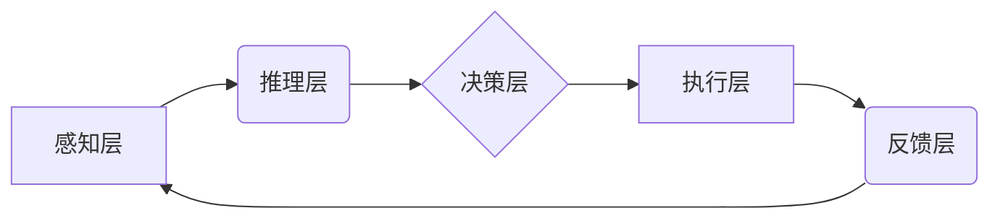

> AI Agent, 智能代理, 强化学习, 自然语言处理, 机器学习, 决策推理, 知识图谱, 

## 1. 背景介绍

人工智能（AI）技术近年来发展迅速，从语音识别、图像识别到自然语言处理等领域取得了突破性进展。然而，传统的AI模型大多是静态的，缺乏自主学习和决策的能力。随着技术的不断进步，AI Agent 作为人工智能的下一个风口，逐渐成为研究和应用的热点。

AI Agent是指能够感知环境、做出决策并与环境交互的智能实体。它拥有自主学习、推理和决策的能力，能够在复杂环境中执行任务，并根据反馈信息不断优化自身行为。与传统的AI模型相比，AI Agent更具灵活性、适应性和自主性，能够更好地应对现实世界中的复杂挑战。

## 2. 核心概念与联系

**2.1 AI Agent 的核心概念**

* **感知:** AI Agent 通过传感器获取环境信息，例如图像、文本、音频等。
* **推理:** AI Agent 基于感知到的信息进行逻辑推理，分析环境状态和目标。
* **决策:** AI Agent 根据推理结果做出决策，选择最优行动方案。
* **执行:** AI Agent 执行决策，与环境交互，改变环境状态。
* **学习:** AI Agent 通过经验积累和反馈信息，不断优化自身行为策略。

**2.2 AI Agent 与其他技术的联系**

AI Agent 的发展离不开其他人工智能技术的支持，例如：

* **机器学习:**  AI Agent 利用机器学习算法从数据中学习，提高感知、推理和决策能力。
* **深度学习:** 深度学习算法能够处理复杂的数据模式，为 AI Agent 提供更强大的感知和理解能力。
* **自然语言处理:** 自然语言处理技术使 AI Agent能够理解和生成人类语言，实现与人类的自然交互。
* **知识图谱:** 知识图谱提供结构化的知识表示，帮助 AI Agent 理解语义关系，进行更精准的推理和决策。

**2.3 AI Agent 架构**



## 3. 核心算法原理 & 具体操作步骤

**3.1 算法原理概述**

AI Agent 的核心算法主要包括强化学习、决策树、贝叶斯网络等。

* **强化学习:**  AI Agent 通过与环境交互，获得奖励和惩罚信号，不断调整行为策略，以最大化累积奖励。
* **决策树:**  决策树是一种树形结构的算法，用于表示决策规则，根据输入特征，逐步决策最终结果。
* **贝叶斯网络:** 贝叶斯网络是一种概率图模型，用于表示变量之间的依赖关系，根据已知信息，推断未知变量的概率分布。

**3.2 算法步骤详解**

以强化学习为例，其基本步骤如下：

1. **环境建模:** 建立 AI Agent 与环境的交互模型，定义状态空间、动作空间和奖励函数。
2. **策略初始化:**  初始化 AI Agent 的行为策略，例如随机策略或贪婪策略。
3. **环境交互:** AI Agent 与环境交互，根据当前状态选择动作，并获得环境反馈信息（奖励和下一个状态）。
4. **策略更新:**  根据环境反馈信息，更新 AI Agent 的行为策略，以提高累积奖励。
5. **重复步骤3-4:**  重复以上步骤，直到 AI Agent 的行为策略收敛或达到预设目标。

**3.3 算法优缺点**

* **强化学习:** 优点：能够学习复杂的行为策略，适应动态环境；缺点：训练过程复杂，需要大量数据和计算资源。
* **决策树:** 优点：易于理解和解释，训练速度快；缺点：容易过拟合，难以处理高维数据。
* **贝叶斯网络:** 优点：能够处理不确定性，推断概率分布；缺点：构建贝叶斯网络需要大量专家知识。

**3.4 算法应用领域**

AI Agent 广泛应用于以下领域：

* **机器人控制:**  使机器人能够自主导航、避障、执行任务。
* **游戏 AI:**  开发更智能的游戏对手，提高游戏体验。
* **自动驾驶:**  实现车辆的自主驾驶功能。
* **个性化推荐:**  根据用户的行为和偏好，提供个性化的产品和服务推荐。
* **医疗诊断:**  辅助医生进行疾病诊断和治疗方案制定。

## 4. 数学模型和公式 & 详细讲解 & 举例说明

**4.1 数学模型构建**

AI Agent 可以用马尔可夫决策过程 (MDP) 来建模。MDP 由以下五个要素组成：

* **状态空间 (S):** 环境可能存在的全部状态。
* **动作空间 (A):** AI Agent 可以执行的所有动作。
* **转移概率 (P):** 从一个状态执行一个动作后转移到另一个状态的概率。
* **奖励函数 (R):**  AI Agent 在某个状态执行某个动作后获得的奖励。
* **折扣因子 (γ):**  未来奖励的权重因子。

**4.2 公式推导过程**

强化学习的目标是找到一个最优策略 π，使得 AI Agent 在所有状态下执行该策略，能够获得最大的累积奖励。最优策略可以通过 Bellman 方程来求解：

$$
V^*(s) = \max_a \sum_{s'} P(s'|s,a) [R(s,a,s') + \gamma V^*(s')]
$$

其中：

* $V^*(s)$ 是状态 $s$ 的最优价值函数。
* $a$ 是 AI Agent 在状态 $s$ 可以执行的动作。
* $s'$ 是状态 $s$ 执行动作 $a$ 后可能转移到的状态。
* $R(s,a,s')$ 是 AI Agent 在状态 $s$ 执行动作 $a$ 后转移到状态 $s'$ 获得的奖励。

**4.3 案例分析与讲解**

例如，在一个简单的迷宫环境中，AI Agent 的目标是找到通往出口的最短路径。我们可以用 MDP 来建模这个环境，其中状态空间是迷宫中的所有位置，动作空间是上下左右四个方向，奖励函数是到达出口获得最大奖励，其他状态获得零奖励。通过 Bellman 方程，我们可以求解出最优价值函数，并根据价值函数确定最优策略，引导 AI Agent 找到最短路径。

## 5. 项目实践：代码实例和详细解释说明

**5.1 开发环境搭建**

* Python 3.x
* TensorFlow 或 PyTorch
* OpenAI Gym

**5.2 源代码详细实现**

```python
import gym
import numpy as np

# 定义环境
env = gym.make('CartPole-v1')

# 定义学习率
learning_rate = 0.1

# 定义 Q-表
q_table = np.zeros((env.observation_space.n, env.action_space.n))

# 训练循环
for episode in range(1000):
    # 初始化状态
    state = env.reset()

    # 训练过程
    done = False
    while not done:
        # 选择动作
        action = np.argmax(q_table[state])

        # 执行动作
        next_state, reward, done, _ = env.step(action)

        # 更新 Q-表
        q_table[state, action] = q_table[state, action] + learning_rate * (reward + 0.9 * np.max(q_table[next_state]) - q_table[state, action])

        # 更新状态
        state = next_state

    # 打印进度
    print(f"Episode {episode+1} completed")

# 测试
state = env.reset()
while True:
    # 选择动作
    action = np.argmax(q_table[state])

    # 执行动作
    next_state, reward, done, _ = env.step(action)

    # 显示环境
    env.render()

    # 更新状态
    state = next_state

    # 结束游戏
    if done:
        break

env.close()
```

**5.3 代码解读与分析**

这段代码实现了一个简单的 Q-学习算法，用于训练一个 CartPole 问题中的 AI Agent。

* Q-表存储了每个状态下每个动作的价值估计。
* 学习率控制了 Q-表更新的速度。
* 训练循环中，AI Agent 会根据 Q-表选择动作，执行动作，并根据环境反馈信息更新 Q-表。
* 测试阶段，AI Agent 会根据训练好的 Q-表选择动作，并与环境交互，展示其学习到的行为。

**5.4 运行结果展示**

运行代码后，AI Agent 会在 CartPole 环境中学习，并最终能够稳定地平衡杆子。

## 6. 实际应用场景

**6.1 智能客服**

AI Agent 可以作为智能客服，通过自然语言处理技术理解用户需求，并提供准确的回复和解决方案。

**6.2 个性化推荐**

AI Agent 可以根据用户的行为和偏好，推荐个性化的产品、服务和内容。

**6.3 自动化办公**

AI Agent 可以自动化办公流程，例如处理邮件、安排会议、生成报告等，提高工作效率。

**6.4 医疗辅助诊断**

AI Agent 可以辅助医生进行疾病诊断，分析患者的症状和检查结果，提供诊断建议。

**6.5 金融风险管理**

AI Agent 可以分析市场数据和交易行为，识别潜在的金融风险，并采取相应的措施进行风险控制。

**6.6 未来应用展望**

随着 AI 技术的不断发展，AI Agent 将在更多领域得到应用，例如：

* **自动驾驶:**  实现更安全、更智能的自动驾驶系统。
* **工业自动化:**  提高工业生产效率和安全性。
* **教育辅助:**  提供个性化的学习体验和教学辅助。
* **科学研究:**  加速科学发现和技术创新。

## 7. 工具和资源推荐

**7.1 学习资源推荐**

* **书籍:**
    * 《Reinforcement Learning: An Introduction》 by Richard S. Sutton and Andrew G. Barto
    * 《Artificial Intelligence: A Modern Approach》 by Stuart Russell and Peter Norvig
* **在线课程:**
    * Coursera: Reinforcement Learning Specialization
    * Udacity: Artificial Intelligence Nanodegree
* **开源库:**
    * TensorFlow
    * PyTorch
    * OpenAI Gym

**7.2 开发工具推荐**

* **编程语言:** Python
* **机器学习框架:** TensorFlow, PyTorch
* **环境模拟器:** OpenAI Gym
* **数据可视化工具:** Matplotlib, Seaborn

**7.3 相关论文推荐**

* Deep Reinforcement Learning: An Overview
* Proximal Policy Optimization Algorithms
* Asynchronous Methods for Deep Reinforcement Learning

## 8. 总结：未来发展趋势与挑战

**8.1 研究成果总结**

近年来，AI Agent 研究取得了显著进展，例如：

* 强化学习算法取得了突破性进展，能够解决更复杂的任务。
* 深度学习技术为 AI Agent 提供了更强大的感知和理解能力。
* 知识图谱技术帮助 AI Agent 更好地理解语义关系，进行更精准的推理和决策。

**8.2 未来发展趋势**

* **更智能的 AI Agent:**  AI Agent 将更加智能，能够自主学习、推理和决策，并适应更复杂的环境。
* **更广泛的应用场景:**  AI Agent 将应用于更多领域，例如自动驾驶、医疗保健、教育等。
* **更安全的 AI Agent:**  研究人员将更加关注 AI Agent 的安全性、可靠性和可解释性。

**8.3 面临的挑战**

* **数据获取和标注:**  训练 AI Agent 需要大量数据，而获取和标注高质量数据仍然是一个挑战。
* **算法复杂度:**  一些 AI Agent 算法非常复杂，难以理解和调试。
* **伦理问题:**  AI Agent 的发展也带来了一些伦理问题，例如算法