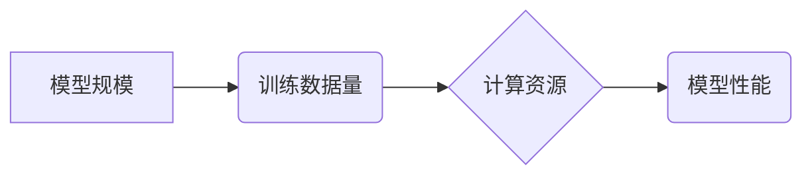

> AI 大模型, Scaling Law, 模型规模, 训练数据, 计算资源, 性能提升, 泛化能力, 效率优化

## 1. 背景介绍

近年来，深度学习在人工智能领域取得了显著进展，其中大规模人工智能模型（AI模型）的出现更是推动了这一领域的飞速发展。从 AlphaGo 到 GPT-3，这些模型的规模不断扩大，性能也随之提升。然而，模型规模的增长并非一帆风顺，它也带来了新的挑战，例如训练成本的增加和资源消耗的巨大。

Scaling Law 作为一种描述模型规模与性能之间关系的理论，为我们理解和优化大模型训练提供了新的视角。它揭示了模型规模、训练数据量、计算资源等因素对模型性能的影响，并指出了提升模型性能的潜在方向。

## 2. 核心概念与联系

Scaling Law 指的是模型性能随着模型规模、训练数据量和计算资源的增加而呈指数级或超线性增长。

**核心概念：**

* **模型规模:** 指模型参数数量，通常用百万（M）、亿（B）或万亿（T）表示。
* **训练数据量:** 指用于训练模型的数据量，通常用 GB、TB 或 PB 表示。
* **计算资源:** 指用于训练模型的计算能力，通常用 GPU 或 TPU 表示。

**架构流程图:**



**核心联系:**

模型规模、训练数据量和计算资源是相互关联的，它们共同影响模型性能。

* **模型规模:** 模型规模越大，模型的表达能力越强，能够学习更复杂的模式，从而提升模型性能。
* **训练数据量:** 训练数据量越大，模型能够学习到的知识和规律越多，从而提升模型的泛化能力和准确性。
* **计算资源:** 计算资源决定了模型训练的速度和效率，充足的计算资源可以加速模型训练，从而缩短训练时间和降低成本。

## 3. 核心算法原理 & 具体操作步骤

### 3.1  算法原理概述

Scaling Law 的核心算法原理是基于深度学习模型的训练过程。深度学习模型的训练过程可以看作是一个优化问题，目标是找到最优的参数值，使得模型在训练数据上表现最佳。

Scaling Law 认为，模型性能随着模型规模、训练数据量和计算资源的增加而呈指数级或超线性增长，这可以通过以下几个方面解释：

* **参数数量:** 模型参数数量越多，模型的表达能力越强，能够学习更复杂的模式。
* **数据容量:** 训练数据量越大，模型能够学习到的知识和规律越多，从而提升模型的泛化能力和准确性。
* **计算能力:** 计算资源决定了模型训练的速度和效率，充足的计算资源可以加速模型训练，从而缩短训练时间和降低成本。

### 3.2  算法步骤详解

1. **数据预处理:** 将原始数据进行清洗、转换和格式化，使其适合模型训练。
2. **模型构建:** 根据任务需求选择合适的模型架构，并初始化模型参数。
3. **模型训练:** 使用训练数据训练模型，通过反向传播算法更新模型参数，使得模型在训练数据上表现最佳。
4. **模型评估:** 使用测试数据评估模型的性能，例如准确率、召回率和 F1-score 等。
5. **模型调优:** 根据模型评估结果，调整模型参数、训练策略或数据增强方法，以提升模型性能。

### 3.3  算法优缺点

**优点:**

* **性能提升:** Scaling Law 理论表明，模型规模、训练数据量和计算资源的增加可以显著提升模型性能。
* **泛化能力增强:** 更多的训练数据可以帮助模型学习更广泛的知识和规律，从而提升模型的泛化能力。
* **应用范围广:** Scaling Law 适用于各种类型的深度学习模型，例如图像识别、自然语言处理和语音识别等。

**缺点:**

* **成本高昂:** 训练大型模型需要大量的计算资源和时间，成本较高。
* **数据依赖:** 模型性能很大程度上依赖于训练数据的质量和数量，数据不足或数据质量低会影响模型性能。
* **可解释性差:** 大型模型的内部机制复杂，难以解释模型的决策过程。

### 3.4  算法应用领域

Scaling Law 理论在以下领域具有广泛的应用:

* **计算机视觉:** 图像识别、目标检测、图像分割等。
* **自然语言处理:** 机器翻译、文本摘要、问答系统等。
* **语音识别:** 语音转文本、语音合成等。
* **药物研发:** 药物发现、药物设计等。
* **金融科技:** 风险评估、欺诈检测等。

## 4. 数学模型和公式 & 详细讲解 & 举例说明

### 4.1  数学模型构建

Scaling Law 通常用以下数学模型来描述模型性能与模型规模之间的关系:

$$
\text{Performance} \propto \text{Model Size}^{\alpha}
$$

其中，Performance 表示模型性能，Model Size 表示模型规模，α 是一个常数，代表模型规模对性能的影响程度。

### 4.2  公式推导过程

该公式的推导过程通常基于大量的实验数据和统计分析。通过分析不同规模的模型在相同数据集上的性能表现，可以得到 α 的值。

### 4.3  案例分析与讲解

例如，一些研究表明，在图像识别任务中，模型性能随着模型规模的增加而呈超线性增长，即 α > 1。这意味着，模型规模的增加对性能提升的影响比线性增长更大。

## 5. 项目实践：代码实例和详细解释说明

### 5.1  开发环境搭建

* 操作系统: Ubuntu 20.04
* Python 版本: 3.8
* 深度学习框架: PyTorch 1.8

### 5.2  源代码详细实现

```python
import torch
import torch.nn as nn

class SimpleModel(nn.Module):
    def __init__(self, input_size, hidden_size, output_size):
        super(SimpleModel, self).__init__()
        self.linear1 = nn.Linear(input_size, hidden_size)
        self.relu = nn.ReLU()
        self.linear2 = nn.Linear(hidden_size, output_size)

    def forward(self, x):
        x = self.linear1(x)
        x = self.relu(x)
        x = self.linear2(x)
        return x

# 模型参数
input_size = 10
hidden_size = 50
output_size = 2

# 实例化模型
model = SimpleModel(input_size, hidden_size, output_size)

# 定义损失函数和优化器
criterion = nn.CrossEntropyLoss()
optimizer = torch.optim.Adam(model.parameters(), lr=0.001)

# 训练数据
# ...

# 训练循环
for epoch in range(num_epochs):
    for batch_idx, (data, target) in enumerate(train_loader):
        # 前向传播
        output = model(data)
        # 计算损失
        loss = criterion(output, target)
        # 反向传播
        optimizer.zero_grad()
        loss.backward()
        # 更新参数
        optimizer.step()

# 测试模型
# ...
```

### 5.3  代码解读与分析

* 代码首先定义了一个简单的深度学习模型，包含两层全连接层和一个 ReLU 激活函数。
* 然后定义了损失函数和优化器，用于训练模型。
* 训练循环中，模型会对训练数据进行前向传播，计算损失，并使用反向传播算法更新模型参数。
* 最后，可以使用测试数据评估模型的性能。

### 5.4  运行结果展示

训练完成后，可以将模型的性能指标，例如准确率、召回率和 F1-score 等，展示出来，以评估模型的训练效果。

## 6. 实际应用场景

### 6.1  图像识别

* **人脸识别:** 用于解锁手机、验证身份、监控安全等。
* **物体检测:** 用于自动驾驶、安防监控、医疗影像分析等。
* **图像分类:** 用于电商商品分类、图片搜索、内容推荐等。

### 6.2  自然语言处理

* **机器翻译:** 将一种语言翻译成另一种语言。
* **文本摘要:** 自动生成文本的简短摘要。
* **问答系统:** 能够理解用户的问题并给出准确的答案。

### 6.3  语音识别

* **语音转文本:** 将语音转换为文本。
* **语音合成:** 将文本转换为语音。
* **语音助手:** 例如 Siri、Alexa 和 Google Assistant 等。

### 6.4  未来应用展望

随着模型规模和训练数据量的不断增长，AI 大模型的应用场景将更加广泛，例如：

* **个性化教育:** 根据学生的学习情况提供个性化的学习方案。
* **医疗诊断:** 辅助医生进行疾病诊断和治疗方案制定。
* **科学研究:** 加速科学研究的进程，例如药物研发、材料科学等。

## 7. 工具和资源推荐

### 7.1  学习资源推荐

* **书籍:**
    * Deep Learning by Ian Goodfellow, Yoshua Bengio, and Aaron Courville
    * Hands-On Machine Learning with Scikit-Learn, Keras & TensorFlow by Aurélien Géron
* **在线课程:**
    * Stanford CS231n: Convolutional Neural Networks for Visual Recognition
    * Deep Learning Specialization by Andrew Ng on Coursera

### 7.2  开发工具推荐

* **深度学习框架:** PyTorch, TensorFlow, Keras
* **云计算平台:** Google Cloud Platform, Amazon Web Services, Microsoft Azure

### 7.3  相关论文推荐

* Scaling Laws for Neural Language Models by Kaplan et al.
* On the Dangers of Stochastic Parrots: Can Language Models Be Too Big? by Bender et al.

## 8. 总结：未来发展趋势与挑战

### 8.1  研究成果总结

Scaling Law 理论为我们理解和优化大模型训练提供了新的视角，并指出了提升模型性能的潜在方向。

### 8.2  未来发展趋势

* **模型规模的进一步扩大:** 随着计算资源的不断发展，模型规模将继续扩大，从而提升模型性能。
* **训练数据量的增加:** 更多的训练数据将帮助模型学习更广泛的知识和规律，从而提升模型的泛化能力。
* **算法和架构的创新:** 研究人员将继续探索新的算法和模型架构，以提高模型的效率和性能。

### 8.3  面临的挑战

* **计算资源的限制:** 训练大型模型需要大量的计算资源，这对于资源有限的机构或个人来说是一个挑战。
* **数据安全和隐私问题:** 训练大型模型需要大量的训练数据，这可能会带来数据安全和隐私问题。
* **模型可解释性和公平性:** 大型模型的内部机制复杂，难以解释模型的决策过程，这可能会导致模型的不可解释性和公平性问题。

### 8.4  研究展望

未来，研究人员将继续探索 Scaling Law 的应用，并解决其面临的挑战，以推动人工智能技术的进一步发展。

## 9. 附录：常见问题与解答

* **Q1: Scaling Law 适用于所有类型的深度学习模型吗？**

* **A1:** 理论上，Scaling Law 适用于所有类型的深度学习模型，但其效果可能因模型类型和任务而异。

* **Q2: 如何确定模型规模的最佳值？**

* **A2:** 模型规模的最佳值取决于多种因素，例如任务需求、训练数据量和计算资源。可以通过实验和分析来确定最佳值。

* **Q3: 如何解决数据安全和隐私问题？**

* **A3:** 可以采用数据加密、匿名化和联邦学习等技术来解决数据安全和隐私问题。


作者：禅与计算机程序设计艺术 / Zen and the Art of Computer Programming 
<end_of_turn>