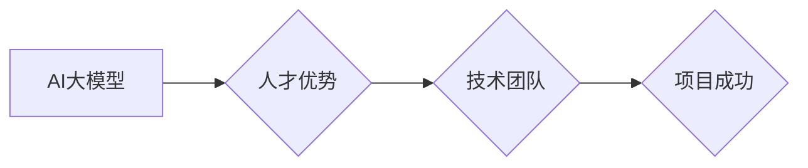

> AI大模型，人才优势，创业，技术团队，人才培养，知识共享，项目管理

## 1. 背景介绍

近年来，人工智能（AI）技术蓬勃发展，特别是大模型的涌现，为各行各业带来了革命性的变革。从自然语言处理到计算机视觉，从药物研发到金融预测，AI大模型正在深刻地改变着我们的生活和工作方式。

与此同时，AI大模型的开发和应用也面临着巨大的挑战，其中人才短缺是制约其发展的关键因素。如何有效利用人才优势，构建一支高素质的AI技术团队，成为AI大模型创业的关键所在。

## 2. 核心概念与联系

**2.1 AI大模型**

AI大模型是指在海量数据上训练，拥有强大泛化能力和学习能力的深度学习模型。它们通常具有以下特点：

* **规模庞大:** 参数数量巨大，往往包含数十亿甚至数千亿个参数。
* **多任务学习:** 可以胜任多种任务，例如文本生成、图像识别、语音合成等。
* **迁移学习:** 可以将已学习到的知识迁移到新的任务和领域。

**2.2 人才优势**

人才优势是指企业拥有的优秀人才资源，包括技术能力、经验积累、创新精神等方面的优势。

**2.3 联系**

AI大模型的开发和应用需要大量具备深度学习、机器学习、数据科学等专业知识和技能的人才。而人才优势则是企业在AI大模型创业中取得成功的关键因素。

**2.4  Mermaid 流程图**



## 3. 核心算法原理 & 具体操作步骤

**3.1 算法原理概述**

AI大模型的训练主要基于深度学习算法，例如Transformer、BERT、GPT等。这些算法通过多层神经网络结构，学习数据中的复杂模式和关系，从而实现对数据的理解和预测。

**3.2 算法步骤详解**

1. **数据预处理:** 收集和清洗数据，将其转换为模型可理解的格式。
2. **模型构建:** 根据任务需求选择合适的深度学习模型架构。
3. **模型训练:** 使用训练数据训练模型，调整模型参数，使其能够准确地预测目标输出。
4. **模型评估:** 使用测试数据评估模型的性能，例如准确率、召回率、F1-score等。
5. **模型部署:** 将训练好的模型部署到实际应用场景中。

**3.3 算法优缺点**

**优点:**

* 强大的泛化能力，能够处理复杂的任务。
* 迁移学习能力强，可以应用于多个领域。
* 持续学习和改进的能力。

**缺点:**

* 训练成本高，需要大量数据和计算资源。
* 训练时间长，可能需要数天甚至数周。
* 模型解释性差，难以理解模型的决策过程。

**3.4 算法应用领域**

* 自然语言处理：文本生成、机器翻译、问答系统等。
* 计算机视觉：图像识别、物体检测、图像分割等。
* 语音识别：语音转文本、语音助手等。
* 金融预测：股票预测、风险评估等。
* 医疗诊断：疾病诊断、药物研发等。

## 4. 数学模型和公式 & 详细讲解 & 举例说明

**4.1 数学模型构建**

AI大模型的训练过程本质上是一个优化问题，目标是找到模型参数，使得模型在训练数据上的损失函数最小。

损失函数通常采用交叉熵损失函数或均方误差损失函数。

**4.2 公式推导过程**

交叉熵损失函数的公式如下：

$$
L = -\sum_{i=1}^{N} y_i \log(\hat{y}_i)
$$

其中：

* $N$ 是样本数量。
* $y_i$ 是真实标签。
* $\hat{y}_i$ 是模型预测的概率。

**4.3 案例分析与讲解**

假设我们训练一个图像分类模型，目标是识别猫和狗的图片。

训练数据包含大量猫和狗的图片，以及对应的标签。模型通过学习数据中的特征，将图片映射到相应的类别。

训练过程中，模型会不断调整参数，使得预测结果与真实标签之间的差异最小化。

**4.4  举例说明**

假设模型预测一张图片为猫的概率为0.8，真实标签为猫，则损失函数值为：

$$
L = -0.8 \log(0.8) \approx 0.22
$$

## 5. 项目实践：代码实例和详细解释说明

**5.1 开发环境搭建**

* 操作系统：Linux或macOS
* Python版本：3.7或更高版本
* 深度学习框架：TensorFlow或PyTorch
* 其他依赖库：NumPy、pandas、matplotlib等

**5.2 源代码详细实现**

```python
import tensorflow as tf

# 定义模型架构
model = tf.keras.models.Sequential([
    tf.keras.layers.Conv2D(32, (3, 3), activation='relu', input_shape=(28, 28, 1)),
    tf.keras.layers.MaxPooling2D((2, 2)),
    tf.keras.layers.Conv2D(64, (3, 3), activation='relu'),
    tf.keras.layers.MaxPooling2D((2, 2)),
    tf.keras.layers.Flatten(),
    tf.keras.layers.Dense(10, activation='softmax')
])

# 编译模型
model.compile(optimizer='adam',
              loss='sparse_categorical_crossentropy',
              metrics=['accuracy'])

# 训练模型
model.fit(x_train, y_train, epochs=10)

# 评估模型
loss, accuracy = model.evaluate(x_test, y_test)
print('Test loss:', loss)
print('Test accuracy:', accuracy)
```

**5.3 代码解读与分析**

这段代码定义了一个简单的卷积神经网络模型，用于手写数字识别任务。

模型包含两层卷积层、两层最大池化层、一层全连接层和一层softmax输出层。

模型使用Adam优化器、交叉熵损失函数和准确率作为评估指标。

**5.4 运行结果展示**

训练完成后，模型可以用来预测新的手写数字图片。

## 6. 实际应用场景

**6.1 自然语言处理**

* **聊天机器人:** 利用AI大模型构建更智能、更自然的聊天机器人，能够理解用户意图并提供更精准的回复。
* **机器翻译:** 实现更高效、更准确的机器翻译，突破语言障碍，促进跨文化交流。
* **文本摘要:** 自动生成文本摘要，帮助用户快速获取关键信息。

**6.2 计算机视觉**

* **图像识别:** 识别图片中的物体、场景和人物，应用于安防监控、医疗诊断等领域。
* **图像分割:** 将图像分割成不同的区域，应用于医学影像分析、自动驾驶等领域。
* **视频分析:** 分析视频内容，识别动作、事件和人物，应用于监控、娱乐等领域。

**6.3 其他领域**

* **语音识别:** 将语音转换为文本，应用于语音助手、语音搜索等领域。
* **金融预测:** 利用AI大模型分析金融数据，预测股票价格、风险评估等。
* **医疗诊断:** 利用AI大模型分析医学影像，辅助医生诊断疾病。

**6.4 未来应用展望**

随着AI大模型技术的不断发展，其应用场景将更加广泛，例如：

* **个性化教育:** 根据学生的学习情况，提供个性化的学习方案和辅导。
* **智能家居:** 利用AI大模型控制家居设备，实现智能家居的自动化和个性化。
* **自动驾驶:** 利用AI大模型感知周围环境，实现自动驾驶汽车的自主行驶。

## 7. 工具和资源推荐

**7.1 学习资源推荐**

* **在线课程:** Coursera、edX、Udacity等平台提供丰富的AI大模型课程。
* **书籍:** 《深度学习》、《自然语言处理》等书籍介绍了AI大模型的基础知识和应用。
* **开源项目:** TensorFlow、PyTorch等开源框架提供了丰富的工具和资源，可以帮助开发者学习和实践AI大模型。

**7.2 开发工具推荐**

* **深度学习框架:** TensorFlow、PyTorch、Keras等框架提供了高效的深度学习开发工具。
* **云计算平台:** AWS、Azure、Google Cloud等云计算平台提供了强大的计算资源和服务，可以加速AI大模型的训练和部署。
* **数据处理工具:** Pandas、NumPy等工具可以帮助开发者处理和分析大规模数据。

**7.3 相关论文推荐**

* **Attention Is All You Need:** 提出Transformer模型架构，为自然语言处理领域带来了革命性的变革。
* **BERT: Pre-training of Deep Bidirectional Transformers for Language Understanding:** 提出BERT模型，在自然语言理解任务上取得了显著的成果。
* **GPT-3: Language Models are Few-Shot Learners:** 提出GPT-3模型，展示了大规模语言模型的强大能力。

## 8. 总结：未来发展趋势与挑战

**8.1 研究成果总结**

近年来，AI大模型取得了令人瞩目的进展，在多个领域展现出强大的应用潜力。

**8.2 未来发展趋势**

* **模型规模继续扩大:** 随着计算资源的不断提升，AI大模型的规模将继续扩大，模型能力将进一步增强。
* **多模态学习:** AI大模型将能够处理多种数据类型，例如文本、图像、音频等，实现跨模态的理解和生成。
* **可解释性增强:** 研究者将致力于提高AI大模型的可解释性，使模型的决策过程更加透明和可理解。

**8.3 面临的挑战**

* **数据获取和隐私保护:** AI大模型的训练需要大量数据，如何获取高质量数据并保护用户隐私是一个重要的挑战。
* **计算资源需求:** 训练大型AI模型需要大量的计算资源，如何降低训练成本和能源消耗是一个关键问题。
* **伦理和社会影响:** AI大模型的应用可能带来伦理和社会问题，例如算法偏见、就业影响等，需要引起重视和探讨。

**8.4 研究展望**

未来，AI大模型研究将继续朝着更强大、更智能、更安全的方向发展。

## 9. 附录：常见问题与解答

**9.1 如何选择合适的AI大模型？**

选择合适的AI大模型需要根据具体的应用场景和需求进行考虑。

例如，对于文本生成任务，可以选择GPT-3等语言模型；对于图像识别任务，可以选择ResNet、EfficientNet等图像分类模型。

**9.2 如何训练自己的AI大模型？**

训练自己的AI大模型需要具备一定的深度学习知识和经验，以及强大的计算资源。

可以使用开源框架，例如TensorFlow、PyTorch，以及云计算平台，例如AWS、Azure、Google Cloud，来进行模型训练。

**9.3 如何部署AI大模型？**

部署AI大模型可以采用多种方式，例如：

* **云端部署:** 将模型部署到云计算平台，提供API接口供用户调用。
* **边缘部署:** 将模型部署到边缘设备，例如手机、智能家居设备，实现本地化处理。
* **容器化部署:** 使用Docker等容器技术，将模型打包成容器，方便部署和管理。


作者：禅与计算机程序设计艺术 / Zen and the Art of Computer Programming 
<end_of_turn>