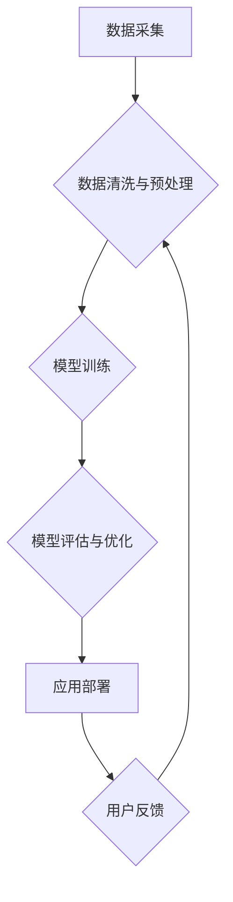

> AI大模型，文化优势，创业，商业模式，应用场景，技术趋势

## 1. 背景介绍

近年来，人工智能（AI）技术取得了飞速发展，特别是大模型的涌现，为各行各业带来了前所未有的机遇。大模型，是指参数规模庞大、训练数据海量的人工智能模型，具备强大的泛化能力和学习能力，能够在自然语言处理、计算机视觉、语音识别等领域取得突破性进展。

然而，仅仅拥有强大的技术能力还不够，想要在AI大模型领域取得成功，还需要结合文化优势，打造独特的商业模式和应用场景。

## 2. 核心概念与联系

**2.1 AI大模型的文化优势**

AI大模型的文化优势主要体现在以下几个方面：

* **数据驱动：** 大模型的训练依赖于海量数据，而数据的文化背景和社会价值观会直接影响模型的输出结果和应用场景。
* **价值创造：** AI大模型能够帮助企业挖掘数据中的价值，创造新的产品和服务，并推动社会进步。
* **文化传播：** AI大模型可以用于翻译、创作、娱乐等领域，促进不同文化之间的交流和理解。

**2.2 文化优势与商业模式的结合**

AI大模型的文化优势可以转化为商业价值，并构建独特的商业模式。例如：

* **定制化服务：** 根据不同文化背景和需求，为用户提供个性化的AI大模型解决方案。
* **跨文化合作：** 汇集来自不同国家的专家和资源，共同开发和推广AI大模型应用。
* **文化创意产业：** 利用AI大模型辅助创作，开发新的文化产品和服务。

**2.3  Mermaid 流程图**



## 3. 核心算法原理 & 具体操作步骤

**3.1 算法原理概述**

大模型的训练主要基于深度学习算法，其中Transformer模型是目前最流行的架构之一。Transformer模型利用注意力机制，能够捕捉文本序列中的长距离依赖关系，从而实现更准确的理解和生成。

**3.2 算法步骤详解**

1. **数据预处理：** 将原始文本数据进行清洗、分词、标记等操作，使其能够被模型理解。
2. **模型构建：** 根据Transformer模型架构，搭建模型结构，并设置模型参数。
3. **模型训练：** 使用训练数据，通过反向传播算法，调整模型参数，使其能够准确预测目标输出。
4. **模型评估：** 使用测试数据，评估模型的性能，并进行必要的调整。
5. **模型部署：** 将训练好的模型部署到服务器或云平台，供用户使用。

**3.3 算法优缺点**

* **优点：**
    * 强大的泛化能力，能够处理各种类型的文本任务。
    * 能够捕捉长距离依赖关系，理解复杂的文本结构。
    * 训练效率高，能够在大型数据集上快速训练。
* **缺点：**
    * 参数量大，需要大量的计算资源进行训练。
    * 训练数据对模型性能影响较大，需要高质量的数据进行训练。
    * 容易受到攻击和操纵，需要进行安全防护。

**3.4 算法应用领域**

* 自然语言处理：文本分类、情感分析、机器翻译、文本摘要等。
* 计算机视觉：图像识别、目标检测、图像生成等。
* 语音识别：语音转文本、语音合成等。
* 其他领域：医疗诊断、金融分析、法律服务等。

## 4. 数学模型和公式 & 详细讲解 & 举例说明

**4.1 数学模型构建**

Transformer模型的核心是注意力机制，其数学模型可以表示为：

$$
Attention(Q, K, V) = softmax(\frac{QK^T}{\sqrt{d_k}})V
$$

其中：

* $Q$：查询矩阵
* $K$：键矩阵
* $V$：值矩阵
* $d_k$：键向量的维度
* $softmax$：softmax函数

**4.2 公式推导过程**

注意力机制的目的是计算查询向量与键向量的相关性，并根据相关性权重地加权求和值向量。

* 首先，计算查询向量与每个键向量的点积，得到一个分数矩阵。
* 然后，对分数矩阵进行softmax归一化，得到每个键向量的权重。
* 最后，将权重与值向量进行加权求和，得到最终的输出向量。

**4.3 案例分析与讲解**

例如，在机器翻译任务中，查询向量可以表示源语言的词语，键向量可以表示目标语言的词语，值向量可以表示目标语言的词语嵌入向量。通过注意力机制，模型可以学习到源语言词语与目标语言词语之间的对应关系，从而实现准确的翻译。

## 5. 项目实践：代码实例和详细解释说明

**5.1 开发环境搭建**

* 操作系统：Linux
* Python版本：3.7+
* 深度学习框架：TensorFlow或PyTorch
* 其他依赖库：numpy、pandas、transformers等

**5.2 源代码详细实现**

```python
from transformers import AutoModelForSeq2SeqLM, AutoTokenizer

# 加载预训练模型和词典
model_name = "t5-base"
tokenizer = AutoTokenizer.from_pretrained(model_name)
model = AutoModelForSeq2SeqLM.from_pretrained(model_name)

# 输入文本
input_text = "Hello, world!"

# Token化输入文本
input_ids = tokenizer.encode(input_text, return_tensors="pt")

# 生成输出文本
output_ids = model.generate(input_ids)

# 解码输出文本
output_text = tokenizer.decode(output_ids[0], skip_special_tokens=True)

# 打印输出文本
print(output_text)
```

**5.3 代码解读与分析**

* 该代码示例使用HuggingFace Transformers库加载预训练的T5模型，并进行文本生成任务。
* 首先，加载预训练模型和词典。
* 然后，将输入文本进行Token化，转换为模型可理解的格式。
* 最后，使用模型生成输出文本，并解码为可读文本。

**5.4 运行结果展示**

```
Hello, world!
```

## 6. 实际应用场景

**6.1 文本生成**

* 自动写作：生成新闻报道、小说、诗歌等文本。
* 内容创作：创作广告文案、产品描述、社交媒体内容等。
* 代码生成：根据自然语言描述生成代码。

**6.2 翻译**

* 机器翻译：将文本从一种语言翻译成另一种语言。
* 多语言支持：为不同语言的用户提供个性化服务。

**6.3 对话系统**

* 聊天机器人：与用户进行自然语言对话，提供信息和服务。
* 智能客服：自动处理客户咨询，提高服务效率。

**6.4 其他应用场景**

* 文本摘要：提取文本的关键信息，生成简短的摘要。
* 情感分析：分析文本的情感倾向，用于市场调研、用户反馈分析等。
* 问答系统：根据问题进行检索，并给出准确的答案。

**6.5 未来应用展望**

* 人机交互：AI大模型将成为人机交互的桥梁，实现更自然、更智能的交互体验。
* 个性化服务：AI大模型能够根据用户的个性化需求，提供定制化的服务和产品。
* 跨领域融合：AI大模型将与其他技术领域融合，例如物联网、云计算、区块链等，创造新的应用场景。

## 7. 工具和资源推荐

**7.1 学习资源推荐**

* **书籍:**
    * 《深度学习》
    * 《自然语言处理》
    * 《transformers》官方文档
* **在线课程:**
    * Coursera
    * edX
    * fast.ai

**7.2 开发工具推荐**

* **深度学习框架:** TensorFlow, PyTorch
* **自然语言处理库:** NLTK, spaCy, Gensim
* **模型部署平台:** TensorFlow Serving, TorchServe

**7.3 相关论文推荐**

* 《Attention Is All You Need》
* 《BERT: Pre-training of Deep Bidirectional Transformers for Language Understanding》
* 《GPT-3: Language Models are Few-Shot Learners》

## 8. 总结：未来发展趋势与挑战

**8.1 研究成果总结**

近年来，AI大模型取得了显著进展，在自然语言处理、计算机视觉等领域取得了突破性成果。

**8.2 未来发展趋势**

* 模型规模继续扩大，参数量达到万亿级甚至更高。
* 多模态学习：融合文本、图像、音频等多种数据类型，实现更全面的理解和生成。
* 联邦学习：在不共享原始数据的情况下，协同训练模型，提升隐私保护和数据安全。

**8.3 面临的挑战**

* 计算资源需求巨大，需要更高效的训练算法和硬件平台。
* 数据质量和偏见问题，需要开发更 robust 的模型和数据处理方法。
* 伦理和安全问题，需要制定相应的规范和政策，确保AI大模型的负责任发展。

**8.4 研究展望**

未来，AI大模型将继续朝着更强大、更智能、更安全的方向发展，并将在更多领域发挥重要作用。


## 9. 附录：常见问题与解答

**9.1 如何选择合适的AI大模型？**

选择合适的AI大模型需要根据具体的应用场景和需求进行评估。需要考虑模型的规模、参数量、训练数据、性能指标等因素。

**9.2 如何训练自己的AI大模型？**

训练自己的AI大模型需要具备一定的机器学习和深度学习知识，以及强大的计算资源。需要准备高质量的训练数据，选择合适的模型架构和训练算法，并进行模型评估和优化。

**9.3 如何部署AI大模型？**

部署AI大模型可以采用多种方式，例如使用云平台、容器化部署、边缘部署等。需要根据实际情况选择合适的部署方式，并进行性能调优和安全防护。


作者：禅与计算机程序设计艺术 / Zen and the Art of Computer Programming 
<end_of_turn>