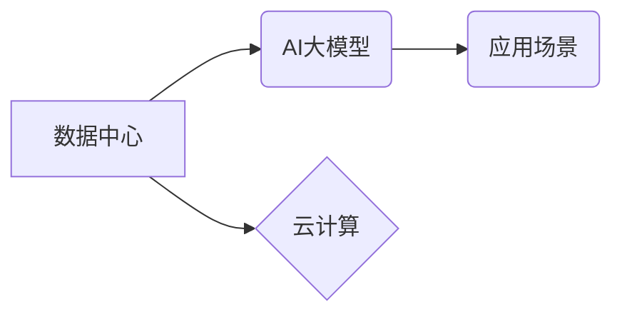

> AI大模型、数据中心、云计算、深度学习、机器学习、数据存储、数据处理、高性能计算

## 1. 背景介绍

近年来，人工智能（AI）技术取得了飞速发展，特别是深度学习算法的突破，使得AI大模型在自然语言处理、计算机视觉、语音识别等领域展现出强大的应用潜力。然而，AI大模型的训练和部署都需要海量数据和强大的计算资源，这推动了数据中心建设的快速发展。

数据中心作为AI大模型应用的基础设施，其规模、性能和可靠性直接影响着AI技术的应用效果。随着AI技术的不断发展，数据中心将面临着更大的挑战和机遇。

## 2. 核心概念与联系

**2.1 数据中心**

数据中心是集中存储、处理和管理数据的物理设施，通常由服务器、存储设备、网络设备、电源系统和冷却系统等组成。数据中心可以提供高可靠性、高可用性和高性能的计算资源，支持各种业务应用，包括AI大模型的训练和部署。

**2.2 AI大模型**

AI大模型是指在海量数据上训练的深度学习模型，其参数量通常在数十亿甚至数千亿级别。AI大模型具有强大的泛化能力和学习能力，可以应用于各种复杂的AI任务。

**2.3 云计算**

云计算是一种按需提供的计算资源、存储资源和网络资源的服务模式。云计算可以为数据中心提供弹性扩展、按需付费和高可用性等优势，降低数据中心的建设和运营成本。

**2.4 核心概念关系图**



## 3. 核心算法原理 & 具体操作步骤

**3.1 算法原理概述**

AI大模型的训练主要基于深度学习算法，例如卷积神经网络（CNN）、循环神经网络（RNN）和Transformer等。这些算法通过多层神经网络结构，学习数据中的特征和模式，从而实现对数据的理解和预测。

**3.2 算法步骤详解**

1. **数据预处理:** 将原始数据进行清洗、转换和格式化，使其适合模型训练。
2. **模型构建:** 根据任务需求选择合适的深度学习模型架构，并设置模型参数。
3. **模型训练:** 使用训练数据训练模型，通过调整模型参数，使模型的预测结果与真实值尽可能接近。
4. **模型评估:** 使用测试数据评估模型的性能，并根据评估结果进行模型调优。
5. **模型部署:** 将训练好的模型部署到生产环境中，用于实际应用。

**3.3 算法优缺点**

**优点:**

* 强大的泛化能力和学习能力
* 可以处理复杂的数据模式
* 能够实现端到端的自动化

**缺点:**

* 训练成本高，需要海量数据和强大的计算资源
* 模型解释性差，难以理解模型的决策过程
* 容易受到数据偏差的影响

**3.4 算法应用领域**

* 自然语言处理：文本分类、机器翻译、问答系统
* 计算机视觉：图像识别、目标检测、图像生成
* 语音识别：语音转文本、语音助手
* 其他领域：医疗诊断、金融风险评估、推荐系统

## 4. 数学模型和公式 & 详细讲解 & 举例说明

**4.1 数学模型构建**

AI大模型的训练过程可以看作是一个优化问题，目标是找到模型参数，使得模型的预测结果与真实值之间的误差最小化。常用的损失函数包括均方误差（MSE）、交叉熵损失（Cross-Entropy Loss）等。

**4.2 公式推导过程**

假设模型的预测输出为 $y_i$，真实值 $y_i^*$，损失函数为 $L(y_i, y_i^*)$，则模型的目标函数为：

$$
J = \frac{1}{N} \sum_{i=1}^{N} L(y_i, y_i^*)
$$

其中 $N$ 为样本数量。

通过梯度下降算法，不断更新模型参数，使得目标函数 $J$ 逐渐减小。

**4.3 案例分析与讲解**

例如，在图像分类任务中，可以使用交叉熵损失函数来衡量模型预测结果与真实标签之间的差异。假设模型预测图像属于某个类别 $k$ 的概率为 $p_k$，真实标签为 $t_k$，则交叉熵损失函数为：

$$
L(p_k, t_k) = -t_k \log p_k
$$

通过梯度下降算法，不断更新模型参数，使得交叉熵损失函数最小化，从而提高模型的图像分类准确率。

## 5. 项目实践：代码实例和详细解释说明

**5.1 开发环境搭建**

* 操作系统：Ubuntu 20.04
* 编程语言：Python 3.8
* 深度学习框架：TensorFlow 2.0
* GPU：NVIDIA GeForce RTX 3090

**5.2 源代码详细实现**

```python
import tensorflow as tf

# 定义模型架构
model = tf.keras.models.Sequential([
    tf.keras.layers.Conv2D(32, (3, 3), activation='relu', input_shape=(28, 28, 1)),
    tf.keras.layers.MaxPooling2D((2, 2)),
    tf.keras.layers.Conv2D(64, (3, 3), activation='relu'),
    tf.keras.layers.MaxPooling2D((2, 2)),
    tf.keras.layers.Flatten(),
    tf.keras.layers.Dense(10, activation='softmax')
])

# 编译模型
model.compile(optimizer='adam',
              loss='sparse_categorical_crossentropy',
              metrics=['accuracy'])

# 训练模型
model.fit(x_train, y_train, epochs=10)

# 评估模型
loss, accuracy = model.evaluate(x_test, y_test)
print('Test loss:', loss)
print('Test accuracy:', accuracy)
```

**5.3 代码解读与分析**

这段代码定义了一个简单的卷积神经网络模型，用于手写数字识别任务。模型包含两层卷积层、两层最大池化层、一层全连接层和一层softmax输出层。

模型使用Adam优化器、交叉熵损失函数和准确率作为评估指标。训练过程使用训练数据进行迭代训练，直到达到预设的 epochs 数。

**5.4 运行结果展示**

训练完成后，模型可以用于预测新的手写数字图像。

## 6. 实际应用场景

**6.1 自然语言处理**

* **机器翻译:** AI大模型可以实现多种语言之间的机器翻译，例如英语到中文、中文到英语等。
* **文本摘要:** AI大模型可以自动生成文本的摘要，例如新闻文章、会议记录等。
* **聊天机器人:** AI大模型可以构建聊天机器人，与用户进行自然语言对话。

**6.2 计算机视觉**

* **图像识别:** AI大模型可以识别图像中的物体、场景和人物。
* **目标检测:** AI大模型可以检测图像中多个目标的位置和类别。
* **图像生成:** AI大模型可以生成新的图像，例如人脸、风景等。

**6.3 语音识别**

* **语音转文本:** AI大模型可以将语音转换为文本，例如语音助手、会议记录等。
* **语音合成:** AI大模型可以将文本转换为语音，例如语音播报、语音助手等。

**6.4 未来应用展望**

AI大模型的应用场景还在不断扩展，未来将应用于更多领域，例如医疗诊断、金融风险评估、自动驾驶等。

## 7. 工具和资源推荐

**7.1 学习资源推荐**

* **书籍:**
    * 深度学习
    * 人工智能：一种现代方法
* **在线课程:**
    * Coursera: 深度学习
    * Udacity: 
    * fast.ai: 深度学习课程

**7.2 开发工具推荐**

* **深度学习框架:** TensorFlow, PyTorch, Keras
* **云计算平台:** AWS, Azure, Google Cloud

**7.3 相关论文推荐**

* Attention Is All You Need
* BERT: Pre-training of Deep Bidirectional Transformers for Language Understanding
* GPT-3: Language Models are Few-Shot Learners

## 8. 总结：未来发展趋势与挑战

**8.1 研究成果总结**

近年来，AI大模型取得了显著的进展，在各种应用场景中展现出强大的潜力。

**8.2 未来发展趋势**

* 模型规模和能力的进一步提升
* 模型训练效率和成本的降低
* 模型解释性和可解释性的增强
* 模型的安全性、可靠性和伦理性的研究

**8.3 面临的挑战**

* 数据获取和隐私保护
* 计算资源需求
* 模型偏见和公平性
* 模型安全性与可控性

**8.4 研究展望**

未来，AI大模型的研究将继续朝着更强大、更安全、更可解释的方向发展，为人类社会带来更多福祉。

## 9. 附录：常见问题与解答

**9.1 如何选择合适的AI大模型？**

选择合适的AI大模型需要根据具体的应用场景和需求进行考虑，例如任务类型、数据规模、计算资源等。

**9.2 如何训练和部署AI大模型？**

训练和部署AI大模型需要一定的技术基础和经验，可以参考相关的教程和文档进行学习。

**9.3 AI大模型的安全性如何保障？**

AI大模型的安全性需要从多个方面进行保障，例如数据安全、模型安全、部署安全等。

作者：禅与计算机程序设计艺术 / Zen and the Art of Computer Programming


<end_of_turn>