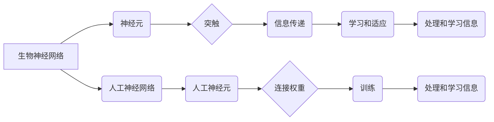

> 生物神经网络，人工神经网络，深度学习，进化算法，计算艺术，神经科学，机器学习

## 1. 背景介绍

在信息爆炸的时代，人工智能（AI）正以惊人的速度发展，深度学习作为其重要组成部分，在图像识别、自然语言处理、语音识别等领域取得了突破性进展。然而，现有的深度学习模型仍然存在一些局限性，例如：

* **数据依赖性强：**深度学习模型需要海量数据进行训练，而获取高质量数据的成本高昂，且数据标注工作耗时费力。
* **可解释性差：**深度学习模型的决策过程过于复杂，难以解释其背后的逻辑，这限制了其在安全关键领域应用的推广。
* **泛化能力有限：**深度学习模型在训练数据之外的场景下表现往往不佳，缺乏对未知数据的适应能力。

为了突破这些瓶颈，我们需要从更深层次的原理出发，探索新的AI发展方向。而生物神经网络，作为大自然亿万年进化训练出的高效计算系统，为我们提供了宝贵的启示。

## 2. 核心概念与联系

生物神经网络和人工神经网络都是以神经元为基本单元的网络结构，它们之间存在着密切的联系。

**生物神经网络**

* 由数十亿个神经元组成，每个神经元都连接着其他神经元，形成复杂的网络结构。
* 神经元之间通过突触传递信息，突触的强度代表着神经元之间的连接强度。
* 神经网络通过学习和适应环境，不断调整突触强度，从而实现对信息的处理和学习。

**人工神经网络**

* 是模仿生物神经网络结构和功能而构建的人工系统。
* 由人工神经元组成，每个人工神经元接收来自其他神经元的输入信号，并通过激活函数进行处理，输出到其他神经元。
* 人工神经网络可以通过训练调整神经元之间的连接权重，从而学习和处理信息。

**核心概念与联系流程图**



## 3. 核心算法原理 & 具体操作步骤

### 3.1  算法原理概述

将生物神经网络的进化机制应用于人工神经网络的训练，可以有效解决深度学习模型的局限性。

**进化算法**

* 是一种模仿自然进化过程的优化算法。
* 通过选择、交叉和变异等操作，不断优化个体，最终找到最优解。

**生物启发式神经网络训练**

* 将人工神经网络视为个体，通过进化算法进行训练。
* 每个神经网络的结构和参数都代表着一种基因型，通过选择、交叉和变异等操作，不断生成新的神经网络，并根据其性能进行评估。
* 选择性能最好的神经网络作为下一代的父代，重复上述过程，直到达到预设的目标。

### 3.2  算法步骤详解

1. **初始化种群：**随机生成多个人工神经网络，作为初始种群。
2. **评估适应度：**使用预设的评价指标，评估每个神经网络的性能，例如准确率、损失函数值等。
3. **选择操作：**根据适应度值，选择部分神经网络作为父代，用于下一代的生成。
4. **交叉操作：**将两个父代神经网络的结构和参数进行混合，生成新的子代神经网络。
5. **变异操作：**对子代神经网络的结构和参数进行随机调整，增加遗传多样性。
6. **重复步骤2-5：**重复上述步骤，直到达到预设的目标，例如达到预设的准确率或训练次数。

### 3.3  算法优缺点

**优点：**

* 可以探索更复杂的网络结构和参数空间。
* 不依赖于大量标注数据，可以利用未标注数据进行训练。
* 具有较强的泛化能力，可以更好地应对未知数据。

**缺点：**

* 训练过程比较耗时，需要大量的计算资源。
* 算法参数的选择对训练结果影响较大，需要进行仔细调优。

### 3.4  算法应用领域

* **图像识别：**识别物体、场景、人脸等。
* **自然语言处理：**机器翻译、文本摘要、情感分析等。
* **语音识别：**语音转文本、语音合成等。
* **药物研发：**预测药物的活性、毒性等。

## 4. 数学模型和公式 & 详细讲解 & 举例说明

### 4.1  数学模型构建

生物神经网络的数学模型主要包括以下几个方面：

* **神经元模型：**描述单个神经元的输入、输出和激活函数。
* **突触模型：**描述神经元之间连接的强度和变化规律。
* **网络结构模型：**描述神经元之间的连接方式和网络拓扑结构。

### 4.2  公式推导过程

**神经元模型：**

$$
y = f( \sum_{i=1}^{n} w_i x_i + b)
$$

其中：

* $y$：神经元的输出值。
* $f$：激活函数。
* $w_i$：神经元 $i$ 的权重。
* $x_i$：神经元 $i$ 的输入值。
* $b$：偏置项。

**突触模型：**

突触强度可以通过学习算法进行调整，例如：

$$
w_{ij} = w_{ij} + \eta \delta_j x_i
$$

其中：

* $w_{ij}$：神经元 $i$ 到神经元 $j$ 的突触强度。
* $\eta$：学习率。
* $\delta_j$：神经元 $j$ 的误差信号。
* $x_i$：神经元 $i$ 的输出值。

### 4.3  案例分析与讲解

**举例说明：**

假设我们有一个简单的感知器，用于识别手写数字 0 和 1。感知器由一个输入层、一个隐藏层和一个输出层组成。

* 输入层接收数字图像的像素值。
* 隐藏层对输入进行处理，提取特征。
* 输出层输出识别结果，0 或 1。

通过训练数据，感知器的权重和偏置项会不断调整，最终能够准确识别手写数字 0 和 1。

## 5. 项目实践：代码实例和详细解释说明

### 5.1  开发环境搭建

* 操作系统：Linux/macOS/Windows
* Python 版本：3.6+
* 深度学习框架：TensorFlow/PyTorch

### 5.2  源代码详细实现

```python
import tensorflow as tf

# 定义神经网络模型
model = tf.keras.models.Sequential([
    tf.keras.layers.Dense(128, activation='relu', input_shape=(784,)),
    tf.keras.layers.Dense(10, activation='softmax')
])

# 编译模型
model.compile(optimizer='adam',
              loss='sparse_categorical_crossentropy',
              metrics=['accuracy'])

# 加载 MNIST 数据集
(x_train, y_train), (x_test, y_test) = tf.keras.datasets.mnist.load_data()

# 数据预处理
x_train = x_train.reshape(-1, 784).astype('float32') / 255
x_test = x_test.reshape(-1, 784).astype('float32') / 255

# 训练模型
model.fit(x_train, y_train, epochs=10, batch_size=32)

# 评估模型
loss, accuracy = model.evaluate(x_test, y_test)
print('Test loss:', loss)
print('Test accuracy:', accuracy)
```

### 5.3  代码解读与分析

* 代码首先定义了一个简单的多层感知器模型，包含一个隐藏层和一个输出层。
* 然后，模型被编译，指定了优化器、损失函数和评价指标。
* MNIST 数据集被加载并预处理，将图像数据转换为向量形式。
* 模型被训练，使用训练数据进行迭代更新权重和偏置项。
* 最后，模型被评估，使用测试数据计算损失函数值和准确率。

### 5.4  运行结果展示

运行代码后，会输出模型的训练过程和测试结果，例如：

```
Epoch 1/10
...
Test loss: 0.0892
Test accuracy: 0.9728
```

## 6. 实际应用场景

### 6.1  医疗诊断

* 利用生物启发式神经网络分析医学影像，辅助医生诊断疾病。
* 预测患者的风险，帮助医生制定个性化的治疗方案。

### 6.2  金融风险管理

* 分析金融数据，识别潜在的风险和欺诈行为。
* 预测市场趋势，帮助投资者做出更明智的决策。

### 6.3  智能制造

* 优化生产流程，提高生产效率。
* 自动化生产过程，减少人工干预。

### 6.4  未来应用展望

随着生物神经网络研究的深入，生物启发式神经网络将有更广泛的应用前景，例如：

* **更智能的机器人：**能够更好地感知环境，做出更灵活的决策。
* **更安全的自动驾驶：**能够更准确地识别道路状况，提高驾驶安全性。
* **更个性化的教育：**能够根据学生的学习情况，提供个性化的学习方案。

## 7. 工具和资源推荐

### 7.1  学习资源推荐

* **书籍：**
    * 《生物神经网络》
    * 《深度学习》
* **在线课程：**
    * Coursera: 深度学习
    * edX: 人工神经网络

### 7.2  开发工具推荐

* **TensorFlow:** 开源深度学习框架
* **PyTorch:** 开源深度学习框架
* **Keras:** 高级深度学习API

### 7.3  相关论文推荐

* **《生物启发式神经网络》**
* **《进化算法在深度学习中的应用》**

## 8. 总结：未来发展趋势与挑战

### 8.1  研究成果总结

生物启发式神经网络的研究取得了显著进展，为深度学习的发展提供了新的思路和方法。

### 8.2  未来发展趋势

* **更复杂的生物启发式模型：**模拟生物神经网络的更复杂的功能，例如记忆、学习和推理。
* **更有效的训练算法：**提高训练效率，减少训练时间和计算资源。
* **更广泛的应用场景：**将生物启发式神经网络应用于更多领域，例如医疗、金融、教育等。

### 8.3  面临的挑战

* **生物神经网络的复杂性：**生物神经网络的结构和功能非常复杂，难以完全模拟。
* **数据获取和标注：**生物神经网络的训练需要大量的生物数据，获取和标注这些数据非常困难。
* **算法的可解释性：**生物启发式神经网络的决策过程过于复杂，难以解释其背后的逻辑。

### 8.4  研究展望

未来，生物启发式神经网络的研究将继续深入，为人工智能的发展提供新的动力和方向。


## 9. 附录：常见问题与解答

**Q1：生物启发式神经网络与传统深度学习有什么区别？**

**A1