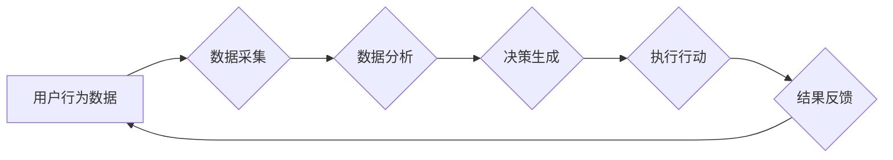

> AI，人工智能，Agent，新零售，智能化，自动化，个性化，数据分析，机器学习，深度学习

## 1. 背景介绍

新零售时代，以消费者为中心，以数据为驱动，以科技为手段，正在深刻地改变着零售业的格局。传统零售模式面临着效率低下、体验单一、服务不足等挑战，而人工智能（AI）技术作为新零售的重要驱动力，正在为零售业注入新的活力。

AI人工智能 Agent，作为一种智能化的软件实体，能够自主学习、决策和执行任务，在零售领域展现出巨大的应用潜力。它可以帮助零售商实现智能化运营、个性化服务、自动化流程等，提升客户体验，降低运营成本，最终实现商业价值的提升。

## 2. 核心概念与联系

### 2.1 AI Agent

AI Agent是指能够感知环境、做出决策并执行行动的智能体。它通常由以下几个核心组件组成：

* **感知模块:** 收集环境信息，例如用户行为、商品信息、市场趋势等。
* **推理模块:** 分析感知到的信息，做出决策，例如推荐商品、制定促销策略等。
* **执行模块:** 执行决策，例如向用户推送信息、调整商品价格等。

### 2.2 新零售

新零售是指以消费者为中心，融合线上线下资源，利用大数据、人工智能等新技术，打造全新的零售模式。其核心特点包括：

* **线上线下融合:** 打破线上线下壁垒，实现数据共享、资源整合，提供更加便捷、丰富的购物体验。
* **数据驱动:** 利用大数据分析用户行为、市场趋势，精准定位目标客户，提供个性化服务。
* **智能化运营:** 利用人工智能技术，实现智能化库存管理、智能化营销、智能化客服等，提升运营效率。

### 2.3 AI Agent在 New Retail中的应用

AI Agent可以应用于新零售各个环节，例如：

* **商品推荐:** 根据用户的购买历史、浏览记录、兴趣偏好等信息，推荐个性化的商品。
* **营销推广:** 分析用户画像，精准推送广告，提高营销效果。
* **库存管理:** 利用预测模型，预测商品需求，优化库存水平，降低库存成本。
* **客服服务:** 提供智能化客服，解答用户疑问，解决问题。

**Mermaid 流程图**



## 3. 核心算法原理 & 具体操作步骤

### 3.1 算法原理概述

AI Agent在零售领域应用的核心算法主要包括：

* **机器学习:** 利用算法从数据中学习，发现模式和规律，例如推荐系统、预测模型等。
* **深度学习:** 一种更高级的机器学习算法，能够处理更复杂的数据，例如图像识别、自然语言处理等。
* **强化学习:** 训练AI Agent通过与环境交互，学习最佳策略，例如智能客服、自动决策等。

### 3.2 算法步骤详解

以商品推荐为例，AI Agent的具体操作步骤如下：

1. **数据收集:** 收集用户购买历史、浏览记录、评价信息等数据。
2. **数据预处理:** 清洗、转换、格式化数据，使其适合算法训练。
3. **模型训练:** 利用机器学习算法，训练商品推荐模型。
4. **模型评估:** 使用测试数据评估模型性能，例如准确率、召回率等。
5. **模型部署:** 将训练好的模型部署到线上系统，为用户提供个性化商品推荐。

### 3.3 算法优缺点

**优点:**

* **个性化推荐:** 根据用户需求，提供更精准的商品推荐。
* **提升用户体验:** 提供更便捷、更丰富的购物体验。
* **提高销售额:** 通过精准推荐，提升商品销量。

**缺点:**

* **数据依赖:** 算法性能依赖于数据质量和数量。
* **算法复杂:** 训练和维护复杂的算法模型需要专业技术。
* **隐私安全:** 需要妥善处理用户数据，保障用户隐私安全。

### 3.4 算法应用领域

AI Agent的算法应用领域非常广泛，例如：

* **电商平台:** 商品推荐、个性化营销、智能客服等。
* **零售门店:** 智能导购、库存管理、促销策略等。
* **物流配送:** 路径规划、配送调度、智能仓储等。

## 4. 数学模型和公式 & 详细讲解 & 举例说明

### 4.1 数学模型构建

在商品推荐系统中，可以使用协同过滤算法构建数学模型。协同过滤算法基于用户的历史行为数据，预测用户对未购买商品的兴趣。

**用户-商品矩阵:**

用户-商品矩阵是一个二维矩阵，其中每一行代表一个用户，每一列代表一个商品。矩阵元素表示用户对商品的评分或购买行为。

**预测公式:**

$$
\hat{r}_{u,i} = \bar{r}_u + \frac{\sum_{v \in N(u)} (r_{v,i} - \bar{r}_v) \cdot sim(u,v)}{\sum_{v \in N(u)} sim(u,v)}
$$

其中:

* $\hat{r}_{u,i}$: 用户u对商品i的预测评分。
* $\bar{r}_u$: 用户u的平均评分。
* $r_{v,i}$: 用户v对商品i的实际评分。
* $sim(u,v)$: 用户u和用户v之间的相似度。
* $N(u)$: 用户u的邻居用户集合。

### 4.2 公式推导过程

协同过滤算法的核心思想是，如果用户u和用户v对相似的商品有相似的评分，那么用户u也可能喜欢用户v喜欢的商品。

公式推导过程如下:

1. 计算用户u的平均评分 $\bar{r}_u$。
2. 遍历用户u的邻居用户集合 $N(u)$。
3. 计算用户u和每个邻居用户v之间的相似度 $sim(u,v)$。
4. 计算用户u对商品i的预测评分 $\hat{r}_{u,i}$，根据公式进行计算。

### 4.3 案例分析与讲解

假设有两个用户A和B，他们都购买了商品1和商品2，但对商品3的评分不同。如果A和B对其他商品的评分相似，那么我们可以推断出，A对商品3的评分也可能与B相似。

## 5. 项目实践：代码实例和详细解释说明

### 5.1 开发环境搭建

* 操作系统: Ubuntu 20.04
* Python 版本: 3.8
* 必要的库: numpy, pandas, scikit-learn

### 5.2 源代码详细实现

```python
import pandas as pd
from sklearn.metrics.pairwise import cosine_similarity

# 加载用户-商品矩阵
data = pd.read_csv('user_item_matrix.csv')

# 计算用户之间的相似度
user_similarity = cosine_similarity(data)

# 预测用户对商品的评分
def predict_rating(user_id, item_id):
    # 获取用户邻居
    neighbors = get_neighbors(user_id, user_similarity)
    # 计算预测评分
    return calculate_predicted_rating(user_id, item_id, neighbors, data)

# 获取用户邻居
def get_neighbors(user_id, user_similarity):
    # ...

# 计算预测评分
def calculate_predicted_rating(user_id, item_id, neighbors, data):
    # ...

# 预测用户对商品的评分
predicted_ratings = predict_rating(1, 3)
print(predicted_ratings)
```

### 5.3 代码解读与分析

* 代码首先加载用户-商品矩阵数据。
* 然后使用余弦相似度计算用户之间的相似度。
* `predict_rating`函数用于预测用户对商品的评分，它首先获取用户邻居，然后根据公式计算预测评分。
* `get_neighbors`函数用于获取用户邻居，`calculate_predicted_rating`函数用于计算预测评分。

### 5.4 运行结果展示

运行代码后，可以得到用户对商品的预测评分。

## 6. 实际应用场景

### 6.1 电商平台

* **商品推荐:** 根据用户的购买历史、浏览记录、兴趣偏好等信息，推荐个性化的商品。
* **个性化营销:** 分析用户画像，精准推送广告，提高营销效果。
* **智能客服:** 提供智能化客服，解答用户疑问，解决问题。

### 6.2 零售门店

* **智能导购:** 通过语音识别、图像识别等技术，帮助顾客找到需要的商品。
* **库存管理:** 利用预测模型，预测商品需求，优化库存水平，降低库存成本。
* **促销策略:** 分析顾客行为数据，制定精准的促销策略，提高销售额。

### 6.3 物流配送

* **路径规划:** 利用算法优化配送路线，提高配送效率。
* **配送调度:** 根据实时交通状况，动态调整配送计划，确保按时送达。
* **智能仓储:** 利用机器人、自动导引车等技术，实现智能化仓储管理。

### 6.4 未来应用展望

随着人工智能技术的不断发展，AI Agent在零售领域的应用将更加广泛和深入。例如:

* **虚拟试衣间:** 利用虚拟现实技术，让顾客在家就能试穿衣服。
* **个性化定制:** 根据用户的需求，定制个性化的商品。
* **智能零售助手:** AI Agent可以作为零售商的智能助手，帮助他们完成各种任务，例如数据分析、库存管理、客户服务等。

## 7. 工具和资源推荐

### 7.1 学习资源推荐

* **书籍:**
    * 《深度学习》
    * 《机器学习实战》
    * 《人工智能：一种现代方法》
* **在线课程:**
    * Coursera: 深度学习
    * edX: 机器学习
    * Udacity: AI Nanodegree

### 7.2 开发工具推荐

* **Python:** 广泛应用于人工智能开发，拥有丰富的库和框架。
* **TensorFlow:** Google开发的开源深度学习框架。
* **PyTorch:** Facebook开发的开源深度学习框架。
* **Scikit-learn:** Python机器学习库。

### 7.3 相关论文推荐

* **Attention Is All You Need:** https://arxiv.org/abs/1706.03762
* **BERT: Pre-training of Deep Bidirectional Transformers for Language Understanding:** https://arxiv.org/abs/1810.04805
* **Generative Adversarial Networks:** https://arxiv.org/abs/1406.2661

## 8. 总结：未来发展趋势与挑战

### 8.1 研究成果总结

AI Agent在零售领域的应用取得了显著成果，例如商品推荐、个性化营销、智能客服等。这些应用能够提升用户体验、提高运营效率，为零售商带来商业价值。

### 8.2 未来发展趋势

* **更精准的个性化推荐:** 利用更先进的机器学习算法和数据分析技术，提供更精准的个性化推荐。
* **更智能的自动化流程:** 利用强化学习等技术，实现更智能的自动化流程，例如智能库存管理、智能促销策略等。
* **更丰富的交互体验:** 利用虚拟现实、增强现实等技术，提供更丰富的交互体验，例如虚拟试衣间、个性化定制等。

### 8.3 面临的挑战

* **数据安全和隐私保护:** AI Agent的应用需要大量用户数据，如何保障数据安全和隐私保护是一个重要的挑战。
* **算法解释性和可信度:** 许多AI算法是黑箱模型，难以解释其决策过程，如何提高算法的解释性和可信度是一个重要的研究方向。
* **技术成本和人才缺口:** AI Agent的开发和维护需要高昂的技术成本和专业人才，如何降低技术成本和培养人才是一个重要的挑战。

### 8.4 研究