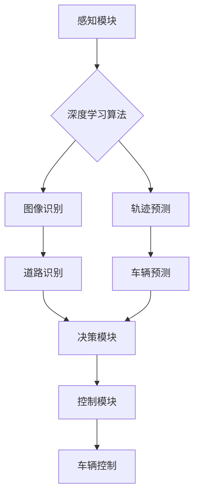

> 深度学习、无人驾驶、计算机视觉、强化学习、神经网络、卷积神经网络、递归神经网络

## 1. 背景介绍

无人驾驶汽车作为未来交通运输的重要方向，其核心技术之一便是深度学习算法。深度学习算法能够从海量数据中学习驾驶规则，识别道路环境，并做出相应的决策，从而实现自动驾驶功能。随着计算机硬件性能的提升和数据量的爆炸式增长，深度学习算法在无人驾驶汽车领域的应用越来越广泛。

## 2. 核心概念与联系

**2.1 深度学习算法**

深度学习算法是一种机器学习算法，其灵感来源于人脑神经网络的结构和功能。深度学习算法由多层神经元组成，每层神经元之间通过连接权重进行信息传递。通过训练，深度学习算法能够学习到数据中的复杂模式和特征，从而实现对数据的预测、分类、识别等任务。

**2.2 无人驾驶汽车**

无人驾驶汽车是一种能够自动驾驶的车辆，其不需要人工驾驶员的干预。无人驾驶汽车的核心技术包括感知、决策和控制。感知模块负责收集车辆周围的环境信息，例如道路、车辆、行人等；决策模块负责根据感知到的信息做出驾驶决策，例如加速、减速、转向等；控制模块负责执行驾驶决策，控制车辆的运动。

**2.3 核心概念联系**

深度学习算法在无人驾驶汽车中扮演着至关重要的角色。感知模块主要依赖于深度学习算法来识别和理解周围环境。例如，使用卷积神经网络（CNN）可以实现图像识别，识别道路、车辆、行人等；使用递归神经网络（RNN）可以实现序列数据处理，例如预测车辆的行驶轨迹。决策模块则利用深度学习算法来分析感知到的信息，做出最优的驾驶决策。控制模块则根据决策模块的指令，控制车辆的运动。



## 3. 核心算法原理 & 具体操作步骤

### 3.1  算法原理概述

在无人驾驶汽车中，深度学习算法主要包括卷积神经网络（CNN）和递归神经网络（RNN）。

**3.1.1 卷积神经网络（CNN）**

CNN 是一种专门用于处理图像数据的深度学习算法。CNN 的核心结构是卷积层和池化层。卷积层通过卷积核对图像进行卷积运算，提取图像的特征。池化层则对卷积层的输出进行降维，减少计算量并提高算法的鲁棒性。

**3.1.2 递归神经网络（RNN）**

RNN 是一种专门用于处理序列数据的深度学习算法。RNN 的核心结构是循环神经元，它能够记住之前的信息，并将其用于处理当前的输入。RNN 能够处理时间序列数据，例如语音识别、机器翻译、文本生成等。

### 3.2  算法步骤详解

**3.2.1 CNN 算法步骤**

1. **输入图像数据:** 将图像数据输入到 CNN 的第一层卷积层。
2. **卷积运算:** 卷积层使用卷积核对图像进行卷积运算，提取图像的特征。
3. **激活函数:** 将卷积层的输出通过激活函数进行非线性变换，提高算法的表达能力。
4. **池化运算:** 池化层对卷积层的输出进行降维，减少计算量并提高算法的鲁棒性。
5. **全连接层:** 将池化层的输出连接到全连接层，进行分类或回归。

**3.2.2 RNN 算法步骤**

1. **输入序列数据:** 将序列数据输入到 RNN 的第一层循环神经元。
2. **循环神经元计算:** 循环神经元根据当前输入和之前的信息计算输出。
3. **输出结果:** RNN 的输出可以是分类结果、回归结果或序列数据。

### 3.3  算法优缺点

**3.3.1 CNN 优点**

* 能够有效地提取图像特征。
* 具有较高的准确率。
* 能够处理大规模图像数据。

**3.3.1 CNN 缺点**

* 训练时间较长。
* 参数量较大。
* 对数据质量要求较高。

**3.3.2 RNN 优点**

* 能够处理序列数据。
* 能够记住之前的信息。
* 具有较高的表达能力。

**3.3.2 RNN 缺点**

* 训练难度较大。
* 容易出现梯度消失或梯度爆炸问题。
* 对长序列数据处理能力有限。

### 3.4  算法应用领域

CNN 和 RNN 在无人驾驶汽车中广泛应用于以下领域：

* **图像识别:** 识别道路、车辆、行人等。
* **轨迹预测:** 预测车辆的行驶轨迹。
* **场景理解:** 理解周围环境的场景。
* **决策辅助:** 辅助驾驶决策。

## 4. 数学模型和公式 & 详细讲解 & 举例说明

### 4.1  数学模型构建

**4.1.1 CNN 数学模型**

CNN 的数学模型主要包括卷积运算、激活函数和池化运算。

* **卷积运算:**

$$
y_{i,j} = \sum_{m=0}^{M-1} \sum_{n=0}^{N-1} x_{i+m,j+n} * w_{m,n} + b
$$

其中，$x_{i,j}$ 是输入图像的像素值，$w_{m,n}$ 是卷积核的权重，$b$ 是偏置项，$y_{i,j}$ 是卷积层的输出值。

* **激活函数:**

$$
f(x) = \frac{1}{1 + e^{-x}}
$$

其中，$f(x)$ 是激活函数，$x$ 是输入值。

* **池化运算:**

$$
y_{i,j} = \max(x_{i,j}, x_{i+1,j}, x_{i,j+1}, x_{i+1,j+1})
$$

其中，$y_{i,j}$ 是池化层的输出值，$x_{i,j}$ 是卷积层的输出值。

**4.1.2 RNN 数学模型**

RNN 的数学模型主要包括循环神经元的计算公式。

$$
h_t = f(W_{hh}h_{t-1} + W_{xh}x_t + b_h)
$$

其中，$h_t$ 是当前时间步的隐藏状态，$h_{t-1}$ 是上一个时间步的隐藏状态，$x_t$ 是当前时间步的输入，$W_{hh}$ 和 $W_{xh}$ 是权重矩阵，$b_h$ 是偏置项，$f$ 是激活函数。

### 4.2  公式推导过程

**4.2.1 CNN 公式推导**

CNN 的公式推导过程主要涉及卷积运算、激活函数和池化运算的数学原理。

**4.2.2 RNN 公式推导**

RNN 的公式推导过程主要涉及循环神经元的计算公式，以及如何将时间序列数据处理为多个时间步的输入。

### 4.3  案例分析与讲解

**4.3.1 CNN 案例分析**

使用 CNN 识别道路图像中的行人。

**4.3.2 RNN 案例分析**

使用 RNN 预测车辆的行驶轨迹。

## 5. 项目实践：代码实例和详细解释说明

### 5.1  开发环境搭建

使用 Python 语言和 TensorFlow 或 PyTorch 深度学习框架进行开发。

### 5.2  源代码详细实现

```python
# 使用 TensorFlow 实现 CNN 识别道路图像中的行人

import tensorflow as tf

# 定义 CNN 模型
model = tf.keras.models.Sequential([
    tf.keras.layers.Conv2D(32, (3, 3), activation='relu', input_shape=(64, 64, 3)),
    tf.keras.layers.MaxPooling2D((2, 2)),
    tf.keras.layers.Conv2D(64, (3, 3), activation='relu'),
    tf.keras.layers.MaxPooling2D((2, 2)),
    tf.keras.layers.Flatten(),
    tf.keras.layers.Dense(10, activation='softmax')
])

# 编译模型
model.compile(optimizer='adam',
              loss='sparse_categorical_crossentropy',
              metrics=['accuracy'])

# 训练模型
model.fit(x_train, y_train, epochs=10)

# 评估模型
loss, accuracy = model.evaluate(x_test, y_test)
print('Loss:', loss)
print('Accuracy:', accuracy)
```

### 5.3  代码解读与分析

代码首先定义了一个 CNN 模型，包含卷积层、池化层和全连接层。然后，使用 Adam 优化器和交叉熵损失函数对模型进行训练。最后，使用测试数据评估模型的性能。

### 5.4  运行结果展示

训练完成后，模型能够识别道路图像中的行人，并输出相应的分类结果。

## 6. 实际应用场景

### 6.1  自动驾驶汽车

深度学习算法在自动驾驶汽车中应用广泛，例如：

* **环境感知:** 使用 CNN 识别道路、车辆、行人等。
* **路径规划:** 使用 RNN 预测车辆的行驶轨迹，规划最优路径。
* **决策控制:** 使用深度强化学习算法训练自动驾驶汽车，使其能够做出最优的驾驶决策。

### 6.2  智能交通系统

深度学习算法可以用于智能交通系统的建设，例如：

* **交通流量预测:** 使用 RNN 预测交通流量，优化交通信号灯控制。
* **拥堵路段检测:** 使用 CNN 检测拥堵路段，引导车辆避开拥堵区域。
* **违章行为识别:** 使用 CNN 识别违章行为，例如闯红灯、超速行驶等。

### 6.3  其他应用场景

深度学习算法还可以应用于其他领域，例如：

* **机器人控制:** 使用深度强化学习算法训练机器人，使其能够自主完成任务。
* **医疗诊断:** 使用 CNN 识别医学图像中的病灶，辅助医生诊断疾病。
* **金融风险控制:** 使用深度学习算法识别金融风险，降低金融风险。

### 6.4  未来应用展望

随着深度学习算法的不断发展，其在无人驾驶汽车和智能交通系统中的应用将更加广泛和深入。未来，深度学习算法将能够实现更精准的感知、更智能的决策和更安全的驾驶体验。

## 7. 工具和资源推荐

### 7.1  学习资源推荐

* **书籍:**
    * 深度学习
    * 深度学习实战
    * 深度学习与计算机视觉
* **在线课程:**
    * Coursera 深度学习课程
    * Udacity 深度学习工程师 Nanodegree
    * fast.ai 深度学习课程

### 7.2  开发工具推荐

* **Python:** 深度学习开发的主要编程语言。
* **TensorFlow:** 开源深度学习框架。
* **PyTorch:** 开源深度学习框架。
* **Keras:** 高级深度学习 API，可以用于 TensorFlow 和 Theano。

### 7.3  相关论文推荐

* **AlexNet:** ImageNet Classification with Deep Convolutional Neural Networks
* **VGGNet:** Very Deep Convolutional Networks for Large-Scale Image Recognition
* **ResNet:** Deep Residual Learning for Image Recognition
* **YOLO:** You Only Look Once: Unified, Real-Time Object Detection

## 8. 总结：未来发展趋势与挑战

### 8.1  研究成果总结

深度学习算法在无人驾驶汽车领域取得了显著的成果，例如：

* **图像识别精度大幅