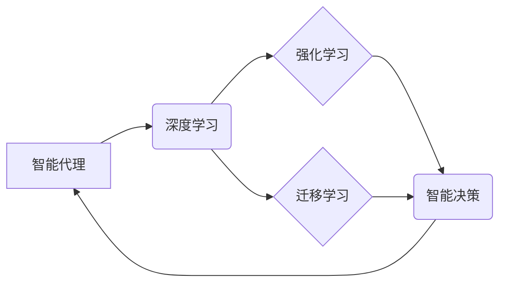

> 深度学习、智能代理、强化学习、迁移学习、泛化能力、可解释性、伦理

## 1. 背景介绍

人工智能（AI）正以惊人的速度发展，深度学习作为其核心技术，在图像识别、自然语言处理、语音识别等领域取得了突破性进展。然而，现有的深度学习模型大多是静态的，缺乏适应动态环境和复杂任务的能力。智能深度学习代理（Intelligent Deep Learning Agents）应运而生，旨在构建能够自主学习、决策和行动的智能体。

智能深度学习代理的核心目标是赋予机器自主学习和决策的能力，使其能够在复杂环境中感知、理解和交互。与传统的基于规则的智能体不同，智能深度学习代理通过深度学习算法从数据中学习，并不断优化其行为策略，以实现目标。

## 2. 核心概念与联系

**2.1 智能代理**

智能代理是一个能够感知环境、做出决策并执行行动的系统。它可以是软件程序、机器人或其他形式的智能体。智能代理的目标通常是最大化其自身利益或完成特定的任务。

**2.2 深度学习**

深度学习是一种机器学习的子领域，它利用多层神经网络来模拟人类大脑的学习过程。深度学习算法能够从海量数据中学习复杂的特征和模式，从而实现高精度的人工智能应用。

**2.3 强化学习**

强化学习是一种机器学习方法，它通过奖励和惩罚机制来训练智能体。智能体在环境中采取行动，根据行动的结果获得奖励或惩罚。通过不断学习和调整行为策略，智能体最终能够找到最优的行动策略以最大化奖励。

**2.4 迁移学习**

迁移学习是一种机器学习方法，它利用已学习到的知识和经验来解决新的任务。迁移学习可以有效地减少训练数据和训练时间，提高模型的泛化能力。

**2.5 核心概念关系图**



## 3. 核心算法原理 & 具体操作步骤

### 3.1 算法原理概述

智能深度学习代理的核心算法通常基于强化学习和深度学习的结合。

* **强化学习:** 智能代理通过与环境交互，学习最优的行为策略，以最大化累积奖励。
* **深度学习:** 深度神经网络用于学习环境状态和行为的映射关系，并预测未来状态和奖励。

### 3.2 算法步骤详解

1. **环境建模:** 建立智能代理与环境交互的模型，定义状态空间、动作空间和奖励函数。
2. **深度神经网络构建:** 设计深度神经网络架构，用于学习环境状态和行为的映射关系。
3. **策略梯度算法:** 使用策略梯度算法训练深度神经网络，优化行为策略以最大化累积奖励。
4. **环境交互:** 智能代理与环境交互，根据学习到的策略选择动作，并观察环境状态和奖励。
5. **模型更新:** 根据环境反馈，更新深度神经网络的参数，不断优化行为策略。
6. **重复步骤4-5:** 重复环境交互和模型更新过程，直到智能代理达到预设的目标或性能指标。

### 3.3 算法优缺点

**优点:**

* **自主学习:** 智能代理能够自主学习和适应动态环境。
* **高性能:** 深度学习算法能够学习复杂的特征和模式，实现高精度的人工智能应用。
* **可扩展性:** 智能代理可以扩展到多个领域和任务。

**缺点:**

* **训练成本高:** 深度学习模型的训练需要大量数据和计算资源。
* **可解释性差:** 深度学习模型的决策过程难以解释，缺乏透明度。
* **安全性和伦理问题:** 智能代理的自主决策可能带来安全性和伦理问题。

### 3.4 算法应用领域

智能深度学习代理的应用领域广泛，包括：

* **机器人控制:** 智能机器人能够自主导航、避障和执行任务。
* **游戏人工智能:** 智能游戏代理能够学习游戏规则和策略，与人类玩家进行竞争。
* **金融交易:** 智能交易代理能够分析市场数据和预测价格走势，进行自动交易。
* **医疗诊断:** 智能医疗代理能够辅助医生诊断疾病和制定治疗方案。

## 4. 数学模型和公式 & 详细讲解 & 举例说明

### 4.1 数学模型构建

智能深度学习代理的数学模型通常基于马尔可夫决策过程（MDP）。

* **状态空间 (S):** 环境可能存在的各种状态。
* **动作空间 (A):** 智能代理可以采取的各种动作。
* **转移概率 (P):** 从一个状态到另一个状态的概率，取决于采取的动作。
* **奖励函数 (R):** 智能代理在某个状态采取某个动作后获得的奖励。
* **价值函数 (V):** 在某个状态下获得的长期奖励的期望值。

### 4.2 公式推导过程

策略梯度算法的目标是最大化价值函数。策略梯度算法的核心公式如下：

```latex
\theta = \theta + \alpha \nabla_{\theta} J(\theta)
```

其中：

* $\theta$ 是深度神经网络的参数。
* $\alpha$ 是学习率。
* $J(\theta)$ 是价值函数。
* $\nabla_{\theta} J(\theta)$ 是价值函数对参数 $\theta$ 的梯度。

### 4.3 案例分析与讲解

假设一个智能代理在玩游戏，目标是获得尽可能高的分数。

* 状态空间：游戏中的地图、角色位置、道具等信息。
* 动作空间：移动、攻击、使用道具等操作。
* 转移概率：取决于游戏规则和随机事件。
* 奖励函数：获得分数、击杀敌人、收集道具等行为获得奖励。

智能代理通过策略梯度算法学习最优的行为策略，以最大化累积分数。

## 5. 项目实践：代码实例和详细解释说明

### 5.1 开发环境搭建

* Python 3.x
* TensorFlow 或 PyTorch 深度学习框架
* OpenAI Gym 或其他强化学习环境

### 5.2 源代码详细实现

```python
import tensorflow as tf
import gym

# 定义深度神经网络模型
model = tf.keras.models.Sequential([
    tf.keras.layers.Dense(64, activation='relu', input_shape=(state_size,)),
    tf.keras.layers.Dense(64, activation='relu'),
    tf.keras.layers.Dense(action_size)
])

# 定义策略梯度算法
def train(env, model, episodes=1000):
    for episode in range(episodes):
        state = env.reset()
        done = False
        total_reward = 0
        while not done:
            # 选择动作
            action = model.predict(state)[0]
            # 执行动作
            next_state, reward, done, _ = env.step(action)
            # 更新状态
            state = next_state
            # 更新奖励
            total_reward += reward
        # 更新模型参数
        model.fit(state, action, epochs=1)
    return total_reward

# 训练智能代理
env = gym.make('CartPole-v1')
model = tf.keras.models.Sequential(...)
total_reward = train(env, model)
print(f"Total reward: {total_reward}")
```

### 5.3 代码解读与分析

* 代码首先定义了深度神经网络模型，用于学习环境状态和行为的映射关系。
* 然后定义了策略梯度算法，用于训练深度神经网络，优化行为策略以最大化累积奖励。
* 训练过程包括环境交互、动作选择、状态更新、奖励更新和模型参数更新。
* 最后，代码展示了如何使用OpenAI Gym环境训练智能代理，并打印出总奖励。

### 5.4 运行结果展示

运行代码后，智能代理将在CartPole环境中学习平衡杆的行为策略。随着训练的进行，智能代理的平衡时间会逐渐延长，最终能够长时间保持平衡。

## 6. 实际应用场景

### 6.1 智能机器人控制

智能深度学习代理可以用于控制机器人，使其能够自主导航、避障和执行任务。例如，在仓库环境中，智能机器人可以根据库存信息和任务指令，自动搬运货物。

### 6.2 游戏人工智能

智能深度学习代理可以用于开发游戏人工智能，使其能够与人类玩家进行竞争。例如，在围棋游戏中，智能代理可以学习围棋规则和策略，与人类玩家进行比赛。

### 6.3 金融交易

智能深度学习代理可以用于金融交易，分析市场数据和预测价格走势，进行自动交易。例如，智能交易代理可以根据股票价格、交易量和新闻事件等信息，自动买卖股票。

### 6.4 医疗诊断

智能深度学习代理可以用于辅助医生诊断疾病和制定治疗方案。例如，智能医疗代理可以根据患者的病史、症状和检查结果，预测疾病的类型和严重程度。

### 6.4 未来应用展望

智能深度学习代理的应用前景广阔，未来将应用于更多领域，例如：

* 自动驾驶
* 个性化教育
* 智能家居
* 医疗保健

## 7. 工具和资源推荐

### 7.1 学习资源推荐

* **书籍:**
    * 深度学习
    * 强化学习
* **在线课程:**
    * Coursera: 深度学习
    * Udacity: 强化学习
* **博客:**
    * OpenAI Blog
    * DeepMind Blog

### 7.2 开发工具推荐

* **深度学习框架:** TensorFlow, PyTorch
* **强化学习环境:** OpenAI Gym, Stable Baselines3
* **编程语言:** Python

### 7.3 相关论文推荐

* Deep Reinforcement Learning: An Overview
* Proximal Policy Optimization Algorithms
* Asynchronous Methods for Deep Reinforcement Learning

## 8. 总结：未来发展趋势与挑战

### 8.1 研究成果总结

智能深度学习代理的研究取得了显著进展，在多个领域取得了突破性成果。

* **算法性能提升:** 深度学习算法的不断发展，使得智能代理的学习能力和决策能力得到显著提升。
* **应用场景拓展:** 智能代理的应用场景不断拓展，从游戏到机器人控制，再到金融交易和医疗诊断，智能代理正在改变着我们的生活。

### 8.2 未来发展趋势

* **泛化能力增强:** 提高智能代理的泛化能力，使其能够适应更多不同的环境和任务。
* **可解释性提升:** 提高智能代理的决策透明度，使其决策过程更加可解释和可信赖。
* **安全性和伦理问题解决:** 研究智能代理的安全性和伦理问题，确保其安全可靠地应用于现实世界。

### 8.3 面临的挑战

* **数据获取和标注:** 深度学习模型需要大量数据进行训练，获取和标注高质量数据仍然是一个挑战。
* **计算资源需求:** 训练深度学习模型需要大量的计算资源，这对于资源有限的机构和个人来说是一个障碍。
* **安全性和伦理问题:** 智能代理的自主决策可能带来安全性和伦理问题，需要进一步研究和解决。

### 8.4 研究展望

未来，智能深度学习代理的研究将继续朝着更智能、更安全、更可解释的方向发展。随着人工智能技术的不断进步，智能代理将扮演越来越重要的角色，改变着我们的生活和工作方式。

## 9. 附录：常见问题与解答

**Q1: 智能代理和传统人工智能有什么区别？**

**A1:** 传统人工智能通常基于规则和专家知识，而智能代理则通过深度学习算法从数据中学习，具有更强的适应性和泛化能力。

**Q2: 智能代理的训练需要多长时间？**

**A2:** 智能代理的训练时间取决于任务复杂度、数据量和计算资源等因素，通常需要几天到几周甚至更长时间。

**Q3