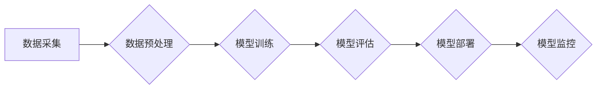

> AI大模型，创业，挑战，应用场景，技术趋势，伦理问题，商业模式

## 1. 背景介绍

近年来，人工智能（AI）技术取得了飞速发展，特别是大规模语言模型（LLM）的出现，如GPT-3、LaMDA等，展现出强大的文本生成、理解和翻译能力，为各行各业带来了革命性的变革。 

AI大模型的商业化应用前景广阔，吸引了众多创业者和企业的目光。从智能客服、内容创作到代码生成，AI大模型正在改变着我们生活的方方面面。然而，创业者在利用AI大模型进行商业化开发时，也面临着诸多挑战。

## 2. 核心概念与联系

**2.1 AI大模型概述**

AI大模型是指训练数据量巨大、模型参数规模庞大的深度学习模型。它们通过学习海量文本数据，掌握了语言的规律和知识，能够执行各种复杂的任务，例如：

* 文本生成：创作故事、诗歌、文章等。
* 文本理解：分析文本情感、主题、意图等。
* 机器翻译：将文本从一种语言翻译成另一种语言。
* 代码生成：根据自然语言描述生成代码。

**2.2 核心概念与联系**

* **深度学习:** AI大模型的核心技术是深度学习，它利用多层神经网络模拟人类大脑的学习过程。
* **Transformer:** Transformer是一种新型的神经网络架构，能够有效处理长文本序列，是构建AI大模型的关键技术之一。
* **预训练:** 预训练是指在大量文本数据上训练模型，使其掌握基本的语言知识和理解能力。
* **微调:** 微调是指在特定任务数据上对预训练模型进行进一步训练，使其能够完成特定任务。

**2.3  AI大模型架构**



## 3. 核心算法原理 & 具体操作步骤

**3.1 算法原理概述**

AI大模型的核心算法是深度学习算法，其中Transformer架构是目前最先进的模型架构之一。Transformer模型通过自注意力机制（Self-Attention）和多头注意力机制（Multi-Head Attention）来捕捉文本序列中的长距离依赖关系，从而实现更准确的文本理解和生成。

**3.2 算法步骤详解**

1. **数据采集:** 收集大量文本数据，例如书籍、文章、网站内容等。
2. **数据预处理:** 对文本数据进行清洗、分词、标记等预处理操作，使其能够被模型理解。
3. **模型训练:** 使用深度学习框架（如TensorFlow、PyTorch）训练Transformer模型，并根据训练结果调整模型参数。
4. **模型评估:** 使用测试数据评估模型的性能，例如准确率、召回率、F1-score等。
5. **模型部署:** 将训练好的模型部署到服务器或云平台，使其能够接受用户请求并进行预测。

**3.3 算法优缺点**

* **优点:**
    * 能够处理长文本序列，捕捉长距离依赖关系。
    * 表现出强大的文本理解和生成能力。
    * 可迁移学习，在不同任务上进行微调。
* **缺点:**
    * 训练成本高，需要大量计算资源和数据。
    * 模型参数规模庞大，部署成本较高。
    * 容易受到训练数据偏差的影响。

**3.4 算法应用领域**

* **自然语言处理:** 文本分类、情感分析、机器翻译、问答系统等。
* **计算机视觉:** 图像识别、物体检测、图像生成等。
* **语音识别:** 语音转文本、语音合成等。
* **代码生成:** 根据自然语言描述生成代码。

## 4. 数学模型和公式 & 详细讲解 & 举例说明

**4.1 数学模型构建**

Transformer模型的核心是自注意力机制，它通过计算每个词与所有其他词之间的相关性，来捕捉文本序列中的长距离依赖关系。

**4.2 公式推导过程**

* **注意力权重计算:**

$$
\text{Attention}(Q, K, V) = \text{softmax}\left(\frac{Q K^T}{\sqrt{d_k}}\right) V
$$

其中：

* $Q$：查询矩阵
* $K$：键矩阵
* $V$：值矩阵
* $d_k$：键向量的维度
* $\text{softmax}$：softmax函数

* **多头注意力机制:**

多头注意力机制将注意力机制应用于多个不同的子空间，从而捕捉到更丰富的文本信息。

$$
\text{MultiHead}(Q, K, V) = \text{Concat}(head_1, head_2, ..., head_h) W_o
$$

其中：

* $head_i$：第 $i$ 个注意力头的输出
* $h$：注意力头的数量
* $W_o$：最终输出层的权重矩阵

**4.3 案例分析与讲解**

例如，在机器翻译任务中，Transformer模型可以将源语言文本序列映射到目标语言文本序列。

* 查询矩阵 $Q$ 包含源语言文本的每个词的嵌入向量。
* 键矩阵 $K$ 包含目标语言文本的每个词的嵌入向量。
* 值矩阵 $V$ 包含目标语言文本的每个词的嵌入向量。

通过计算注意力权重，Transformer模型可以找到源语言文本中与目标语言文本每个词最相关的词，从而更好地理解语义关系，并生成更准确的翻译结果。

## 5. 项目实践：代码实例和详细解释说明

**5.1 开发环境搭建**

* 操作系统：Linux/macOS
* Python版本：3.7+
* 深度学习框架：TensorFlow/PyTorch
* 其他依赖库：transformers、numpy、pandas等

**5.2 源代码详细实现**

```python
from transformers import AutoModelForSeq2SeqLM, AutoTokenizer

# 加载预训练模型和词典
model_name = "t5-base"
tokenizer = AutoTokenizer.from_pretrained(model_name)
model = AutoModelForSeq2SeqLM.from_pretrained(model_name)

# 输入文本
input_text = "Hello, world!"

# Token化输入文本
input_ids = tokenizer.encode(input_text, return_tensors="pt")

# 生成输出文本
output_ids = model.generate(input_ids)

# 解码输出文本
output_text = tokenizer.decode(output_ids[0], skip_special_tokens=True)

# 打印输出文本
print(output_text)
```

**5.3 代码解读与分析**

* 使用 `transformers` 库加载预训练模型和词典。
* 使用 `tokenizer` 将输入文本转换为模型可理解的 token。
* 使用 `model.generate()` 函数生成输出文本。
* 使用 `tokenizer.decode()` 函数将输出 token 转换为文本。

**5.4 运行结果展示**

```
Hello, world!
```

## 6. 实际应用场景

**6.1 智能客服**

AI大模型可以用于构建智能客服系统，自动回答用户常见问题，提高客户服务效率。

**6.2 内容创作**

AI大模型可以辅助内容创作，例如生成文章、故事、诗歌等，提高创作效率和灵感。

**6.3 代码生成**

AI大模型可以根据自然语言描述生成代码，降低开发成本和时间。

**6.4 未来应用展望**

* **个性化教育:** 根据学生的学习情况，提供个性化的学习内容和辅导。
* **医疗诊断:** 辅助医生进行疾病诊断，提高诊断准确率。
* **科学研究:** 加速科学研究，发现新的知识和规律。

## 7. 工具和资源推荐

**7.1 学习资源推荐**

* **书籍:**
    * 《深度学习》
    * 《自然语言处理》
* **在线课程:**
    * Coursera: 深度学习
    * Udacity: 自然语言处理
* **博客和网站:**
    * TensorFlow博客
    * PyTorch博客
    * Hugging Face

**7.2 开发工具推荐**

* **深度学习框架:** TensorFlow, PyTorch
* **自然语言处理库:** NLTK, spaCy
* **云平台:** AWS, Azure, Google Cloud

**7.3 相关论文推荐**

* Attention Is All You Need
* BERT: Pre-training of Deep Bidirectional Transformers for Language Understanding
* GPT-3: Language Models are Few-Shot Learners

## 8. 总结：未来发展趋势与挑战

**8.1 研究成果总结**

近年来，AI大模型取得了显著进展，在文本理解、生成、翻译等领域展现出强大的能力。

**8.2 未来发展趋势**

* 模型规模进一步扩大，参数量达到万亿级甚至更高。
* 多模态学习，融合文本、图像、音频等多种数据类型。
* 更加安全、可靠、可解释的AI模型。

**8.3 面临的挑战**

* 训练成本高昂，需要大量计算资源和数据。
* 模型参数规模庞大，部署成本较高。
* 容易受到训练数据偏差的影响，导致模型存在偏见和歧视。

**8.4 研究展望**

* 研究更有效的训练方法，降低训练成本。
* 开发更安全、可靠、可解释的AI模型。
* 探索AI大模型在更多领域的应用，推动社会进步。

## 9. 附录：常见问题与解答

**9.1 如何选择合适的AI大模型？**

选择合适的AI大模型需要根据具体的应用场景和需求进行考虑，例如模型规模、性能、训练数据等。

**9.2 如何训练自己的AI大模型？**

训练自己的AI大模型需要具备一定的深度学习和机器学习知识，以及充足的计算资源和数据。

**9.3 如何部署AI大模型？**

部署AI大模型可以采用云平台、服务器或边缘设备等方式，需要根据实际情况选择合适的部署方案。


作者：禅与计算机程序设计艺术 / Zen and the Art of Computer Programming 
<end_of_turn>