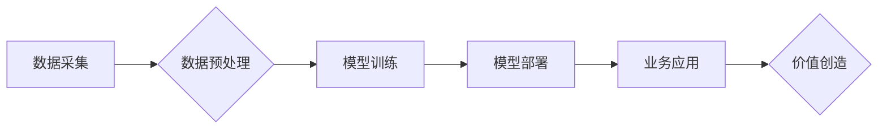

> 人工智能 (AI)
> 商业模式创新
> 数据驱动
> 机器学习
> 深度学习
> 算法优化
> 价值创造

## 1. 背景介绍

人工智能 (AI) 正以惊人的速度发展，从自动驾驶到医疗诊断，从个性化推荐到金融风险管理，AI 的应用领域日益广泛。然而，仅仅拥有先进的 AI 技术还不够，将 AI 技术与商业模式有效结合才是实现商业价值的关键。

当前，许多企业在探索如何将 AI 技术融入到他们的业务流程中，以提高效率、降低成本、创造新的价值。然而，将 AI 技术与商业模式相结合并非易事，需要企业深入思考 AI 技术的应用场景、数据资源的获取和利用、商业模式的创新以及伦理和社会影响等多个方面。

## 2. 核心概念与联系

**2.1 AI 与商业模式的关联**

商业模式是指企业为创造、传递和捕捉价值而采取的策略和实践。AI 技术可以对商业模式产生深远的影响，例如：

* **数据驱动决策:** AI 可以通过分析海量数据，为企业提供更精准、更有效的决策支持。
* **个性化体验:** AI 可以根据用户的行为和偏好，提供个性化的产品和服务，提升用户体验。
* **自动化流程:** AI 可以自动化许多重复性任务，提高效率，降低成本。
* **新产品和服务创新:** AI 可以帮助企业开发新的产品和服务，满足用户不断变化的需求。

**2.2 AI 技术与商业模式的融合架构**



**2.3 核心概念原理**

* **数据驱动:** AI 的核心是数据，高质量的数据是训练和优化 AI 模型的关键。
* **算法优化:** 不同的 AI 算法适用于不同的应用场景，需要根据具体需求选择合适的算法并进行优化。
* **价值创造:** AI 技术最终目的是为企业创造价值，需要将 AI 技术与商业目标相结合。

## 3. 核心算法原理 & 具体操作步骤

**3.1 算法原理概述**

机器学习 (ML) 是 AI 的一个重要分支，它通过算法学习数据中的模式，并根据这些模式进行预测或分类。常见的机器学习算法包括：

* **监督学习:** 利用标记数据训练模型，例如分类和回归问题。
* **无监督学习:** 利用未标记数据发现数据中的隐藏结构，例如聚类和降维。
* **强化学习:** 通过试错学习，让智能体在环境中获得最大奖励。

**3.2 算法步骤详解**

以监督学习为例，其基本步骤如下：

1. **数据收集和预处理:** 收集相关数据，并进行清洗、转换和特征工程等预处理操作。
2. **模型选择:** 根据具体问题选择合适的机器学习算法。
3. **模型训练:** 利用标记数据训练模型，调整模型参数，使其能够准确预测或分类。
4. **模型评估:** 使用测试数据评估模型的性能，例如准确率、召回率和 F1-score。
5. **模型部署:** 将训练好的模型部署到实际应用场景中。

**3.3 算法优缺点**

* **优点:** 可以自动学习数据中的模式，无需人工编程，能够处理复杂的数据关系。
* **缺点:** 需要大量的标记数据进行训练，对数据质量要求高，模型解释性较差。

**3.4 算法应用领域**

* **图像识别:** 人脸识别、物体检测、图像分类。
* **自然语言处理:** 文本分类、情感分析、机器翻译。
* **推荐系统:** 商品推荐、内容推荐、用户匹配。
* **预测分析:** 销售预测、风险评估、客户流失预测。

## 4. 数学模型和公式 & 详细讲解 & 举例说明

**4.1 数学模型构建**

假设我们有一个分类问题，目标是将数据点分类到不同的类别中。我们可以使用逻辑回归模型来解决这个问题。逻辑回归模型将线性回归模型的输出映射到 [0, 1] 的区间，表示数据点属于某个类别的概率。

**4.2 公式推导过程**

逻辑回归模型的输出为：

$$
p(y=1|x) = \frac{1}{1 + e^{-(w^T x + b)}}
$$

其中：

* $p(y=1|x)$ 是数据点 $x$ 属于类别 1 的概率。
* $w$ 是模型参数向量。
* $x$ 是数据点的特征向量。
* $b$ 是模型的偏置项。
* $e$ 是自然常数。

**4.3 案例分析与讲解**

假设我们有一个二分类问题，用于判断邮件是否为垃圾邮件。我们可以使用逻辑回归模型来训练一个垃圾邮件分类器。

* **特征:** 邮件的主题、内容、发送者等信息。
* **标签:** 垃圾邮件或正常邮件。

通过训练逻辑回归模型，我们可以得到模型参数 $w$ 和 $b$。然后，对于新的邮件，我们可以使用模型预测其是否为垃圾邮件。

## 5. 项目实践：代码实例和详细解释说明

**5.1 开发环境搭建**

* Python 3.x
* TensorFlow 或 PyTorch 等深度学习框架
* Jupyter Notebook 或 VS Code 等开发环境

**5.2 源代码详细实现**

```python
import tensorflow as tf

# 定义模型
model = tf.keras.models.Sequential([
    tf.keras.layers.Dense(128, activation='relu', input_shape=(num_features,)),
    tf.keras.layers.Dense(64, activation='relu'),
    tf.keras.layers.Dense(1, activation='sigmoid')
])

# 编译模型
model.compile(optimizer='adam',
              loss='binary_crossentropy',
              metrics=['accuracy'])

# 训练模型
model.fit(X_train, y_train, epochs=10)

# 评估模型
loss, accuracy = model.evaluate(X_test, y_test)
print('Loss:', loss)
print('Accuracy:', accuracy)
```

**5.3 代码解读与分析**

* 代码定义了一个简单的深度学习模型，包含三个全连接层。
* 模型使用 Adam 优化器，损失函数为二分类交叉熵，评估指标为准确率。
* 模型使用训练数据进行训练，并使用测试数据进行评估。

**5.4 运行结果展示**

训练完成后，我们可以查看模型的损失值和准确率。

## 6. 实际应用场景

**6.1 个性化推荐系统**

AI 可以分析用户的行为数据，例如浏览历史、购买记录、评分等，并推荐个性化的产品或内容。

**6.2 自动化客服系统**

AI 驱动的聊天机器人可以自动回答用户常见问题，提高客服效率。

**6.3 医疗诊断辅助系统**

AI 可以分析患者的病历、影像数据等，辅助医生进行诊断。

**6.4 金融风险管理**

AI 可以分析金融数据，识别潜在的风险，并进行风险控制。

**6.5 未来应用展望**

AI 技术的应用场景还在不断扩展，未来将应用于更多领域，例如：

* **自动驾驶:** AI 将推动自动驾驶技术的普及。
* **个性化教育:** AI 将提供个性化的学习方案，提高教育效率。
* **智能制造:** AI 将提高制造业的自动化程度和效率。

## 7. 工具和资源推荐

**7.1 学习资源推荐**

* **在线课程:** Coursera, edX, Udacity 等平台提供丰富的 AI 课程。
* **书籍:** 《深度学习》、《机器学习实战》等书籍。
* **开源项目:** TensorFlow, PyTorch 等开源项目。

**7.2 开发工具推荐**

* **Python:** AI 开发的主要编程语言。
* **Jupyter Notebook:** 用于编写和运行 Python 代码的交互式环境。
* **VS Code:** 一款功能强大的代码编辑器。

**7.3 相关论文推荐**

* **《ImageNet Classification with Deep Convolutional Neural Networks》**
* **《Attention Is All You Need》**
* **《BERT: Pre-training of Deep Bidirectional Transformers for Language Understanding》**

## 8. 总结：未来发展趋势与挑战

**8.1 研究成果总结**

近年来，AI 技术取得了长足的进步，在图像识别、自然语言处理、推荐系统等领域取得了突破性进展。

**8.2 未来发展趋势**

* **模型规模和复杂度提升:** 未来 AI 模型将更加强大，能够处理更复杂的数据和任务。
* **边缘计算和联邦学习:** AI 将更加靠近数据源，提高效率和隐私保护。
* **跨模态学习:** AI 将能够理解和处理多种数据类型，例如文本、图像、音频等。

**8.3 面临的挑战**

* **数据安全和隐私保护:** AI 的发展依赖于大量数据，如何保障数据安全和隐私是关键挑战。
* **算法可解释性和公平性:** AI 算法的决策过程往往难以理解，如何提高算法的可解释性和公平性也是重要问题。
* **伦理和社会影响:** AI 技术的应用可能带来伦理和社会问题，需要进行深入思考和探讨。

**8.4 研究展望**

未来 AI 研究将继续探索更强大的算法、更安全的应用场景和更广泛的应用领域，为人类社会带来更多福祉。

## 9. 附录：常见问题与解答

**9.1 如何选择合适的 AI 算法？**

选择合适的 AI 算法取决于具体的应用场景和数据特点。需要考虑算法的适用性、性能、复杂度等因素。

**9.2 如何处理不平衡数据？**

不平衡数据是指数据集中某些类别样本数量远大于其他类别样本数量。可以使用数据采样、算法调整等方法处理不平衡数据。

**9.3 如何评估 AI 模型的性能？**

常用的 AI 模型性能评估指标包括准确率、召回率、F1-score、AUC 等。

**9.4 如何部署 AI 模型？**

AI 模型的部署方式多种多样，可以部署到云端、边缘设备或本地服务器。

**9.5 如何保证 AI 模型的安全性？**

需要进行数据安全防护、模型安全评估、攻击防御等措施，保障 AI 模型的安全性。


作者：禅与计算机程序设计艺术 / Zen and the Art of Computer Programming 
<end_of_turn>