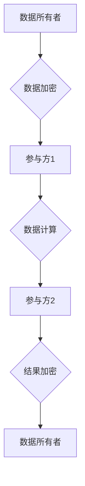

> 隐私计算，安全多方计算，联邦学习，同态加密，差分隐私，数据安全，数据隐私

## 1. 背景介绍

随着人工智能（AI）技术的飞速发展，数据已成为驱动AI发展的关键要素。然而，数据本身也蕴含着巨大的隐私风险。在数据共享和协作的过程中，如何保护数据隐私，同时又能充分利用数据价值，成为一个亟待解决的难题。

隐私计算和安全多方计算（MPC）应运而生，它们提供了一种在不泄露原始数据的情况下进行数据分析和计算的新方法。通过加密技术、分布式计算等手段，隐私计算和MPC技术能够保障数据安全和隐私，同时实现数据价值的挖掘和共享。

## 2. 核心概念与联系

**2.1 隐私计算**

隐私计算是指在不泄露原始数据的情况下，对数据进行分析和计算的技术。其核心目标是保护数据隐私，同时实现数据价值的利用。

**2.2 安全多方计算**

安全多方计算（MPC）是一种分布式计算模型，允许多个参与方共同计算一个函数，而无需透露各自的输入数据。MPC技术通过加密技术和协议设计，确保计算过程中的数据安全和隐私保护。

**2.3 联系**

隐私计算和安全多方计算是互补的，它们共同构成了保护数据隐私和实现数据价值共享的解决方案。

* 隐私计算提供了一系列技术手段，例如同态加密、差分隐私等，用于保护数据隐私。
* 安全多方计算提供了一种计算模型，允许多个参与方共同计算，而无需透露各自的输入数据。

通过结合使用这些技术，可以实现更安全、更私密的计算过程。

**2.4  Mermaid 流程图**



## 3. 核心算法原理 & 具体操作步骤

**3.1 算法原理概述**

安全多方计算的核心算法原理是通过加密技术和协议设计，使得参与方能够共同计算一个函数，而无需透露各自的输入数据。

常见的安全多方计算算法包括：

* **秘密共享:** 将数据分割成多个份额，分别分配给不同的参与方，只有所有份额集合才能恢复原始数据。
* **同态加密:** 在加密数据的情况下进行计算，计算结果也是加密的，只有解密后才能得到原始结果。
* **差分隐私:** 通过添加噪声来保护数据隐私，使得攻击者无法从计算结果中推断出任何关于原始数据的敏感信息。

**3.2 算法步骤详解**

以秘密共享为例，其具体操作步骤如下：

1. **数据分割:** 将原始数据分割成多个份额，每个份额包含部分数据信息。
2. **份额分配:** 将每个份额分别分配给不同的参与方。
3. **计算:** 参与方根据协议，使用各自的份额进行计算，最终得到计算结果的份额。
4. **结果组合:** 所有参与方的计算结果份额集合起来，即可恢复原始计算结果。

**3.3 算法优缺点**

**优点:**

* 保护数据隐私: 数据在计算过程中始终保持加密状态，无法被攻击者窃取。
* 可信计算: 计算过程由多个参与方共同完成，提高了计算结果的可靠性。
* 数据共享: 参与方可以共享数据，而无需透露原始数据，实现数据价值的共享。

**缺点:**

* 计算效率: 加密计算通常比明文计算效率低。
* 通信成本: 多方参与计算需要大量的通信，可能会增加通信成本。
* 协议复杂性: 安全多方计算协议设计复杂，需要专业的技术人员进行开发和维护。

**3.4 算法应用领域**

安全多方计算在以下领域具有广泛的应用前景:

* **医疗保健:** 保护患者隐私，实现医疗数据共享和分析。
* **金融服务:** 保护客户隐私，实现金融数据分析和风险管理。
* **物联网:** 保护设备数据隐私，实现数据安全共享。
* **人工智能:** 保护训练数据隐私，实现联邦学习等隐私保护AI技术。

## 4. 数学模型和公式 & 详细讲解 & 举例说明

**4.1 数学模型构建**

安全多方计算的数学模型通常基于以下几个核心概念:

* **参与方:** 多个参与方共同计算，每个参与方拥有自己的输入数据和计算能力。
* **函数:** 需要共同计算的函数，可以是简单的加法、减法，也可以是复杂的机器学习模型。
* **协议:** 参与方之间进行通信和计算的规则，确保计算过程的安全性、隐私性和正确性。

**4.2 公式推导过程**

以秘密共享为例，其数学模型可以描述为:

* **数据分割:** 将原始数据 $x$ 分割成 $n$ 个份额 $s_1, s_2, ..., s_n$，满足: $x = s_1 + s_2 + ... + s_n$

* **份额分配:** 将每个份额 $s_i$ 分别分配给参与方 $P_i$。

* **计算:** 参与方 $P_i$ 使用自己的份额 $s_i$ 计算函数 $f(x)$，得到计算结果的份额 $c_i$。

* **结果组合:** 所有参与方的计算结果份额 $c_1, c_2, ..., c_n$ 集合起来，即可恢复原始计算结果 $f(x)$。

**4.3 案例分析与讲解**

假设有两个参与方 $P_1$ 和 $P_2$，需要共同计算一个函数 $f(x) = x + y$，其中 $x$ 是 $P_1$ 的输入数据，$y$ 是 $P_2$ 的输入数据。

1. **数据分割:** 将 $x$ 和 $y$ 分别分割成两个份额，例如 $x = s_1 + s_2$ 和 $y = t_1 + t_2$。

2. **份额分配:** 将 $s_1, s_2, t_1, t_2$ 分别分配给 $P_1$ 和 $P_2$。

3. **计算:** $P_1$ 计算 $f(x) = (s_1 + s_2) + (t_1 + t_2) = s_1 + t_1 + s_2 + t_2$，得到计算结果的份额 $c_1$ 和 $c_2$。

4. **结果组合:** $P_1$ 和 $P_2$ 将各自的计算结果份额 $c_1$ 和 $c_2$ 发送给第三方，第三方将 $c_1$ 和 $c_2$ 加起来，即可得到最终计算结果 $f(x)$。

## 5. 项目实践：代码实例和详细解释说明

**5.1 开发环境搭建**

* 操作系统: Ubuntu 20.04
* Python 版本: 3.8
* 依赖库: PyCryptodome, NumPy, Pandas

**5.2 源代码详细实现**

```python
from Crypto.Cipher import AES
from Crypto.Util.Padding import pad, unpad

# 密钥
key = b'your_secret_key'

# 加密函数
def encrypt(data):
    cipher = AES.new(key, AES.MODE_ECB)
    ciphertext = cipher.encrypt(pad(data, AES.block_size))
    return ciphertext

# 解密函数
def decrypt(ciphertext):
    cipher = AES.new(key, AES.MODE_ECB)
    plaintext = unpad(cipher.decrypt(ciphertext), AES.block_size)
    return plaintext

# 示例代码
data = b'This is a secret message'
ciphertext = encrypt(data)
plaintext = decrypt(ciphertext)
print(f'Original data: {data}')
print(f'Ciphertext: {ciphertext}')
print(f'Decrypted data: {plaintext}')
```

**5.3 代码解读与分析**

* 该代码实现了一个简单的AES加密和解密功能。
* 使用ECB模式加密，密钥为`your_secret_key`。
* `pad`函数对数据进行填充，以满足AES算法的块大小要求。
* `unpad`函数对解密后的数据进行去除填充。

**5.4 运行结果展示**

运行该代码后，会输出原始数据、加密后的密文和解密后的明文。

## 6. 实际应用场景

**6.1 医疗保健**

* **患者隐私保护:** 使用隐私计算技术，可以保护患者医疗数据的隐私，同时实现数据共享和分析。
* **疾病研究:** 多个医院可以共享患者数据，进行疾病研究和药物开发，而无需透露患者的个人信息。

**6.2 金融服务**

* **欺诈检测:** 使用安全多方计算技术，可以多个金融机构共同分析交易数据，提高欺诈检测的准确率，同时保护客户隐私。
* **风险管理:** 多个金融机构可以共享风险数据，进行风险评估和管理，而无需透露敏感信息。

**6.3 物联网**

* **设备数据安全:** 使用隐私计算技术，可以保护设备数据隐私，防止数据泄露。
* **数据共享:** 设备可以共享数据，实现数据分析和应用，而无需透露设备的具体信息。

**6.4 未来应用展望**

随着人工智能技术的不断发展，隐私计算和安全多方计算将在更多领域得到应用，例如:

* **教育:** 保护学生隐私，实现教育数据共享和分析。
* **政府:** 保护公民隐私，实现数据安全共享和分析。
* **工业:** 保护工业数据隐私，实现数据安全共享和分析。

## 7. 工具和资源推荐

**7.1 学习资源推荐**

* **书籍:**
    * 《隐私计算》
    * 《安全多方计算》
* **在线课程:**
    * Coursera: Privacy-Preserving Machine Learning
    * edX: Secure Multi-Party Computation

**7.2 开发工具推荐**

* **PySyft:** 一个用于联邦学习和隐私计算的Python库。
* **SEAL:** 一个用于同态加密的C++库。
* **MPC-in-the-Cloud:** 一个基于云计算的安全多方计算平台。

**7.3 相关论文推荐**

* 《A Survey of Privacy-Preserving Machine Learning》
* 《Secure Multi-Party Computation: An Overview》

## 8. 总结：未来发展趋势与挑战

**8.1 研究成果总结**

近年来，隐私计算和安全多方计算领域取得了显著进展，涌现出许多新的算法、协议和工具。这些技术为保护数据隐私和实现数据价值共享提供了新的解决方案。

**8.2 未来发展趋势**

* **更高效的算法:** 研究更高效、更安全的隐私计算和安全多方计算算法。
* **更广泛的应用场景:** 将隐私计算和安全多方计算技术应用到更多领域，例如医疗保健、金融服务、物联网等。
* **更易于使用的工具:** 开发更易于使用的隐私计算和安全多方计算工具，降低技术门槛。

**8.3 面临的挑战**

* **计算效率:** 加密计算通常比明文计算效率低，需要进一步提高计算效率。
* **通信成本:** 多方参与计算需要大量的通信，可能会增加通信成本。
* **协议复杂性:** 安全多方计算协议设计复杂，需要专业的技术人员进行开发和维护。

**8.4 研究展望**

未来，隐私计算和安全多方计算领域将继续发展，并为数据安全和隐私保护提供更有效的解决方案。


## 9. 附录：常见问题与解答

**9.1 Q: 隐私计算和安全多方计算有什么区别？**

**A:** 隐私计算是一个更广泛的概念，涵盖了各种技术手段，例如同态加密、差分隐私等，用于保护数据隐私。安全多方计算是一种特定的计算模型，允许多个参与方共同计算，而无需透露各自的