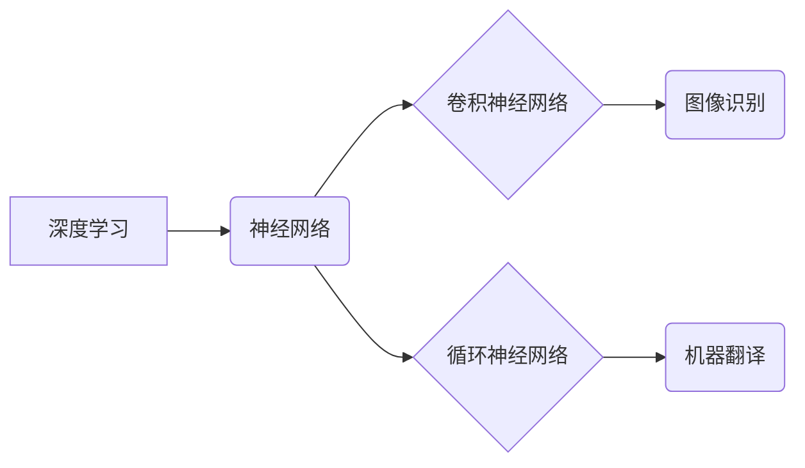

> 深度学习，计算机视觉，特斯拉，OpenAI，AI 伦理，神经网络，图像识别

## 1. 背景介绍

在人工智能领域，Andrej Karpathy 是一位享有盛誉的科学家和工程师，他的贡献深刻地影响了深度学习的发展。他以其在计算机视觉、自动驾驶和自然语言处理方面的杰出成就而闻名。本文将深入探讨 Andrej Karpathy 的职业生涯、研究成果以及对人工智能领域的深远影响。

## 2. 核心概念与联系

Andrej Karpathy 的研究主要集中在深度学习领域，特别是计算机视觉。深度学习是一种机器学习的子领域，它利用多层神经网络来模拟人类大脑的学习过程。

**核心概念：**

* **神经网络:**  由多个相互连接的节点（神经元）组成的网络结构，能够学习复杂的模式和关系。
* **卷积神经网络 (CNN):**  专门用于处理图像数据的深度学习网络，能够提取图像特征并进行分类、识别等任务。
* **循环神经网络 (RNN):**  能够处理序列数据的深度学习网络，例如文本和语音，常用于机器翻译、文本生成等任务。

**架构关系：**



## 3. 核心算法原理 & 具体操作步骤

### 3.1  算法原理概述

Andrej Karpathy 在计算机视觉领域的研究主要集中在卷积神经网络的改进和应用。他开发了许多新的 CNN 架构和训练方法，例如：

* **AlexNet:**  2012 年在 ImageNet 大规模图像识别挑战赛中取得突破性进展的 CNN 架构。
* **VGGNet:**  使用较小的卷积核和更多的卷积层，取得了更高的准确率。
* **ResNet:**  引入了残差连接，能够训练更深的网络，从而提高了性能。

### 3.2  算法步骤详解

CNN 的训练过程通常包括以下步骤：

1. **数据预处理:**  将图像数据转换为适合 CNN 训练的格式，例如调整大小、归一化等。
2. **网络结构定义:**  根据任务需求设计 CNN 的架构，包括卷积层、池化层、全连接层等。
3. **权值初始化:**  为网络中的参数（权值和偏置）赋予初始值。
4. **前向传播:**  将输入图像数据通过网络进行计算，得到输出结果。
5. **损失函数计算:**  比较输出结果与真实标签之间的差异，计算损失值。
6. **反向传播:**  根据损失值，调整网络参数，使损失值最小化。
7. **迭代训练:**  重复前向传播、损失函数计算和反向传播的过程，直到模型达到预期的性能。

### 3.3  算法优缺点

**优点:**

* **高准确率:**  CNN 在图像识别、物体检测等任务中表现出色，能够达到人类水平的准确率。
* **鲁棒性:**  CNN 对图像噪声和变化有一定的鲁棒性。
* **可扩展性:**  CNN 可以很容易地扩展到处理更大的图像数据和更复杂的任务。

**缺点:**

* **计算量大:**  训练 CNN 需要大量的计算资源和时间。
* **数据依赖性:**  CNN 的性能取决于训练数据的质量和数量。
* **可解释性差:**  CNN 的决策过程比较复杂，难以解释其背后的原因。

### 3.4  算法应用领域

CNN 在计算机视觉领域有着广泛的应用，例如：

* **图像识别:**  识别图像中的物体、场景和人物。
* **物体检测:**  在图像中定位和识别多个物体。
* **图像分割:**  将图像分割成不同的区域，例如前景和背景。
* **图像生成:**  生成新的图像数据。
* **视频分析:**  分析视频内容，例如动作识别、事件检测等。

## 4. 数学模型和公式 & 详细讲解 & 举例说明

### 4.1  数学模型构建

CNN 的核心数学模型是卷积操作和池化操作。

* **卷积操作:**  将卷积核（一个小的矩阵）滑动在图像上，计算每个位置的卷积结果，从而提取图像特征。

* **池化操作:**  对卷积层的输出进行降维，减少计算量并提高模型的鲁棒性。常见的池化操作包括最大池化和平均池化。

### 4.2  公式推导过程

**卷积操作公式:**

$$
y_{i,j} = \sum_{m=0}^{M-1} \sum_{n=0}^{N-1} x_{i+m,j+n} * w_{m,n}
$$

其中：

* $y_{i,j}$ 是卷积结果的像素值。
* $x_{i+m,j+n}$ 是输入图像的像素值。
* $w_{m,n}$ 是卷积核的权值。
* $M$ 和 $N$ 是卷积核的大小。

**最大池化操作公式:**

$$
y_{i,j} = \max(x_{i,j}, x_{i+1,j}, x_{i,j+1}, x_{i+1,j+1})
$$

其中：

* $y_{i,j}$ 是池化结果的像素值。
* $x_{i,j}$ 是输入图像的像素值。

### 4.3  案例分析与讲解

假设我们有一个 3x3 的图像，以及一个 2x2 的卷积核。卷积操作将将卷积核滑动在图像上，计算每个位置的卷积结果。例如，当卷积核位于图像的左上角时，卷积结果将是：

$$
y_{0,0} = x_{0,0} * w_{0,0} + x_{0,1} * w_{0,1} + x_{1,0} * w_{1,0} + x_{1,1} * w_{1,1}
$$

## 5. 项目实践：代码实例和详细解释说明

### 5.1  开发环境搭建

* **操作系统:**  Linux 或 macOS
* **编程语言:**  Python
* **深度学习框架:**  TensorFlow 或 PyTorch
* **其他工具:**  Git、Jupyter Notebook

### 5.2  源代码详细实现

```python
import tensorflow as tf

# 定义 CNN 模型
model = tf.keras.models.Sequential([
    tf.keras.layers.Conv2D(32, (3, 3), activation='relu', input_shape=(28, 28, 1)),
    tf.keras.layers.MaxPooling2D((2, 2)),
    tf.keras.layers.Conv2D(64, (3, 3), activation='relu'),
    tf.keras.layers.MaxPooling2D((2, 2)),
    tf.keras.layers.Flatten(),
    tf.keras.layers.Dense(10, activation='softmax')
])

# 编译模型
model.compile(optimizer='adam',
              loss='sparse_categorical_crossentropy',
              metrics=['accuracy'])

# 训练模型
model.fit(x_train, y_train, epochs=10)

# 评估模型
loss, accuracy = model.evaluate(x_test, y_test)
print('Test loss:', loss)
print('Test accuracy:', accuracy)
```

### 5.3  代码解读与分析

* **定义 CNN 模型:**  使用 TensorFlow 的 Keras API 定义了一个简单的 CNN 模型，包括卷积层、池化层和全连接层。
* **编译模型:**  使用 Adam 优化器、交叉熵损失函数和准确率指标编译模型。
* **训练模型:**  使用训练数据训练模型，设置训练轮数为 10。
* **评估模型:**  使用测试数据评估模型的性能，打印测试损失和准确率。

### 5.4  运行结果展示

训练完成后，模型将输出测试损失和准确率。

## 6. 实际应用场景

Andrej Karpathy 的研究成果在许多实际应用场景中得到了广泛应用，例如：

* **自动驾驶:**  特斯拉的自动驾驶系统使用了 Andrej Karpathy 开发的 CNN 模型来识别道路、交通标志和行人。
* **图像识别:**  Google 的图像搜索引擎使用了 Andrej Karpathy 的研究成果来识别图像中的物体和场景。
* **医疗诊断:**  CNN 模型被用于分析医学图像，辅助医生进行诊断。

### 6.4  未来应用展望

随着深度学习技术的不断发展，Andrej Karpathy 的研究成果将在未来应用领域得到更广泛的应用，例如：

* **自然语言处理:**  CNN 可以用于处理文本数据，例如机器翻译、文本摘要和情感分析。
* **语音识别:**  CNN 可以用于识别语音信号，例如语音助手和语音搜索。
* **机器人控制:**  CNN 可以用于帮助机器人理解周围环境并进行控制。

## 7. 工具和资源推荐

### 7.1  学习资源推荐

* **书籍:**
    * Deep Learning by Ian Goodfellow, Yoshua Bengio, and Aaron Courville
    * Hands-On Machine Learning with Scikit-Learn, Keras & TensorFlow by Aurélien Géron
* **在线课程:**
    * Deep Learning Specialization by Andrew Ng (Coursera)
    * Fast.ai Deep Learning Course
* **博客和网站:**
    * Andrej Karpathy's Blog: https://karpathy.github.io/
    * OpenAI Blog: https://openai.com/blog/

### 7.2  开发工具推荐

* **深度学习框架:**
    * TensorFlow: https://www.tensorflow.org/
    * PyTorch: https://pytorch.org/
* **编程语言:**
    * Python: https://www.python.org/

### 7.3  相关论文推荐

* AlexNet: ImageNet Classification with Deep Convolutional Neural Networks
* VGGNet: Very Deep Convolutional Networks for Large-Scale Image Recognition
* ResNet: Deep Residual Learning for Image Recognition

## 8. 总结：未来发展趋势与挑战

### 8.1  研究成果总结

Andrej Karpathy 的研究成果对深度学习的发展做出了重要贡献，特别是他在计算机视觉领域取得的突破性进展。他的研究成果被广泛应用于自动驾驶、图像识别、医疗诊断等领域。

### 8.2  未来发展趋势

未来，深度学习技术将继续发展，并应用于更多领域。一些重要的发展趋势包括：

* **更深更复杂的网络架构:**  研究人员将继续探索更深更复杂的网络架构，以提高模型的性能。
* **自监督学习:**  利用未标记数据进行训练，降低对标注数据的依赖。
* **联邦学习:**  在不共享原始数据的情况下，训练模型，保护用户隐私。

### 8.3  面临的挑战

深度学习技术也面临一些挑战，例如：

* **数据隐私:**  深度学习模型需要大量的训练数据，如何保护用户隐私是一个重要的挑战。
* **模型可解释性:**  深度学习模型的决策过程比较复杂，难以解释其背后的原因，这可能会导致模型的不可信赖性。
* **公平性:**  深度学习模型可能存在偏见，导致不公平的结果。

### 8.4  研究展望

未来，研究人员将继续探索深度学习技术的潜力，并解决其面临的挑战。

## 9. 附录：常见问题与解答

**Q1:  深度学习和机器学习有什么区别？**

**A1:**  机器学习是人工智能的一个子领域，它利用算法从数据中学习模式。深度学习是机器学习的一种特殊形式，它使用多层神经网络来模拟人类大脑的学习过程。

**Q2:  CNN 的优势是什么？**

**A2:**  CNN 在图像识别等任务中表现出色，其优势包括：

* **高准确率:**  CNN 可以学习到图像的复杂特征，从而实现高准确率的识别。
* **鲁