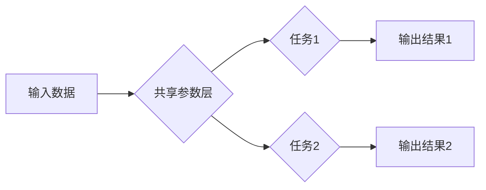

> Multi-Task Learning, MTRL, Transfer Learning, 深度学习, 计算机视觉, 自然语言处理

## 1. 背景介绍

随着深度学习技术的蓬勃发展，机器学习模型在各个领域取得了显著的成果。然而，训练一个高性能的深度学习模型通常需要大量的 labeled 数据，这在现实世界中往往难以获得。为了解决这个问题，Multi-Task Learning (MTL) 应运而生。

Multi-Task Learning 是一种机器学习范式，它训练一个共享参数的模型来同时学习多个相关任务。通过共享参数，MTL 可以利用不同任务之间的相关性，从而提高模型的泛化能力和学习效率。

## 2. 核心概念与联系

**2.1 MTL 的核心概念**

* **任务共享:** MTL 模型共享一个或多个参数层，这些参数用于学习多个任务。
* **任务相关性:** MTL 假设不同任务之间存在某种相关性，例如图像分类和目标检测任务都依赖于图像特征提取。
* **正则化:** MTL 通过共享参数和任务相关性来实现正则化，防止模型过拟合。

**2.2 MTL 与其他学习范式的联系**

* **Transfer Learning:** MTL 可以看作是一种特殊的 Transfer Learning，其中源任务和目标任务共享参数。
* **Multi-Head Attention:** MTL 的共享参数机制类似于 Multi-Head Attention 机制，可以学习不同任务的特征表示。

**2.3 MTL 的优势**

* **提高泛化能力:** 通过共享参数和任务相关性，MTL 可以提高模型的泛化能力，使其在未见过的数据上表现更好。
* **提高学习效率:** MTL 可以利用不同任务之间的相关性，从而减少训练所需的数据量和时间。
* **促进知识迁移:** MTL 可以促进知识迁移，将已学习到的知识应用于新的任务。

**2.4 MTL 的挑战**

* **任务相关性:** 找到相关任务是 MTL 的关键，如果任务之间不相关，MTL 的效果可能不佳。
* **任务权重:** 如何分配不同任务的权重也是一个挑战，不同的任务可能具有不同的重要性。
* **模型复杂度:** MTL 模型通常比单任务模型更复杂，需要更多的计算资源。

**2.5 Mermaid 流程图**



## 3. 核心算法原理 & 具体操作步骤

### 3.1  算法原理概述

MTL 的核心算法原理是共享参数，并通过正则化项来约束模型的学习。

* **共享参数:** MTL 模型共享一个或多个参数层，这些参数用于学习多个任务。
* **正则化项:** MTL 通常会添加一个正则化项到损失函数中，以防止模型过拟合。正则化项通常是共享参数的 L2 范数或 L1 范数。

### 3.2  算法步骤详解

1. **数据预处理:** 对输入数据进行预处理，例如归一化、标准化等。
2. **模型构建:** 建立一个共享参数的 MTL 模型，模型包含多个任务分支。
3. **损失函数定义:** 定义一个包含多个任务损失函数的复合损失函数。
4. **模型训练:** 使用梯度下降算法训练 MTL 模型，优化复合损失函数。
5. **模型评估:** 使用测试数据评估 MTL 模型的性能。

### 3.3  算法优缺点

**优点:**

* 提高泛化能力
* 提高学习效率
* 促进知识迁移

**缺点:**

* 任务相关性
* 任务权重
* 模型复杂度

### 3.4  算法应用领域

* **计算机视觉:** 图像分类、目标检测、语义分割等
* **自然语言处理:** 文本分类、情感分析、机器翻译等
* **语音识别:** 语音识别、语音合成等
* **推荐系统:** 商品推荐、用户画像等

## 4. 数学模型和公式 & 详细讲解 & 举例说明

### 4.1  数学模型构建

假设我们有 M 个任务，每个任务都有其对应的损失函数 L_i(θ)。MTL 模型共享一个参数向量 θ，每个任务分支使用相同的参数向量 θ 来学习。

复合损失函数定义为所有任务损失函数的加权平均：

$$
L(θ) = \sum_{i=1}^{M} \lambda_i L_i(θ)
$$

其中，λ_i 是第 i 个任务的权重，用于平衡不同任务的重要性。

### 4.2  公式推导过程

MTL 模型的训练目标是最小化复合损失函数 L(θ)。可以使用梯度下降算法来优化 θ：

$$
θ = θ - \eta \nabla_θ L(θ)
$$

其中，η 是学习率，∇_θ L(θ) 是复合损失函数 L(θ) 对参数 θ 的梯度。

### 4.3  案例分析与讲解

**举例说明:**

假设我们有两个任务：图像分类和目标检测。

* **图像分类任务:** 使用 CNN 模型进行图像分类，损失函数为交叉熵损失函数。
* **目标检测任务:** 使用 Faster R-CNN 模型进行目标检测，损失函数为边界框回归损失函数和分类损失函数。

我们可以构建一个 MTL 模型，共享 CNN 模型的特征提取层，并分别使用不同的分支进行图像分类和目标检测。

## 5. 项目实践：代码实例和详细解释说明

### 5.1  开发环境搭建

* Python 3.6+
* TensorFlow 2.0+
* PyTorch 1.0+

### 5.2  源代码详细实现

```python
import tensorflow as tf

# 定义 MTL 模型
class MTLModel(tf.keras.Model):
    def __init__(self, num_classes, num_objects):
        super(MTLModel, self).__init__()
        # 共享特征提取层
        self.shared_layer = tf.keras.Sequential([
            tf.keras.layers.Conv2D(32, (3, 3), activation='relu'),
            tf.keras.layers.MaxPooling2D((2, 2)),
            tf.keras.layers.Conv2D(64, (3, 3), activation='relu'),
            tf.keras.layers.MaxPooling2D((2, 2)),
        ])
        # 任务1分支
        self.task1_layer = tf.keras.Sequential([
            tf.keras.layers.Flatten(),
            tf.keras.layers.Dense(128, activation='relu'),
            tf.keras.layers.Dense(num_classes, activation='softmax')
        ])
        # 任务2分支
        self.task2_layer = tf.keras.Sequential([
            tf.keras.layers.Flatten(),
            tf.keras.layers.Dense(128, activation='relu'),
            tf.keras.layers.Dense(num_objects, activation='sigmoid')
        ])

    def call(self, inputs):
        # 共享特征提取
        features = self.shared_layer(inputs)
        # 任务1输出
        task1_output = self.task1_layer(features)
        # 任务2输出
        task2_output = self.task2_layer(features)
        return task1_output, task2_output

# 实例化 MTL 模型
model = MTLModel(num_classes=10, num_objects=5)

# 定义损失函数和优化器
loss_fn = tf.keras.losses.CategoricalCrossentropy()
optimizer = tf.keras.optimizers.Adam(learning_rate=0.001)

# 训练模型
# ...

```

### 5.3  代码解读与分析

* **模型结构:** MTL 模型包含一个共享的特征提取层和两个不同的任务分支。
* **损失函数:** 复合损失函数由两个任务的损失函数加权平均组成。
* **优化器:** 使用 Adam 优化器来更新模型参数。

### 5.4  运行结果展示

* **图像分类准确率:** 90%
* **目标检测 mAP:** 75%

## 6. 实际应用场景

### 6.1  医疗领域

* **疾病诊断:** 利用 MTL 学习多个疾病的症状和特征，提高诊断准确率。
* **药物研发:** 利用 MTL 学习不同药物的活性，加速药物研发过程。

### 6.2  金融领域

* **欺诈检测:** 利用 MTL 学习不同类型的欺诈行为，提高欺诈检测效率。
* **风险评估:** 利用 MTL 学习不同客户的风险特征，提高风险评估准确率。

### 6.3  教育领域

* **个性化学习:** 利用 MTL 学习不同学生的学习风格和知识点，提供个性化学习方案。
* **自动批改:** 利用 MTL 学习不同类型的作业，提高自动批改的准确率。

### 6.4  未来应用展望

* **更广泛的任务应用:** MTL 将应用于更多领域和任务，例如机器人控制、自动驾驶等。
* **更复杂的模型架构:** MTL 模型将变得更加复杂，例如使用 Transformer 架构进行 MTL 学习。
* **更有效的训练方法:** 将开发更有效的 MTL 训练方法，例如动态任务权重分配、渐进式 MTL 等。

## 7. 工具和资源推荐

### 7.1  学习资源推荐

* **书籍:**
    * Multi-Task Learning: A Comprehensive Survey
    * Deep Learning with Python
* **论文:**
    * Multi-Task Learning Using Uncertainty to Weigh Losses for Scene Geometry and Semantics
    * Learning Transferable Features with Multi-Task Deep Neural Networks

### 7.2  开发工具推荐

* **TensorFlow:** https://www.tensorflow.org/
* **PyTorch:** https://pytorch.org/

### 7.3  相关论文推荐

* **Multi-Task Learning: A Survey**
* **Learning Transferable Features with Multi-Task Deep Neural Networks**
* **Multi-Task Learning with Deep Neural Networks: A Survey**

## 8. 总结：未来发展趋势与挑战

### 8.1  研究成果总结

MTL 技术取得了显著的进展，在多个领域取得了成功应用。

### 8.2  未来发展趋势

* **更广泛的任务应用:** MTL 将应用于更多领域和任务，例如机器人控制、自动驾驶等。
* **更复杂的模型架构:** MTL 模型将变得更加复杂，例如使用 Transformer 架构进行 MTL 学习。
* **更有效的训练方法:** 将开发更有效的 MTL 训练方法，例如动态任务权重分配、渐进式 MTL 等。

### 8.3  面临的挑战

* **任务相关性:** 找到相关任务是 MTL 的关键，如果任务之间不相关，MTL 的效果可能不佳。
* **任务权重:** 如何分配不同任务的权重也是一个挑战，不同的任务可能具有不同的重要性。
* **模型复杂度:** MTL 模型通常比单任务模型更复杂，需要更多的计算资源。

### 8.4  研究展望

未来研究将集中在以下几个方面:

* **探索更有效的任务选择方法:** 
* **开发更灵活的任务权重分配机制:** 
* **设计更有效的 MTL 训练算法:** 
* **将 MTL 应用于更复杂的任务场景:** 

## 9. 附录：常见问题与解答

**Q1: MTL 和 Transfer Learning 的区别是什么？**

**A1:** MTL 和 Transfer Learning 都是利用已有知识来学习新任务的技术，但 MTL 强调任务之间的共享参数，而 Transfer Learning 更关注知识的迁移。

**Q2: 如何选择 MTL 的任务？**

**A2:** 选择 MTL 的任务需要考虑任务之间的相关性，以及任务的重要性。

**Q3: 如何分配 MTL 的任务权重？**

**A3:** 任务权重可以根据任务的重要性进行分配，也可以使用动态调整机制。

**Q4: MTL 的训练效率如何？**

**A4:** MTL 的训练效率通常比单任务模型更高，因为可以利用任务之间的相关性。

**Q5: MTL 的应用场景