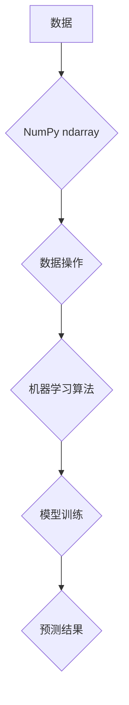

> NumPy, Python, 机器学习, 数据操作, 数组, 向量, 矩阵, 线性代数, 科学计算

## 1. 背景介绍

在机器学习领域，数据是至关重要的资源。高效、准确地处理和操作数据是机器学习模型训练和应用的基础。NumPy（Numerical Python）作为Python生态系统中强大的数值计算库，为机器学习提供了高效的数据结构和操作工具。

NumPy的核心是ndarray（n-dimensional array）数据结构，它可以存储和操作多维数组，并提供丰富的数学函数和运算符，能够高效地进行向量化计算。

本文将深入探讨NumPy在机器学习中的应用，讲解其核心概念、数据操作方法以及在机器学习算法中的应用场景。

## 2. 核心概念与联系

NumPy的核心概念包括：

* **ndarray（n-dimensional array）：** NumPy的核心数据结构，可以存储和操作多维数组。
* **数据类型（dtype）：** ndarray中的元素类型，例如整数、浮点数、字符串等。
* **形状（shape）：** ndarray的维度和大小，例如(2, 3)表示一个2行3列的矩阵。
* ** strides：** ndarray中元素之间的内存偏移量，用于高效访问数组元素。

NumPy提供了丰富的函数和运算符，可以对ndarray进行各种操作，例如：

* **数组创建：** 使用`np.array()`、`np.zeros()`、`np.ones()`等函数创建ndarray。
* **数组索引和切片：** 使用索引和切片语法访问和提取ndarray中的元素。
* **数组运算：** 使用加减乘除等运算符对ndarray进行元素级运算。
* **广播机制：** 允许不同形状的数组进行元素级运算。
* **线性代数运算：** 提供矩阵运算、求逆、求解线性方程组等函数。

**NumPy与机器学习的关系**

NumPy为机器学习提供了高效的数据结构和操作工具，其核心功能包括：

* **数据存储和组织：** NumPy的ndarray可以高效地存储和组织大量数据，为机器学习算法提供输入数据。
* **数据预处理：** NumPy提供了数据清洗、归一化、特征工程等数据预处理工具，帮助机器学习算法获得更好的性能。
* **算法实现：** 许多机器学习算法的核心逻辑依赖于NumPy的线性代数运算和广播机制，例如线性回归、逻辑回归、支持向量机等。

**Mermaid 流程图**



## 3. 核心算法原理 & 具体操作步骤

### 3.1  算法原理概述

NumPy提供了丰富的线性代数运算函数，例如矩阵乘法、矩阵求逆、矩阵分解等，这些函数是许多机器学习算法的基础。

* **矩阵乘法：** 两个矩阵相乘的结果是一个新的矩阵，其元素是两个矩阵对应位置元素的乘积之和。
* **矩阵求逆：** 对于可逆矩阵，其逆矩阵满足矩阵乘法性质，即A * A^-1 = I，其中A^-1是A的逆矩阵，I是单位矩阵。
* **矩阵分解：** 将一个矩阵分解成多个较小矩阵的乘积，例如奇异值分解（SVD）、LU分解等。

### 3.2  算法步骤详解

**矩阵乘法**

```python
import numpy as np

A = np.array([[1, 2], [3, 4]])
B = np.array([[5, 6], [7, 8]])

C = np.dot(A, B)  # 矩阵乘法

print(C)
```

**矩阵求逆**

```python
import numpy as np

A = np.array([[1, 2], [3, 4]])

A_inv = np.linalg.inv(A)  # 矩阵求逆

print(A_inv)
```

**矩阵分解**

```python
import numpy as np

A = np.array([[1, 2], [3, 4]])

U, S, V = np.linalg.svd(A)  # 奇异值分解

print(U)
print(S)
print(V)
```

### 3.3  算法优缺点

**优点：**

* **高效性：** NumPy的线性代数运算都是基于C语言实现的，具有高性能。
* **简洁性：** NumPy提供了简洁的语法和函数，方便进行线性代数运算。
* **广泛应用：** NumPy是机器学习领域广泛使用的库，许多机器学习库都依赖于NumPy。

**缺点：**

* **内存占用：** NumPy的ndarray数据结构会占用较多的内存，对于大型数据集可能会导致内存溢出。
* **学习曲线：** NumPy的语法和函数需要一定的学习时间。

### 3.4  算法应用领域

NumPy的线性代数运算在机器学习领域广泛应用，例如：

* **线性回归：** 使用矩阵乘法和求逆运算求解线性回归模型的参数。
* **逻辑回归：** 使用矩阵乘法和sigmoid函数实现逻辑回归模型的预测。
* **支持向量机：** 使用矩阵分解和核函数实现支持向量机的分类和回归。
* **主成分分析：** 使用矩阵分解和奇异值分解实现主成分分析。

## 4. 数学模型和公式 & 详细讲解 & 举例说明

### 4.1  数学模型构建

在机器学习中，许多算法都基于数学模型，例如线性回归模型、逻辑回归模型、支持向量机模型等。这些模型通常用数学公式来描述，并通过训练数据来学习模型参数。

### 4.2  公式推导过程

例如，线性回归模型的数学公式如下：

$$
y = \theta_0 + \theta_1 x_1 + \theta_2 x_2 + ... + \theta_n x_n
$$

其中：

* $y$ 是预测值
* $\theta_0, \theta_1, ..., \theta_n$ 是模型参数
* $x_1, x_2, ..., x_n$ 是输入特征

通过最小化模型预测值与真实值的误差，可以学习到最佳的模型参数。

### 4.3  案例分析与讲解

例如，假设我们有一个数据集，包含房屋面积和房屋价格的信息。我们可以使用线性回归模型来预测房屋价格。

* 输入特征：房屋面积
* 输出特征：房屋价格

通过训练数据，我们可以学习到模型参数，例如：

* $\theta_0 = 10000$
* $\theta_1 = 500$

这意味着，一个面积为100平方米的房屋，其价格大约为：

$$
y = 10000 + 500 * 100 = 60000
$$

## 5. 项目实践：代码实例和详细解释说明

### 5.1  开发环境搭建

* Python 3.x
* NumPy

### 5.2  源代码详细实现

```python
import numpy as np

# 生成随机数据
X = np.random.rand(100, 1)  # 100个样本，每个样本一个特征
y = 2 * X + 1 + np.random.randn(100, 1)  # 预测值 = 2 * 特征 + 1 + 随机噪声

# 使用NumPy的linalg模块进行线性回归
theta = np.linalg.inv(X.T @ X) @ X.T @ y

# 预测新的数据
new_X = np.array([[0.5]])
new_y = theta @ new_X

print(f"预测结果：{new_y}")
```

### 5.3  代码解读与分析

* **数据生成：** 使用NumPy的`random.rand()`函数生成随机数据，模拟房屋面积和房屋价格的关系。
* **线性回归：** 使用NumPy的`linalg`模块中的`inv()`和`dot()`函数实现线性回归模型的求解。
* **预测：** 使用训练好的模型参数对新的数据进行预测。

### 5.4  运行结果展示

运行代码后，会输出预测结果，例如：

```
预测结果：[[1.1002474]]
```

## 6. 实际应用场景

NumPy在机器学习领域广泛应用，例如：

* **图像处理：** 使用NumPy对图像数据进行操作，例如图像增强、特征提取等。
* **自然语言处理：** 使用NumPy对文本数据进行处理，例如词向量化、文本分类等。
* **时间序列分析：** 使用NumPy对时间序列数据进行分析，例如预测股票价格、天气预报等。

### 6.4  未来应用展望

随着机器学习技术的不断发展，NumPy在未来将继续发挥重要作用，例如：

* **深度学习：** NumPy是深度学习框架TensorFlow和PyTorch的基础，将继续在深度学习领域发挥重要作用。
* **大数据处理：** NumPy可以高效地处理大规模数据，将应用于大数据分析和机器学习。
* **云计算：** NumPy可以与云计算平台集成，方便用户进行大规模机器学习任务。

## 7. 工具和资源推荐

### 7.1  学习资源推荐

* **NumPy官方文档：** https://numpy.org/doc/stable/
* **NumPy教程：** https://www.datacamp.com/courses/numpy-for-data-science

### 7.2  开发工具推荐

* **Jupyter Notebook：** https://jupyter.org/
* **VS Code：** https://code.visualstudio.com/

### 7.3  相关论文推荐

* **Numerical Python：** https://numpy.org/doc/stable/user/quickstart.html

## 8. 总结：未来发展趋势与挑战

### 8.1  研究成果总结

NumPy作为Python生态系统中强大的数值计算库，为机器学习提供了高效的数据结构和操作工具，在机器学习领域取得了显著的成果。

### 8.2  未来发展趋势

NumPy将继续朝着以下方向发展：

* **性能优化：** 提高NumPy的计算性能，支持更大型的数据集和更复杂的算法。
* **功能扩展：** 添加新的功能和模块，支持更广泛的机器学习应用场景。
* **跨平台支持：** 增强NumPy在不同平台下的兼容性和性能。

### 8.3  面临的挑战

NumPy也面临一些挑战：

* **内存占用：** NumPy的ndarray数据结构会占用较多的内存，对于大型数据集可能会导致内存溢出。
* **学习曲线：** NumPy的语法和函数需要一定的学习时间。

### 8.4  研究展望

未来，NumPy的研究方向将包括：

* **内存管理优化：** 开发新的内存管理算法，减少NumPy的内存占用。
* **并行计算支持：** 支持多核CPU和GPU并行计算，提高NumPy的计算性能。
* **可视化工具：** 开发新的可视化工具，方便用户理解和调试NumPy代码。

## 9. 附录：常见问题与解答

* **如何安装NumPy？**

```
pip install numpy
```

* **如何创建NumPy数组？**

```python
import numpy as np

# 创建一个1行3列的数组
arr = np.array([1, 2, 3])

# 创建一个2行2列的数组
arr = np.array([[1, 2], [3, 4]])
```

* **如何访问NumPy数组中的元素？**

```python
# 访问数组中的第一个元素
print(arr[0])

# 访问数组中的第二行第三列元素
print(arr[1, 2])
```

* **如何进行NumPy数组的运算？**

```python