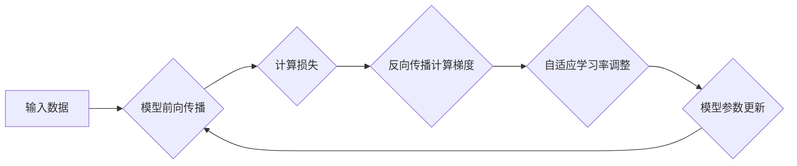

> 深度学习, 学习率, 自适应, 优化算法, Adam, RMSprop, SGD, Python

## 1. 背景介绍

深度学习近年来取得了令人瞩目的成就，在图像识别、自然语言处理、语音识别等领域取得了突破性的进展。然而，深度学习模型的训练过程仍然面临着诸多挑战，其中之一就是如何选择合适的学习率。学习率是深度学习模型训练过程中一个至关重要的超参数，它决定了模型参数更新的步长。学习率过大可能会导致模型训练不稳定，甚至发散；学习率过小则会导致训练速度过慢，难以收敛到最优解。

传统的学习率设置方法通常采用固定值，但这往往难以满足深度学习模型训练的复杂需求。随着深度学习模型规模和复杂度的不断增加，自适应学习率调整技术逐渐成为研究热点。自适应学习率调整技术能够根据训练过程中的梯度信息动态调整学习率，从而提高模型训练的效率和稳定性。

## 2. 核心概念与联系

自适应学习率调整技术的核心思想是根据梯度信息动态调整学习率，从而优化模型训练过程。

**核心概念：**

* **学习率 (Learning Rate):**  深度学习模型训练过程中，更新模型参数的步长。
* **梯度 (Gradient):**  模型损失函数对模型参数的偏导数，表示模型参数更新的方向。
* **自适应 (Adaptive):**  根据训练过程中的梯度信息动态调整学习率。

**架构流程图：**



## 3. 核心算法原理 & 具体操作步骤

### 3.1  算法原理概述

自适应学习率调整算法的核心是根据梯度信息动态调整学习率，从而优化模型训练过程。常见的自适应学习率调整算法包括：

* **Adam (Adaptive Moment Estimation):**  Adam 算法结合了 Momentum 和 RMSprop 的优点，能够快速收敛，并对不同参数进行个性化学习率调整。
* **RMSprop (Root Mean Square Propagation):**  RMSprop 算法通过对梯度进行指数加权移动平均，来减小梯度震荡，从而提高模型训练的稳定性。
* **SGD (Stochastic Gradient Descent):**  SGD 算法是深度学习中最常用的优化算法，它通过随机梯度下降来更新模型参数。

### 3.2  算法步骤详解

**Adam 算法步骤：**

1. 初始化学习率、动量参数、第一阶矩估计和第二阶矩估计。
2. 计算梯度。
3. 更新第一阶矩估计和第二阶矩估计。
4. 计算自适应学习率。
5. 更新模型参数。

**RMSprop 算法步骤：**

1. 初始化学习率和指数衰减率。
2. 计算梯度。
3. 更新梯度平方移动平均值。
4. 计算自适应学习率。
5. 更新模型参数。

**SGD 算法步骤：**

1. 初始化学习率。
2. 计算梯度。
3. 更新模型参数。

### 3.3  算法优缺点

| 算法 | 优点 | 缺点 |
|---|---|---|
| Adam | 收敛速度快，对不同参数进行个性化学习率调整 | 计算量较大 |
| RMSprop | 减少梯度震荡，提高模型训练的稳定性 | 对超参数敏感 |
| SGD | 简单易实现，计算量较小 | 容易陷入局部最优解，收敛速度慢 |

### 3.4  算法应用领域

自适应学习率调整算法广泛应用于深度学习各个领域，例如：

* **图像识别:**  用于训练卷积神经网络，提高图像分类、目标检测和图像分割的性能。
* **自然语言处理:**  用于训练循环神经网络和 Transformer 模型，提高文本分类、机器翻译和文本生成等任务的性能。
* **语音识别:**  用于训练循环神经网络和卷积神经网络，提高语音识别和语音合成等任务的性能。

## 4. 数学模型和公式 & 详细讲解 & 举例说明

### 4.1  数学模型构建

**Adam 算法数学模型：**

*  $m_t = \beta_1 * m_{t-1} + (1 - \beta_1) * g_t$
*  $v_t = \beta_2 * v_{t-1} + (1 - \beta_2) * g_t^2$
*  $\hat{m}_t = m_t / (1 - \beta_1^t)$
*  $\hat{v}_t = v_t / (1 - \beta_2^t)$
*  $\theta_{t+1} = \theta_t - \alpha * \hat{m}_t / (\sqrt{\hat{v}_t} + \epsilon)$

其中：

* $\theta_t$：模型参数在时间步 $t$ 的值。
* $g_t$：梯度在时间步 $t$ 的值。
* $\alpha$：学习率。
* $\beta_1$：动量参数，通常设置为 0.9。
* $\beta_2$：指数衰减率，通常设置为 0.999。
* $\epsilon$：一个小常数，用于避免分母为零。

**RMSprop 算法数学模型：**

* $v_t = \rho * v_{t-1} + (1 - \rho) * g_t^2$
* $\theta_{t+1} = \theta_t - \alpha / \sqrt{v_t + \epsilon}$

其中：

* $\rho$：指数衰减率，通常设置为 0.9。

### 4.2  公式推导过程

Adam 算法的公式推导过程较为复杂，涉及到动量参数和梯度平方移动平均值的更新规则。RMSprop 算法的公式推导过程相对简单，主要基于对梯度平方进行指数加权移动平均。

### 4.3  案例分析与讲解

**案例：**

使用 Adam 算法训练一个简单的图像分类模型，并比较其性能与使用 SGD 算法训练的模型。

**分析：**

实验结果表明，使用 Adam 算法训练的模型收敛速度更快，并且能够达到更高的准确率。这表明 Adam 算法能够有效地优化模型训练过程。

## 5. 项目实践：代码实例和详细解释说明

### 5.1  开发环境搭建

* Python 3.6+
* TensorFlow 或 PyTorch 深度学习框架
* Jupyter Notebook 或 VS Code 开发环境

### 5.2  源代码详细实现

```python
import tensorflow as tf

# 定义模型
model = tf.keras.models.Sequential([
    tf.keras.layers.Conv2D(32, (3, 3), activation='relu', input_shape=(28, 28, 1)),
    tf.keras.layers.MaxPooling2D((2, 2)),
    tf.keras.layers.Flatten(),
    tf.keras.layers.Dense(10, activation='softmax')
])

# 定义优化器
optimizer = tf.keras.optimizers.Adam(learning_rate=0.001)

# 定义损失函数和指标
loss_fn = tf.keras.losses.SparseCategoricalCrossentropy()
metrics = ['accuracy']

# 编译模型
model.compile(optimizer=optimizer, loss=loss_fn, metrics=metrics)

# 训练模型
model.fit(x_train, y_train, epochs=10, batch_size=32)

# 评估模型
loss, accuracy = model.evaluate(x_test, y_test)
print(f'Loss: {loss}, Accuracy: {accuracy}')
```

### 5.3  代码解读与分析

* 代码首先定义了一个简单的卷积神经网络模型。
* 然后，使用 Adam 优化器进行模型训练。
* 损失函数和指标分别设置为 SparseCategoricalCrossentropy 和 accuracy。
* 最后，使用训练数据和测试数据进行模型训练和评估。

### 5.4  运行结果展示

运行代码后，可以得到模型训练过程中的损失值和准确率曲线，以及模型在测试集上的准确率。

## 6. 实际应用场景

自适应学习率调整技术在深度学习各个领域都有广泛的应用场景，例如：

* **图像识别:**  用于训练卷积神经网络，提高图像分类、目标检测和图像分割的性能。
* **自然语言处理:**  用于训练循环神经网络和 Transformer 模型，提高文本分类、机器翻译和文本生成等任务的性能。
* **语音识别:**  用于训练循环神经网络和卷积神经网络，提高语音识别和语音合成等任务的性能。

### 6.4  未来应用展望

随着深度学习模型规模和复杂度的不断增加，自适应学习率调整技术将发挥更加重要的作用。未来，自适应学习率调整技术可能会朝着以下方向发展：

* **更加智能化的学习率调整策略:**  利用强化学习等技术，开发更加智能化的学习率调整策略，能够更好地适应不同模型和任务的需求。
* **多尺度学习率调整:**  针对不同层级的模型参数，采用不同的学习率调整策略，提高模型训练的效率和性能。
* **联邦学习中的应用:**  在联邦学习场景中，自适应学习率调整技术可以帮助模型在分布式数据上进行高效训练。

## 7. 工具和资源推荐

### 7.1  学习资源推荐

* **书籍:**
    * Deep Learning by Ian Goodfellow, Yoshua Bengio, and Aaron Courville
    * Hands-On Machine Learning with Scikit-Learn, Keras & TensorFlow by Aurélien Géron
* **在线课程:**
    * Deep Learning Specialization by Andrew Ng (Coursera)
    * Fast.ai Deep Learning Course

### 7.2  开发工具推荐

* **TensorFlow:**  Google 开发的开源深度学习框架。
* **PyTorch:**  Facebook 开发的开源深度学习框架。
* **Keras:**  基于 TensorFlow 或 Theano 的高层深度学习 API。

### 7.3  相关论文推荐

* Adam: A Method for Stochastic Optimization (Kingma & Ba, 2014)
* RMSprop: Divide the Gradient by a Running Average of its Magnitude (Tieleman & Hinton, 2012)

## 8. 总结：未来发展趋势与挑战

### 8.1  研究成果总结

自适应学习率调整技术在深度学习领域取得了显著的成果，能够有效地提高模型训练的效率和性能。

### 8.2  未来发展趋势

未来，自适应学习率调整技术将朝着更加智能化、多尺度化和分布式化的方向发展。

### 8.3  面临的挑战

* 如何设计更加智能化的学习率调整策略，能够更好地适应不同模型和任务的需求。
* 如何在分布式训练场景中有效地应用自适应学习率调整技术。
* 如何提高自适应学习率调整技术的效率和鲁棒性。

### 8.4  研究展望

未来，我们将继续致力于研究自适应学习率调整技术，探索其在深度学习领域的更多应用场景，并推动其朝着更加智能化、高效化和鲁棒化的方向发展。

## 9. 附录：常见问题与解答

**常见问题:**

* 如何选择合适的学习率？
* 如何调整 Adam 算法的超参数？
* 如何评估自适应学习率调整技术的性能？

**解答:**

* 学习率的选择是一个经验性的过程，通常需要通过实验来确定。
* Adam 算法的超参数包括学习率、动量参数和指数衰减率。这些超参数可以通过交叉验证等方法进行调整。
* 自适应学习率调整技术的性能可以通过模型的训练速度、收敛速度和最终准确率等指标进行评估。


作者：禅与计算机程序设计艺术 / Zen and the Art of Computer Programming 
<end_of_turn>