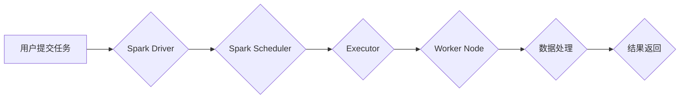

> Spark, 大数据处理, 分布式计算, 容错机制, 编程模型,  数据流处理,  机器学习

## 1. 背景介绍

在海量数据时代，高效处理和分析数据成为各行各业的关键挑战。传统的单机计算模式已难以满足对大数据处理的需求。分布式计算框架应运而生，Spark作为其中佼佼者，凭借其高性能、易用性和丰富的生态系统，迅速成为大数据处理的首选工具。

Spark由加州大学伯克利分校 AMPLab 开发，最初是为了解决 MapReduce 的一些局限性而设计。它采用内存计算模型，将数据加载到内存中进行处理，从而大幅提升了计算速度。此外，Spark还支持多种编程模型，包括基于 RDD（Resilient Distributed Datasets）的编程模型、基于 DataFrame 的编程模型以及流式处理模型，满足不同场景的需求。

## 2. 核心概念与联系

Spark 的核心概念包括：

* **RDD（Resilient Distributed Datasets）：** Spark 的基本数据结构，是分布式、可恢复的集合。RDD 可以通过一系列操作进行转换和聚合，最终生成新的 RDD。
* **DAG（Directed Acyclic Graph）：** Spark 将每个操作都表示为一个节点，并将节点之间的依赖关系表示为边，形成一个有向无环图。Spark 会根据 DAG 的拓扑结构，并行执行操作，提高计算效率。
* **调度器：** Spark 调度器负责将任务分配给不同的节点，并管理资源的分配。Spark 提供了两种调度器：本地调度器和集群调度器。
* **容错机制：** Spark 采用基于 RDD 的容错机制，可以自动检测和恢复因节点故障导致的数据丢失。

**Spark 架构流程图：**



## 3. 核心算法原理 & 具体操作步骤

### 3.1  算法原理概述

Spark 的核心算法是基于 DAG 的并行计算模型。它将任务分解成多个小的操作，并根据操作之间的依赖关系，将这些操作组织成一个 DAG。然后，Spark 调度器会根据 DAG 的拓扑结构，将任务分配给不同的节点执行。

### 3.2  算法步骤详解

1. **任务分解：** 将用户提交的任务分解成多个小的操作。
2. **DAG 构建：** 将操作之间的依赖关系表示为 DAG。
3. **任务调度：** Spark 调度器根据 DAG 的拓扑结构，将任务分配给不同的节点执行。
4. **并行执行：** 各个节点并行执行分配的任务。
5. **结果聚合：** 各个节点执行完任务后，将结果聚合到最终结果。

### 3.3  算法优缺点

**优点：**

* **高性能：** 采用内存计算模型，并行执行，大幅提升计算速度。
* **易用性：** 提供多种编程模型，方便用户选择。
* **生态系统丰富：** 拥有丰富的第三方库和工具，方便用户扩展功能。

**缺点：**

* **资源消耗：** 由于采用内存计算模型，对内存资源要求较高。
* **复杂性：** 调度和容错机制的实现较为复杂。

### 3.4  算法应用领域

Spark 的应用领域非常广泛，包括：

* **数据分析：** 对海量数据进行统计分析、模式识别等。
* **机器学习：** 训练机器学习模型，进行预测和分类等。
* **流式处理：** 实时处理流式数据，例如日志分析、异常检测等。
* **图形处理：** 处理图数据，例如社交网络分析、推荐系统等。

## 4. 数学模型和公式 & 详细讲解 & 举例说明

### 4.1  数学模型构建

Spark 的核心算法可以抽象为一个图论模型，其中：

* **节点：** 代表 Spark 中的操作。
* **边：** 代表操作之间的依赖关系。

DAG 的拓扑结构决定了操作的执行顺序。

### 4.2  公式推导过程

Spark 的并行计算模型可以利用并行计算的理论进行推导。例如，对于一个包含 N 个操作的 DAG，如果每个操作可以并行执行，那么总的执行时间可以近似为：

```latex
T = \frac{T_i}{P}
```

其中：

* $T$ 是总的执行时间。
* $T_i$ 是单个操作的执行时间。
* $P$ 是并行执行的线程数。

### 4.3  案例分析与讲解

假设我们有一个包含 10 个操作的 DAG，每个操作的执行时间为 1 秒，并行执行的线程数为 4。根据公式推导，总的执行时间为：

```latex
T = \frac{10}{4} = 2.5 秒
```

如果串行执行，总的执行时间为 10 秒。可见，并行执行可以大幅提升计算速度。

## 5. 项目实践：代码实例和详细解释说明

### 5.1  开发环境搭建

为了使用 Spark，需要搭建一个开发环境。常用的开发环境包括：

* **本地开发环境：** 使用 Spark 的本地模式，在单机上运行 Spark 应用。
* **集群开发环境：** 使用 Spark 的集群模式，在多个节点上运行 Spark 应用。

### 5.2  源代码详细实现

以下是一个简单的 Spark 代码实例，用于计算一个数据集的平均值：

```python
from pyspark.sql import SparkSession

# 创建 SparkSession
spark = SparkSession.builder.appName("AverageCalculation").getOrCreate()

# 读取数据
data = spark.read.text("data.txt")

# 计算平均值
average = data.agg({"value": "avg"}).collect()[0][0]

# 打印结果
print(f"Average value: {average}")

# 关闭 SparkSession
spark.stop()
```

### 5.3  代码解读与分析

* **创建 SparkSession：** SparkSession 是 Spark 的入口点，用于创建 Spark 上下文。
* **读取数据：** 使用 `spark.read.text()` 方法读取数据文件。
* **计算平均值：** 使用 `data.agg({"value": "avg"})` 方法计算数据的平均值。
* **打印结果：** 使用 `collect()` 方法将结果从分布式环境中收集到本地，然后打印结果。
* **关闭 SparkSession：** 使用 `spark.stop()` 方法关闭 Spark 上下文。

### 5.4  运行结果展示

运行上述代码后，将输出数据集的平均值。

## 6. 实际应用场景

Spark 在各个领域都有广泛的应用场景，例如：

* **电商平台：** 用于用户行为分析、商品推荐、库存管理等。
* **金融机构：** 用于风险控制、欺诈检测、客户画像等。
* **医疗机构：** 用于疾病诊断、药物研发、患者管理等。

### 6.4  未来应用展望

随着大数据量的不断增长，Spark 的应用场景将更加广泛。未来，Spark 将在以下领域发挥更大的作用：

* **人工智能：** Spark 将成为人工智能训练和推理的平台。
* **物联网：** Spark 将用于处理海量物联网数据，实现智能感知和决策。
* **边缘计算：** Spark 将被部署在边缘设备上，实现实时数据处理和分析。

## 7. 工具和资源推荐

### 7.1  学习资源推荐

* **Spark 官方文档：** https://spark.apache.org/docs/latest/
* **Spark 中文文档：** https://spark.apache.org/docs/latest/zh-cn/
* **Spark 入门教程：** https://spark.apache.org/docs/latest/getting-started.html

### 7.2  开发工具推荐

* **IDE：** Eclipse、IntelliJ IDEA、PyCharm
* **命令行工具：** Spark Shell、Scala REPL

### 7.3  相关论文推荐

* **Spark: Cluster Computing with Working Sets**
* **Resilient Distributed Datasets: A Fault-Tolerant Abstraction for In-Memory Cluster Computing**

## 8. 总结：未来发展趋势与挑战

### 8.1  研究成果总结

Spark 作为一种高效的分布式计算框架，在处理海量数据方面取得了显著的成果。其内存计算模型、DAG 优化算法和容错机制等技术，为大数据处理提供了强大的支持。

### 8.2  未来发展趋势

未来，Spark 将继续朝着以下方向发展：

* **更强的性能：** 通过优化算法、提高硬件利用率等方式，进一步提升 Spark 的性能。
* **更丰富的功能：** 开发新的功能模块，满足用户多样化的需求。
* **更易于使用：** 简化 Spark 的使用流程，降低用户学习成本。

### 8.3  面临的挑战

Spark 也面临着一些挑战，例如：

* **资源管理：** 随着数据量的不断增长，Spark 需要更加高效地管理资源。
* **数据安全：** 保护数据安全和隐私是 Spark 开发的重要课题。
* **生态系统建设：** 持续发展 Spark 的生态系统，提供更多优质的工具和资源。

### 8.4  研究展望

未来，Spark 将继续作为大数据处理领域的重要技术，并将在人工智能、物联网等领域发挥更大的作用。

## 9. 附录：常见问题与解答

### 9.1  常见问题

* **Spark 和 Hadoop 的区别？**
* **Spark 的编程模型有哪些？**
* **Spark 的容错机制是如何实现的？**

### 9.2  解答

* **Spark 和 Hadoop 的区别：** Spark 是一个分布式计算框架，而 Hadoop 是一个分布式存储和处理框架。Spark 可以运行在 Hadoop 的基础上，也可以独立运行。
* **Spark 的编程模型有哪些？** Spark 提供了三种编程模型：基于 RDD 的编程模型、基于 DataFrame 的编程模型和流式处理模型。
* **Spark 的容错机制是如何实现的？** Spark 采用基于 RDD 的容错机制，可以自动检测和恢复因节点故障导致的数据丢失。

作者：禅与计算机程序设计艺术 / Zen and the Art of Computer Programming


<end_of_turn>