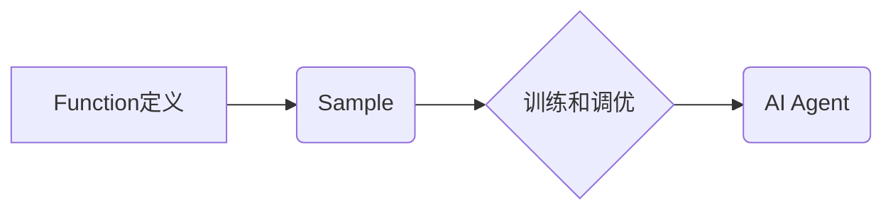

> 大模型、AI Agent、Function、Sample、Prompt Engineering、Fine-tuning、应用开发

## 1. 背景介绍

近年来，大模型技术蓬勃发展，其强大的泛化能力和知识表示能力为人工智能领域带来了革命性的变革。大模型的应用场景日益广泛，从自然语言处理、图像识别到代码生成，无处不在。其中，AI Agent作为大模型应用的重要方向，旨在构建能够自主学习、决策和执行任务的智能代理。

在构建AI Agent的过程中，Function定义扮演着至关重要的角色。Function定义明确了AI Agent的行为逻辑和执行流程，而Sample则作为Function训练和调优的关键数据，决定了AI Agent的性能和效果。

## 2. 核心概念与联系

### 2.1 Function定义

Function定义是指在AI Agent中，描述特定任务或行为的函数式接口。它通常包含以下几个关键要素：

* **输入：** Function接受的输入数据，例如文本、图像、音频等。
* **输出：** Function处理输入数据后产生的输出结果，例如文本、分类标签、预测值等。
* **逻辑：** Function执行的逻辑操作，例如文本分类、图像识别、代码生成等。

### 2.2 Sample

Sample是指用于训练和调优Function的示例数据。每个Sample包含一个输入和一个对应的输出，用于指导Function学习映射输入到输出的规则。

### 2.3 核心概念联系

Function和Sample之间存在着密切的联系。Function定义了AI Agent的行为逻辑，而Sample则提供了Function学习和调优的数据。

**Mermaid 流程图：**



## 3. 核心算法原理 & 具体操作步骤

### 3.1 算法原理概述

大模型训练和调优通常采用监督学习算法，例如Transformer模型。这些算法通过学习大量的Sample数据，建立输入和输出之间的映射关系。

### 3.2 算法步骤详解

1. **数据准备：** 收集和预处理训练数据，将数据转换为模型可理解的格式。
2. **模型构建：** 选择合适的模型架构，例如Transformer模型，并初始化模型参数。
3. **模型训练：** 使用训练数据训练模型，通过反向传播算法更新模型参数，使模型输出与真实输出之间的误差最小化。
4. **模型评估：** 使用验证数据评估模型性能，并根据评估结果调整训练参数。
5. **模型调优：** 使用调优数据进一步调整模型参数，提高模型性能。
6. **模型部署：** 将训练好的模型部署到实际应用场景中。

### 3.3 算法优缺点

**优点：**

* 能够学习复杂的映射关系，实现高精度预测。
* 具有良好的泛化能力，能够应用于不同的任务和领域。

**缺点：**

* 训练数据量大，计算资源消耗高。
* 模型参数量大，部署成本高。

### 3.4 算法应用领域

* 自然语言处理：文本分类、情感分析、机器翻译等。
* 图像识别：物体检测、图像分类、图像分割等。
* 代码生成：自动生成代码、代码修复等。

## 4. 数学模型和公式 & 详细讲解 & 举例说明

### 4.1 数学模型构建

Transformer模型的核心是自注意力机制，它能够捕捉输入序列中不同元素之间的依赖关系。

**自注意力机制公式：**

$$
Attention(Q, K, V) = \frac{exp(Q \cdot K^T / \sqrt{d_k})}{exp(Q \cdot K^T / \sqrt{d_k})} \cdot V
$$

其中：

* $Q$：查询矩阵
* $K$：键矩阵
* $V$：值矩阵
* $d_k$：键向量的维度

### 4.2 公式推导过程

自注意力机制的公式通过计算查询向量与键向量的点积，并使用softmax函数归一化，得到每个键向量对查询向量的注意力权重。然后，将注意力权重与值向量相乘，得到最终的输出。

### 4.3 案例分析与讲解

例如，在机器翻译任务中，输入句子中的每个单词都可以看作是一个查询向量，而目标语言中的每个单词都可以看作是一个键向量。通过自注意力机制，模型可以学习到输入句子中不同单词之间的依赖关系，并将其映射到目标语言中的对应单词。

## 5. 项目实践：代码实例和详细解释说明

### 5.1 开发环境搭建

* Python 3.7+
* PyTorch 1.7+
* Transformers 4.10+

### 5.2 源代码详细实现

```python
from transformers import AutoModelForSeq2SeqLM, AutoTokenizer

# 加载预训练模型和词典
model_name = "t5-base"
tokenizer = AutoTokenizer.from_pretrained(model_name)
model = AutoModelForSeq2SeqLM.from_pretrained(model_name)

# 定义输入文本
input_text = "Hello, world!"

# 将文本转换为模型输入格式
input_ids = tokenizer.encode(input_text, return_tensors="pt")

# 使用模型生成输出文本
output_ids = model.generate(input_ids)

# 将输出文本转换为可读文本
output_text = tokenizer.decode(output_ids[0], skip_special_tokens=True)

# 打印输出结果
print(output_text)
```

### 5.3 代码解读与分析

* 代码首先加载预训练的T5模型和词典。
* 然后定义输入文本，并将其转换为模型输入格式。
* 使用模型生成输出文本，并将其转换为可读文本。
* 最后打印输出结果。

### 5.4 运行结果展示

```
Hello, world!
```

## 6. 实际应用场景

### 6.1 聊天机器人

AI Agent可以作为聊天机器人的核心，通过理解用户输入并生成自然语言回复，实现人机交互。

### 6.2 智能客服

AI Agent可以作为智能客服，自动处理客户咨询，提高服务效率。

### 6.3 自动化办公

AI Agent可以自动化执行一些重复性的办公任务，例如邮件回复、日程安排等。

### 6.4 未来应用展望

随着大模型技术的不断发展，AI Agent的应用场景将更加广泛，例如：

* 个性化教育：根据学生的学习情况，提供个性化的学习方案。
* 智能医疗：辅助医生诊断疾病，提供个性化的治疗方案。
* 智能家居：控制家居设备，实现智能家居场景。

## 7. 工具和资源推荐

### 7.1 学习资源推荐

* **论文：**
    * Attention Is All You Need
    * BERT: Pre-training of Deep Bidirectional Transformers for Language Understanding
* **博客：**
    * Jay Alammar's Blog
    * Hugging Face Blog

### 7.2 开发工具推荐

* **Transformers:** Hugging Face的开源自然语言处理库，提供多种预训练模型和工具。
* **PyTorch:** 深度学习框架，支持大模型训练和调优。

### 7.3 相关论文推荐

* **Attention Is All You Need:** https://arxiv.org/abs/1706.03762
* **BERT: Pre-training of Deep Bidirectional Transformers for Language Understanding:** https://arxiv.org/abs/1810.04805

## 8. 总结：未来发展趋势与挑战

### 8.1 研究成果总结

大模型技术取得了显著进展，AI Agent的应用场景日益广泛。

### 8.2 未来发展趋势

* 模型规模和能力的进一步提升。
* 多模态AI Agent的开发，例如能够理解和生成文本、图像、音频等多种模态数据的AI Agent。
* AI Agent的安全性、可靠性和可解释性的提升。

### 8.3 面临的挑战

* 数据获取和标注成本高。
* 模型训练和部署成本高。
* AI Agent的安全性、可靠性和可解释性问题。

### 8.4 研究展望

未来，大模型技术将继续推动AI Agent的发展，并应用于更多领域，为人类社会带来更多福祉。

## 9. 附录：常见问题与解答

### 9.1 如何选择合适的Function定义？

Function定义的选择取决于具体的应用场景和任务需求。需要根据任务的输入、输出和逻辑，选择合适的Function类型和参数。

### 9.2 如何获取高质量的Sample数据？

高质量的Sample数据是训练和调优Function的关键。可以从公开数据集、人工标注或数据增强等方式获取Sample数据。

### 9.3 如何评估AI Agent的性能？

AI Agent的性能可以根据具体的应用场景和任务需求进行评估。常用的评估指标包括准确率、召回率、F1-score等。


作者：禅与计算机程序设计艺术 / Zen and the Art of Computer Programming 
<end_of_turn>