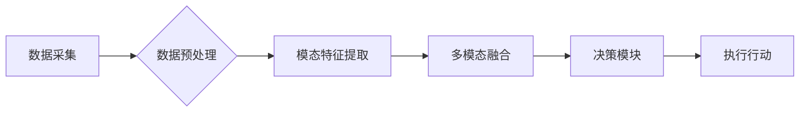

> 大模型、多模态、AI Agent、自然语言处理、计算机视觉、音频处理、数据融合、模型训练、应用开发

## 1. 背景介绍

近年来，人工智能（AI）技术取得了飞速发展，特别是大模型的涌现，为AI应用带来了新的机遇和挑战。大模型，是指参数规模庞大、训练数据海量的人工智能模型，其强大的学习能力和泛化能力使其能够处理复杂的任务，并展现出令人惊叹的性能。

多模态能力是AI发展的重要方向之一。人类感知世界的方式是多模态的，我们通过视觉、听觉、触觉、嗅觉等多种感官获取信息，并进行综合理解。而传统的AI模型大多局限于单一模态，例如文本或图像，缺乏对多模态信息的理解和处理能力。

多模态AI Agent是指能够理解和交互于多种模态信息的智能代理。它可以接收文本、图像、音频等多种输入，并生成相应的输出，例如文本、图像、语音等。多模态AI Agent具有广泛的应用前景，例如智能客服、虚拟助手、教育机器人、医疗诊断等。

## 2. 核心概念与联系

**2.1 多模态理解**

多模态理解是指从多个模态数据中提取特征，并进行融合和交互，以获得更全面的信息理解。

**2.2 AI Agent**

AI Agent是指能够感知环境、做出决策并执行行动的智能体。它可以自主学习和适应环境变化，并完成特定的任务。

**2.3 多模态AI Agent架构**

多模态AI Agent的架构通常包括以下几个模块：

* **数据采集模块:** 收集来自不同模态的数据，例如文本、图像、音频等。
* **数据预处理模块:** 对采集到的数据进行预处理，例如文本清洗、图像裁剪、音频降噪等。
* **模态特征提取模块:** 对不同模态的数据进行特征提取，例如文本词嵌入、图像卷积神经网络、音频声谱图等。
* **多模态融合模块:** 对不同模态的特征进行融合，例如注意力机制、图神经网络等。
* **决策模块:** 根据融合后的特征，做出决策并执行相应的行动。

**2.4 Mermaid 流程图**



## 3. 核心算法原理 & 具体操作步骤

### 3.1 算法原理概述

多模态AI Agent的训练通常采用监督学习或强化学习的方法。

* **监督学习:** 需要大量的标注数据，例如文本-图像对、文本-音频对等，训练模型将输入的多模态数据映射到相应的输出。
* **强化学习:** 模型通过与环境交互，学习如何完成任务，并获得奖励。

### 3.2 算法步骤详解

**3.2.1 监督学习训练步骤:**

1. **数据准备:** 收集并预处理多模态数据，并进行标注。
2. **模型构建:** 选择合适的模型架构，例如Transformer、CNN、RNN等，并进行初始化。
3. **模型训练:** 使用训练数据训练模型，并通过优化算法调整模型参数，使模型的预测结果与真实标签尽可能接近。
4. **模型评估:** 使用测试数据评估模型的性能，例如准确率、召回率、F1-score等。
5. **模型调优:** 根据评估结果，调整模型参数、训练策略等，以提高模型性能。

**3.2.2 强化学习训练步骤:**

1. **环境定义:** 定义AI Agent与环境的交互规则，以及奖励机制。
2. **策略网络构建:** 选择合适的策略网络架构，例如DQN、A2C等，并进行初始化。
3. **训练过程:** AI Agent与环境交互，根据策略网络的输出选择行动，并获得奖励。
4. **策略更新:** 使用强化学习算法，例如Q-learning、SARSA等，更新策略网络的参数，使AI Agent能够学习到最优策略。
5. **评估和部署:** 评估AI Agent的性能，并将其部署到实际应用场景中。

### 3.3 算法优缺点

**3.3.1 监督学习:**

* **优点:** 训练效果好，能够达到较高的准确率。
* **缺点:** 需要大量的标注数据，数据标注成本高。

**3.3.2 强化学习:**

* **优点:** 不需要大量的标注数据，能够学习到更复杂的策略。
* **缺点:** 训练过程较慢，收敛性较差。

### 3.4 算法应用领域

多模态AI Agent的应用领域非常广泛，例如：

* **智能客服:** 能够理解用户的多模态输入，并提供更精准的回复。
* **虚拟助手:** 能够理解用户的语音、文本和图像输入，并完成相应的任务，例如日程安排、信息查询等。
* **教育机器人:** 能够通过多模态交互，与学生进行互动学习。
* **医疗诊断:** 能够辅助医生进行诊断，例如分析医学图像、识别病症等。

## 4. 数学模型和公式 & 详细讲解 & 举例说明

### 4.1 数学模型构建

多模态AI Agent的数学模型通常基于深度学习框架，例如TensorFlow、PyTorch等。模型的结构可以根据具体任务和数据特点进行设计，例如Transformer、CNN、RNN等。

### 4.2 公式推导过程

**4.2.1 注意力机制:**

注意力机制是一种用于学习数据中重要特征的方法。其核心思想是通过计算不同数据元素之间的相关性，赋予重要元素更高的权重，从而提高模型的学习效率和准确率。

注意力机制的公式如下：

$$
\text{Attention}(Q, K, V) = \text{softmax}\left(\frac{Q K^T}{\sqrt{d_k}}\right) V
$$

其中：

* $Q$：查询矩阵
* $K$：键矩阵
* $V$：值矩阵
* $d_k$：键向量的维度
* $\text{softmax}$：softmax函数

**4.2.2 损失函数:**

损失函数用于衡量模型预测结果与真实标签之间的差异。常用的损失函数包括交叉熵损失、均方误差损失等。

**4.2.3 优化算法:**

优化算法用于更新模型参数，使模型的损失函数最小化。常用的优化算法包括梯度下降、Adam等。

### 4.3 案例分析与讲解

**4.3.1 图像字幕生成:**

图像字幕生成任务是指根据图像内容生成相应的文本描述。

**4.3.2 文本摘要:**

文本摘要任务是指根据给定的文本，生成一个更短的摘要，保留文本的主要信息。

## 5. 项目实践：代码实例和详细解释说明

### 5.1 开发环境搭建

* **操作系统:** Ubuntu 20.04
* **Python版本:** 3.8
* **深度学习框架:** TensorFlow 2.x

### 5.2 源代码详细实现

```python
# 导入必要的库
import tensorflow as tf

# 定义模型架构
class MultiModalModel(tf.keras.Model):
    def __init__(self, text_embedding_dim, image_embedding_dim, fusion_dim):
        super(MultiModalModel, self).__init__()
        self.text_embedding = tf.keras.layers.Embedding(vocab_size, text_embedding_dim)
        self.image_embedding = tf.keras.layers.Conv2D(filters=image_embedding_dim, kernel_size=(3, 3), activation='relu')
        self.fusion_layer = tf.keras.layers.Dense(fusion_dim)
        self.output_layer = tf.keras.layers.Dense(num_classes)

    def call(self, text, image):
        text_embedding = self.text_embedding(text)
        image_embedding = self.image_embedding(image)
        fused_embedding = self.fusion_layer(tf.concat([text_embedding, image_embedding], axis=-1))
        output = self.output_layer(fused_embedding)
        return output

# 实例化模型
model = MultiModalModel(text_embedding_dim=128, image_embedding_dim=64, fusion_dim=256)

# 编译模型
model.compile(optimizer='adam', loss='categorical_crossentropy', metrics=['accuracy'])

# 训练模型
model.fit(x_train, y_train, epochs=10)

# 评估模型
loss, accuracy = model.evaluate(x_test, y_test)
print('Loss:', loss)
print('Accuracy:', accuracy)
```

### 5.3 代码解读与分析

* **模型架构:** 模型采用多层感知机 (MLP) 架构，将文本和图像特征融合后进行分类。
* **文本嵌入:** 使用嵌入层将文本单词映射到低维向量空间。
* **图像嵌入:** 使用卷积神经网络 (CNN) 从图像中提取特征。
* **特征融合:** 使用全连接层将文本和图像特征进行融合。
* **输出层:** 使用全连接层进行分类。

### 5.4 运行结果展示

训练完成后，模型可以用于预测新的文本和图像数据。

## 6. 实际应用场景

### 6.1 智能客服

多模态AI Agent可以理解用户的文本、语音和图像输入，并提供更精准的回复，例如回答常见问题、提供产品信息、预约服务等。

### 6.2 虚拟助手

多模态AI Agent可以帮助用户完成各种任务，例如日程安排、信息查询、音乐播放、天气预报等。

### 6.3 教育机器人

多模态AI Agent可以与学生进行互动学习，例如回答问题、提供讲解、进行游戏等。

### 6.4 未来应用展望

多模态AI Agent的应用前景非常广阔，未来可能在以下领域得到更广泛的应用：

* **医疗诊断:** 辅助医生进行诊断，例如分析医学图像、识别病症等。
* **金融服务:** 进行风险评估、欺诈检测等。
* **智能家居:** 控制家电设备、提供个性化服务等。

## 7. 工具和资源推荐

### 7.1 学习资源推荐

* **书籍:**
    * 《深度学习》
    * 《自然语言处理》
    * 《计算机视觉》
* **在线课程:**
    * Coursera
    * edX
    * Udacity

### 7.2 开发工具推荐

* **深度学习框架:** TensorFlow, PyTorch
* **数据处理工具:** Pandas, NumPy
* **可视化工具:** Matplotlib, Seaborn

### 7.3 相关论文推荐

* **Attention Is All You Need:** https://arxiv.org/abs/1706.03762
* **BERT: Pre-training of Deep Bidirectional Transformers for Language Understanding:** https://arxiv.org/abs/1810.04805
* **ImageNet Classification with Deep Convolutional Neural Networks:** https://papers.nips.cc/paper/4824-imagenet-classification-with-deep-convolutional-neural-networks.pdf

## 8. 总结：未来发展趋势与挑战

### 8.1 研究成果总结

近年来，多模态AI Agent取得了显著进展，例如在图像字幕生成、文本摘要、问答系统等任务上取得了优异的性能。

### 8.2 未来发展趋势

* **模型规模和能力提升:** 未来，多模态AI Agent模型规模将进一步扩大，并具备更强的理解和生成能力。
* **跨模态知识融合:** 将不同模态之间的知识进行融合，提升模型的泛化能力和鲁棒性。
* **个性化定制:** 根据用户的需求和偏好，定制个性化的多模态AI Agent。

### 8.3 面临的挑战

*