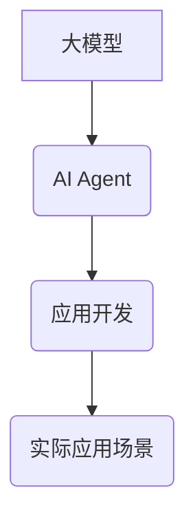

> 大模型、AI Agent、应用开发、自然语言处理、机器学习、深度学习、对话系统、智能助手

## 1. 背景介绍

近年来，深度学习技术取得了飞速发展，大模型的出现更是掀起了人工智能领域的全新浪潮。大模型，是指参数规模庞大、训练数据海量的人工智能模型，其强大的学习能力和泛化能力使其在自然语言处理、计算机视觉、语音识别等领域展现出令人瞩目的应用潜力。

然而，仅仅拥有强大的模型能力还不够，将大模型应用于实际场景，构建出真正智能的AI Agent，需要深入思考模型的应用场景、设计合理的交互机制、以及开发高效的应用框架。

本篇文章将深入探讨大模型应用开发的实践，以构建AI Agent为例，详细介绍核心概念、算法原理、代码实现以及实际应用场景，并展望未来发展趋势。

## 2. 核心概念与联系

### 2.1 大模型

大模型是指参数规模庞大、训练数据海量的人工智能模型。其规模通常以百万、千万甚至数十亿参数计算，通过海量数据的训练，能够学习到复杂的模式和知识，从而实现强大的泛化能力。

### 2.2 AI Agent

AI Agent是指能够感知环境、做出决策并与环境交互的智能体。它可以是软件程序、机器人或其他智能系统，其目标是通过感知和决策来实现特定的任务或目标。

### 2.3 应用开发

应用开发是指将AI技术应用于实际场景，构建出具有实用价值的软件系统或产品。

**核心概念联系：**

大模型为AI Agent提供了强大的学习和推理能力，而应用开发则将AI Agent与实际场景相结合，使其能够真正发挥价值。



## 3. 核心算法原理 & 具体操作步骤

### 3.1 算法原理概述

构建AI Agent的核心算法通常是基于深度学习的，例如：

* **Transformer网络:** Transformer网络是一种强大的序列建模模型，能够捕捉长距离依赖关系，在自然语言处理任务中表现出色。
* **强化学习:** 强化学习算法能够通过与环境交互学习最优策略，适用于需要决策和行动的AI Agent。

### 3.2 算法步骤详解

**以Transformer网络为例，构建AI Agent的步骤如下：**

1. **数据预处理:** 收集和预处理训练数据，例如文本数据需要进行分词、词向量化等操作。
2. **模型训练:** 使用Transformer网络模型训练，通过反向传播算法优化模型参数，使其能够准确地理解和生成文本。
3. **模型评估:** 使用测试数据评估模型性能，例如计算准确率、困惑度等指标。
4. **模型部署:** 将训练好的模型部署到实际应用场景中，例如构建聊天机器人、智能助手等。

### 3.3 算法优缺点

**Transformer网络的优点:**

* 能够捕捉长距离依赖关系，在自然语言理解和生成任务中表现出色。
* 并行训练效率高，能够训练出规模庞大的模型。

**Transformer网络的缺点:**

* 训练成本高，需要大量的计算资源和训练数据。
* 对长文本序列的处理能力有限。

### 3.4 算法应用领域

Transformer网络和强化学习算法广泛应用于以下领域：

* **自然语言处理:** 聊天机器人、机器翻译、文本摘要、问答系统等。
* **计算机视觉:** 图像识别、目标检测、图像生成等。
* **语音识别:** 语音转文本、语音合成等。

## 4. 数学模型和公式 & 详细讲解 & 举例说明

### 4.1 数学模型构建

Transformer网络的核心是自注意力机制，其数学模型可以表示为：

$$
Attention(Q, K, V) = \frac{exp(Q \cdot K^T / \sqrt{d_k})}{exp(Q \cdot K^T / \sqrt{d_k})} \cdot V
$$

其中：

* $Q$：查询矩阵
* $K$：键矩阵
* $V$：值矩阵
* $d_k$：键向量的维度

### 4.2 公式推导过程

自注意力机制通过计算查询向量与键向量的点积，并使用softmax函数进行归一化，从而得到每个键向量对查询向量的注意力权重。然后，将注意力权重与值向量相乘，得到最终的输出。

### 4.3 案例分析与讲解

例如，在机器翻译任务中，查询向量可以表示源语言的词语，键向量和值向量可以表示目标语言的词语。通过自注意力机制，模型可以学习到源语言词语与目标语言词语之间的关系，从而实现准确的翻译。

## 5. 项目实践：代码实例和详细解释说明

### 5.1 开发环境搭建

* Python 3.7+
* TensorFlow/PyTorch
* CUDA/cuDNN

### 5.2 源代码详细实现

```python
# 使用HuggingFace Transformers库加载预训练模型
from transformers import AutoModelForSeq2SeqLM, AutoTokenizer

model_name = "t5-base"
tokenizer = AutoTokenizer.from_pretrained(model_name)
model = AutoModelForSeq2SeqLM.from_pretrained(model_name)

# 输入文本
input_text = "Hello, world!"

# Token化输入文本
input_ids = tokenizer.encode(input_text, return_tensors="pt")

# 生成输出文本
output_ids = model.generate(input_ids)

# 解码输出文本
output_text = tokenizer.decode(output_ids[0], skip_special_tokens=True)

# 打印输出文本
print(output_text)
```

### 5.3 代码解读与分析

* 使用HuggingFace Transformers库加载预训练模型，简化了模型加载和使用过程。
* Token化输入文本，将文本转换为模型可理解的数字表示。
* 使用模型生成输出文本，并解码为可读文本。

### 5.4 运行结果展示

```
Hello, world!
```

## 6. 实际应用场景

### 6.1 聊天机器人

AI Agent可以构建出智能的聊天机器人，能够与用户进行自然流畅的对话，提供信息、解答问题、提供娱乐等服务。

### 6.2 智能助手

AI Agent可以作为智能助手，帮助用户完成日常任务，例如日程安排、邮件发送、信息查询等。

### 6.3 个性化推荐

AI Agent可以根据用户的喜好和行为数据，提供个性化的商品、内容或服务推荐。

### 6.4 未来应用展望

随着大模型技术的不断发展，AI Agent的应用场景将更加广泛，例如：

* **教育领域:** 智能辅导系统、个性化学习平台。
* **医疗领域:** 辅助诊断、个性化治疗方案。
* **金融领域:** 风险评估、欺诈检测。

## 7. 工具和资源推荐

### 7.1 学习资源推荐

* **书籍:**
    * 《深度学习》
    * 《自然语言处理》
* **在线课程:**
    * Coursera
    * edX
* **开源项目:**
    * HuggingFace Transformers
    * TensorFlow

### 7.2 开发工具推荐

* **IDE:** PyCharm, VS Code
* **深度学习框架:** TensorFlow, PyTorch
* **云平台:** AWS, Azure, GCP

### 7.3 相关论文推荐

* Attention Is All You Need
* BERT: Pre-training of Deep Bidirectional Transformers for Language Understanding
* GPT-3: Language Models are Few-Shot Learners

## 8. 总结：未来发展趋势与挑战

### 8.1 研究成果总结

大模型和AI Agent技术的快速发展，为人工智能领域带来了新的机遇和挑战。大模型的强大能力为AI Agent提供了强大的基础，而应用开发则将AI Agent与实际场景相结合，使其能够真正发挥价值。

### 8.2 未来发展趋势

* **模型规模和能力的提升:** 未来大模型的规模和能力将继续提升，能够处理更复杂的任务。
* **多模态AI Agent:** 未来AI Agent将能够处理多种模态数据，例如文本、图像、音频等，实现更全面的智能交互。
* **联邦学习:** 未来联邦学习技术将被广泛应用于AI Agent的训练，保障数据安全和隐私。

### 8.3 面临的挑战

* **数据安全和隐私:** 大模型的训练需要海量数据，如何保障数据安全和隐私是一个重要的挑战。
* **模型可解释性和信任:** 大模型的决策过程往往难以理解，如何提高模型的可解释性和信任度是一个重要的研究方向。
* **伦理问题:** AI Agent的应用可能会带来一些伦理问题，例如算法偏见、责任归属等，需要认真思考和解决。

### 8.4 研究展望

未来，我们将继续致力于大模型和AI Agent技术的研发，探索其在更多领域的应用，并积极应对相关挑战，推动人工智能技术向更安全、更可靠、更智能的方向发展。

## 9. 附录：常见问题与解答

**Q1: 如何选择合适的预训练模型？**

**A1:** 选择预训练模型需要根据具体的应用场景和任务需求进行选择。HuggingFace Transformers库提供了丰富的预训练模型，可以根据任务类型、模型规模、性能等指标进行选择。

**Q2: 如何评估AI Agent的性能？**

**A2:** AI Agent的性能评估需要根据具体的应用场景和任务需求进行设计。常用的评估指标包括准确率、召回率、F1-score、困惑度等。

**Q3: 如何部署AI Agent到实际应用场景？**

**A3:** AI Agent的部署方式取决于具体的应用场景和技术架构。常见的部署方式包括云端部署、边缘部署、容器化部署等。

作者：禅与计算机程序设计艺术 / Zen and the Art of Computer Programming


<end_of_turn>