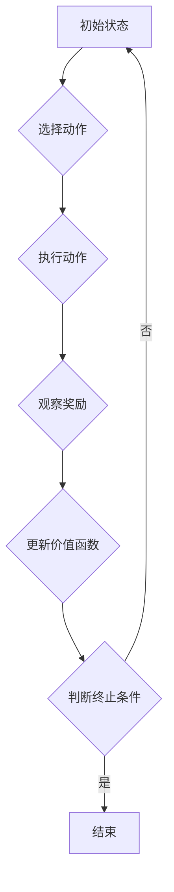

> Q-learning, 强化学习, 价值函数, 策略, 探索与利用, 贪婪策略, 马尔可夫决策过程

## 1. 背景介绍

在人工智能领域，强化学习 (Reinforcement Learning, RL) 作为一种模仿人类学习方式的算法，近年来取得了显著进展，并在机器人控制、游戏 AI、推荐系统等领域展现出强大的应用潜力。其中，Q-learning 作为 RL 的经典算法之一，以其简单易懂、易于实现的特点，成为了研究和应用的热点。

Q-learning 算法的核心思想是通过学习一个价值函数 (Value Function)，来评估在特定状态下采取特定动作的长期回报。这个价值函数就像一个智能体的“经验地图”，帮助它在不断与环境交互的过程中，做出最优决策，从而最大化累积的奖励。

## 2. 核心概念与联系

**2.1 马尔可夫决策过程 (MDP)**

Q-learning 算法的基础是马尔可夫决策过程 (Markov Decision Process, MDP)。MDP 是一个数学模型，用于描述一个智能体与环境交互的过程。MDP 包含以下几个关键要素：

* **状态空间 (State Space)**：表示智能体可能处于的所有状态。
* **动作空间 (Action Space)**：表示智能体在每个状态下可以采取的所有动作。
* **转移概率 (Transition Probability)**：表示从一个状态执行一个动作后，转移到另一个状态的概率。
* **奖励函数 (Reward Function)**：表示在某个状态执行某个动作后获得的奖励。

**2.2 价值函数 (Value Function)**

价值函数是 Q-learning 算法的核心概念之一。它用来评估在特定状态下采取特定动作的长期回报。

* **状态价值函数 (State-Value Function)**：表示在特定状态下，采取任何动作的期望累积奖励。
* **动作价值函数 (Action-Value Function)**：表示在特定状态下采取特定动作的期望累积奖励。

**2.3 策略 (Policy)**

策略是指智能体在不同状态下选择动作的规则。策略可以是确定性的，也可以是随机的。

**2.4 探索与利用 (Exploration vs. Exploitation)**

在强化学习过程中，智能体需要在探索未知状态和利用已知知识之间进行权衡。

* **探索 (Exploration)**：尝试新的动作和状态，以获取更多信息。
* **利用 (Exploitation)**：选择已知最优的动作和状态，以最大化奖励。

**2.5 贪婪策略 (Greedy Policy)**

贪婪策略是指在每个状态下，选择价值函数评估最高的动作。

**Mermaid 流程图**



## 3. 核心算法原理 & 具体操作步骤

### 3.1 算法原理概述

Q-learning 算法是一种基于价值函数的强化学习算法，其目标是学习一个动作价值函数，该函数能够评估在每个状态下采取每个动作的长期回报。

Q-learning 算法的核心思想是通过迭代更新动作价值函数，使其逐渐逼近最优动作价值函数。更新规则基于 Bellman 方程，它描述了动作价值函数在时间步长 t 的更新与未来奖励和状态价值函数的关系。

### 3.2 算法步骤详解

1. **初始化动作价值函数 Q(s, a)**：将所有状态-动作对的价值函数初始化为 0 或一个小的随机值。
2. **根据策略选择动作**：在每个时间步长 t，根据当前状态 s 和策略 π，选择一个动作 a。
3. **执行动作并观察奖励**：执行动作 a，观察环境返回的奖励 r 和下一个状态 s'。
4. **更新动作价值函数**：根据 Bellman 方程更新动作价值函数：

 $$Q(s, a) \leftarrow Q(s, a) + \alpha [r + \gamma \max_{a'} Q(s', a') - Q(s, a)]$$

其中：

* α 是学习率，控制着学习速率。
* γ 是折扣因子，控制着未来奖励的权重。
* max_{a'} Q(s', a') 是下一个状态 s' 下所有动作的价值函数的最大值。

5. **重复步骤 2-4**：直到达到终止条件，例如，达到最大时间步长或达到目标状态。

### 3.3 算法优缺点

**优点：**

* 简单易懂，易于实现。
* 不需要事先知道环境模型。
* 可以应用于离散状态和动作空间。

**缺点：**

* 学习速度可能较慢。
* 容易陷入局部最优解。
* 对高维状态空间的处理能力有限。

### 3.4 算法应用领域

Q-learning 算法在以下领域具有广泛的应用：

* **机器人控制**：训练机器人执行复杂的任务，例如导航、抓取和 Manipulation。
* **游戏 AI**：开发能够与人类玩家竞争的游戏 AI。
* **推荐系统**：根据用户的历史行为推荐物品或服务。
* **医疗诊断**：辅助医生诊断疾病。

## 4. 数学模型和公式 & 详细讲解 & 举例说明

### 4.1 数学模型构建

Q-learning 算法的核心数学模型是动作价值函数 Q(s, a)，它表示在状态 s 下执行动作 a 的期望累积奖励。

### 4.2 公式推导过程

Q-learning 算法的更新规则基于 Bellman 方程：

$$Q(s, a) \leftarrow Q(s, a) + \alpha [r + \gamma \max_{a'} Q(s', a') - Q(s, a)]$$

其中：

* α 是学习率，控制着学习速率。
* γ 是折扣因子，控制着未来奖励的权重。
* r 是在状态 s 执行动作 a 后获得的奖励。
* s' 是执行动作 a 后到达的下一个状态。
* max_{a'} Q(s', a') 是下一个状态 s' 下所有动作的价值函数的最大值。

### 4.3 案例分析与讲解

假设有一个简单的环境，智能体可以处于两个状态：状态 1 和状态 2。智能体可以执行两个动作：动作 1 和动作 2。

* 状态 1 的奖励为 1，状态 2 的奖励为 0。
* 执行动作 1 从状态 1 转移到状态 2，执行动作 2 从状态 2 转移到状态 1。

使用 Q-learning 算法，我们可以学习到以下动作价值函数：

* Q(1, 1) = 0.5
* Q(1, 2) = 0.5
* Q(2, 1) = 0.5
* Q(2, 2) = 0.5

这意味着，在状态 1 和状态 2 下，执行动作 1 和动作 2 的期望累积奖励都是 0.5。

## 5. 项目实践：代码实例和详细解释说明

### 5.1 开发环境搭建

* Python 3.x
* TensorFlow 或 PyTorch

### 5.2 源代码详细实现

```python
import numpy as np

# 定义环境
class Environment:
    def __init__(self):
        self.state = 1

    def step(self, action):
        if self.state == 1:
            if action == 0:
                self.state = 2
                reward = 1
            else:
                self.state = 1
                reward = 0
        else:
            if action == 0:
                self.state = 1
                reward = 0
            else:
                self.state = 2
                reward = 1
        return self.state, reward

# 定义 Q-learning 算法
class QLearning:
    def __init__(self, state_size, action_size, learning_rate=0.1, discount_factor=0.9):
        self.state_size = state_size
        self.action_size = action_size
        self.learning_rate = learning_rate
        self.discount_factor = discount_factor
        self.q_table = np.zeros((state_size, action_size))

    def choose_action(self, state):
        return np.argmax(self.q_table[state, :])

    def update_q_table(self, state, action, reward, next_state):
        self.q_table[state, action] += self.learning_rate * (reward + self.discount_factor * np.max(self.q_table[next_state, :]) - self.q_table[state, action])

# 实例化环境和 Q-learning 算法
env = Environment()
agent = QLearning(state_size=2, action_size=2)

# 训练
for episode in range(1000):
    state = env.reset()
    done = False
    while not done:
        action = agent.choose_action(state)
        next_state, reward = env.step(action)
        agent.update_q_table(state, action, reward, next_state)
        state = next_state
        done = state == 2

# 打印 Q-table
print(agent.q_table)
```

### 5.3 代码解读与分析

* **环境类 (Environment)**：定义了环境的状态和动作，以及环境的转移规则和奖励函数。
* **Q-learning 类 (QLearning)**：实现了 Q-learning 算法的核心逻辑，包括初始化 Q-table、选择动作、更新 Q-table 等。
* **训练循环**：通过循环执行环境的步骤，并更新 Q-table，最终学习到最优的动作策略。

### 5.4 运行结果展示

运行代码后，会输出 Q-table 的值，其中每个值代表在对应状态下执行对应动作的期望累积奖励。

## 6. 实际应用场景

### 6.1 游戏 AI

Q-learning 算法可以用于训练游戏 AI，例如 AlphaGo 和 AlphaZero。这些 AI 通过学习游戏规则和历史数据，能够战胜人类玩家。

### 6.2 机器人控制

Q-learning 算法可以用于训练机器人执行复杂的任务，例如导航、抓取和 Manipulation。

### 6.3 推荐系统

Q-learning 算法可以用于训练推荐系统，根据用户的历史行为推荐物品或服务。

### 6.4 未来应用展望

Q-learning 算法在未来将有更广泛的应用，例如：

* **自动驾驶**：训练自动驾驶汽车在复杂环境中行驶。
* **医疗诊断**：辅助医生诊断疾病。
* **金融交易**：开发自动交易系统。

## 7. 工具和资源推荐

### 7.1 学习资源推荐

* **书籍**：
    * Reinforcement Learning: An Introduction by Richard S. Sutton and Andrew G. Barto
    * Deep Reinforcement Learning Hands-On by Maxim Lapan
* **在线课程**：
    * Coursera: Reinforcement Learning Specialization by David Silver
    * Udacity: Deep Reinforcement Learning Nanodegree

### 7.2 开发工具推荐

* **TensorFlow**：开源机器学习框架，支持 Q-learning 算法的实现。
* **PyTorch**：开源机器学习框架，支持 Q-learning 算法的实现。
* **OpenAI Gym**：强化学习环境库，提供多种标准环境，方便 Q-learning 算法的测试和评估。

### 7.3 相关论文推荐

* **Q-Learning** by Richard S. Sutton and Andrew G. Barto (1998)
* **Deep Q-Network** by Volodymyr Mnih et al. (2015)
* **Proximal Policy Optimization Algorithms** by John Schulman et al. (2017)

## 8. 总结：未来发展趋势与挑战

###