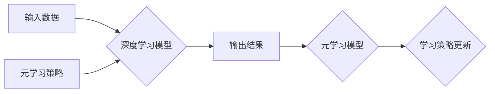

> 深度学习，元学习，映射，模型迁移，泛化能力，数据效率

## 1. 背景介绍

深度学习近年来取得了令人瞩目的成就，在图像识别、自然语言处理、语音识别等领域取得了突破性的进展。然而，深度学习模型的训练过程仍然面临着一些挑战，例如数据依赖性强、训练成本高、泛化能力有限等。

元学习（Meta-Learning）作为一种新兴的机器学习范式，旨在学习如何学习，从而提高模型的泛化能力和数据效率。元学习的目标是通过学习一系列任务的学习策略，从而能够快速适应新的任务。

## 2. 核心概念与联系

**2.1 深度学习**

深度学习是一种基于多层神经网络的机器学习方法。它能够从大量数据中学习复杂的特征表示，并用于各种机器学习任务。

**2.2 元学习**

元学习的目标是学习如何学习，而不是直接学习特定任务。它通过学习一系列任务的学习策略，从而能够快速适应新的任务。

**2.3 映射关系**

深度学习模型可以看作是将输入数据映射到输出结果的函数。元学习则试图学习一个更高级的映射关系，即学习如何学习映射关系。

**2.4 深度学习与元学习的结合**

将深度学习与元学习结合起来，可以利用元学习的优势来提高深度学习模型的泛化能力和数据效率。

**2.5 架构图**



## 3. 核心算法原理 & 具体操作步骤

**3.1 算法原理概述**

元学习算法通常分为两部分：

* **内循环:** 在每个任务上进行梯度下降训练，学习任务特定的模型参数。
* **外循环:** 通过优化元学习策略参数，学习如何适应不同的任务。

**3.2 算法步骤详解**

1. **初始化:** 初始化深度学习模型参数和元学习策略参数。
2. **内循环:**
    * 从训练集中随机抽取一个任务。
    * 在该任务上进行梯度下降训练，更新深度学习模型参数。
3. **外循环:**
    * 计算元学习策略参数的梯度。
    * 更新元学习策略参数。
4. **重复步骤2和3:** 直到达到预设的训练轮数或性能指标。

**3.3 算法优缺点**

* **优点:**
    * 提高模型的泛化能力。
    * 降低模型的训练成本。
* **缺点:**
    * 训练过程复杂。
    * 需要大量的训练数据。

**3.4 算法应用领域**

* **图像识别:** 元学习可以用于学习图像分类、目标检测等任务的学习策略，从而提高模型的泛化能力。
* **自然语言处理:** 元学习可以用于学习文本分类、机器翻译等任务的学习策略，从而提高模型的性能。
* **机器人控制:** 元学习可以用于学习机器人控制策略，从而提高机器人的适应性。

## 4. 数学模型和公式 & 详细讲解 & 举例说明

**4.1 数学模型构建**

假设我们有一个包含 $N$ 个任务的集合 $\mathcal{T} = \{T_1, T_2, ..., T_N\}$. 每个任务 $T_i$ 包含一个训练集 $D_i$ 和一个测试集 $S_i$. 我们希望学习一个元学习模型 $M$，它能够学习如何从任务 $T_i$ 的训练集 $D_i$ 中学习一个模型参数 $\theta_i$，从而在测试集 $S_i$ 上获得最佳性能。

**4.2 公式推导过程**

元学习模型 $M$ 的目标函数可以定义为：

$$
\mathcal{L}(M, \mathcal{T}) = \sum_{i=1}^{N} \mathcal{L}_i(M, D_i, S_i)
$$

其中，$\mathcal{L}_i(M, D_i, S_i)$ 是任务 $T_i$ 的损失函数，它衡量了模型 $M$ 在训练集 $D_i$ 上学习到的模型参数 $\theta_i$ 在测试集 $S_i$ 上的性能。

元学习模型 $M$ 的参数可以通过梯度下降算法进行优化：

$$
\theta_M = \theta_M - \alpha \nabla_{\theta_M} \mathcal{L}(M, \mathcal{T})
$$

其中，$\alpha$ 是学习率。

**4.3 案例分析与讲解**

例如，在图像分类任务中，我们可以使用元学习算法来学习一个模型，它能够从少量图像数据中学习分类策略。

## 5. 项目实践：代码实例和详细解释说明

**5.1 开发环境搭建**

* Python 3.7+
* TensorFlow 2.0+
* PyTorch 1.0+

**5.2 源代码详细实现**

```python
import tensorflow as tf

# 定义元学习模型
class MetaLearner(tf.keras.Model):
    def __init__(self, input_shape, num_classes):
        super(MetaLearner, self).__init__()
        self.encoder = tf.keras.Sequential([
            tf.keras.layers.Flatten(input_shape=input_shape),
            tf.keras.layers.Dense(128, activation='relu'),
            tf.keras.layers.Dense(num_classes)
        ])

    def call(self, inputs):
        return self.encoder(inputs)

# 定义训练函数
def train_step(model, optimizer, task_data):
    with tf.GradientTape() as tape:
        # 计算损失
        loss = tf.keras.losses.CategoricalCrossentropy()(task_data['labels'], model(task_data['images']))
    # 更新模型参数
    gradients = tape.gradient(loss, model.trainable_variables)
    optimizer.apply_gradients(zip(gradients, model.trainable_variables))
    return loss

# 定义元学习训练函数
def meta_train(model, optimizer, train_tasks, epochs):
    for epoch in range(epochs):
        for task in train_tasks:
            # 训练一个任务
            loss = train_step(model, optimizer, task)
            print(f'Epoch: {epoch}, Task: {task}, Loss: {loss}')

# 实例化模型和优化器
model = MetaLearner(input_shape=(28, 28), num_classes=10)
optimizer = tf.keras.optimizers.Adam(learning_rate=0.001)

# 定义训练任务
train_tasks = ...

# 元学习训练
meta_train(model, optimizer, train_tasks, epochs=10)
```

**5.3 代码解读与分析**

* `MetaLearner` 类定义了元学习模型，它包含一个编码器，用于将输入数据映射到输出结果。
* `train_step` 函数定义了单个任务的训练步骤，它计算损失并更新模型参数。
* `meta_train` 函数定义了元学习训练过程，它迭代训练多个任务，并更新元学习模型的参数。

**5.4 运行结果展示**

运行代码后，可以观察到模型在每个任务上的损失值，以及模型在测试集上的性能。

## 6. 实际应用场景

**6.1 图像分类**

元学习可以用于学习图像分类的学习策略，从而提高模型的泛化能力。例如，可以训练一个元学习模型，它能够从少量图像数据中学习分类策略，并应用于新的图像分类任务。

**6.2 自然语言处理**

元学习可以用于学习自然语言处理任务的学习策略，例如文本分类、机器翻译等。例如，可以训练一个元学习模型，它能够从少量文本数据中学习分类策略，并应用于新的文本分类任务。

**6.3 机器人控制**

元学习可以用于学习机器人控制策略，从而提高机器人的适应性。例如，可以训练一个元学习模型，它能够从少量机器人控制数据中学习控制策略，并应用于新的环境中。

**6.4 未来应用展望**

元学习在人工智能领域具有广阔的应用前景，未来可能应用于以下领域：

* **个性化学习:** 根据用户的学习风格和需求，定制个性化的学习策略。
* **自动驾驶:** 学习驾驶策略，提高自动驾驶系统的安全性。
* **医疗诊断:** 学习诊断策略，提高医疗诊断的准确性。

## 7. 工具和资源推荐

**7.1 学习资源推荐**

* **论文:**
    * Meta-Learning with Differentiable Convex Optimization
    * Model-Agnostic Meta-Learning for Fast Adaptation of Deep Networks
* **博客:**
    * OpenAI Blog: Meta-Learning
    * Towards Data Science: Meta-Learning

**7.2 开发工具推荐**

* **TensorFlow:** https://www.tensorflow.org/
* **PyTorch:** https://pytorch.org/

**7.3 相关论文推荐**

* Meta-Learning with Differentiable Convex Optimization
* Model-Agnostic Meta-Learning for Fast Adaptation of Deep Networks
* Reptile: A Scalable Meta-Learning Algorithm

## 8. 总结：未来发展趋势与挑战

**8.1 研究成果总结**

元学习在人工智能领域取得了显著的进展，能够有效提高模型的泛化能力和数据效率。

**8.2 未来发展趋势**

* **更有效的元学习算法:** 研究更有效的元学习算法，提高模型的学习效率和性能。
* **更广泛的应用场景:** 将元学习应用于更多领域，例如个性化学习、自动驾驶、医疗诊断等。
* **理论研究:** 深入研究元学习的理论基础，理解元学习的机制和局限性。

**8.3 面临的挑战**

* **数据效率:** 元学习算法仍然需要大量的训练数据。
* **计算成本:** 元学习算法的训练过程通常需要大量的计算资源。
* **泛化能力:** 元学习模型的泛化能力仍然存在局限性。

**8.4 研究展望**

未来，元学习将继续是一个重要的研究方向，有望推动人工智能的发展。


## 9. 附录：常见问题与解答

**9.1 什么是元学习？**

元学习是一种机器学习范式，旨在学习如何学习。它通过学习一系列任务的学习策略，从而能够快速适应新的任务。

**9.2 元学习与深度学习有什么区别？**

深度学习是一种基于多层神经网络的机器学习方法，而元学习是一种学习如何学习的机器学习范式。

**9.3 元学习有哪些应用场景？**

元学习可以应用于图像分类、自然语言处理、机器人控制等领域。

**9.4 元学习的优势是什么？**

元学习可以提高模型的泛化能力和数据效率。

**9.5 元学习的局限性是什么？**

元学习算法仍然需要大量的训练数据，并且训练过程通常需要大量的计算资源。


作者：禅与计算机程序设计艺术 / Zen and the Art of Computer Programming 
<end_of_turn>