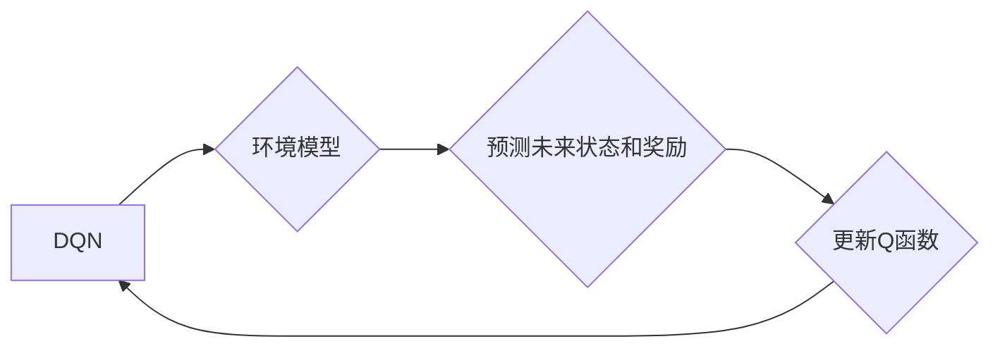

> Deep Q-Network (DQN), 环境模型, 预测, 规划, 强化学习, 

## 1. 背景介绍

在机器学习领域，强化学习 (Reinforcement Learning, RL) 作为一种模仿人类学习的算法，近年来取得了显著的进展。其中，Deep Q-Network (DQN) 作为一种深度强化学习算法，在解决复杂决策问题方面展现出强大的能力。DQN 通过学习一个 Q 函数，该函数估计在给定状态下采取特定动作的预期回报，从而指导智能体做出最优决策。

然而，传统的 DQN 算法存在一些局限性，例如：

* **样本效率低:** DQN 需要大量的样本数据才能有效学习，这在现实世界中可能难以实现。
* **过拟合问题:** DQN 容易过拟合训练数据，导致在未知环境中表现不佳。
* **缺乏规划能力:** DQN 主要关注当前状态下的最优动作，缺乏对未来状态的预测和规划能力。

为了克服这些问题，环境模型 (Environment Model) 在 DQN 中得到了广泛应用。环境模型可以预测未来状态和奖励，从而帮助智能体进行更有效的决策。

## 2. 核心概念与联系

环境模型是机器学习中一个重要的概念，它试图学习一个函数，该函数可以预测给定状态和动作后，下一个状态和奖励。

**环境模型与DQN的关系:**

DQN 算法的核心是学习一个 Q 函数，该函数估计在给定状态下采取特定动作的预期回报。而环境模型可以帮助 DQN 预测未来状态和奖励，从而提高 Q 函数的学习效率和泛化能力。

**环境模型的类型:**

* **基于神经网络的环境模型:** 使用神经网络来学习环境模型，具有较强的学习能力和泛化能力。
* **基于物理模型的环境模型:** 基于物理规律和知识构建环境模型，具有较高的准确性，但构建难度较大。
* **基于统计模型的环境模型:** 使用统计方法来学习环境模型，具有较低的计算复杂度，但准确性可能较低。

**Mermaid 流程图:**



## 3. 核心算法原理 & 具体操作步骤

### 3.1  算法原理概述

环境模型在 DQN 中主要用于预测未来状态和奖励。通过学习一个环境模型，DQN 可以模拟未来的环境变化，从而更好地评估不同动作的价值。

**核心思想:**

* 使用环境模型预测未来状态和奖励，并将其作为 DQN 的输入。
* 通过学习环境模型，DQN 可以获得对未来环境的预测能力，从而提高决策的准确性。

### 3.2  算法步骤详解

1. **训练环境模型:** 使用训练数据训练环境模型，使其能够准确预测未来状态和奖励。
2. **使用环境模型预测未来:** 在 DQN 算法的训练过程中，使用环境模型预测未来状态和奖励。
3. **更新 Q 函数:** 使用预测的未来状态和奖励更新 DQN 的 Q 函数。

### 3.3  算法优缺点

**优点:**

* **提高样本效率:** 通过环境模型的预测，DQN 可以减少对真实环境的交互，从而提高样本效率。
* **增强泛化能力:** 环境模型可以帮助 DQN 学习到更通用的决策策略，从而提高其在未知环境中的泛化能力。
* **增强规划能力:** 环境模型可以帮助 DQN 对未来状态进行预测和规划，从而做出更优的决策。

**缺点:**

* **环境模型的训练复杂度:** 训练一个准确的环境模型可能需要大量的计算资源和时间。
* **环境模型的偏差:** 环境模型可能存在偏差，导致 DQN 的决策不准确。

### 3.4  算法应用领域

环境模型在 DQN 中的应用领域非常广泛，例如：

* **机器人控制:** 使用环境模型帮助机器人预测未来环境变化，从而更好地控制运动。
* **游戏 AI:** 使用环境模型帮助游戏 AI 预测游戏状态变化，从而做出更优的决策。
* **自动驾驶:** 使用环境模型帮助自动驾驶系统预测道路环境变化，从而做出更安全的决策。

## 4. 数学模型和公式 & 详细讲解 & 举例说明

### 4.1  数学模型构建

环境模型可以表示为一个函数，该函数接受当前状态和动作作为输入，输出下一个状态和奖励作为输出。

**数学模型:**

$$
s' = f(s, a)
r = g(s, a)
$$

其中：

* $s$ 表示当前状态
* $a$ 表示动作
* $s'$ 表示下一个状态
* $r$ 表示奖励

### 4.2  公式推导过程

环境模型的训练目标是最小化预测误差。可以使用均方误差 (MSE) 作为损失函数。

**损失函数:**

$$
L = \frac{1}{N} \sum_{i=1}^{N} (r_i - \hat{r}_i)^2 + \lambda (s'_{i} - \hat{s}'_{i})^2
$$

其中：

* $N$ 表示训练样本数量
* $r_i$ 表示真实奖励
* $\hat{r}_i$ 表示预测奖励
* $s'_{i}$ 表示真实下一个状态
* $\hat{s}'_{i}$ 表示预测下一个状态
* $\lambda$ 表示权重参数

### 4.3  案例分析与讲解

假设我们有一个简单的环境，其中智能体可以向左或向右移动。环境模型可以学习到，向左移动会将智能体移动到下一个状态，向右移动会将智能体移动到另一个状态。

**例子:**

* 当前状态: $s = 1$
* 动作: $a = \text{left}$
* 预测下一个状态: $\hat{s}' = 2$
* 真实下一个状态: $s' = 2$

在这种情况下，环境模型的预测准确，损失函数的值会很小。

## 5. 项目实践：代码实例和详细解释说明

### 5.1  开发环境搭建

* Python 3.7+
* TensorFlow 2.0+
* PyTorch 1.0+

### 5.2  源代码详细实现

```python
# 环境模型的代码示例 (使用 TensorFlow)

import tensorflow as tf

class EnvironmentModel(tf.keras.Model):
    def __init__(self, state_size, action_size, output_size):
        super(EnvironmentModel, self).__init__()
        self.dense1 = tf.keras.layers.Dense(64, activation='relu')
        self.dense2 = tf.keras.layers.Dense(32, activation='relu')
        self.output_layer = tf.keras.layers.Dense(output_size)

    def call(self, inputs):
        x = self.dense1(inputs)
        x = self.dense2(x)
        return self.output_layer(x)

# 实例化环境模型
model = EnvironmentModel(state_size=4, action_size=2, output_size=2)

# 训练环境模型
# ...

```

### 5.3  代码解读与分析

* 环境模型使用 TensorFlow 的 Keras API 进行构建。
* 模型结构包含两层全连接层和一层输出层。
* 损失函数和优化器需要根据具体任务进行选择。
* 训练环境模型需要使用训练数据进行监督学习。

### 5.4  运行结果展示

训练完成后，可以使用环境模型预测未来状态和奖励。

## 6. 实际应用场景

### 6.1  机器人控制

环境模型可以帮助机器人预测未来环境变化，从而更好地控制运动。例如，在导航任务中，环境模型可以预测障碍物的位置和移动轨迹，帮助机器人避开障碍物并到达目标位置。

### 6.2  游戏 AI

环境模型可以帮助游戏 AI 预测游戏状态变化，从而做出更优的决策。例如，在策略游戏中，环境模型可以预测对手的行动，帮助 AI 制定更有效的策略。

### 6.3  自动驾驶

环境模型可以帮助自动驾驶系统预测道路环境变化，从而做出更安全的决策。例如，环境模型可以预测其他车辆的运动轨迹，帮助自动驾驶系统避免碰撞事故。

### 6.4  未来应用展望

随着环境模型技术的不断发展，其在强化学习中的应用将更加广泛。未来，环境模型可能被用于解决更复杂的任务，例如：

* **医疗诊断:** 使用环境模型预测疾病的进展，帮助医生制定更有效的治疗方案。
* **金融预测:** 使用环境模型预测市场趋势，帮助投资者做出更明智的投资决策。
* **科学研究:** 使用环境模型模拟复杂系统，帮助科学家更好地理解自然现象。

## 7. 工具和资源推荐

### 7.1  学习资源推荐

* **强化学习书籍:**
    * Reinforcement Learning: An Introduction by Richard S. Sutton and Andrew G. Barto
    * Deep Reinforcement Learning Hands-On by Maxim Lapan
* **在线课程:**
    * Deep Reinforcement Learning Specialization by DeepLearning.AI
    * Reinforcement Learning by David Silver (University of DeepMind)

### 7.2  开发工具推荐

* **TensorFlow:** https://www.tensorflow.org/
* **PyTorch:** https://pytorch.org/
* **OpenAI Gym:** https://gym.openai.com/

### 7.3  相关论文推荐

* **Playing Atari with Deep Reinforcement Learning** by Mnih et al. (2013)
* **Human-level control through deep reinforcement learning** by Mnih et al. (2015)
* **Asynchronous Methods for Deep Reinforcement Learning** by Mnih et al. (2016)

## 8. 总结：未来发展趋势与挑战

### 8.1  研究成果总结

环境模型在 DQN 中的应用取得了显著的进展，提高了 DQN 的样本效率、泛化能力和规划能力。

### 8.2  未来发展趋势

* **更强大的环境模型:** 研究更强大的环境模型，例如基于物理模型的环境模型和基于深度学习的环境模型。
* **更有效的训练方法:** 研究更有效的环境模型训练方法，例如迁移学习和自监督学习。
* **环境模型的安全性:** 研究环境模型的安全性，确保其在实际应用中不会造成负面影响。

### 8.3  面临的挑战

* **环境模型的复杂性:** 构建准确的环境模型可能非常复杂，需要大量的计算资源和时间。
* **环境模型的偏差:** 环境模型可能存在偏差，导致 DQN 的决策不准确。
* **环境模型的安全性:** 环境模型可能被恶意攻击，导致 DQN 的决策被操纵。

### 8.4  研究展望

未来，环境模型将在强化学习领域发挥越来越重要的作用。随着研究的深入，环境模型将变得更加强大、高效和安全，从而推动强化学习技术在更多领域得到应用。

## 9. 附录：常见问题与解答

**问题 1:** 环境模型的训练需要多少数据？

**答案:** 环境模型的训练数据量取决于环境的复杂度和模型的复杂度。一般来说，需要大量的训练数据才能训练出一个准确的环境模型。

**问题 2:** 如何评估环境模型的性能？

**答案:** 可以使用均方误差 (MSE) 作为环境模型的性能指标。MSE 越小，环境模型的预测精度越高。

**问题 3:** 环境模型的训练时间有多长？

**答案:** 环境模型的训练时间取决于环境的复杂度、模型的复杂度和计算资源。一般来说，训练一个准确的环境模型可能需要几天甚至几周的时间。


作者：禅与计算机程序设计艺术 / Zen and the Art of Computer Programming 
<end_of_turn>