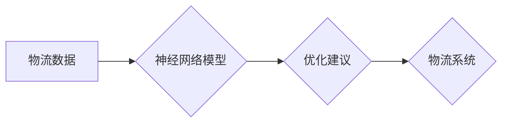

> 神经网络，物流优化，深度学习，预测模型，路径规划，效率提升

## 1. 背景介绍

在当今全球化经济的背景下，物流行业扮演着至关重要的角色。高效、精准的物流配送不仅能够降低企业成本，提升客户满意度，还能促进经济发展。然而，传统的物流管理模式往往面临着诸多挑战，例如运输路线规划复杂、需求预测不准确、库存管理困难等。

近年来，随着人工智能技术的快速发展，特别是深度学习技术的突破，神经网络在物流优化领域展现出巨大的潜力。神经网络能够学习和分析海量物流数据，识别复杂模式，并提供更优的决策建议，从而有效解决传统物流管理的痛点。

## 2. 核心概念与联系

### 2.1 神经网络

神经网络是一种模仿人脑神经网络结构的机器学习模型。它由多个相互连接的神经元组成，每个神经元接收输入信号，进行处理，并输出信号。通过层层传递和权重调整，神经网络能够学习数据中的复杂模式和关系。

### 2.2 物流优化

物流优化是指通过合理规划和管理物流资源，以降低成本、提高效率、满足客户需求为目标的综合性管理活动。

### 2.3 联系

神经网络能够通过学习物流数据，例如运输路线、货物需求、库存水平等，识别出影响物流效率的因素，并提供优化建议。例如，神经网络可以用于预测货物需求，优化运输路线，提高仓储效率，以及进行智能调度等。

**Mermaid 流程图**



## 3. 核心算法原理 & 具体操作步骤

### 3.1 算法原理概述

在物流优化领域，常用的神经网络算法包括卷积神经网络（CNN）、循环神经网络（RNN）和深度强化学习（DRL）。

* **卷积神经网络（CNN）**：擅长处理图像和序列数据，可以用于识别物流场景中的图像信息，例如货物类型、包装状态等。
* **循环神经网络（RNN）**：擅长处理时间序列数据，可以用于预测货物需求、运输时间等。
* **深度强化学习（DRL）**：通过强化学习算法，训练智能体在物流环境中做出最优决策，例如路径规划、资源分配等。

### 3.2 算法步骤详解

以预测货物需求为例，使用RNN算法的具体操作步骤如下：

1. **数据收集和预处理**: 收集历史货物需求数据，并进行清洗、转换、归一化等预处理操作。
2. **模型构建**: 使用RNN网络结构，构建预测模型。
3. **模型训练**: 使用训练数据训练模型，调整网络参数，使模型能够准确预测货物需求。
4. **模型评估**: 使用测试数据评估模型性能，例如平均绝对误差（MAE）、均方根误差（RMSE）等指标。
5. **模型部署**: 将训练好的模型部署到生产环境中，用于实时预测货物需求。

### 3.3 算法优缺点

**优点**:

* 能够学习复杂数据模式，提高预测精度。
* 能够处理海量数据，支持大规模物流系统。
* 能够不断学习和优化，随着数据积累，预测精度不断提升。

**缺点**:

* 需要大量数据进行训练，数据质量对模型性能影响较大。
* 模型训练时间较长，需要强大的计算资源。
* 模型解释性较差，难以理解模型决策过程。

### 3.4 算法应用领域

* **货物需求预测**: 预测未来货物需求，优化库存管理和运输计划。
* **运输路线规划**: 根据实时路况、货物类型等信息，规划最优运输路线，降低运输成本和时间。
* **仓储管理**: 优化仓储空间利用率，提高货物存储和提取效率。
* **智能调度**: 根据实时需求和资源情况，智能调度车辆和人员，提高物流效率。

## 4. 数学模型和公式 & 详细讲解 & 举例说明

### 4.1 数学模型构建

在神经网络模型中，常用的数学模型包括激活函数、损失函数和优化算法。

* **激活函数**: 用于引入非线性，使神经网络能够学习复杂数据模式。常见的激活函数包括ReLU、Sigmoid和Tanh等。
* **损失函数**: 用于衡量模型预测结果与真实值的差距，引导模型参数更新。常见的损失函数包括均方误差（MSE）、交叉熵损失（Cross-Entropy Loss）等。
* **优化算法**: 用于更新模型参数，使损失函数最小化。常见的优化算法包括梯度下降（Gradient Descent）、Adam和RMSprop等。

### 4.2 公式推导过程

以均方误差（MSE）损失函数为例，其公式如下：

$$
MSE = \frac{1}{n} \sum_{i=1}^{n} (y_i - \hat{y}_i)^2
$$

其中：

* $n$ 为样本数量
* $y_i$ 为真实值
* $\hat{y}_i$ 为预测值

### 4.3 案例分析与讲解

假设我们使用神经网络模型预测货物需求，训练数据包含历史货物需求和相关特征，例如日期、星期、节日等。模型训练完成后，我们可以使用测试数据评估模型性能，例如计算平均绝对误差（MAE）。

如果MAE值较小，说明模型预测精度较高，可以用于实际应用。反之，如果MAE值较大，需要进一步调整模型参数或增加训练数据，提高模型性能。

## 5. 项目实践：代码实例和详细解释说明

### 5.1 开发环境搭建

* 操作系统：Linux/Windows/macOS
* Python 版本：3.6+
* 深度学习框架：TensorFlow/PyTorch
* 其他依赖库：NumPy、Pandas、Matplotlib等

### 5.2 源代码详细实现

```python
# 导入必要的库
import tensorflow as tf

# 定义神经网络模型
model = tf.keras.Sequential([
    tf.keras.layers.Dense(64, activation='relu', input_shape=(10,)),
    tf.keras.layers.Dense(32, activation='relu'),
    tf.keras.layers.Dense(1)
])

# 定义损失函数和优化器
model.compile(loss='mse', optimizer='adam')

# 训练模型
model.fit(X_train, y_train, epochs=100)

# 评估模型
loss = model.evaluate(X_test, y_test)
print('测试损失:', loss)

# 使用模型预测
predictions = model.predict(X_new)
```

### 5.3 代码解读与分析

* 代码首先导入必要的库。
* 然后定义一个简单的多层感知机（MLP）模型，包含三个全连接层和ReLU激活函数。
* 模型使用均方误差（MSE）损失函数和Adam优化器进行训练。
* 训练完成后，使用测试数据评估模型性能。
* 最后，使用训练好的模型预测新的数据。

### 5.4 运行结果展示

运行结果展示模型的训练过程和预测结果，例如训练损失曲线、测试损失值以及预测值与真实值的比较等。

## 6. 实际应用场景

### 6.1 货物需求预测

利用神经网络模型预测未来货物需求，可以帮助企业优化库存管理，减少库存积压和缺货风险。

### 6.2 运输路线规划

根据实时路况、货物类型等信息，神经网络可以优化运输路线，降低运输成本和时间。

### 6.3 仓储管理

神经网络可以帮助优化仓储空间利用率，提高货物存储和提取效率。

### 6.4 未来应用展望

随着人工智能技术的不断发展，神经网络在物流优化领域的应用将更加广泛和深入。例如，可以利用强化学习算法训练智能物流机器人，实现自动化仓储和配送。

## 7. 工具和资源推荐

### 7.1 学习资源推荐

* **书籍**:
    * 深度学习
    * 人工智能：一种现代方法
* **在线课程**:
    * Coursera 深度学习课程
    * Udacity 机器学习工程师 Nanodegree

### 7.2 开发工具推荐

* **深度学习框架**: TensorFlow, PyTorch
* **数据处理工具**: Pandas, NumPy
* **可视化工具**: Matplotlib, Seaborn

### 7.3 相关论文推荐

* **神经网络在物流优化中的应用**:
    * [论文标题1](论文链接)
    * [论文标题2](论文链接)

## 8. 总结：未来发展趋势与挑战

### 8.1 研究成果总结

神经网络在物流优化领域取得了显著成果，能够有效解决传统物流管理的痛点，提高物流效率和降低成本。

### 8.2 未来发展趋势

* **模型更加复杂和智能**: 未来将开发更加复杂和智能的神经网络模型，例如Transformer、Graph Neural Networks等，能够处理更复杂的数据模式和场景。
* **数据驱动和个性化**: 随着数据量的不断增长，神经网络模型将更加依赖数据驱动，并能够提供更加个性化的物流服务。
* **边缘计算和云计算**: 将将神经网络模型部署到边缘设备和云平台，实现实时决策和协同优化。

### 8.3 面临的挑战

* **数据质量和隐私**: 神经网络模型对数据质量要求较高，同时需要解决数据隐私保护问题。
* **模型解释性和可信度**: 神经网络模型的决策过程难以解释，需要提高模型的透明度和可信度。
* **计算资源和成本**: 训练大型神经网络模型需要大量的计算资源和成本。

### 8.4 研究展望

未来研究将重点关注以下几个方面：

* 开发更加高效、鲁棒和可解释的神经网络模型。
* 探索新的数据来源和数据融合方法，提高模型训练质量。
* 研究神经网络在物流领域的应用场景，探索新的应用价值。

## 9. 附录：常见问题与解答

* **Q1**: 神经网络模型需要多少数据才能训练？
* **A1**: 不同模型和任务对数据量的需求不同，一般来说，需要至少几千条数据才能进行有效训练。
* **Q2**: 如何评估神经网络模型的性能？
* **A2**: 可以使用测试数据评估模型性能，常用的指标包括平均绝对误差（MAE）、均方根误差（RMSE）等。
* **Q3**: 如何解决神经网络模型的过拟合问题？
* **A3**: 可以使用正则化技术、数据增强、交叉验证等方法来解决过拟合问题。


作者：禅与计算机程序设计艺术 / Zen and the Art of Computer Programming 
<end_of_turn>