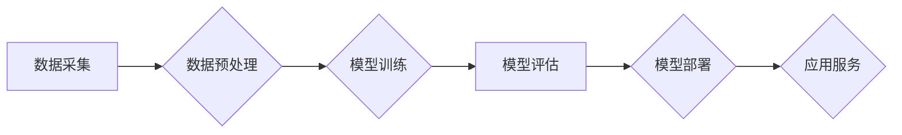

> AI大模型，中国市场，应用规模，技术趋势，商业价值，发展挑战

## 1. 背景介绍

人工智能（AI）技术近年来发展迅速，特别是大模型的涌现，为各行各业带来了前所未有的机遇。大模型是指参数规模庞大、训练数据海量的人工智能模型，具备强大的泛化能力和学习能力，能够在自然语言处理、计算机视觉、语音识别等多个领域取得突破性进展。

中国作为全球人工智能发展的重要力量，在AI大模型领域也取得了显著成就。涌现出一批优秀的AI大模型，例如百度文心一言、阿里达摩院的M6、华为的Pangu等。这些模型在各个领域得到了广泛应用，推动着中国AI产业的快速发展。

## 2. 核心概念与联系

**2.1 AI大模型的概念**

AI大模型是指参数规模庞大、训练数据海量的人工智能模型。其核心特点包括：

* **参数规模庞大:** 大模型通常拥有数十亿甚至数千亿个参数，这使得它们能够学习更复杂的模式和关系。
* **训练数据海量:** 大模型的训练需要海量的数据，才能有效地学习和优化模型参数。
* **泛化能力强:** 由于参数规模庞大，大模型能够更好地泛化到新的数据和任务上。

**2.2 AI大模型的架构**

AI大模型的架构通常基于深度学习，主要包括以下几个部分：

* **输入层:** 将原始数据转换为模型可以理解的格式。
* **隐藏层:** 多层神经网络，负责提取数据的特征和模式。
* **输出层:** 将隐藏层的输出转换为最终的预测结果。

**2.3 AI大模型的应用场景**

AI大模型在各个领域都有广泛的应用场景，例如：

* **自然语言处理:** 文本生成、机器翻译、问答系统、情感分析等。
* **计算机视觉:** 图像识别、物体检测、图像分割、视频分析等。
* **语音识别:** 语音转文本、语音合成、语音助手等。
* **推荐系统:** 商品推荐、内容推荐、用户画像等。

**2.4  AI大模型的市场规模**

全球AI大模型市场规模预计将持续高速增长，到2030年将达到数千亿美元。中国作为全球人工智能发展的重要力量，其AI大模型市场规模也将保持快速增长态势。

**Mermaid 流程图**



## 3. 核心算法原理 & 具体操作步骤

**3.1 算法原理概述**

AI大模型的训练主要基于深度学习算法，其中Transformer模型是近年来发展最快的模型架构之一。Transformer模型的核心思想是利用注意力机制来捕捉文本序列中的长距离依赖关系，从而提高模型的理解和生成能力。

**3.2 算法步骤详解**

1. **数据预处理:** 将原始数据进行清洗、格式化、编码等操作，使其能够被模型理解。
2. **模型构建:** 根据预定的模型架构，搭建模型结构，并初始化模型参数。
3. **模型训练:** 使用训练数据对模型进行训练，通过反向传播算法不断优化模型参数，使模型能够准确地预测目标输出。
4. **模型评估:** 使用测试数据对模型进行评估，衡量模型的性能，例如准确率、召回率、F1-score等。
5. **模型部署:** 将训练好的模型部署到生产环境中，用于实际应用。

**3.3 算法优缺点**

**优点:**

* 强大的泛化能力，能够处理各种复杂的任务。
* 能够捕捉文本序列中的长距离依赖关系。
* 训练效率高，能够在较短的时间内训练出高质量的模型。

**缺点:**

* 训练成本高，需要大量的计算资源和数据。
* 模型参数规模庞大，部署和推理效率较低。
* 容易受到训练数据质量的影响。

**3.4 算法应用领域**

Transformer模型在自然语言处理领域得到了广泛应用，例如：

* **机器翻译:** Google Translate、DeepL等翻译工具。
* **文本摘要:** 自动生成文本的摘要。
* **问答系统:** 能够回答用户提出的问题。
* **对话系统:** 与用户进行自然语言对话。

## 4. 数学模型和公式 & 详细讲解 & 举例说明

**4.1 数学模型构建**

Transformer模型的核心是注意力机制，其数学模型可以表示为：

$$
Attention(Q, K, V) = softmax(\frac{QK^T}{\sqrt{d_k}})V
$$

其中：

* $Q$：查询矩阵
* $K$：键矩阵
* $V$：值矩阵
* $d_k$：键向量的维度
* $softmax$：softmax函数

**4.2 公式推导过程**

注意力机制的目的是计算查询向量与键向量的相关性，并根据相关性对值向量进行加权求和。

1. 计算查询向量与每个键向量的点积，得到一个分数矩阵。
2. 对分数矩阵进行归一化，得到一个概率分布。
3. 将概率分布与值向量进行加权求和，得到最终的输出。

**4.3 案例分析与讲解**

假设我们有一个句子“我爱学习编程”，我们想要计算“学习”这个词与整个句子的相关性。

1. 将句子中的每个词都转换为向量表示。
2. 将“学习”这个词作为查询向量，其他词作为键向量。
3. 计算查询向量与每个键向量的点积，得到一个分数矩阵。
4. 对分数矩阵进行归一化，得到一个概率分布。
5. 将概率分布与值向量进行加权求和，得到“学习”这个词与整个句子的相关性得分。

## 5. 项目实践：代码实例和详细解释说明

**5.1 开发环境搭建**

* Python 3.7+
* PyTorch 1.7+
* CUDA 10.2+

**5.2 源代码详细实现**

```python
import torch
import torch.nn as nn

class Transformer(nn.Module):
    def __init__(self, vocab_size, embedding_dim, num_heads, num_layers):
        super(Transformer, self).__init__()
        self.embedding = nn.Embedding(vocab_size, embedding_dim)
        self.transformer_layers = nn.ModuleList([
            nn.TransformerEncoderLayer(embedding_dim, num_heads)
            for _ in range(num_layers)
        ])
        self.linear = nn.Linear(embedding_dim, vocab_size)

    def forward(self, x):
        x = self.embedding(x)
        for layer in self.transformer_layers:
            x = layer(x)
        x = self.linear(x)
        return x
```

**5.3 代码解读与分析**

* `__init__` 方法初始化模型参数，包括词嵌入层、Transformer编码器层和输出层。
* `forward` 方法定义模型的正向传播过程，将输入序列经过词嵌入层、Transformer编码器层和输出层，最终得到预测输出。

**5.4 运行结果展示**

训练好的Transformer模型可以用于各种自然语言处理任务，例如机器翻译、文本摘要、问答系统等。

## 6. 实际应用场景

**6.1 自然语言处理**

* **机器翻译:** 将一种语言的文本翻译成另一种语言。
* **文本摘要:** 自动生成文本的摘要。
* **问答系统:** 能够回答用户提出的问题。
* **对话系统:** 与用户进行自然语言对话。

**6.2 计算机视觉**

* **图像识别:** 将图像分类为不同的类别。
* **物体检测:** 在图像中检测到特定物体的位置和大小。
* **图像分割:** 将图像分割成不同的区域。

**6.3 语音识别**

* **语音转文本:** 将语音转换为文本。
* **语音合成:** 将文本转换为语音。
* **语音助手:** 能够理解用户的语音指令并执行相应的操作。

**6.4 其他应用场景**

* **推荐系统:** 根据用户的历史行为推荐相关的商品或内容。
* **医疗诊断:** 辅助医生进行疾病诊断。
* **金融风险控制:** 识别和预防金融风险。

**6.5 未来应用展望**

随着AI大模型技术的不断发展，其应用场景将更加广泛，例如：

* **个性化教育:** 根据学生的学习情况提供个性化的学习方案。
* **智能客服:** 提供24小时在线客服服务，解决用户的疑问。
* **自动驾驶:** 辅助驾驶员完成驾驶任务。

## 7. 工具和资源推荐

**7.1 学习资源推荐**

* **书籍:**
    * 《深度学习》
    * 《自然语言处理》
    * 《Transformer模型详解》
* **在线课程:**
    * Coursera: 深度学习
    * Udacity: 自然语言处理
    * fast.ai: 深度学习

**7.2 开发工具推荐**

* **框架:**
    * PyTorch
    * TensorFlow
* **库:**
    * HuggingFace Transformers
    * Gensim
* **平台:**
    * Google Colab
    * Paperspace Gradient

**7.3 相关论文推荐**

* 《Attention Is All You Need》
* 《BERT: Pre-training of Deep Bidirectional Transformers for Language Understanding》
* 《GPT-3: Language Models are Few-Shot Learners》

## 8. 总结：未来发展趋势与挑战

**8.1 研究成果总结**

近年来，AI大模型取得了显著进展，在各个领域都取得了突破性成果。

**8.2 未来发展趋势**

* **模型规模继续扩大:** 模型参数规模将继续扩大，从而提升模型的性能。
* **多模态学习:** AI大模型将能够处理多种模态数据，例如文本、图像、音频等。
* **可解释性增强:** 研究人员将致力于提高AI大模型的可解释性，使其决策过程更加透明。

**8.3 面临的挑战**

* **数据安全和隐私:** AI大模型的训练需要海量数据，如何保证数据安全和隐私是一个重要挑战。
* **模型偏见:** AI大模型容易受到训练数据中的偏见影响，如何解决模型偏见是一个重要的研究方向。
* **计算资源需求:** 训练大型AI模型需要大量的计算资源，如何降低训练成本是一个重要的挑战。

**8.4 研究展望**

未来，AI大模型将继续朝着更强大、更智能、更安全的方向发展，并将对人类社会产生深远的影响。


## 9. 附录：常见问题与解答

**9.1 如何选择合适的AI大模型？**

选择合适的AI大模型需要根据具体的应用场景和需求进行选择。例如，如果需要进行机器翻译，可以选择预训练的机器翻译模型；如果需要进行文本摘要，可以选择预训练的文本摘要模型。

**9.2 如何训练自己的AI大模型？**

训练自己的AI大模型需要准备大量的训练数据、强大的计算资源和专业的技术人员。

**9.3 如何解决AI大模型的偏见问题？**

解决AI大模型的偏见问题需要从多个方面入手，例如：

* 使用更加公平的数据集进行训练。
* 在模型训练过程中加入对抗训练，以减少模型对偏见数据的敏感度。
* 开发新的算法和方法，以更好地识别和解决模型偏见。


作者：禅与计算机程序设计艺术 / Zen and the Art of Computer Programming 
<end_of_turn>