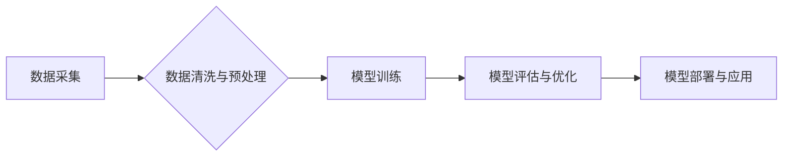

> 中国企业, AI技术, 数据优势, 深度学习, 算法模型, 数据安全, 隐私保护, 产业应用

## 1. 背景介绍

人工智能（AI）正以惊人的速度发展，深刻地改变着各行各业。从自动驾驶到医疗诊断，从个性化推荐到金融风险控制，AI技术的应用场景日益广泛。在这个快速发展的时代，数据成为了AI发展的基石，而拥有海量数据的中国企业在AI技术发展上拥有独特的优势。

近年来，中国企业在数字化转型方面取得了显著进展，积累了大量的用户数据、运营数据、生产数据等。这些数据蕴含着丰富的价值，为AI技术的训练和应用提供了坚实的基础。同时，中国政府也高度重视AI发展，出台了一系列政策措施，鼓励企业加大AI技术研发投入，推动AI产业发展。

## 2. 核心概念与联系

**2.1 数据驱动型AI**

数据驱动型AI是指利用海量数据训练和优化AI模型，使其能够更好地理解和处理信息，从而实现智能化决策和自动化执行。

**2.2 中国企业的数据优势**

中国企业在以下几个方面拥有数据优势：

* **数据量大:** 中国拥有全球最大的互联网用户群体，以及庞大的移动支付、电商、社交媒体等平台，这些平台每天产生海量数据。
* **数据类型丰富:** 中国企业的业务范围广泛，涵盖了各个行业和领域，因此积累的数据类型也更加丰富多样。
* **数据更新快:** 中国互联网发展迅速，数据更新速度快，这有利于AI模型的实时学习和优化。

**2.3 数据安全与隐私保护**

在利用数据进行AI训练和应用时，数据安全和隐私保护至关重要。中国政府制定了严格的数据安全和隐私保护法律法规，企业需要严格遵守相关规定，确保数据的安全性和合法性。

**Mermaid 流程图**



## 3. 核心算法原理 & 具体操作步骤

**3.1 算法原理概述**

深度学习是目前AI领域最热门的算法之一，它能够通过多层神经网络学习数据中的复杂特征，从而实现对数据的理解和预测。

**3.2 算法步骤详解**

1. **数据预处理:** 将原始数据进行清洗、转换和格式化，使其能够被深度学习模型所接受。
2. **网络结构设计:** 根据具体任务需求，设计深度学习模型的网络结构，包括神经网络层数、节点数量、激活函数等。
3. **模型训练:** 使用训练数据训练深度学习模型，通过调整模型参数，使模型能够准确地预测目标变量。
4. **模型评估:** 使用测试数据评估模型的性能，并根据评估结果进行模型优化。
5. **模型部署:** 将训练好的模型部署到实际应用场景中，用于进行预测或决策。

**3.3 算法优缺点**

**优点:**

* 能够学习数据中的复杂特征，实现高精度预测。
* 适用于各种类型的数据，包括文本、图像、音频等。

**缺点:**

* 训练数据量大，需要大量的计算资源。
* 模型训练时间长，需要较长的训练周期。
* 模型解释性差，难以理解模型的决策过程。

**3.4 算法应用领域**

* **图像识别:** 人脸识别、物体检测、图像分类等。
* **自然语言处理:** 文本分类、情感分析、机器翻译等。
* **语音识别:** 语音转文本、语音助手等。
* **推荐系统:** 商品推荐、内容推荐等。

## 4. 数学模型和公式 & 详细讲解 & 举例说明

**4.1 数学模型构建**

深度学习模型通常采用多层神经网络结构，每个神经元接收多个输入信号，并通过激活函数进行处理，输出一个信号。神经网络的训练过程就是通过调整神经元之间的权重，使模型的输出与实际目标值之间的误差最小化。

**4.2 公式推导过程**

深度学习模型的训练通常使用反向传播算法，该算法通过计算误差梯度，逐步调整神经元权重，使模型的预测精度不断提高。

**反向传播算法公式:**

```latex
\Delta w = -\eta \frac{\partial L}{\partial w}
```

其中:

* $\Delta w$ 是权重更新量
* $\eta$ 是学习率
* $L$ 是损失函数
* $w$ 是权重

**4.3 案例分析与讲解**

例如，在图像分类任务中，深度学习模型可以学习图像中的特征，并将其映射到不同的类别。训练过程中，模型会根据图像标签进行调整，使模型能够准确地识别图像类别。

## 5. 项目实践：代码实例和详细解释说明

**5.1 开发环境搭建**

使用Python语言和深度学习框架TensorFlow或PyTorch进行开发。

**5.2 源代码详细实现**

```python
import tensorflow as tf

# 定义模型结构
model = tf.keras.models.Sequential([
    tf.keras.layers.Conv2D(32, (3, 3), activation='relu', input_shape=(28, 28, 1)),
    tf.keras.layers.MaxPooling2D((2, 2)),
    tf.keras.layers.Conv2D(64, (3, 3), activation='relu'),
    tf.keras.layers.MaxPooling2D((2, 2)),
    tf.keras.layers.Flatten(),
    tf.keras.layers.Dense(10, activation='softmax')
])

# 编译模型
model.compile(optimizer='adam',
              loss='sparse_categorical_crossentropy',
              metrics=['accuracy'])

# 训练模型
model.fit(x_train, y_train, epochs=5)

# 评估模型
loss, accuracy = model.evaluate(x_test, y_test)
print('Test loss:', loss)
print('Test accuracy:', accuracy)
```

**5.3 代码解读与分析**

这段代码定义了一个简单的卷积神经网络模型，用于手写数字识别任务。模型包含两层卷积层、两层池化层、一层全连接层和一层输出层。

**5.4 运行结果展示**

训练完成后，模型能够准确地识别手写数字。

## 6. 实际应用场景

**6.1 医疗诊断**

AI技术可以辅助医生进行疾病诊断，例如通过分析医学影像数据，识别肿瘤、骨折等病症。

**6.2 金融风险控制**

AI技术可以帮助金融机构识别欺诈交易、评估信用风险、预测市场波动等。

**6.3 制造业优化**

AI技术可以帮助制造企业进行生产过程优化，例如预测设备故障、优化生产计划、提高生产效率等。

**6.4 未来应用展望**

随着AI技术的不断发展，其应用场景将更加广泛，例如自动驾驶、个性化教育、智能家居等。

## 7. 工具和资源推荐

**7.1 学习资源推荐**

* **在线课程:** Coursera、edX、Udacity等平台提供丰富的AI课程。
* **书籍:** 《深度学习》、《机器学习实战》等书籍。
* **开源项目:** TensorFlow、PyTorch等开源深度学习框架。

**7.2 开发工具推荐**

* **Python:** 作为AI开发的主要编程语言。
* **Jupyter Notebook:** 用于代码编写、数据分析和可视化。
* **TensorFlow/PyTorch:** 深度学习框架。

**7.3 相关论文推荐**

* **《ImageNet Classification with Deep Convolutional Neural Networks》**
* **《Attention Is All You Need》**

## 8. 总结：未来发展趋势与挑战

**8.1 研究成果总结**

近年来，AI技术取得了显著进展，在图像识别、自然语言处理、语音识别等领域取得了突破性成果。

**8.2 未来发展趋势**

* **模型更加强大:** 模型规模将继续扩大，性能将进一步提升。
* **应用更加广泛:** AI技术将应用于更多领域，例如自动驾驶、医疗保健、教育等。
* **算法更加高效:** 算法训练效率将提高，模型部署更加便捷。

**8.3 面临的挑战**

* **数据安全与隐私保护:** 如何确保数据的安全性和合法性，是AI发展面临的重要挑战。
* **算法解释性:** 如何理解AI模型的决策过程，提高模型的可解释性，也是一个重要的研究方向。
* **伦理问题:** AI技术的应用可能会带来一些伦理问题，例如算法偏见、工作岗位替代等，需要引起重视。

**8.4 研究展望**

未来，AI技术将继续发展，为人类社会带来更多福祉。我们需要加强基础研究，探索更强大的AI算法，同时也要关注AI技术的伦理问题，确保AI技术能够安全、可持续地发展。

## 9. 附录：常见问题与解答

**9.1 如何选择合适的AI算法？**

选择合适的AI算法需要根据具体任务需求和数据特点进行选择。例如，对于图像识别任务，可以使用卷积神经网络；对于文本分类任务，可以使用循环神经网络。

**9.2 如何解决AI模型的过拟合问题？**

过拟合是指AI模型在训练数据上表现很好，但在测试数据上表现较差。解决过拟合问题的方法包括：增加训练数据量、使用正则化技术、采用交叉验证等。

**9.3 如何评估AI模型的性能？**

常用的AI模型性能评估指标包括准确率、召回率、F1-score等。选择合适的评估指标需要根据具体任务需求进行选择。


作者：禅与计算机程序设计艺术 / Zen and the Art of Computer Programming 
<end_of_turn>