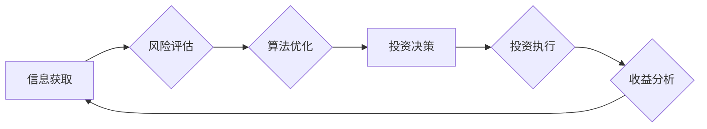

> 中观层面的投资收益下降, 投资策略, 风险管理, 数据分析, 机器学习, 算法优化, 投资回报率, 投资组合, 资产配置

## 1. 背景介绍

在当今金融市场日益复杂的背景下，投资者们寻求更高效、更精准的投资策略以获得更高的投资回报率。传统的投资策略往往依赖于宏观经济指标和市场情绪分析，而忽略了中观层面的细微变化，导致投资收益下降的现象日益普遍。

中观层面的投资收益下降是指在宏观经济环境相对稳定、市场整体趋势向好的情况下，投资者在特定行业、特定公司或特定资产类别上的投资收益却低于预期。这种现象的出现，往往与以下几个因素密切相关：

* **信息不对称:** 投资者获取的信息可能存在滞后性、不完整性或偏差性，导致对投资标的的评估不准确。
* **竞争加剧:** 随着金融市场竞争的加剧，投资者之间的信息获取和分析能力不断提升，导致投资机会的稀缺性增加，投资收益率下降。
* **风险管理不足:** 投资者在投资决策过程中，可能存在风险评估不足、风险控制不力等问题，导致投资组合的风险偏离预期，最终影响投资收益。
* **算法优化不足:** 传统的投资策略往往依赖于经验和直觉，而缺乏科学的算法优化，导致投资策略的执行效率低下，投资收益率下降。

## 2. 核心概念与联系

中观层面的投资收益下降是一个复杂的多因素问题，涉及到信息获取、风险管理、算法优化等多个环节。为了更好地理解和解决这个问题，我们需要首先明确以下几个核心概念：

* **中观层面的投资:** 指的是在宏观经济环境相对稳定的情况下，对特定行业、特定公司或特定资产类别进行投资的策略。
* **投资收益率:** 指的是投资者在特定时间段内获得的投资回报率，通常以百分比表示。
* **风险管理:** 指的是投资者在投资决策过程中，采取措施控制投资风险的策略。
* **算法优化:** 指的是通过改进算法的结构和参数，提高投资策略的执行效率和投资收益率的策略。

**Mermaid 流程图:**



## 3. 核心算法原理 & 具体操作步骤

为了解决中观层面的投资收益下降问题，我们可以采用机器学习算法进行投资策略优化。

### 3.1  算法原理概述

机器学习算法是一种能够从数据中学习并不断改进的算法。在投资领域，我们可以利用机器学习算法分析历史数据，识别出影响投资收益的因素，并构建出能够预测未来投资收益的模型。

常见的机器学习算法包括：

* **线性回归:** 用于预测连续型变量，例如股票价格。
* **逻辑回归:** 用于预测分类型变量，例如股票是否上涨。
* **支持向量机:** 用于分类和回归问题，能够处理高维数据。
* **决策树:** 用于分类和回归问题，能够解释模型的决策过程。
* **随机森林:** 结合多个决策树，提高模型的预测精度。

### 3.2  算法步骤详解

使用机器学习算法进行投资策略优化，具体步骤如下：

1. **数据收集:** 收集历史股票数据、宏观经济数据、公司财务数据等相关数据。
2. **数据预处理:** 对收集到的数据进行清洗、转换、特征工程等处理，使其适合机器学习算法的训练。
3. **模型选择:** 根据投资目标和数据特点，选择合适的机器学习算法。
4. **模型训练:** 使用训练数据训练选择的机器学习模型，并调整模型参数以获得最佳的预测精度。
5. **模型评估:** 使用测试数据评估模型的预测精度，并进行模型调优。
6. **模型部署:** 将训练好的模型部署到生产环境中，用于实时预测投资收益。

### 3.3  算法优缺点

**优点:**

* **数据驱动:** 基于历史数据进行分析和预测，能够识别出传统方法难以发现的投资机会。
* **自动化:** 可以自动化执行投资决策，提高投资效率。
* **可量化:** 投资策略可以量化，便于评估和优化。

**缺点:**

* **数据依赖:** 机器学习算法的性能依赖于数据的质量和数量。
* **黑盒效应:** 一些机器学习算法的决策过程难以解释，难以理解模型的预测结果。
* **过拟合风险:** 模型过拟合训练数据，导致在实际应用中预测精度下降。

### 3.4  算法应用领域

机器学习算法在投资领域有着广泛的应用，例如：

* **股票预测:** 利用历史股票数据预测未来股票价格走势。
* **风险管理:** 识别出潜在的投资风险，并采取措施控制风险。
* **资产配置:** 根据投资者的风险偏好和目标，构建合理的资产配置方案。
* **量化交易:** 利用算法自动执行交易，实现高频交易。

## 4. 数学模型和公式 & 详细讲解 & 举例说明

机器学习算法的训练过程本质上是一个优化问题，目标是找到能够最小化预测误差的模型参数。常用的优化算法包括梯度下降法、随机梯度下降法等。

### 4.1  数学模型构建

假设我们想要预测股票价格，可以使用线性回归模型，其数学表达式如下：

$$
y = \beta_0 + \beta_1 x_1 + \beta_2 x_2 + ... + \beta_n x_n + \epsilon
$$

其中：

* $y$ 是股票价格
* $x_1, x_2, ..., x_n$ 是股票的特征变量，例如成交量、市盈率等
* $\beta_0, \beta_1, ..., \beta_n$ 是模型参数
* $\epsilon$ 是误差项

### 4.2  公式推导过程

为了找到最佳的模型参数，我们需要最小化预测误差。常用的误差函数是均方误差（MSE）：

$$
MSE = \frac{1}{n} \sum_{i=1}^{n} (y_i - \hat{y}_i)^2
$$

其中：

* $y_i$ 是实际股票价格
* $\hat{y}_i$ 是模型预测的股票价格

通过梯度下降法，我们可以迭代更新模型参数，直到MSE达到最小值。

### 4.3  案例分析与讲解

假设我们想要预测某只股票的价格，收集了该股票的成交量、市盈率等特征变量的历史数据。我们可以使用线性回归模型进行预测，并通过梯度下降法优化模型参数。

通过训练模型，我们可以得到最佳的模型参数，并使用这些参数预测未来股票价格。

## 5. 项目实践：代码实例和详细解释说明

为了更好地理解机器学习算法在投资策略优化中的应用，我们可以使用Python语言实现一个简单的股票预测模型。

### 5.1  开发环境搭建

需要安装Python语言和相关库，例如NumPy、Pandas、Scikit-learn等。

### 5.2  源代码详细实现

```python
import pandas as pd
from sklearn.linear_model import LinearRegression
from sklearn.model_selection import train_test_split

# 加载股票数据
data = pd.read_csv('stock_data.csv')

# 选择特征变量和目标变量
features = ['成交量', '市盈率']
target = '股票价格'

# 将数据分割为训练集和测试集
X_train, X_test, y_train, y_test = train_test_split(data[features], data[target], test_size=0.2)

# 创建线性回归模型
model = LinearRegression()

# 训练模型
model.fit(X_train, y_train)

# 预测测试集数据
y_pred = model.predict(X_test)

# 评估模型性能
from sklearn.metrics import mean_squared_error
mse = mean_squared_error(y_test, y_pred)
print('均方误差:', mse)
```

### 5.3  代码解读与分析

这段代码首先加载股票数据，然后选择特征变量和目标变量。接着将数据分割为训练集和测试集，并创建线性回归模型。

训练模型后，使用测试集数据进行预测，并计算模型的均方误差。

### 5.4  运行结果展示

运行代码后，会输出模型的均方误差值，该值越小，模型的预测精度越高。

## 6. 实际应用场景

机器学习算法在投资领域有着广泛的应用场景，例如：

### 6.1  量化投资

量化投资是指利用数学模型和计算机程序进行投资决策的策略。机器学习算法可以帮助量化投资策略的开发和优化，例如：

* **股票选股:** 利用机器学习算法分析股票数据，识别出具有投资价值的股票。
* **交易策略:** 利用机器学习算法构建交易策略，例如趋势跟踪策略、均线策略等。
* **风险管理:** 利用机器学习算法识别潜在的投资风险，并采取措施控制风险。

### 6.2  资产配置

资产配置是指将投资资金分配到不同资产类别，以达到风险和收益的平衡。机器学习算法可以帮助投资者构建合理的资产配置方案，例如：

* **风险偏好分析:** 利用机器学习算法分析投资者的风险偏好，并根据风险偏好构建相应的资产配置方案。
* **市场环境分析:** 利用机器学习算法分析市场环境，并根据市场环境调整资产配置方案。

### 6.3  投资组合管理

投资组合管理是指对投资组合进行优化和管理，以提高投资组合的收益率和降低投资组合的风险。机器学习算法可以帮助投资者进行投资组合管理，例如：

* **组合优化:** 利用机器学习算法优化投资组合的资产配置，以提高投资组合的收益率和降低投资组合的风险。
* **组合监控:** 利用机器学习算法监控投资组合的风险和收益，并及时调整投资组合的资产配置。

### 6.4  未来应用展望

随着人工智能技术的不断发展，机器学习算法在投资领域将有更广泛的应用场景。例如：

* **个性化投资:** 利用机器学习算法分析投资者的个人情况，提供个性化的投资建议。
* **智能投资顾问:** 利用机器学习算法构建智能投资顾问，为投资者提供专业的投资建议。
* **自动投资平台:** 利用机器学习算法构建自动投资平台，帮助投资者自动进行投资决策。

## 7. 工具和资源推荐

### 7.1  学习资源推荐

* **书籍:**
    * 《Python机器学习》
    * 《机器学习实战》
    * 《深度学习》
* **在线课程:**
    * Coursera: 机器学习
    * edX: 机器学习
    * Udacity: 机器学习工程师

### 7.2  开发工具推荐

* **Python:** 
    * NumPy
    * Pandas
    * Scikit-learn
    * TensorFlow
    * PyTorch

### 7.3  相关论文推荐

* **机器学习在金融领域的应用:**
    * 《机器学习在金融领域的应用》
    * 《机器学习在投资领域的应用》
* **股票预测模型:**
    * 《基于深度学习的股票预测模型》
    * 《基于机器学习的股票预测模型》

## 8. 总结：未来发展趋势与挑战

### 8.1  研究成果总结

机器学习算法在投资领域取得了显著的成果，例如：

* **提高投资收益率:** 机器学习算法能够识别出传统方法难以发现的投资机会，从而提高投资收益率。
* **降低投资风险:** 机器学习算法能够识别出潜在的投资风险，并采取措施控制风险。
* **自动化投资决策:** 机器学习算法能够自动化执行投资决策，提高投资效率。

### 8.2  未来发展趋势

未来，机器学习算法在投资领域的应用将更加广泛和深入，例如：

* **更精准的预测:** 利用更先进的机器学习算法，提高股票价格、市场趋势等预测的精准度。
* **更个性化的投资